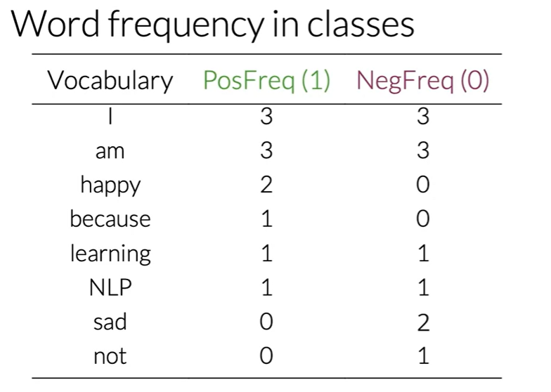
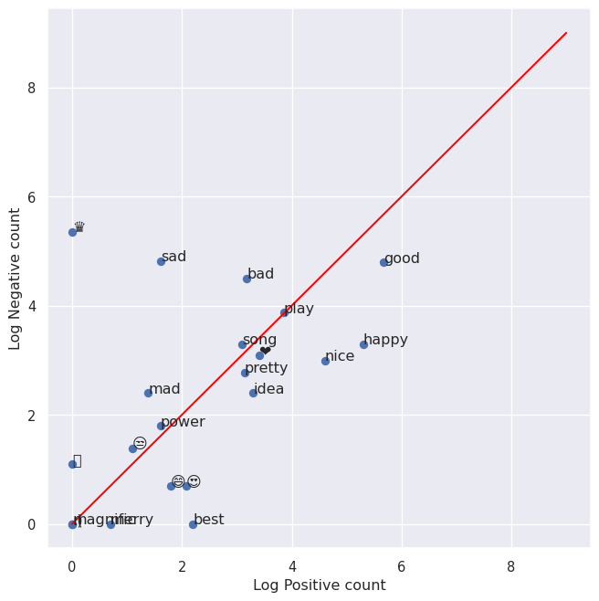

# Sentiment Analysis with Logistic Regression


- [<span class="toc-section-number">1</span> Supervised ML & Sentiment
  Analysis](#supervised-ml--sentiment-analysis)
- [<span class="toc-section-number">2</span> Text
  Representation.](#text-representation)
  - [<span class="toc-section-number">2.1</span> Sparse
    Representation.](#sparse-representation)
  - [<span class="toc-section-number">2.2</span> Negative and Positive
    Frequencies.](#negative-and-positive-frequencies)
  - [<span class="toc-section-number">2.3</span> Feature extraction with
    Frequencies](#sec-frequencies-1)
  - [<span class="toc-section-number">2.4</span> Preprocessing
    techniques.](#preprocessing-techniques)
    - [<span class="toc-section-number">2.4.1</span> HyperLink
      Cleaning](#hyperlink-cleaning)
    - [<span class="toc-section-number">2.4.2</span>
      Tokenization](#tokenization)
    - [<span class="toc-section-number">2.4.3</span> Punctuation and
      Stopwords](#punctuation-and-stopwords)
    - [<span class="toc-section-number">2.4.4</span> Stemming and
      lowercasing](#stemming-and-lowercasing)
    - [<span class="toc-section-number">2.4.5</span>
      Lemmatization](#lemmatization)
  - [<span class="toc-section-number">2.5</span> Summing all
    together](#summing-all-together)
  - [<span class="toc-section-number">2.6</span> Building and
    Visualizing word
    frequencies](#building-and-visualizing-word-frequencies)
- [<span class="toc-section-number">3</span> Logistic Regression
  Overview](#logistic-regression-overview)
  - [<span class="toc-section-number">3.1</span> Training logistic
    regression.](#training-logistic-regression)

# Supervised ML & Sentiment Analysis

In supervised machine learning, you usually have an input $X$, which
goes into your prediction function to get your $\hat{Y}$ You can then
compare your prediction with the true value $Y$. This gives you your
cost which you use to update the parameters The following image,
summarizes the process.


To perform sentiment analysis on a tweet, you first have to represent
the text (i.e. “I am happy because I am learning NLP”) as features, you
then train your logistic regression classifier, and then you can use it
to classify the text.


Note that in this case, you either classify 1, for a positive sentiment,
or 0, for a negative sentiment.

# Text Representation.

## Sparse Representation.

Given a set of tweets:

``` python
tweets = ['This dog is amazing but I prefer a corgi',
'Donald Trump hair-dresser should be in jail',
'Roses are red, the sky is blue and machine learning is not a black box']
```

A vocabulary $V$ will be formed by all the different words available in
the tweet list. Lets imagine that our vocabulary is just composed of the
unique words of our first tweet. In this case we could encode the second
tweet as follows:

``` python
sparse_vector = []
vocabulary = tweets[0].split(' ')
for i in tweets[2].split(' '):
    if i in vocabulary:
        sparse_vector.append(1)
    else:
        sparse_vector.append(0)
```

The resulting vector will be
$[0, 0, 0, 0, 0, 1, 0, 0, 0, 0, 1, 0, 1, 0, 0]$ which is a sparse vector
as it mostly contain 0s. It is easily seen that this is not scalable as
well as not memory efficient. Basically the resulting vectors will have
a size of $n=|V|$

## Negative and Positive Frequencies.

Let’s imagine that now we have the following tweets:

``` python
tweets = ['I am happy because I am learning NLP',
'I am happy',
'I am sad, I am not learning NLP',
'I am sad']
```

The unique vocabulary can be obtained by:

``` python
all_text = ' '.join(tweets).lower()
import string
all_tweets = all_text.translate(str.maketrans('', '', string.punctuation))

# Split the combined string into individual words
words = all_tweets.split()

# Convert the list of words into a set to get unique words
unique_words = set(words)

print(unique_words)
```

    {'i', 'learning', 'not', 'happy', 'because', 'sad', 'am', 'nlp'}

For this particular example of sentiment analysis, you have two classes.
One class associated with positive sentiment and the other with negative
sentiment. So taking your corpus, you’d have a set of two tweets that
belong to the positive class, and the sets of two tweets that belong to
the negative class. Let’s take the sets of positive tweets. Now, take a
look at your vocabulary. To get the positive frequency in any word in
your vocabulary, you will have to count the times as it appears in the
positive tweets and viceversa for the negative frequency.



## Feature extraction with Frequencies

Given the representation of the dictionary mentioned above. We can
calculate a feature representation vector as follows:

``` python
positive_negative_dictionary = {
    'vocabulary' : ['I', 'am', 'happy', 'because', 'learning', 'NLP', 'sad', 'not'],
    'posfreq(1)' : [3, 3, 2, 1, 1, 1, 0, 0],
    'negfreq(0)' : [3, 3, 0, 0, 1, 1, 2, 1],
}

sentence = ['I', 'am', 'sad', 'I', 'am', 'not', 'learning', 'NLP']

positions = set(
    [positive_negative_dictionary['vocabulary'].index(word)
    for word in sentence])

pos_freq_sum = sum(
    positive_negative_dictionary['posfreq(1)'][position]
    for position in positions)
neg_freq_sum = sum(
    positive_negative_dictionary['negfreq(0)'][position]
    for position in positions)

X_m = [1, pos_freq_sum, neg_freq_sum]
X_m
```

    [1, 8, 11]

## Preprocessing techniques.

Lets use now a real dataset from the NLTK library. We will be using the
Twitter dataset, the sample dataset from NLTK is separated into positive
and negative tweets. It contains 5000 positive tweets and 5000 negative
tweets exactly. The exact match between these classes is not a
coincidence. The intention is to have a balanced dataset. That does not
reflect the real distributions of positive and negative classes in live
Twitter streams. It is just because balanced datasets simplify the
design of most computational methods that are required for sentiment
analysis. However, it is better to be aware that this balance of classes
is artificial.

``` python
import nltk                                # Python library for NLP
from nltk.corpus import twitter_samples    # sample Twitter dataset from NLTK
import matplotlib.pyplot as plt            # library for visualization
import random

# downloads sample twitter dataset.
nltk.download('twitter_samples')
# select the set of positive and negative tweets
all_positive_tweets = twitter_samples.strings('positive_tweets.json')
all_negative_tweets = twitter_samples.strings('negative_tweets.json')
```

    [nltk_data] Downloading package twitter_samples to
    [nltk_data]     /home/azureuser/nltk_data...
    [nltk_data]   Package twitter_samples is already up-to-date!

We will now get the number of positives and negative tweets:

``` python
print(f'Number of positive tweets: {len(all_positive_tweets)}')
print(f'Number of negative tweets: {len(all_negative_tweets)}')

print(f'The type of all_positive_tweets is: {type(all_positive_tweets)}')
print(f'The type of a tweet entry is: {type(all_negative_tweets[0])}')
```

    Number of positive tweets: 5000
    Number of negative tweets: 5000
    The type of all_positive_tweets is: <class 'list'>
    The type of a tweet entry is: <class 'str'>

Before anything else, we can print a couple of tweets from the dataset
to see how they look. Understanding the data is responsible for 80% of
the success or failure in data science projects. We can use this time to
observe aspects we’d like to consider when preprocessing our data.

Below, you will print one random positive and one random negative tweet.
We have added a color mark at the beginning of the string to further
distinguish the two. (Warning: This is taken from a public dataset of
real tweets and a very small portion has explicit content.)

``` python
# print positive in greeen
print('\033[92m' + all_positive_tweets[random.randint(0,5000)])

# print negative in red
print('\033[91m' + all_negative_tweets[random.randint(0,5000)])
```

    Happy Friday :-) http://t.co/4lxRGxnnH1
    Drop Dead Fred use to be my favorite movie
    I wish I had it :-(

Data preprocessing is one of the critical steps in any machine learning
project. It includes cleaning and formatting the data before feeding
into a machine learning algorithm. For NLP, the preprocessing steps are
comprised of the following tasks:

- Tokenizing the string
- Lowercasing
- Removing stop words and punctuation
- Stemming

All of this techniques allow us to compress even more the dimension of
the vocabulary, achieving faster training due to lower feature vector
size.

### HyperLink Cleaning

``` python
import re                                  # library for regular expression operations
import string                              # for string operations

from nltk.corpus import stopwords          # module for stop words that come with NLTK
from nltk.stem import PorterStemmer        # module for stemming
from nltk.tokenize import TweetTokenizer   # module for tokenizing strings
nltk.download('stopwords')

# Our selected sample. Complex enough to exemplify each step
tweet = all_positive_tweets[2277]
print(tweet)
```

    My beautiful sunflowers on a sunny Friday morning off :) #sunflowers #favourites #happy #Friday off… https://t.co/3tfYom0N1i

    [nltk_data] Downloading package stopwords to
    [nltk_data]     /home/azureuser/nltk_data...
    [nltk_data]   Package stopwords is already up-to-date!

Since we have a Twitter dataset, we’d like to remove some substrings
commonly used on the platform like the hashtag, retweet marks, and
hyperlinks. We’ll use the re library to perform regular expression
operations on our tweet. We’ll define our search pattern and use the
sub() method to remove matches by substituting with an empty character
(i.e. ’’)

``` python
print('\033[92m' + tweet)
print('\033[94m')

# remove old style retweet text "RT"
tweet2 = re.sub(r'^RT[\s]+', '', tweet)

# remove hyperlinks
tweet2 = re.sub(r'https?://[^\s\n\r]+', '', tweet2)

# remove hashtags
# only removing the hash # sign from the word
tweet2 = re.sub(r'#', '', tweet2)

print(tweet2)
```

    My beautiful sunflowers on a sunny Friday morning off :) #sunflowers #favourites #happy #Friday off… https://t.co/3tfYom0N1i

    My beautiful sunflowers on a sunny Friday morning off :) sunflowers favourites happy Friday off…

### Tokenization

``` python
print()
print('\033[92m' + tweet2)
print('\033[94m')

# instantiate tokenizer class
tokenizer = TweetTokenizer(preserve_case=False, strip_handles=True,
                               reduce_len=True)

# tokenize tweets
tweet_tokens = tokenizer.tokenize(tweet2)

print()
print('Tokenized string:')
print(tweet_tokens)
```


    My beautiful sunflowers on a sunny Friday morning off :) sunflowers favourites happy Friday off…


    Tokenized string:
    ['my', 'beautiful', 'sunflowers', 'on', 'a', 'sunny', 'friday', 'morning', 'off', ':)', 'sunflowers', 'favourites', 'happy', 'friday', 'off', '…']

### Punctuation and Stopwords

The next step is to remove stop words and punctuation. Stop words are
words that don’t add significant meaning to the text. You’ll see the
list provided by NLTK when you run the cells below.

``` python
#Import the english stop words list from NLTK
#Import the english stop words list from NLTK
stopwords_english = stopwords.words('english')

print('Stop words\n')
print(stopwords_english)

print('\nPunctuation\n')
print(string.punctuation)
```

    Stop words

    ['i', 'me', 'my', 'myself', 'we', 'our', 'ours', 'ourselves', 'you', "you're", "you've", "you'll", "you'd", 'your', 'yours', 'yourself', 'yourselves', 'he', 'him', 'his', 'himself', 'she', "she's", 'her', 'hers', 'herself', 'it', "it's", 'its', 'itself', 'they', 'them', 'their', 'theirs', 'themselves', 'what', 'which', 'who', 'whom', 'this', 'that', "that'll", 'these', 'those', 'am', 'is', 'are', 'was', 'were', 'be', 'been', 'being', 'have', 'has', 'had', 'having', 'do', 'does', 'did', 'doing', 'a', 'an', 'the', 'and', 'but', 'if', 'or', 'because', 'as', 'until', 'while', 'of', 'at', 'by', 'for', 'with', 'about', 'against', 'between', 'into', 'through', 'during', 'before', 'after', 'above', 'below', 'to', 'from', 'up', 'down', 'in', 'out', 'on', 'off', 'over', 'under', 'again', 'further', 'then', 'once', 'here', 'there', 'when', 'where', 'why', 'how', 'all', 'any', 'both', 'each', 'few', 'more', 'most', 'other', 'some', 'such', 'no', 'nor', 'not', 'only', 'own', 'same', 'so', 'than', 'too', 'very', 's', 't', 'can', 'will', 'just', 'don', "don't", 'should', "should've", 'now', 'd', 'll', 'm', 'o', 're', 've', 'y', 'ain', 'aren', "aren't", 'couldn', "couldn't", 'didn', "didn't", 'doesn', "doesn't", 'hadn', "hadn't", 'hasn', "hasn't", 'haven', "haven't", 'isn', "isn't", 'ma', 'mightn', "mightn't", 'mustn', "mustn't", 'needn', "needn't", 'shan', "shan't", 'shouldn', "shouldn't", 'wasn', "wasn't", 'weren', "weren't", 'won', "won't", 'wouldn', "wouldn't"]

    Punctuation

    !"#$%&'()*+,-./:;<=>?@[\]^_`{|}~

We can see that the stop words list above contains some words that could
be important in some contexts. These could be words like i, not,
between, because, won, against. You might need to customize the stop
words list for some applications. For our exercise, we will use the
entire list.

For the punctuation, we saw earlier that certain groupings like ‘:)’ and
‘…’ should be retained when dealing with tweets because they are used to
express emotions. In other contexts, like medical analysis, these should
also be removed.

Now we clean the tokenized tweet:

``` python
print()
print('\033[92m')
print(tweet_tokens)
print('\033[94m')

tweets_clean = []

for word in tweet_tokens: # Go through every word in your tokens list
    if (word not in stopwords_english and  # remove stopwords
        word not in string.punctuation):  # remove punctuation
        tweets_clean.append(word)

print('removed stop words and punctuation:')
print(tweets_clean)
```


    ['my', 'beautiful', 'sunflowers', 'on', 'a', 'sunny', 'friday', 'morning', 'off', ':)', 'sunflowers', 'favourites', 'happy', 'friday', 'off', '…']

    removed stop words and punctuation:
    ['beautiful', 'sunflowers', 'sunny', 'friday', 'morning', ':)', 'sunflowers', 'favourites', 'happy', 'friday', '…']

### Stemming and lowercasing

Stemming is the process of converting a word to its most general form,
or stem. This helps in reducing the size of our vocabulary.

Consider the words:

- learn
- learning
- learned
- learnt

All these words are stemmed from its common root learn. However, in some
cases, the stemming process produces words that are not correct
spellings of the root word. For example, happi and sunni. That’s because
it chooses the most common stem for related words. For example, we can
look at the set of words that comprises the different forms of happy:

- happy
- happiness
- happier

We can see that the prefix happi is more commonly used. We cannot choose
happ because it is the stem of unrelated words like happen.

NLTK has different modules for stemming and we will be using the
PorterStemmer module which uses the Porter Stemming Algorithm. Let’s see
how we can use it in the cell below.

``` python
print()
print('\033[92m')
print(tweets_clean)
print('\033[94m')

# Instantiate stemming class
stemmer = PorterStemmer()

# Create an empty list to store the stems
tweets_stem = []

for word in tweets_clean:
    stem_word = stemmer.stem(word)  # stemming word
    tweets_stem.append(stem_word)  # append to the list

print('stemmed words:')
print(tweets_stem)
```


    ['beautiful', 'sunflowers', 'sunny', 'friday', 'morning', ':)', 'sunflowers', 'favourites', 'happy', 'friday', '…']

    stemmed words:
    ['beauti', 'sunflow', 'sunni', 'friday', 'morn', ':)', 'sunflow', 'favourit', 'happi', 'friday', '…']

### Lemmatization

Another popular library to handle text processing is SpaCy. SpaCy does
not have built-in support for stemming but if focuses more in
Lemmatization (which is a more sophisticated approach to reduce words to
their base form).

Lemmatization (or less commonly lemmatisation) in linguistics is the
process of grouping together the inflected forms of a word so they can
be analysed as a single item, identified by the word’s lemma, or
dictionary form.\[1\]

In computational linguistics, lemmatization is the algorithmic process
of determining the lemma of a word based on its intended meaning. Unlike
stemming, lemmatization depends on correctly identifying the intended
part of speech and meaning of a word in a sentence, as well as within
the larger context surrounding that sentence, such as neighbouring
sentences or even an entire document. As a result, developing efficient
lemmatization algorithms is an open area of research.

An example of using spacy can be found below. First we download the
spaCy english model:

``` {bash}
pip install spacy
python -m spacy download en_core_web_sm
```

Then we run our pipeline:

``` python
import spacy
import random
import matplotlib.pyplot as plt

# Load spaCy model
nlp = spacy.load('en_core_web_sm')

# Example tweet
tweet = "RT @username: Example tweet with URL https://t.co/example and #hashtag"

# Preprocessing with spaCy
doc = nlp(tweet)

# Tokenization and processing
# Remove URLs, handles, hashtags, stop words, and punctuation. Then, lemmatize the tokens.
tokens = [
    token.lemma_ for token in doc
    if not token.is_stop
    and not token.is_punct
    and not token.like_url
    and not token.is_space
    and token.text[0] != '#'
    and token.text[0] != '@'
    ]

print("Processed tweet tokens:", tokens)
```

    Processed tweet tokens: ['RT', 'example', 'tweet', 'url', 'hashtag']

The primary changes with spaCy involve how you handle text processing:

- spaCy’s Tokenizer handles tokenization more comprehensively, so you
  don’t need to manually remove RT, URLs, or use regex for hashtags.
- Lemmatization is used instead of stemming. spaCy provides the .lemma\_
  attribute for tokens.
- Stop word removal is streamlined with token.is_stop.
- Punctuation removal is achieved with token.is_punct.
- spaCy does not require separate download commands for stop words or
  tokenizers as NLTK does.

## Summing all together

Over all , you start with a given text, you perform preprocessing, then
you do feature extraction to convert text into numerical representation
as follows:


The feature vector $X$ becomes of dimension $(m,3)$ as follows:


## Building and Visualizing word frequencies

In our previous example in
<a href="#sec-frequencies-1" class="quarto-xref">Section 2.3</a> we show
how to compute the feature vector given the pre-computed frequencies.
Now we will the frequency computation from scratch. To do that we will
download the twitter sammples dataset again.

``` python
import nltk                                  # Python library for NLP
from nltk.corpus import twitter_samples      # sample Twitter dataset from NLTK
import matplotlib.pyplot as plt              # visualization library
import numpy as np                           # library for scientific computing and matrix operations

nltk.download('twitter_samples')
all_positive_tweets = twitter_samples.strings('positive_tweets.json')
all_negative_tweets = twitter_samples.strings('negative_tweets.json')

# concatenate the lists, 1st part is the positive tweets followed by the negative
tweets = all_positive_tweets + all_negative_tweets

# let's see how many tweets we have
print("Number of tweets: ", len(tweets))
labels = np.append(np.ones((len(all_positive_tweets))), np.zeros((len(all_negative_tweets))))
```

    [nltk_data] Downloading package twitter_samples to
    [nltk_data]     /home/azureuser/nltk_data...
    [nltk_data]   Package twitter_samples is already up-to-date!

    Number of tweets:  10000

To build the frequency computation we will use python dictionaries. In
Python, a dictionary is a mutable and indexed collection. It stores
items as key-value pairs and uses hash tables underneath to allow
practically constant time lookups. In NLP, dictionaries are essential
because it enables fast retrieval of items or containment checks even
with thousands of entries in the collection.

We will create a function that given a list of tweets it iterates over
the whole list, and stores a pair information associated with a given
sentiment label.

``` python
import spacy
nlp = spacy.load('en_core_web_sm')

def process_tweet(tweet):
    """Process tweet function.
    Input:
        tweet: a string containing a tweet
    Output:
        tweets_clean: a list of words containing the processed tweet

    """
    doc = nlp(tweet)

    # Tokenization and processing
    # Remove URLs, handles, hashtags, stop words, and punctuation.
    # Then, lemmatize the tokens.
    tokens = [
        token.lemma_.lower() for token in doc
        if not token.is_stop
        and not token.is_punct
        and not token.like_url
        and not token.is_space
        and token.text[0] != '#'
        and token.text[0] != '@'
        ]

    return tokens

def build_freqs(tweets, ys):
    """Build frequencies.
    Input:
        tweets: a list of tweets
        ys: an m x 1 array with the sentiment label of each tweet
            (either 0 or 1)
    Output:
        freqs: a dictionary mapping each (word, sentiment) pair to its
        frequency
    """
    # Convert np array to list since zip needs an iterable.
    # The squeeze is necessary or the list ends up with one element.
    # Also note that this is just a NOP if ys is already a list.
    yslist = np.squeeze(ys).tolist()

    # Start with an empty dictionary and populate it by looping over all tweets
    # and over all processed words in each tweet.
    freqs = {}
    for y, tweet in zip(yslist, tweets):
        for word in process_tweet(tweet):
            pair = (word, y)
            freqs[pair] = freqs.get(pair, 0) + 1
    return freqs
```

Instead of using the default utils.process_tweet function we will write
a new one using spaCy.

We will now create our frequency dictionary:

``` python
freqs = build_freqs(tweets, labels)

# check data type
print(f'type(freqs) = {type(freqs)}')

# check length of the dictionary
print(f'len(freqs) = {len(freqs)}')

print(freqs)
```

    type(freqs) = <class 'dict'>
    len(freqs) = 13602
    {('followfriday', 1.0): 25, ('engage', 1.0): 7, ('member', 1.0): 16, ('community', 1.0): 32, ('week', 1.0): 84, ('hey', 1.0): 77, ('james', 1.0): 7, ('odd', 1.0): 2, ('contact', 1.0): 7, ('centre', 1.0): 2, ('02392441234', 1.0): 1, ('able', 1.0): 8, ('assist', 1.0): 1, ('thank', 1.0): 621, ('listen', 1.0): 16, ('night', 1.0): 69, ('bleed', 1.0): 2, ('amazing', 1.0): 48, ('track', 1.0): 5, ('scotland', 1.0): 2, ('congrats', 1.0): 5, ('yeaaaah', 1.0): 1, ('yippppy', 1.0): 1, ('accnt', 1.0): 2, ('verify', 1.0): 2, ('rqst', 1.0): 1, ('succeed', 1.0): 1, ('get', 1.0): 100, ('blue', 1.0): 9, ('tick', 1.0): 1, ('mark', 1.0): 2, ('fb', 1.0): 6, ('profile', 1.0): 2, ('15', 1.0): 3, ('day', 1.0): 244, ('irresistible', 1.0): 2, ('flipkartfashionfriday', 1.0): 17, ('like', 1.0): 232, ('lovely', 1.0): 62, ('customer', 1.0): 3, ('wait', 1.0): 68, ('long', 1.0): 39, ('hope', 1.0): 129, ('enjoy', 1.0): 79, ('happy', 1.0): 199, ('friday', 1.0): 116, ('lwwf', 1.0): 1, ('second', 1.0): 11, ('thought', 1.0): 6, ('time', 1.0): 122, ('dd', 1.0): 1, ('new', 1.0): 147, ('short', 1.0): 8, ('enter', 1.0): 9, ('system', 1.0): 2, ('sheep', 1.0): 1, ('buy', 1.0): 16, ('jgh', 1.0): 4, ('bayan', 1.0): 1, (':d', 1.0): 653, ('bye', 1.0): 8, ('act', 1.0): 8, ('mischievousness', 1.0): 1, ('call', 1.0): 11, ('etl', 1.0): 1, ('layer', 1.0): 1, ('house', 1.0): 6, ('warehousing', 1.0): 1, ('app', 1.0): 16, ('katamari', 1.0): 1, ('imply', 1.0): 1, ('p.', 1.0): 1, ('influencer', 1.0): 17, ('love', 1.0): 337, ('big', 1.0): 41, ('juicy', 1.0): 3, ('selfie', 1.0): 12, ('follow', 1.0): 369, ('amp', 1.0): 167, ('u', 1.0): 244, ('perfect', 1.0): 22, ('know', 1.0): 163, ('great', 1.0): 176, ('opportunity', 1.0): 3, ('junior', 1.0): 2, ('triathlete', 1.0): 1, ('age', 1.0): 2, ('12', 1.0): 7, ('13', 1.0): 6, ('gatorade', 1.0): 1, ('series', 1.0): 5, ('entry', 1.0): 4, ('lay', 1.0): 5, ('greeting', 1.0): 3, ('card', 1.0): 8, ('range', 1.0): 2, ('print', 1.0): 3, ('today', 1.0): 116, ('job', 1.0): 41, ('friend', 1.0): 67, ('lunch', 1.0): 5, ('yummmm', 1.0): 1, ('nostalgia', 1.0): 1, ('tbs', 1.0): 1, ('ku', 1.0): 1, ('d', 1.0): 12, ('conflict', 1.0): 1, ('help', 1.0): 42, ('screenshot', 1.0): 2, ('work', 1.0): 112, ('hi', 1.0): 173, ('liv', 1.0): 2, ('hello', 1.0): 59, ('need', 1.0): 78, ('fm', 1.0): 2, ('twitter', 1.0): 29, ('sure', 1.0): 56, ('thing', 1.0): 69, ('dm', 1.0): 36, ('x', 1.0): 71, ('follower', 1.0): 77, ('hear', 1.0): 42, ('seasons', 1.0): 1, ('pretty', 1.0): 22, ('dope', 1.0): 2, ('penthouse', 1.0): 1, ('obvs', 1.0): 1, ('gobigorgohome', 1.0): 1, ('fun', 1.0): 58, ('you', 1.0): 6, ('yeah', 1.0): 47, ('suppose', 1.0): 7, ('lol', 1.0): 65, ('chat', 1.0): 13, ('bit', 1.0): 20, ('youth', 1.0): 19, ('opportunities', 1.0): 19, ('gt;&gt', 1.0): 25, ('💅', 1.0): 1, ('🏽', 1.0): 2, ('💋', 1.0): 2, ('see', 1.0): 48, ('year', 1.0): 45, ('rest', 1.0): 12, ('go', 1.0): 113, ('quickly', 1.0): 3, ('bed', 1.0): 16, ('music', 1.0): 20, ('fix', 1.0): 9, ('dream', 1.0): 20, ('spiritual', 1.0): 1, ('ritual', 1.0): 1, ('festival', 1.0): 7, ('népal', 1.0): 1, ('beginning', 1.0): 1, ('line', 1.0): 10, ('leave', 1.0): 24, ('y', 1.0): 8, ('sarah', 1.0): 4, ('send', 1.0): 31, ('email', 1.0): 26, ('bitsy@bitdefender.com', 1.0): 1, ('asap', 1.0): 5, ('kik', 1.0): 22, ('hatessuce32429', 1.0): 1, ('kikme', 1.0): 1, ('lgbt', 1.0): 2, ('tinder', 1.0): 1, ('nsfw', 1.0): 1, ('akua', 1.0): 1, ('cumshot', 1.0): 1, ('come', 1.0): 79, ('nsn_supplement', 1.0): 1, ('effective', 1.0): 1, ('press', 1.0): 1, ('release', 1.0): 11, ('distribution', 1.0): 1, ('result', 1.0): 2, ('link', 1.0): 19, ('remove', 1.0): 3, ('pressrelease', 1.0): 1, ('newsdistribution', 1.0): 1, ('bam', 1.0): 44, ('bestfriend', 1.0): 50, ('lot', 1.0): 86, ('warsaw', 1.0): 44, ('lt;3', 1.0): 132, ('x46', 1.0): 1, ('watch', 1.0): 48, ('documentary', 1.0): 1, ('earthlings', 1.0): 1, ('youtube', 1.0): 11, ('support', 1.0): 26, ('buuuuuuuut', 1.0): 1, ('oh', 1.0): 53, ('look', 1.0): 138, ('forward', 1.0): 29, ('visit', 1.0): 30, ('letsgetmessy', 1.0): 1, ('jo', 1.0): 1, ('make', 1.0): 31, ('feel', 1.0): 46, ('well', 1.0): 51, ('kpop', 1.0): 1, ('flesh', 1.0): 1, ('good', 1.0): 289, ('girl', 1.0): 44, ('wish', 1.0): 36, ('reason', 1.0): 12, ('epic', 1.0): 2, ('soundtrack', 1.0): 1, ('shout', 1.0): 13, ('add', 1.0): 33, ('video', 1.0): 35, ('playlist', 1.0): 5, ('m', 1.0): 57, ('twitch', 1.0): 7, ('league', 1.0): 6, ('1', 1.0): 70, ('4', 1.0): 22, ('dear', 1.0): 17, ('jordan', 1.0): 1, ('okay', 1.0): 39, ('fake', 1.0): 2, ('gameplay', 1.0): 1, ('haha', 1.0): 53, ('kid', 1.0): 18, ('stuff', 1.0): 13, ('exactly', 1.0): 6, ('product', 1.0): 10, ('etsy', 1.0): 1, ('shop', 1.0): 13, ('check', 1.0): 53, ('boxroomcraft', 1.0): 1, ('vacation', 1.0): 6, ('rechargeable', 1.0): 1, ('normally', 1.0): 2, ('charger', 1.0): 2, ('asleep', 1.0): 9, ('talk', 1.0): 46, ('sooo', 1.0): 3, ('text', 1.0): 15, ('yes', 1.0): 74, ('bet', 1.0): 6, ('fit', 1.0): 2, ('speech', 1.0): 1, ('pity', 1.0): 3, ('green', 1.0): 3, ('garden', 1.0): 7, ('midnight', 1.0): 1, ('sun', 1.0): 6, ('beautiful', 1.0): 44, ('canal', 1.0): 1, ('dasvidaniya', 1.0): 1, ('till', 1.0): 18, ('scout', 1.0): 1, ('sg', 1.0): 1, ('future', 1.0): 13, ('wlan', 1.0): 1, ('pro', 1.0): 5, ('conference', 1.0): 1, ('asia', 1.0): 1, ('change', 1.0): 23, ('lollipop', 1.0): 1, ('🍭', 1.0): 1, ('nez', 1.0): 1, ('agnezmo', 1.0): 1, ('oley', 1.0): 1, ('mama', 1.0): 1, ('stand', 1.0): 8, ('strong', 1.0): 9, ('god', 1.0): 22, ('misty', 1.0): 1, ('baby', 1.0): 20, ('cute', 1.0): 27, ('woohoo', 1.0): 3, ('sign', 1.0): 12, ('think', 1.0): 91, ('mka', 1.0): 5, ('liam', 1.0): 8, ('access', 1.0): 3, ('welcome', 1.0): 73, ('stat', 1.0): 60, ('arrive', 1.0): 66, ('unfollower', 1.0): 60, ('surprised', 1.0): 2, ('figure', 1.0): 5, ('happybirthdayemilybett', 1.0): 1, ('sweet', 1.0): 19, ('talented', 1.0): 4, ('2', 1.0): 54, ('plan', 1.0): 26, ('drain', 1.0): 1, ('to', 1.0): 25, ('timezone', 1.0): 1, (':p', 1.0): 136, ('parent', 1.0): 5, ('proud', 1.0): 12, ('maybe', 1.0): 18, ('grade', 1.0): 4, ('al', 1.0): 2, ('grande', 1.0): 3, ('manila_bro', 1.0): 2, ('choose', 1.0): 3, ('let', 1.0): 102, ('world', 1.0): 26, ('eh', 1.0): 2, ('care', 1.0): 15, ('finally', 1.0): 16, ('fucking', 1.0): 12, ('weekend', 1.0): 76, ('real', 1.0): 21, ('x45', 1.0): 1, ('join', 1.0): 23, ('hushedcallwithfraydoe', 1.0): 1, ('gift', 1.0): 8, ('got', 1.0): 8, ('yeahhh', 1.0): 1, ('hushedpinwithsammy', 1.0): 2, ('event', 1.0): 9, ('luv', 1.0): 6, ('appreciate', 1.0): 28, ('share', 1.0): 33, ('wow', 1.0): 22, ('tom', 1.0): 4, ('3', 1.0): 30, ('gym', 1.0): 4, ('monday', 1.0): 9, ('invite', 1.0): 17, ('scope', 1.0): 5, ('nude', 1.0): 2, ('sleep', 1.0): 46, ('birthday', 1.0): 74, ('want', 1.0): 98, ('t', 1.0): 9, ('shirt', 1.0): 4, ('cool', 1.0): 38, ('haw', 1.0): 1, ('phela', 1.0): 1, ('mom', 1.0): 10, ('obviously', 1.0): 2, ('prince', 1.0): 1, ('charming', 1.0): 1, ('stage', 1.0): 2, ('luck', 1.0): 30, ('tyler', 1.0): 2, ('hipst', 1.0): 1, ('glass', 1.0): 5, ('marty', 1.0): 2, ('glad', 1.0): 43, ('afternoon', 1.0): 10, ('read', 1.0): 33, ('kahfi', 1.0): 1, ('finish', 1.0): 16, ('ohmyg', 1.0): 1, ('yaya', 1.0): 3, ('dub', 1.0): 2, ('stalk', 1.0): 2, ('ig', 1.0): 3, ('gondooo', 1.0): 1, ('moo', 1.0): 2, ('tologooo', 1.0): 1, ('detail', 1.0): 9, ('zzz', 1.0): 1, ('xx', 1.0): 42, ('physiotherapy', 1.0): 1, ('hashtag', 1.0): 4, ('custom', 1.0): 1, ('💪', 1.0): 1, ('monica', 1.0): 1, ('miss', 1.0): 23, ('sound', 1.0): 23, ('morning', 1.0): 101, ('take', 1.0): 19, ('x43', 1.0): 1, ('definitely', 1.0): 21, ('try', 1.0): 44, ('tonight', 1.0): 22, ('advice', 1.0): 6, ('treviso', 1.0): 1, ('concert', 1.0): 23, ('city', 1.0): 27, ('country', 1.0): 23, ('start', 1.0): 60, ('fine', 1.0): 11, ('gorgeous', 1.0): 12, ('xo', 1.0): 2, ('oven', 1.0): 3, ('roasted', 1.0): 1, ('garlic', 1.0): 1, ('olive', 1.0): 1, ('oil', 1.0): 4, ('dry', 1.0): 5, ('tomato', 1.0): 1, ('basil', 1.0): 1, ('century', 1.0): 1, ('tuna', 1.0): 1, ('right', 1.0): 47, ('atchya', 1.0): 1, ('chance', 1.0): 6, ('cheer', 1.0): 14, ('po', 1.0): 4, ('ice', 1.0): 6, ('cream', 1.0): 6, ('agree', 1.0): 15, ('100', 1.0): 8, ('hehehehe', 1.0): 2, ('s', 1.0): 30, ('point', 1.0): 13, ('stay', 1.0): 26, ('home', 1.0): 32, ('soon', 1.0): 48, ('promise', 1.0): 6, ('web', 1.0): 4, ('whatsapp', 1.0): 5, ('volta', 1.0): 1, ('funcionar', 1.0): 1, ('com', 1.0): 2, ('iphone', 1.0): 7, ('jailbroken', 1.0): 1, ('later', 1.0): 16, ('34', 1.0): 3, ('min', 1.0): 9, ('leia', 1.0): 1, ('appear', 1.0): 2, ('hologram', 1.0): 1, ('r2d2', 1.0): 1, ('w', 1.0): 9, ('message', 1.0): 10, ('obi', 1.0): 1, ('wan', 1.0): 3, ('sit', 1.0): 8, ('luke', 1.0): 5, ('inter', 1.0): 1, ('ucl', 1.0): 1, ('arsenal', 1.0): 2, ('small', 1.0): 5, ('team', 1.0): 30, ('pass', 1.0): 12, ('🚂', 1.0): 1, ('dewsbury', 1.0): 2, ('railway', 1.0): 1, ('station', 1.0): 4, ('dew', 1.0): 1, ('west', 1.0): 3, ('yorkshire', 1.0): 2, ('430', 1.0): 1, ('smh', 1.0): 2, ('9:25', 1.0): 1, ('live', 1.0): 26, ('strange', 1.0): 3, ('imagine', 1.0): 4, ('what?-', 1.0): 1, ('megan', 1.0): 1, ('masaantoday', 1.0): 6, ('a4', 1.0): 3, ('shweta', 1.0): 1, ('tripathi', 1.0): 1, ('5', 1.0): 20, ('20', 1.0): 7, ('kurta', 1.0): 3, ('half', 1.0): 7, ('number', 1.0): 13, ('wsalelove', 1.0): 16, ('ah', 1.0): 13, ('larry', 1.0): 3, ('kinda', 1.0): 13, ('gooood', 1.0): 2, ('life', 1.0): 50, ('enn', 1.0): 1, ('surely', 1.0): 3, ('warmup', 1.0): 1, ('15th', 1.0): 2, ('bath', 1.0): 7, ('dum', 1.0): 2, ('andar', 1.0): 1, ('ram', 1.0): 1, ('sampath', 1.0): 1, ('sona', 1.0): 1, ('mohapatra', 1.0): 1, ('samantha', 1.0): 1, ('edwards', 1.0): 1, ('mein', 1.0): 1, ('tulane', 1.0): 1, ('razi', 1.0): 2, ('wah', 1.0): 2, ('josh', 1.0): 1, ('smile', 1.0): 61, ('picture', 1.0): 10, ('16.20', 1.0): 1, ('timing', 1.0): 5, ('giveitup', 1.0): 1, ('give', 1.0): 16, ('gas', 1.0): 2, ('subsidy', 1.0): 1, ('initiative', 1.0): 1, ('propose', 1.0): 2, ('delighted', 1.0): 4, ('having', 1.0): 1, ('yesterday', 1.0): 8, ('x42', 1.0): 1, ('lmaoo', 1.0): 2, ('song', 1.0): 21, ('shall', 1.0): 6, ('little', 1.0): 31, ('throwback', 1.0): 3, ('outlying', 1.0): 1, ('island', 1.0): 4, ('cheung', 1.0): 1, ('chau', 1.0): 1, ('mui', 1.0): 1, ('wo', 1.0): 1, ('totally', 1.0): 9, ('different', 1.0): 7, ('kfckitchentours', 1.0): 1, ('kitchen', 1.0): 4, ('clean', 1.0): 1, ('amazed', 1.0): 1, ('cusp', 1.0): 1, ('test', 1.0): 7, ('water', 1.0): 7, ('rewarding', 1.0): 1, ('arummzz', 1.0): 2, ('drive', 1.0): 10, ('travel', 1.0): 17, ('traveler', 1.0): 3, ('yogyakarta', 1.0): 3, ('jeep', 1.0): 3, ('indonesia', 1.0): 4, ('instamood', 1.0): 3, ('wanna', 1.0): 30, ('skype', 1.0): 3, ('nice', 1.0): 99, ('friendly', 1.0): 2, ('pretend~', 1.0): 1, ('film', 1.0): 7, ('congratulation', 1.0): 10, ('winner', 1.0): 4, ('cheesydelights', 1.0): 1, ('contest', 1.0): 6, ('address', 1.0): 10, ('guy', 1.0): 57, ('marketing', 1.0): 1, ('24/7', 1.0): 1, ('will', 1.0): 22, ('regret', 1.0): 5, ('14', 1.0): 1, ('hour', 1.0): 27, ('delay', 1.0): 2, ('actually', 1.0): 18, ('easy', 1.0): 12, ('guess', 1.0): 14, ('train', 1.0): 7, ('wd', 1.0): 1, ('shift', 1.0): 5, ('engine', 1.0): 1, ('etc', 1.0): 2, ('sunburn', 1.0): 1, ('peel', 1.0): 2, ('blog', 1.0): 30, ('huge', 1.0): 11, ('warm', 1.0): 6, ('☆', 1.0): 3, ('complete', 1.0): 5, ('triangle', 1.0): 2, ('northern', 1.0): 1, ('ireland', 1.0): 2, ('sight', 1.0): 1, ('smthng', 1.0): 2, ('fr', 1.0): 3, ('hug', 1.0): 10, ('xoxo', 1.0): 3, ('uu', 1.0): 1, ('jaann', 1.0): 1, ('topnewfollower', 1.0): 2, ('connect', 1.0): 14, ('wonderful', 1.0): 25, ('fluffy', 1.0): 1, ('inside', 1.0): 8, ('pirouette', 1.0): 1, ('moose', 1.0): 1, ('trip', 1.0): 13, ('philly', 1.0): 1, ('december', 1.0): 3, ('dude', 1.0): 5, ('x41', 1.0): 1, ('question', 1.0): 17, ('flawed', 1.0): 1, ('pain', 1.0): 8, ('negate', 1.0): 1, ('strength', 1.0): 3, ('solo', 1.0): 4, ('move', 1.0): 3, ('fav', 1.0): 12, ('nirvana', 1.0): 1, ('smell', 1.0): 2, ('teen', 1.0): 3, ('spirit', 1.0): 3, ('rip', 1.0): 3, ('amy', 1.0): 3, ('winehouse', 1.0): 1, ('couple', 1.0): 9, ('tomhiddleston', 1.0): 1, ('elizabetholsen', 1.0): 1, ('yaytheylookgreat', 1.0): 1, ('goodnight', 1.0): 24, ('vid', 1.0): 11, ('wake', 1.0): 17, ('shoot', 1.0): 6, ('itty', 1.0): 2, ('bitty', 1.0): 2, ('teenie', 1.0): 2, ('bikini', 1.0): 2, ('g', 1.0): 10, ('4th', 1.0): 4, ('end', 1.0): 19, ('xfiles', 1.0): 1, ('content', 1.0): 4, ('rain', 1.0): 21, ('fabulous', 1.0): 5, ('fantastic', 1.0): 14, ('♡', 1.0): 24, ('jb', 1.0): 1, ('forever', 1.0): 5, ('belieber', 1.0): 3, ('nighty', 1.0): 1, ('bug', 1.0): 3, ('bite', 1.0): 1, ('bracelet', 1.0): 2, ('idea', 1.0): 26, ('foundry', 1.0): 1, ('game', 1.0): 24, ('sense', 1.0): 7, ('pic', 1.0): 27, ('eff', 1.0): 1, ('phone', 1.0): 19, ('woot', 1.0): 2, ('derek', 1.0): 1, ('parkshare', 1.0): 1, ('gloucestershire', 1.0): 1, ('aaaahhh', 1.0): 1, ('man', 1.0): 29, ('traffic', 1.0): 2, ('stress', 1.0): 8, ('reliever', 1.0): 1, ('arbeloa', 1.0): 1, ('turn', 1.0): 16, ('17', 1.0): 3, ('omg', 1.0): 15, ('difference', 1.0): 3, ('europe', 1.0): 1, ('rise', 1.0): 2, ('find', 1.0): 40, ('hard', 1.0): 13, ('believe', 1.0): 9, ('uncountable', 1.0): 1, ('coz', 1.0): 2, ('unlimited', 1.0): 1, ('course', 1.0): 18, ('teampositive', 1.0): 1, ('aldub', 1.0): 2, ('☕', 1.0): 3, ('rita', 1.0): 2, ('info', 1.0): 14, ('way', 1.0): 46, ('boy', 1.0): 18, ('x40', 1.0): 1, ('true', 1.0): 22, ('sethi', 1.0): 1, ('high', 1.0): 8, ('exe', 1.0): 1, ('skeem', 1.0): 1, ('saam', 1.0): 1, ('people', 1.0): 52, ('k', 1.0): 9, ('polite', 1.0): 2, ('izzat', 1.0): 1, ('wese', 1.0): 1, ('trust', 1.0): 9, ('khawateen', 1.0): 1, ('sath', 1.0): 2, ('mana', 1.0): 1, ('kar', 1.0): 1, ('deya', 1.0): 1, ('evening', 1.0): 2, ('sort', 1.0): 6, ('smart', 1.0): 5, ('hair', 1.0): 11, ('tbh', 1.0): 5, ('jacob', 1.0): 2, ('m&amp;g', 1.0): 2, ('upgrade??:-', 1.0): 1, ('tee', 1.0): 5, ('family', 1.0): 19, ('person', 1.0): 16, ('have', 1.0): 27, ('conversation', 1.0): 5, ('online', 1.0): 7, ('mclaren', 1.0): 1, ('fridayfeeling', 1.0): 3, ('tgif', 1.0): 10, ('square', 1.0): 1, ('enix', 1.0): 1, ('bissmillah', 1.0): 1, ('ya', 1.0): 21, ('allah', 1.0): 4, ('socent', 1.0): 1, ('startup', 1.0): 3, ('w/', 1.0): 5, ('drop', 1.0): 9, ('arnd', 1.0): 1, ('town', 1.0): 6, ('basically', 1.0): 4, ('piss', 1.0): 3, ('cup', 1.0): 4, ('terrible', 1.0): 2, ('complicated', 1.0): 1, ('discussion', 1.0): 1, ('snapchat', 1.0): 36, ('lynettelowe', 1.0): 1, ('kikmenow', 1.0): 3, ('snapme', 1.0): 2, ('hot', 1.0): 24, ('amazon', 1.0): 1, ('kikmeguy', 1.0): 3, ('definately', 1.0): 1, ('grow', 1.0): 7, ('sport', 1.0): 3, ('rt', 1.0): 12, ('rakyat', 1.0): 1, ('writing', 1.0): 2, ('mention', 1.0): 24, ('fly', 1.0): 5, ('fish', 1.0): 4, ('getting', 1.0): 6, ('promote', 1.0): 3, ('post', 1.0): 21, ('cyber', 1.0): 1, ('ourdaughtersourpride', 1.0): 5, ('mypapamypride', 1.0): 2, ('papa', 1.0): 2, ('coach', 1.0): 2, ('positive', 1.0): 6, ('kha', 1.0): 1, ('atleast', 1.0): 2, ('x39', 1.0): 1, ('mango', 1.0): 1, ('lassi', 1.0): 1, ('monty', 1.0): 1, ('marvellous', 1.0): 1, ('d.', 1.0): 4, ('suspect', 1.0): 3, ('mean', 1.0): 28, ('24', 1.0): 4, ('hrs', 1.0): 1, ('touch', 1.0): 15, ('kepler', 1.0): 3, ('452b', 1.0): 3, ('chalna', 1.0): 1, ('hai', 1.0): 11, ('thankyou', 1.0): 13, ('hazel', 1.0): 1, ('food', 1.0): 11, ('market', 1.0): 4, ('brooklyn', 1.0): 1, ('pta', 1.0): 2, ('awake', 1.0): 9, ('okayy', 1.0): 2, ('awww', 1.0): 8, ('ha', 1.0): 25, ('surprise', 1.0): 7, ('doc', 1.0): 1, ('splendid', 1.0): 1, ('spam', 1.0): 1, ('folder', 1.0): 1, ('win', 1.0): 19, ('$', 1.0): 9, ('nigeria', 1.0): 1, ('claim', 1.0): 1, ('rted', 1.0): 1, ('leg', 1.0): 5, ('hurt', 1.0): 7, ('bad', 1.0): 23, ('saturday', 1.0): 8, ('thaaank', 1.0): 1, ('puhon', 1.0): 1, ('happinessss~', 1.0): 1, ('tnc', 1.0): 1, ('prior', 1.0): 1, ('notification', 1.0): 2, ('probably', 1.0): 10, ('funny', 1.0): 20, ('2:22', 1.0): 1, ('fat', 1.0): 1, ('cos', 1.0): 1, ('eat', 1.0): 10, ('yuna', 1.0): 2, ('tameside', 1.0): 1, ('you´re', 1.0): 2, ('google+', 1.0): 1, ('account', 1.0): 19, ('scouser', 1.0): 1, ('zoe', 1.0): 2, ('mate', 1.0): 7, ('literally', 1.0): 7, ('||', 1.0): 1, ('sameee~', 1.0): 1, ('edgar', 1.0): 1, ('update', 1.0): 12, ('log', 1.0): 4, ('bring', 1.0): 19, ('abe', 1.0): 1, ('meet', 1.0): 34, ('x38', 1.0): 1, ('sigh', 1.0): 2, ('dreamily', 1.0): 1, ('pout', 1.0): 1, ('eye', 1.0): 15, ('quacketyquack', 1.0): 7, ('happen', 1.0): 16, ('phil', 1.0): 1, ('them', 1.0): 2, ('del', 1.0): 1, ('rodder', 1.0): 1, ('play', 1.0): 46, ('gamejam', 1.0): 1, ('irish', 1.0): 2, ('literature', 1.0): 2, ('inaccessible', 1.0): 2, ('kareena', 1.0): 2, ('fans', 1.0): 2, ('brain', 1.0): 13, ('dots', 1.0): 11, ('braindot', 1.0): 10, ('fair', 1.0): 6, ('rush', 1.0): 1, ('brandi', 1.0): 1, ('18', 1.0): 3, ('carnival', 1.0): 1, ('mask', 1.0): 3, ('xavier', 1.0): 1, ('forneret', 1.0): 1, ('jennifer', 1.0): 1, ('site', 1.0): 9, ('free', 1.0): 38, ('50.000', 1.0): 3, ('8', 1.0): 8, ('ball', 1.0): 7, ('pool', 1.0): 5, ('coins', 1.0): 5, ('edit', 1.0): 5, ('trish', 1.0): 1, ('♥', 1.0): 19, ('gratefulness', 1.0): 1, ('=', 1.0): 16, ('happiness', 1.0): 14, ('grateful', 1.0): 4, ('comment', 1.0): 9, ('wakeup', 1.0): 1, ('dirty', 1.0): 2, ('sex', 1.0): 6, ('lmaooo', 1.0): 1, ('😤', 1.0): 2, ('louis', 1.0): 4, ('throw', 1.0): 6, ('cause', 1.0): 14, ('inspire', 1.0): 5, ('ff', 1.0): 47, ('best', 1.0): 8, ('twoofs', 1.0): 3, ('gr8', 1.0): 1, ('wkend', 1.0): 3, ('kind', 1.0): 26, ('exhausted', 1.0): 1, ('word', 1.0): 19, ('cheltenham', 1.0): 1, ('area', 1.0): 4, ('9', 1.0): 8, ('kale', 1.0): 1, ('crisp', 1.0): 1, ('ruin', 1.0): 5, ('x37', 1.0): 1, ('open', 1.0): 11, ('worldwide', 1.0): 2, ('fuck', 1.0): 14, ('outta', 1.0): 1, ('sfvbeta', 1.0): 1, ('vantastic', 1.0): 1, ('xcylin', 1.0): 1, ('bundle', 1.0): 1, ('show', 1.0): 5, ('internet', 1.0): 2, ('price', 1.0): 4, ('realisticly', 1.0): 1, ('pay', 1.0): 8, ('net', 1.0): 1, ('education', 1.0): 1, ('powerful', 1.0): 1, ('weapon', 1.0): 1, ('use', 1.0): 24, ('world,"nelson', 1.0): 1, ('mandela', 1.0): 1, ('recent', 1.0): 6, ('j&amp;k', 1.0): 1, ('chenab', 1.0): 1, ('flow', 1.0): 5, ('pakistan', 1.0): 2, ('incredibleindia', 1.0): 1, ('teenchoice', 1.0): 10, ('choiceinternationalartist', 1.0): 9, ('superjunior', 1.0): 9, ('catch', 1.0): 14, ('salmon', 1.0): 3, ('super', 1.0): 15, ('blend', 1.0): 4, ('project', 1.0): 6, ('youth@bipolaruk.org.uk', 1.0): 1, ('awesome', 1.0): 43, ('stream', 1.0): 14, ('artist', 1.0): 2, ('alma', 1.0): 1, ('mater', 1.0): 1, ('highschooldays', 1.0): 1, ('clientvisit', 1.0): 1, ('faith', 1.0): 1, ('christian', 1.0): 1, ('school', 1.0): 11, ('lizaminnelli', 1.0): 1, ('upcoming', 1.0): 2, ('uk', 1.0): 4, ('appearance', 1.0): 1, ('😄', 1.0): 5, ('single', 1.0): 5, ('hills', 1.0): 1, ('beats', 1.0): 1, ('wrong', 1.0): 10, ('ready', 1.0): 25, ('natural', 1.0): 1, ('pefumery', 1.0): 1, ('workshop', 1.0): 3, ('neals', 1.0): 1, ('yard', 1.0): 1, ('covent', 1.0): 1, ('tomorrow', 1.0): 40, ('fback', 1.0): 27, ('indo', 1.0): 1, ('harmo', 1.0): 1, ('americano', 1.0): 1, ('remember', 1.0): 16, ('aww', 1.0): 10, ('head', 1.0): 13, ('dark', 1.0): 6, ('.plz', 1.0): 8, ('handshome', 1.0): 1, ('juga', 1.0): 1, ('hurray', 1.0): 1, ('hate', 1.0): 12, ('not', 1.0): 45, ('decide', 1.0): 4, ('save', 1.0): 12, ('list', 1.0): 15, ('hiya', 1.0): 4, ('exec', 1.0): 1, ('loryn.good@lincs-chamber.co.uk', 1.0): 1, ('photo', 1.0): 19, ('thx', 1.0): 15, ('chinas', 1.0): 1, ('homosexual', 1.0): 1, ('hyungbot', 1.0): 1, ('fam', 1.0): 5, ('mind', 1.0): 21, ('thanks', 1.0): 21, ('timetunnel', 1.0): 1, ('1982', 1.0): 1, ('radio', 1.0): 5, ('set', 1.0): 12, ('heart', 1.0): 10, ('hiii', 1.0): 2, ('jack', 1.0): 3, ('ily', 1.0): 4, ('✨', 1.0): 4, ('domino', 1.0): 1, ('pub', 1.0): 1, ('heated', 1.0): 1, ('prob', 1.0): 4, ('sorry', 1.0): 22, ('hastily', 1.0): 1, ('type', 1.0): 6, ('screenshotting', 1.0): 1, ('pakistanis', 1.0): 1, ('x36', 1.0): 1, ('3point', 1.0): 1, ('dreamteam', 1.0): 1, ('gooo', 1.0): 1, ('bailey', 1.0): 2, ('pbb737gold', 1.0): 3, ('drink', 1.0): 10, ('old', 1.0): 15, ('1/2', 1.0): 1, ('welsh', 1.0): 1, ('wale', 1.0): 2, ('yippee', 1.0): 1, ('💟', 1.0): 4, ('bro', 1.0): 24, ('lord', 1.0): 4, ('michael', 1.0): 5, ('em', 1.0): 2, ("u're", 1.0): 1, ('ure', 1.0): 1, ('bigot', 1.0): 1, ('usually', 1.0): 4, ('squat', 1.0): 1, ('dobar', 1.0): 1, ('dan', 1.0): 5, ('brand', 1.0): 8, ('heavies', 1.0): 1, ('musicology2015', 1.0): 1, ('day2', 1.0): 1, ('spend', 1.0): 4, ('marathon', 1.0): 1, ('iflix', 1.0): 2, ('officially', 1.0): 5, ('graduate', 1.0): 2, ('cry', 1.0): 9, ('yep', 1.0): 9, ('expert', 1.0): 4, ('bisexuality', 1.0): 1, ('minal', 1.0): 1, ('aidzin', 1.0): 1, ('yo', 1.0): 7, ('pi', 1.0): 1, ('cook', 1.0): 2, ('book', 1.0): 22, ('dinner', 1.0): 7, ('tough', 1.0): 2, ('choice', 1.0): 8, ('chill', 1.0): 6, ('smu', 1.0): 1, ('oval', 1.0): 1, ("'coz", 1.0): 1, ('basketball', 1.0): 2, ('player', 1.0): 4, ('whahahaha', 1.0): 1, ('soamazing', 1.0): 1, ('moment', 1.0): 11, ('a5', 1.0): 1, ('wardrobe', 1.0): 2, ('user', 1.0): 3, ('teamred', 1.0): 1, ('apparently', 1.0): 6, ('hopefully', 1.0): 13, ('depend', 1.0): 1, ('greatly', 1.0): 1, ('design', 1.0): 19, ('ahhh', 1.0): 1, ('7th', 1.0): 1, ('cinepambata', 1.0): 1, ('mechanic', 1.0): 1, ('official', 1.0): 5, ('form', 1.0): 4, ('download', 1.0): 10, ('sali', 1.0): 1, ('na', 1.0): 10, ('ur', 1.0): 38, ('swisher', 1.0): 1, ('cop', 1.0): 1, ('ducktails', 1.0): 1, ('surreal', 1.0): 3, ('exposure', 1.0): 1, ('sotw', 1.0): 1, ('jingly', 1.0): 1, ('jangly', 1.0): 1, ('loveliness', 1.0): 1, ('halesowen', 1.0): 1, ('blackcountryfair', 1.0): 1, ('street', 1.0): 1, ('assessment', 1.0): 1, ('mental', 1.0): 4, ('body', 1.0): 15, ('ooze', 1.0): 1, ('appeal', 1.0): 1, ('amassiveoverdoseofships', 1.0): 1, ('late', 1.0): 16, ('isis', 1.0): 1, ('chan', 1.0): 2, ('t&amp', 1.0): 1, ('c', 1.0): 7, ('note', 1.0): 5, ('pkwalasawaal', 1.0): 1, ('gemma', 1.0): 1, ('orleans', 1.0): 1, ('fever', 1.0): 2, ('\\o/', 1.0): 3, ('geskenya', 1.0): 1, ('obamainkenya', 1.0): 1, ('magicalkenya', 1.0): 1, ('greatkenya', 1.0): 1, ('allgoodthingske', 1.0): 1, ('anime', 1.0): 1, ('umaru', 1.0): 1, ('singer', 1.0): 4, ('ship', 1.0): 7, ('order', 1.0): 18, ('room', 1.0): 5, ('car', 1.0): 6, ('hahaha', 1.0): 14, ('story', 1.0): 10, ('relate', 1.0): 2, ('label', 1.0): 1, ('batch', 1.0): 1, ('principal', 1.0): 1, ('march', 1.0): 1, ('wooftastic', 1.0): 2, ('guys', 1.0): 3, ('receive', 1.0): 8, ('necessary', 1.0): 1, ('rn', 1.0): 4, ('hat', 1.0): 1, ('success', 1.0): 5, ('abstinence', 1.0): 1, ('wtf', 1.0): 3, ('middle', 1.0): 2, ('repeat', 1.0): 3, ('relentlessly', 1.0): 1, ('approximately', 1.0): 1, ('oldschool', 1.0): 1, ('runescape', 1.0): 1, ('daaay', 1.0): 1, ('jumma_mubarik', 1.0): 1, ('frnds', 1.0): 1, ('stay_blessed', 1.0): 1, ('bless', 1.0): 8, ('pussycat', 1.0): 1, ('main', 1.0): 5, ('launch', 1.0): 5, ('pretoria', 1.0): 1, ('fahrinahmad', 1.0): 1, ('tengkuaaronshah', 1.0): 1, ('eksperimencinta', 1.0): 1, ('tykkäsin', 1.0): 1, ('videosta', 1.0): 1, ('200sub', 1.0): 1, ('special', 1.0): 9, ('|', 1.0): 5, ('15e', 1.0): 1, ('paysafecard', 1.0): 1, ('giveaway', 1.0): 9, ('lue', 1.0): 1, ('desc', 1.0): 1, ('month', 1.0): 13, ('hoodie', 1.0): 2, ('eeeep', 1.0): 1, ('yay', 1.0): 16, ('sohappyrightnow', 1.0): 1, ('mmmmmm', 1.0): 1, ('azz', 1.0): 1, ('babe', 1.0): 9, ('feedback', 1.0): 11, ('gain', 1.0): 6, ('value', 1.0): 2, ('peaceful', 1.0): 3, ('refresh', 1.0): 1, ('manthan', 1.0): 1, ('tuned', 1.0): 3, ('freshness', 1.0): 2, ('mother', 1.0): 5, ('determination', 1.0): 1, ('maxfreshmove', 1.0): 2, ('loneliest', 1.0): 1, ('tattoo', 1.0): 3, ('.wish', 1.0): 1, ('magnificent', 1.0): 2, ('e.@lorishemek', 1.0): 1, ('achieve', 1.0): 2, ('rashmi', 1.0): 1, ('dedication', 1.0): 1, ('inspiration', 1.0): 2, ('happyfriday', 1.0): 6, ('nearly', 1.0): 4, ('retweete', 1.0): 8, ('alert', 1.0): 1, ('|da', 1.0): 1, ('dang', 1.0): 2, ('rad', 1.0): 2, ('fanart', 1.0): 1, ('massive', 1.0): 1, ('congrat', 1.0): 16, ('niamh', 1.0): 1, ('fennell', 1.0): 1, ('journalism', 1.0): 1, ('lands', 1.0): 1, ('copying', 1.0): 1, ('pasting', 1.0): 1, ('tweets', 1.0): 2, ('yesss', 1.0): 4, ('ariana', 1.0): 2, ('selena', 1.0): 2, ('gomez', 1.0): 1, ('tomlinson', 1.0): 1, ('payne', 1.0): 1, ('caradelevingne', 1.0): 1, ('🌷', 1.0): 1, ('trade', 1.0): 3, ('tired', 1.0): 4, ('nope', 1.0): 7, ('apply', 1.0): 6, ('iamca', 1.0): 1, ('aftie', 1.0): 1, ('goodmorning', 1.0): 6, ('prokabaddi', 1.0): 1, ('koel', 1.0): 1, ('mallick', 1.0): 1, ('recite', 1.0): 3, ('national', 1.0): 3, ('anthem', 1.0): 1, ('day-6', 1.0): 1, ('yournaturalleader', 1.0): 1, ('youngnaturalleader', 1.0): 1, ('mon27july', 1.0): 1, ('cumbria', 1.0): 1, ('flockstar', 1.0): 1, ('thur30july', 1.0): 1, ('itv', 1.0): 1, ('sleeptight', 1.0): 1, ('haveagoodday', 1.0): 1, ('september', 1.0): 5, ('bb', 1.0): 4, ('album', 1.0): 6, ('fully', 1.0): 2, ('intend', 1.0): 1, ('write', 1.0): 14, ('possible', 1.0): 5, ('attack', 1.0): 3, ('6', 1.0): 25, ('gt;:d', 1.0): 3, ('bird', 1.0): 4, ('teamadmicro', 1.0): 1, ('fridaydownpour', 1.0): 1, ('clear', 1.0): 4, ('rohit', 1.0): 1, ('queen', 1.0): 8, ('otwolgrandtrailer', 1.0): 3, ('sheer', 1.0): 1, ('fact', 1.0): 8, ('obama', 1.0): 1, ('beat', 1.0): 9, ('innumerable', 1.0): 1, ('president', 1.0): 2, ('ni', 1.0): 3, ('shauri', 1.0): 1, ('yako', 1.0): 1, ('memotohaters', 1.0): 1, ('sunday', 1.0): 10, ('pampering', 1.0): 1, ("t'was", 1.0): 1, ('cabincrew', 1.0): 1, ('interview', 1.0): 5, ('langkawi', 1.0): 1, ('1st', 1.0): 1, ('august', 1.0): 7, ('fulfil', 1.0): 4, ('fantasy', 1.0): 6, ('👉', 1.0): 6, ('👈', 1.0): 6, ('💖', 1.0): 3, ('thinking', 1.0): 4, ('ex', 1.0): 3, ('twelebs', 1.0): 1, ('apartment', 1.0): 1, ('makeover', 1.0): 1, ('factory', 1.0): 1, ('living', 1.0): 1, ('brilliantly', 1.0): 1, ('happyyyyyy', 1.0): 1, ('birthdaaaaayyyy', 1.0): 2, ('kill', 1.0): 2, ('interested', 1.0): 10, ('internship', 1.0): 3, ('program', 1.0): 4, ('sadly', 1.0): 1, ('career', 1.0): 2, ('page', 1.0): 8, ('issue', 1.0): 11, ('sad', 1.0): 4, ('overwhelmingly', 1.0): 1, ('aha', 1.0): 2, ('beaut', 1.0): 2, ('♬', 1.0): 2, ('/e', 1.0): 1, ('deo', 1.0): 1, ('faaaaaabulous', 1.0): 1, ('freebiefriday', 1.0): 4, ('aluminiumfree', 1.0): 1, ('stayfresh', 1.0): 1, ('john', 1.0): 6, ('worry', 1.0): 18, ('navigate', 1.0): 1, ('thnk', 1.0): 1, ('progrmr', 1.0): 1, ('pm', 1.0): 8, ('quit', 1.0): 4, ('hardly', 1.0): 1, ('surprising', 1.0): 1, ('rose', 1.0): 4, ('emotive', 1.0): 1, ('poetry', 1.0): 1, ('frequentflyer', 1.0): 1, ('break', 1.0): 13, ('apologize', 1.0): 1, ('^kb', 1.0): 1, ('londondairy', 1.0): 1, ('icecream', 1.0): 4, ('experience', 1.0): 6, ('urs', 1.0): 1, ('past', 1.0): 5, ('cover', 1.0): 9, ('sin', 1.0): 1, ('excited', 1.0): 21, ('xxxxxxx', 1.0): 1, ('jim', 1.0): 1, ('chuckle', 1.0): 1, ('cake', 1.0): 9, ('doh', 1.0): 1, ('500', 1.0): 1, ('+', 1.0): 8, ('subscriber', 1.0): 2, ('reach', 1.0): 1, ('scorch', 1.0): 1, ('summer', 1.0): 18, ('young', 1.0): 7, ('woman', 1.0): 6, ('stamina', 1.0): 1, ('tom&gt', 1.0): 1, ('expect', 1.0): 6, ('tweetie', 1.0): 1, ('fab', 1.0): 12, ('--&gt', 1.0): 2, ('10', 1.0): 17, ('loner', 1.0): 3, ('introduce', 1.0): 3, ('vs.', 1.0): 1, ('alter', 1.0): 1, ('understanding', 1.0): 1, ('spread', 1.0): 8, ('problem', 1.0): 19, ('supa', 1.0): 1, ('dupa', 1.0): 1, ('near', 1.0): 6, ('dartmoor', 1.0): 1, ('gold', 1.0): 7, ('colour', 1.0): 3, ('ok', 1.0): 38, ('someday', 1.0): 4, ('r', 1.0): 13, ('dii', 1.0): 1, ('n', 1.0): 15, ('forget', 1.0): 21, ('sis', 1.0): 4, ('smf', 1.0): 1, ('ft', 1.0): 5, ('japanese', 1.0): 3, ('import', 1.0): 1, ('kitty', 1.0): 1, ('match', 1.0): 6, ('stationary', 1.0): 1, ('draw', 1.0): 6, ('close', 1.0): 16, ('broken', 1.0): 1, ('specialise', 1.0): 4, ('thermal', 1.0): 4, ('imaging', 1.0): 4, ('survey', 1.0): 4, ('south', 1.0): 2, ('korea', 1.0): 3, ('scamper', 1.0): 1, ('alarm', 1.0): 1, ('be', 1.0): 6, ('mad', 1.0): 3, ('chweina', 1.0): 1, ('xd', 1.0): 4, ('jotzh', 1.0): 1, ('waste', 1.0): 7, ('place', 1.0): 23, ('completely', 1.0): 4, ('worth', 1.0): 11, ('coat', 1.0): 3, ('tho', 1.0): 11, ('foh', 1.0): 2, ('outside', 1.0): 5, ('holiday', 1.0): 11, ('menacing', 1.0): 1, ('jojo', 1.0): 2, ('ta', 1.0): 2, ('accept', 1.0): 1, ('admin', 1.0): 2, ('lukris', 1.0): 1, ('😘', 1.0): 11, ('momma', 1.0): 2, ('bear', 1.0): 4, ('❤', 1.0): 29, ('️', 1.0): 19, ('redo', 1.0): 1, ('8th', 1.0): 1, ('u.', 1.0): 1, ('atm', 1.0): 4, ('retweets', 1.0): 3, ('build', 1.0): 6, ('pack', 1.0): 8, ('suitcase', 1.0): 2, ('hang', 1.0): 4, ('copy', 1.0): 5, ('translation', 1.0): 1, ('dostoevsky', 1.0): 1, ('notes', 1.0): 1, ('voucher', 1.0): 2, ('bugatti', 1.0): 1, ('bra', 1.0): 3, ('مطعم_هاشم', 1.0): 1, ('yummy', 1.0): 3, ('a7la', 1.0): 1, ('bdayt', 1.0): 1, ('season', 1.0): 7, ('mnwreeen', 1.0): 1, ('jazz', 1.0): 2, ('truck', 1.0): 1, ('x34', 1.0): 1, ('speak', 1.0): 9, ('pbevent', 1.0): 1, ('hq', 1.0): 1, ('yoona', 1.0): 1, ('hairpin', 1.0): 1, ('otp', 1.0): 1, ('collection', 1.0): 7, ('mastership', 1.0): 1, ('honey', 1.0): 4, ('paindo', 1.0): 1, ('await', 1.0): 1, ('report', 1.0): 3, ('manny', 1.0): 1, ('asshole', 1.0): 3, ('brijresidency', 1.0): 1, ('g+6', 1.0): 1, ('structure', 1.0): 1, ('156', 1.0): 1, ('unit', 1.0): 1, ('encompass', 1.0): 1, ('bhk', 1.0): 1, ('flats', 1.0): 1, ('+91', 1.0): 1, ('975', 1.0): 1, ('580', 1.0): 1, ('4444', 1.0): 1, ('.@sajidislam', 1.0): 1, ('honor', 1.0): 1, ('currys', 1.0): 1, ('clash', 1.0): 1, ('milano', 1.0): 1, ('👌', 1.0): 1, ('followback', 1.0): 6, (':-d', 1.0): 5, ('legit', 1.0): 1, ('loser', 1.0): 5, ('dead', 1.0): 4, ('starsquad', 1.0): 4, ('⭐', 1.0): 3, ('awwww', 1.0): 6, ('news', 1.0): 25, ('utc', 1.0): 1, ('flume', 1.0): 1, ('kaytranada', 1.0): 1, ('alunageorge', 1.0): 1, ('ticket', 1.0): 12, ('kms', 1.0): 1, ('certainty', 1.0): 1, ('solve', 1.0): 2, ('fast', 1.0): 7, ('👊', 1.0): 2, ('hurry', 1.0): 5, ('totem', 1.0): 1, ('cheers', 1.0): 7, ('alice', 1.0): 4, ('click', 1.0): 13, ('checkout', 1.0): 3, ('dog', 1.0): 7, ('cat', 1.0): 5, ('goodwynsgoodie', 1.0): 1, ('ugh', 1.0): 1, ('fade', 1.0): 2, ('moan', 1.0): 1, ('leeds', 1.0): 1, ('tweet', 1.0): 62, ('jozi', 1.0): 1, ('fifth', 1.0): 2, ('im', 1.0): 2, ('available', 1.0): 10, ('tix', 1.0): 2, ('pa', 1.0): 3, ('ba', 1.0): 1, ('ng', 1.0): 2, ('atl', 1.0): 1, ('coldplay', 1.0): 1, ('favorite', 1.0): 14, ('scientist', 1.0): 1, ('yellow', 1.0): 2, ('atlas', 1.0): 1, ('yein', 1.0): 1, ('selos', 1.0): 1, ('jabongatpumaurbanstampede', 1.0): 4, ('ans.7&gt', 1.0): 1, ('timely', 1.0): 1, ('arrival', 1.0): 1, ('waiter', 1.0): 1, ('bill', 1.0): 5, ('sir', 1.0): 12, ('title', 1.0): 3, ('say', 1.0): 35, ('pocket', 1.0): 1, ('wrippe', 1.0): 1, ('jean', 1.0): 1, ('connie', 1.0): 2, ('crew', 1.0): 3, ('staff', 1.0): 2, ('sweetan', 1.0): 1, ('ask', 1.0): 37, ('filming', 1.0): 2, ('mum', 1.0): 3, ('beg', 1.0): 2, ('soprano', 1.0): 1, ('ukraine', 1.0): 2, ('x33', 1.0): 1, ('olly', 1.0): 2, ('elmoprinssi', 1.0): 1, ('salsa', 1.0): 1, ('dance', 1.0): 2, ('tell', 1.0): 31, ('truth', 1.0): 4, ('pls', 1.0): 8, ('interesting', 1.0): 9, (':3', 1.0): 4, ('2nd', 1.0): 5, ('blogiversary', 1.0): 1, ('review', 1.0): 8, ('cutie', 1.0): 6, ('bohol', 1.0): 1, ('briliant', 1.0): 1, ('v', 1.0): 8, ('key', 1.0): 3, ('annual', 1.0): 1, ('productive', 1.0): 2, ('far', 1.0): 15, ('spin', 1.0): 2, ('voice', 1.0): 3, ('\U000fe334', 1.0): 1, ('yeheyy', 1.0): 1, ('pinya', 1.0): 1, ('whoooah', 1.0): 1, ('trance', 1.0): 1, ('lover', 1.0): 4, ('subject', 1.0): 6, ('physics', 1.0): 1, ('stop', 1.0): 15, ('ब', 1.0): 1, ('matter', 1.0): 6, ('jungle', 1.0): 1, ('accommodate', 1.0): 1, ('secret', 1.0): 8, ('this?:)@adeccowaytowork', 1.0): 1, ('sandroforceo', 1.0): 2, ('ceo1month', 1.0): 11, ('swag', 1.0): 1, ('mia', 1.0): 1, ('workinprogress', 1.0): 1, ('finnigan', 1.0): 1, ('loyal', 1.0): 2, ('royal', 1.0): 2, ('fotoset', 1.0): 1, ('reusful', 1.0): 1, ('somebody', 1.0): 1, ('sell', 1.0): 1, ('understand', 1.0): 6, ('muntu', 1.0): 1, ('gem', 1.0): 2, ('falcos', 1.0): 1, ('supersmash', 1.0): 1, ('hotnsexy', 1.0): 1, ('friskyfriday', 1.0): 1, ('beach', 1.0): 5, ('tiring', 1.0): 1, ('looking', 1.0): 2, ('movie', 1.0): 24, ('crop', 1.0): 2, ('^ba', 1.0): 1, ('nash', 1.0): 1, ('tissue', 1.0): 1, ('chocolate', 1.0): 7, ('tea', 1.0): 6, ('hannibal', 1.0): 3, ('episode', 1.0): 5, ('hotbed', 1.0): 1, ('bush', 1.0): 2, ('classicassure', 1.0): 1, ('thrilled', 1.0): 1, ('international', 1.0): 2, ('assignment', 1.0): 1, ('aerial', 1.0): 1, ('camera', 1.0): 6, ('operator', 1.0): 1, ('boom', 1.0): 3, ('hong', 1.0): 1, ('kong', 1.0): 1, ('ferry', 1.0): 1, ('central', 1.0): 2, ('girlfriend', 1.0): 4, ('dj', 1.0): 3, ('resto', 1.0): 1, ('drinkt', 1.0): 1, ('koffie', 1.0): 1, ('a6', 1.0): 1, ('stargate', 1.0): 1, ('atlantis', 1.0): 1, ('muaahhh', 1.0): 1, ('ohh', 1.0): 3, ('hii', 1.0): 2, ('🙈', 1.0): 1, ('di', 1.0): 3, ('nagsend', 1.0): 1, ('yung', 1.0): 1, ('ko', 1.0): 4, ('lt;/3', 1.0): 1, ('ulit', 1.0): 3, ('🎉', 1.0): 5, ('🎈', 1.0): 1, ('ugly', 1.0): 4, ('leggete', 1.0): 1, ('qui', 1.0): 1, ('la', 1.0): 6, ('-mar', 1.0): 1, ('encourage', 1.0): 3, ('employer', 1.0): 5, ('board', 1.0): 6, ('stick', 1.0): 7, ('poster', 1.0): 2, ('sticker', 1.0): 1, ('sponsor', 1.0): 4, ('prize', 1.0): 3, ('tablet', 1.0): 1, ('milo', 1.0): 1, ('aurini', 1.0): 1, ('juicebro', 1.0): 1, ('pillar', 1.0): 2, ('respective', 1.0): 1, ('boii', 1.0): 1, ('smashingbook5', 1.0): 1, ('bible', 1.0): 2, ('ill', 1.0): 5, ('sick', 1.0): 4, ('lamo', 1.0): 1, ('fangirl', 1.0): 2, ('platonic', 1.0): 1, ('science', 1.0): 5, ('resident', 1.0): 1, ('servicewithasmile', 1.0): 1, ('bloodline', 1.0): 1, ('husky', 1.0): 1, ('obituary', 1.0): 1, ('advert', 1.0): 1, ('goofingaround', 1.0): 1, ('madness', 1.0): 1, ('bollywood', 1.0): 1, ('dah', 1.0): 2, ('bitterness', 1.0): 1, ('anger', 1.0): 1, ('hatred', 1.0): 2, ('pure', 1.0): 2, ('indifference', 1.0): 1, ('suite', 1.0): 2, ('zach', 1.0): 1, ('cody', 1.0): 2, ('deliver', 1.0): 3, ('^ac', 1.0): 1, ('excellence', 1.0): 1, ('producer', 1.0): 1, ('boggling', 1.0): 1, ('fatigue', 1.0): 1, ('baareeq', 1.0): 1, ('gamedev', 1.0): 2, ('hobby', 1.0): 1, ('tweenie_fox', 1.0): 1, ('accessory', 1.0): 1, ('tamang', 1.0): 1, ('hinala', 1.0): 1, ('niam', 1.0): 1, ('selfieeeee', 1.0): 1, ('especially', 1.0): 4, ('lass', 1.0): 1, ('ale', 1.0): 1, ('swim', 1.0): 2, ('perfection', 1.0): 2, ('bout', 1.0): 3, ('goodbye', 1.0): 5, ('feminist', 1.0): 1, ('fight', 1.0): 4, ('snobby', 1.0): 1, ('bitch', 1.0): 3, ('caroline', 1.0): 2, ('mighty', 1.0): 1, ('🔥', 1.0): 2, ('making', 1.0): 2, ('hbd', 1.0): 1, ('follback', 1.0): 19, ('jog', 1.0): 1, ('remote', 1.0): 2, ('newly', 1.0): 1, ('ebay', 1.0): 2, ('store', 1.0): 15, ('disneyinfinity', 1.0): 1, ('starwar', 1.0): 1, ('character', 1.0): 3, ('preorder', 1.0): 1, ('starter', 1.0): 1, ('hit', 1.0): 13, ('snap', 1.0): 4, ('homie', 1.0): 3, ('skin', 1.0): 8, ('bday', 1.0): 11, ('chant', 1.0): 2, ('jai', 1.0): 1, ('italy', 1.0): 2, ('heeeeyyy', 1.0): 1, ('fan', 1.0): 28, ('woah', 1.0): 3, ('★', 1.0): 6, ('phew', 1.0): 1, ('overwhelmed', 1.0): 1, ('😊', 1.0): 11, ('hugs', 1.0): 2, ('ang', 1.0): 2, ('kisses', 1.0): 1, ('philippine', 1.0): 1, ('package', 1.0): 3, ('bruise', 1.0): 1, ('rib', 1.0): 2, ('😀', 1.0): 2, ('😁', 1.0): 6, ('😂', 1.0): 17, ('😃', 1.0): 2, ('😅', 1.0): 1, ('😉', 1.0): 2, ('tombraider', 1.0): 1, ('hype', 1.0): 1, ('thejuiceinthemix', 1.0): 1, ('rela', 1.0): 1, ('building', 1.0): 2, ('low', 1.0): 6, ('priority', 1.0): 1, ('harry', 1.0): 5, ('bc', 1.0): 9, ('opportune', 1.0): 1, ('collapse', 1.0): 2, ('chaotic', 1.0): 1, ('cosas', 1.0): 1, ('lt;---', 1.0): 1, ('alliteration', 1.0): 1, ('oppayaa', 1.0): 1, ('natgeo', 1.0): 1, ('lick', 1.0): 1, ('elbow', 1.0): 2, ('.seems', 1.0): 1, ('7', 1.0): 6, ('emu', 1.0): 1, ('stoke', 1.0): 1, ('approval', 1.0): 2, ('jisung', 1.0): 1, ('sunshine', 1.0): 7, ('mm', 1.0): 2, ('nicola', 1.0): 1, ('brighten', 1.0): 2, ('helen', 1.0): 3, ('brian', 1.0): 3, ('australia', 1.0): 5, ('bone', 1.0): 1, ('creaking', 1.0): 1, ('abuti', 1.0): 1, ('tweetland', 1.0): 1, ('android', 1.0): 5, ('xmas', 1.0): 2, ('skyblock', 1.0): 1, ('bcause', 1.0): 1, ('2009', 1.0): 1, ('die', 1.0): 9, ('lockedbeast1', 1.0): 1, ('sympathy', 1.0): 1, ('laugh', 1.0): 5, ('unnieeee', 1.0): 1, ('nuka', 1.0): 1, ('penacova', 1.0): 1, ('djset', 1.0): 1, ('edm', 1.0): 1, ('kizomba', 1.0): 1, ('latinhouse', 1.0): 1, ('housemusic', 1.0): 3, ('portugal2015', 1.0): 1, ('wild', 1.0): 2, ('ride', 1.0): 6, ('anytime', 1.0): 6, ('taste', 1.0): 5, ('yer', 1.0): 2, ('mtn8', 1.0): 1, ('maganda', 1.0): 1, ('mistress', 1.0): 2, ('saphire', 1.0): 1, ('busy', 1.0): 13, ('4000', 1.0): 1, ('followers', 1.0): 1, ('instagram', 1.0): 7, ('coconut', 1.0): 1, ('sambal', 1.0): 1, ('mussels', 1.0): 1, ('recipe', 1.0): 6, ('kalin', 1.0): 1, ('mixcloud', 1.0): 1, ('sarcasm', 1.0): 2, ('chelsea', 1.0): 3, ('useless', 1.0): 2, ('thursday', 1.0): 2, ('hehe', 1.0): 10, ('benson', 1.0): 1, ('facebook', 1.0): 5, ('solid', 1.0): 1, ('16/17', 1.0): 1, ('30', 1.0): 2, ('°', 1.0): 1, ('😜', 1.0): 2, ('maryhicks18', 1.0): 1, ('kikmeboy', 1.0): 7, ('photooftheday', 1.0): 4, ('musicbiz', 1.0): 2, ('sheskindahot', 1.0): 1, ('fleekile', 1.0): 1, ('mbalula', 1.0): 1, ('africa', 1.0): 1, ('mexican', 1.0): 1, ('feeling', 1.0): 3, ('scarred', 1.0): 1, ('office', 1.0): 7, ('donut', 1.0): 2, ('foiegra', 1.0): 2, ('despite', 1.0): 2, ('weather', 1.0): 9, ('wedding', 1.0): 4, ('tony', 1.0): 2, ('stark', 1.0): 1, ('incredible', 1.0): 6, ('pictures', 1.0): 2, ('poem', 1.0): 2, ('bubble', 1.0): 3, ('head~', 1.0): 1, ('dale', 1.0): 1, ('billion', 1.0): 1, ('kiss', 1.0): 3, ('magical', 1.0): 2, ('\\op', 1.0): 2, ('cast', 1.0): 1, ('vote', 1.0): 9, ('election', 1.0): 1, ('jcreport', 1.0): 1, ('piggin', 1.0): 1, ('peace', 1.0): 4, ('botanical', 1.0): 2, ('soap', 1.0): 3, ('upload', 1.0): 5, ('freshly', 1.0): 1, ('done/3weeks', 1.0): 1, ('heal', 1.0): 1, ('exciting', 1.0): 9, ('tobi', 1.0): 1, ('isp', 1.0): 1, ('steel', 1.0): 1, ('wednesday', 1.0): 1, ('swear', 1.0): 4, ('early', 1.0): 14, ('cam', 1.0): 2, ('😭', 1.0): 2, ("masha'allah", 1.0): 1, ('french', 1.0): 5, ('wwat', 1.0): 2, ('france', 1.0): 5, ('yaaaaaaaay', 1.0): 1, ('beirute', 1.0): 1, ('coffee', 1.0): 11, ('panda', 1.0): 6, ('eonnie', 1.0): 1, ('favourite', 1.0): 17, ('soda', 1.0): 1, ('full', 1.0): 1, ('shit', 1.0): 13, ('healthy', 1.0): 2, ('💓', 1.0): 3, ('rettweet', 1.0): 3, ('mvg', 1.0): 1, ('valuable', 1.0): 1, ('madrid', 1.0): 3, ('sore', 1.0): 6, ('bergerac', 1.0): 1, ('u21', 1.0): 1, ('individual', 1.0): 2, ('excellent', 1.0): 5, ('far.:-', 1.0): 1, ('adam', 1.0): 1, ("i'm", 1.0): 3, ('suicide', 1.0): 1, ('squad', 1.0): 1, ('fond', 1.0): 1, ('christopher', 1.0): 1, ('initially', 1.0): 1, ('cocky', 1.0): 1, ('prove', 1.0): 3, ('attitude', 1.0): 2, ('improve', 1.0): 2, ('suggest', 1.0): 2, ('date', 1.0): 11, ('happys', 1.0): 1, ('intelligent', 1.0): 3, ('cs', 1.0): 1, ('certain', 1.0): 2, ('exam', 1.0): 5, ('forgot', 1.0): 2, ('base', 1.0): 4, ('knee', 1.0): 4, ('sale', 1.0): 3, ('fleur', 1.0): 1, ('dress', 1.0): 10, ('readystock_hijabmart', 1.0): 1, ('idr', 1.0): 2, ('325.000', 1.0): 1, ('gt', 1.0): 8, ('200.000', 1.0): 1, ('tompolo', 1.0): 1, ('meeting', 1.0): 4, ('aim', 1.0): 1, ('buyer', 1.0): 3, ('disappoint', 1.0): 1, ('paper', 1.0): 4, ('slacking', 1.0): 1, ('crack', 1.0): 1, ('particularly', 1.0): 2, ('strike', 1.0): 1, ('31', 1.0): 1, ('mam', 1.0): 2, ('feytyaz', 1.0): 1, ('lets', 1.0): 6, ('instant', 1.0): 1, ('stiffening', 1.0): 1, ('interest', 1.0): 2, ('ricky_febs', 1.0): 1, ('secrets', 1.0): 1, ('grindea', 1.0): 1, ('courier', 1.0): 1, ('crypts', 1.0): 1, ('possibly', 1.0): 1, ('arma', 1.0): 1, ('record', 1.0): 5, ('gosh', 1.0): 2, ('limbo', 1.0): 1, ('orchard', 1.0): 1, ('art', 1.0): 9, ('karachi', 1.0): 2, ('ka', 1.0): 4, ('venice', 1.0): 1, ('part', 1.0): 1, ('witness', 1.0): 2, ('accumulate', 1.0): 1, ('wionr1evbo', 1.0): 1, ('maroon', 1.0): 1, ('cocktail', 1.0): 4, ('mididresses', 1.0): 1, ('0', 1.0): 2, ('quick', 1.0): 8, ('1100d.', 1.0): 1, ('auto', 1.0): 1, ('focus', 1.0): 2, ('manual', 1.0): 1, ('vein', 1.0): 1, ('crackle', 1.0): 1, ('glaze', 1.0): 1, ('layout', 1.0): 3, ('bomb', 1.0): 2, ('-g', 1.0): 2, ('social', 1.0): 4, ('website', 1.0): 8, ('pake', 1.0): 1, ('joim', 1.0): 1, ('feed', 1.0): 4, ('troop', 1.0): 1, ('beauty', 1.0): 6, ('mail', 1.0): 3, ('ladolcevitainluxembourg@hotmail.com', 1.0): 1, ('prrequ', 1.0): 1, ('journorequ', 1.0): 1, ('the_madstork', 1.0): 1, ('shaun', 1.0): 1, ('bot', 1.0): 4, ('chloe', 1.0): 2, ('actress', 1.0): 3, ('dms', 1.0): 3, ('away', 1.0): 13, ('sharing', 1.0): 13, ('wicked', 1.0): 9, ('hola', 1.0): 1, ('juan', 1.0): 1, ('houston', 1.0): 1, ('tx', 1.0): 2, ('jenni', 1.0): 1, ('stumble', 1.0): 1, ('choker', 1.0): 1, ('btw', 1.0): 12, ('seouljin', 1.0): 1, ('photoset', 1.0): 3, ('sadomasochistsparadise', 1.0): 1, ('wynter', 1.0): 1, ('bottoms-', 1.0): 1, ('outtake', 1.0): 1, ('sadomasochist', 1.0): 1, ('paradise', 1.0): 1, ('ty', 1.0): 8, ('bby', 1.0): 3, ('clip', 1.0): 1, ('lose', 1.0): 8, ('cypher', 1.0): 1, ('amen', 1.0): 2, ('x32', 1.0): 1, ('plant', 1.0): 4, ('allow', 1.0): 4, ('corner', 1.0): 3, ('addict', 1.0): 1, ('gurl', 1.0): 1, ('suck', 1.0): 9, ('editing', 1.0): 1, ('owe', 1.0): 1, ("you're", 1.0): 2, ('daniel', 1.0): 1, ('ape', 1.0): 1, ('saar', 1.0): 1, ('ahead', 1.0): 4, ('verse', 1.0): 1, ('butterfly', 1.0): 1, ('bonus', 1.0): 2, ('fill', 1.0): 5, ('tear', 1.0): 1, ('laughter', 1.0): 2, ('5sos', 1.0): 3, ('yummmyyy', 1.0): 1, ('dosa', 1.0): 1, ('achi', 1.0): 2, ('youuu', 1.0): 1, ('bawi', 1.0): 1, ('ako', 1.0): 1, ('queenesther', 1.0): 1, ('sharp', 1.0): 2, ('yess', 1.0): 1, ('wonder', 1.0): 10, ('poldi', 1.0): 1, ('cimbom', 1.0): 1, ('buddy', 1.0): 7, ('bruhhh“@dopjones', 1.0): 1, ('daddy', 1.0): 2, ('communal', 1.0): 1, ('knowledge', 1.0): 2, ('attention', 1.0): 3, ('tb', 1.0): 2, ('bank', 1.0): 1, ('credit', 1.0): 4, ('department', 1.0): 2, ('anz', 1.0): 1, ('extreme', 1.0): 2, ('offshore', 1.0): 1, ('theirs', 1.0): 1, ('absolutely', 1.0): 7, ('classic', 1.0): 3, ('gottolovebank', 1.0): 1, ('yup', 1.0): 6, ('shaa', 1.0): 1, ('dua', 1.0): 1, ('aameen', 1.0): 2, ('4/5', 1.0): 1, ('coca', 1.0): 1, ('cola', 1.0): 1, ('fanta', 1.0): 1, ('pepsi', 1.0): 1, ('sprite', 1.0): 1, ('all', 1.0): 1, ('sweeeeeeeety', 1.0): 1, ('welcometweet', 1.0): 2, ('psygustokita', 1.0): 4, ('gaming', 1.0): 1, ('setup', 1.0): 1, ('wet', 1.0): 3, ('foot', 1.0): 3, ('carpet', 1.0): 1, ('judgmental', 1.0): 1, ('hypocritical', 1.0): 1, ('narcissist', 1.0): 1, ('jumpsuit', 1.0): 1, ('bt', 1.0): 2, ('denim', 1.0): 1, ('verge', 1.0): 1, ('owl', 1.0): 1, ('constant', 1.0): 1, ('run', 1.0): 12, ('sia', 1.0): 1, ('count', 1.0): 7, ('^mm', 1.0): 5, ('brilliant', 1.0): 10, ('teacher', 1.0): 1, ('.@fileclickprint', 1.0): 1, ('comparative', 1.0): 1, ('religion', 1.0): 1, ('rant', 1.0): 1, ('student', 1.0): 6, ('bencher', 1.0): 1, ('1/5', 1.0): 1, ('porsche', 1.0): 1, ('paddock', 1.0): 1, ('budapestgp', 1.0): 1, ('johnyherbert', 1.0): 1, ('roll', 1.0): 5, ('porschesupercup', 1.0): 1, ('koyal', 1.0): 1, ('melody', 1.0): 1, ('unexpected', 1.0): 4, ('create', 1.0): 8, ('memory', 1.0): 3, ('35', 1.0): 1, ('eps', 1.0): 2, ('wirh', 1.0): 1, ('arc', 1.0): 1, ('x31', 1.0): 1, ('wolf', 1.0): 7, ('fulfill', 1.0): 1, ('desire', 1.0): 1, ('ameen', 1.0): 1, ('kca', 1.0): 1, ('votejkt48id', 1.0): 1, ('helpinggroupdms', 1.0): 1, ('quote', 1.0): 6, ('weird', 1.0): 5, ('dp', 1.0): 1, ('wife', 1.0): 5, ('poor', 1.0): 4, ('chick', 1.0): 1, ('guide', 1.0): 3, ('zonzofox', 1.0): 3, ('bhaiya', 1.0): 1, ('brother', 1.0): 4, ('lucky', 1.0): 10, ('patty', 1.0): 1, ('elaborate', 1.0): 1, ('kuching', 1.0): 1, ('rate', 1.0): 1, ('merdeka', 1.0): 1, ('palace', 1.0): 2, ('hotel', 1.0): 5, ('suites', 1.0): 1, ('plusmiles', 1.0): 1, ('service', 1.0): 7, ('hahahaa', 1.0): 1, ('nex', 1.0): 2, ('safe', 1.0): 5, ('gwd', 1.0): 1, ('okok', 1.0): 1, ('lt;3333', 1.0): 1, ('idiot', 1.0): 1, ('chaerin', 1.0): 1, ('unnie', 1.0): 1, ('viable', 1.0): 1, ('alternative', 1.0): 2, ('nowadays', 1.0): 2, ('ip', 1.0): 1, ('tombow', 1.0): 1, ('abt', 1.0): 2, ('friyay', 1.0): 2, ('xxx', 1.0): 11, ('smug', 1.0): 1, ('marrickville', 1.0): 1, ('public', 1.0): 2, ('ago', 1.0): 8, ('eighteen', 1.0): 1, ('auvssscr', 1.0): 1, ('ncaaseason91', 1.0): 1, ('kills', 1.0): 1, ('slow', 1.0): 3, ('popsicle', 1.0): 1, ('soft', 1.0): 2, ('melt', 1.0): 1, ('mouth', 1.0): 2, ('thankyouuu', 1.0): 1, ('dianna', 1.0): 1, ('ngga', 1.0): 1, ('usah', 1.0): 1, ('dipikirin', 1.0): 1, ('elah', 1.0): 1, ('easily', 1.0): 1, ('entp', 1.0): 1, ('killin', 1.0): 1, ('meme', 1.0): 1, ('worthy', 1.0): 1, ('shot', 1.0): 6, ('emon', 1.0): 1, ('decent', 1.0): 2, ('outdoor', 1.0): 1, ('rave', 1.0): 1, ('shopping', 1.0): 3, ('^dv', 1.0): 1, ('aku', 1.0): 1, ('bakal', 1.0): 1, ('liat', 1.0): 1, ('kak', 1.0): 2, ('merry', 1.0): 1, ('tv', 1.0): 5, ('outfit', 1.0): 3, ('hashtag---&gt', 1.0): 1, ('fashionfriday', 1.0): 1, ('angle', 1.0): 1, ('nelson', 1.0): 1, ('cheap', 1.0): 2, ('mymonsoonstory', 1.0): 2, ('tree', 1.0): 2, ('clearing', 1.0): 1, ('lotion', 1.0): 1, ('moisturizing', 1.0): 1, ('important', 1.0): 4, ('monsoon', 1.0): 1, ('whoop', 1.0): 6, ('romantic', 1.0): 2, ('valencia', 1.0): 1, ('sorted', 1.0): 2, ('daaru', 1.0): 1, ('party', 1.0): 12, ('chaddi', 1.0): 1, ('bros', 1.0): 1, ('begin', 1.0): 4, ('closely', 1.0): 1, ('trim', 1.0): 1, ('pubis', 1.0): 1, ('es', 1.0): 2, ('mi', 1.0): 3, ('tio', 1.0): 1, ('sinaloa', 1.0): 1, ('arre', 1.0): 1, ('stylish', 1.0): 1, ('trendy', 1.0): 1, ('kim', 1.0): 5, ('fabfriday', 1.0): 2, ('facetime', 1.0): 4, ('calum', 1.0): 2, ('constantly', 1.0): 1, ('announce', 1.0): 1, ('filbarbarian', 1.0): 1, ('beer', 1.0): 3, ('arm', 1.0): 3, ('testicle', 1.0): 1, ('light', 1.0): 13, ('katerina', 1.0): 1, ('maniataki', 1.0): 1, ('ideas', 1.0): 1, ('ahh', 1.0): 5, ('alright', 1.0): 6, ('worthwhile', 1.0): 3, ('judge', 1.0): 2, ('tech', 1.0): 3, ('windows', 1.0): 5, ('stupid', 1.0): 8, ('plugin', 1.0): 1, ('bass', 1.0): 1, ('slap', 1.0): 1, ('door', 1.0): 3, ('vip', 1.0): 1, ('general', 1.0): 3, ('seat', 1.0): 2, ('london', 1.0): 9, ('toptravelcentar', 1.0): 1, ('ttctop', 1.0): 1, ('lux', 1.0): 1, ('luxurytravel', 1.0): 1, ('beograd', 1.0): 1, ('srbija', 1.0): 1, ('putovanja', 1.0): 1, ('wendy', 1.0): 2, ('provide', 1.0): 4, ('fresh', 1.0): 4, ('drainage', 1.0): 1, ('homebound', 1.0): 1, ('hahahays', 1.0): 1, ('yeeeeah', 1.0): 1, ('moar', 1.0): 2, ('kittehs', 1.0): 1, ('incoming', 1.0): 1, ('tower', 1.0): 2, ('yippeee', 1.0): 1, ('scrummy', 1.0): 1, ('bio', 1.0): 5, ('mcpe', 1.0): 1, ('-&gt', 1.0): 1, ('vainglory', 1.0): 1, ('driver', 1.0): 1, ('6:01', 1.0): 1, ('lilydale', 1.0): 1, ('fss', 1.0): 1, ('raise', 1.0): 3, ('magicalmysterytour', 1.0): 1, ('chek', 1.0): 2, ('rule', 1.0): 2, ('weebly', 1.0): 1, ('donetsk', 1.0): 1, ('earth', 1.0): 7, ('personalised', 1.0): 1, ('wrap', 1.0): 2, ('business', 1.0): 6, ('stationery-', 1.0): 1, ('adrian', 1.0): 1, ('parcel', 1.0): 2, ('tuesday', 1.0): 7, ('-pris', 1.0): 1, ('80', 1.0): 4, ('wz', 1.0): 1, ('pattern', 1.0): 1, ('cut', 1.0): 4, ('buttonhole', 1.0): 1, ('4my', 1.0): 1, ('designer', 1.0): 2, ('famous', 1.0): 1, ('client', 1.0): 1, ('p', 1.0): 3, ('keep', 1.0): 9, ('alive', 1.0): 2, ('trial', 1.0): 1, ('spm', 1.0): 1, ('dinooo', 1.0): 1, ('cardio', 1.0): 1, ('steak', 1.0): 1, ('cue', 1.0): 1, ('laptop', 1.0): 1, ('put', 1.0): 7, ('guinea', 1.0): 1, ('pig', 1.0): 1, ('-)&lt;3', 1.0): 1, ('salamat', 1.0): 1, ('sa', 1.0): 6, ('mga', 1.0): 1, ('guise', 1.0): 1, ('godbless', 1.0): 2, ('crush', 1.0): 3, ('apple', 1.0): 4, ('ga', 1.0): 2, ('deserve', 1.0): 11, ('charles', 1.0): 1, ('workhard', 1.0): 1, ('model', 1.0): 7, ('ai', 1.0): 2, ('forrit!!', 1.0): 1, ('bread', 1.0): 2, ('bacon', 1.0): 2, ('butter', 1.0): 2, ('afang', 1.0): 2, ('soup', 1.0): 2, ('semo', 1.0): 2, ('brb', 1.0): 1, ('force', 1.0): 2, ('lblogger', 1.0): 1, ('pblogger', 1.0): 1, ('bookreview', 1.0): 1, ('toddlerlife', 1.0): 1, ('tato', 1.0): 1, ('bulat', 1.0): 1, ('discuss', 1.0): 2, ('suggestion', 1.0): 4, ('concerned', 1.0): 1, ('snake', 1.0): 1, ('perform', 1.0): 2, ('con', 1.0): 3, ('todayyyyy', 1.0): 1, ('max', 1.0): 2, ('gaza', 1.0): 1, ('retweet', 1.0): 36, ('bbb', 1.0): 1, ('peacefully', 1.0): 1, ('pc', 1.0): 3, ('lt', 1.0): 3, ('22', 1.0): 1, ('legal', 1.0): 1, ('sha', 1.0): 1, ('ditch', 1.0): 2, ('tory', 1.0): 1, ('bajrangibhaijaanhighestweek1', 1.0): 7, ("s'okay", 1.0): 1, ('andy', 1.0): 2, ('return', 1.0): 3, ('tuitutil', 1.0): 1, ('bud', 1.0): 2, ('learn', 1.0): 9, ('takeaway', 1.0): 1, ('slept', 1.0): 2, ('instead', 1.0): 7, ('1hr', 1.0): 1, ('genial', 1.0): 1, ('competition', 1.0): 1, ('yosh', 1.0): 1, ('procrastinating', 1.0): 1, ('plus', 1.0): 4, ('sorting', 1.0): 1, ('kfc', 1.0): 2, ('itunes', 1.0): 1, ('dedicatedfan', 1.0): 1, ('💜', 1.0): 8, ('daft', 1.0): 1, ('teethe', 1.0): 1, ('trouble', 1.0): 1, ('huxley', 1.0): 1, ('basket', 1.0): 2, ('ben', 1.0): 2, ('gamer', 1.0): 3, ('active', 1.0): 5, ('120', 1.0): 2, ('distance', 1.0): 3, ('suitable', 1.0): 1, ('final', 1.0): 13, ('stockholm', 1.0): 1, ('zack', 1.0): 1, ('o', 1.0): 8, ('destroy', 1.0): 1, ('heel', 1.0): 2, ('claw', 1.0): 1, ('q.', 1.0): 1, ('blonde', 1.0): 2, ('box', 1.0): 3, ('cheerio', 1.0): 1, ('a.', 1.0): 1, ('seed', 1.0): 4, ('ffback', 1.0): 2, ('spotify', 1.0): 3, ('vc', 1.0): 1, ('careers', 1.0): 1, ('^g', 1.0): 1, ('tgp1', 1.0): 1, ('race', 1.0): 5, ('average', 1.0): 2, ('joe', 1.0): 2, ('bluejays', 1.0): 1, ('vinylbear', 1.0): 1, ('pals', 1.0): 1, ('furbaby', 1.0): 1, ('luffs', 1.0): 1, ('mega', 1.0): 4, ('retail', 1.0): 3, ('boots', 1.0): 1, ('whsmith', 1.0): 1, ('ps3', 1.0): 1, ('shannon', 1.0): 1, ('redecorate', 1.0): 1, ('bob', 1.0): 3, ('ellie', 1.0): 3, ('mairi', 1.0): 1, ('workouts', 1.0): 1, ('impair', 1.0): 1, ('uggghhhh', 1.0): 1, ('dam', 1.0): 2, ('dun', 1.0): 2, ('eczema', 1.0): 1, ('sufferer', 1.0): 1, ('ndee', 1.0): 1, ('pleasure', 1.0): 14, ('publilius', 1.0): 1, ('syrus', 1.0): 1, ('fear', 1.0): 1, ('death', 1.0): 3, ('dread', 1.0): 1, ('fall', 1.0): 13, ('fuk', 1.0): 1, ('unblock', 1.0): 1, ('manually', 1.0): 1, ('tweak', 1.0): 2, ('php', 1.0): 2, ('oomf', 1.0): 1, ('pippa', 1.0): 1, ('hschool', 1.0): 1, ('bus', 1.0): 3, ('cardi', 1.0): 1, ('everyday', 1.0): 3, ('everytime', 1.0): 3, ('hk', 1.0): 1, ('acorn', 1.0): 1, ('originally', 1.0): 1, ('c64', 1.0): 1, ('apart', 1.0): 1, ('cpu', 1.0): 1, ('considerably', 1.0): 1, ('advanced', 1.0): 1, ('onair', 1.0): 1, ('bay', 1.0): 1, ('hold', 1.0): 6, ('river', 1.0): 2, ('0878', 1.0): 1, ('0388', 1.0): 1, ('1033', 1.0): 1, ('0272', 1.0): 1, ('330670', 1.0): 1, ('rescue', 1.0): 1, ('mutt', 1.0): 1, ('confirm', 1.0): 2, ('delivery', 1.0): 3, ('switch', 1.0): 2, ('lap', 1.0): 1, ('optimize', 1.0): 1, ('lu', 1.0): 1, (':|', 1.0): 1, ('tweetofthedecade', 1.0): 1, ('class', 1.0): 6, ('fridays', 1.0): 2, ('bbmme', 1.0): 3, ('pin:7df9e60a', 1.0): 1, ('bbm', 1.0): 2, ('pin', 1.0): 3, ('bbmpin', 1.0): 2, ('addmeonbbm', 1.0): 1, ('addme', 1.0): 1, ('normal', 1.0): 4, ('menu', 1.0): 1, ('marry', 1.0): 3, ('glenn', 1.0): 1, ('height', 1.0): 1, ('sculptor', 1.0): 1, ('2015', 1.0): 9, ('ti5', 1.0): 1, ('dota2', 1.0): 2, ('image', 1.0): 2, ('nudge', 1.0): 1, ('spot', 1.0): 6, ('tasty', 1.0): 1, ('hilly', 1.0): 1, ('cycle', 1.0): 4, ('england', 1.0): 4, ('scotlandismassive', 1.0): 1, ('gen', 1.0): 2, ('vikk', 1.0): 1, ('fna', 1.0): 1, ('mombasa', 1.0): 1, ('tukutanemombasa', 1.0): 1, ('100reasonstovisitmombasa', 1.0): 1, ('karibumombasa', 1.0): 1, ('hanbin', 1.0): 1, ('certainly', 1.0): 4, ('goosnight', 1.0): 1, ('kindly', 1.0): 4, ('familiar', 1.0): 2, ('jealous', 1.0): 4, ('tent', 1.0): 1, ('yea', 1.0): 2, ('cozy', 1.0): 1, ('phenomenal', 1.0): 2, ('collab', 1.0): 2, ('birth', 1.0): 1, ('behave', 1.0): 2, ('monster', 1.0): 1, ('spree', 1.0): 4, ('10,000', 1.0): 2, ('tank', 1.0): 3, ('outstanding', 1.0): 1, ('donation', 1.0): 2, ('h', 1.0): 4, ('contestkiduniya', 1.0): 2, ('mfundo', 1.0): 1, ('oche', 1.0): 1, ('hun', 1.0): 4, ('inner', 1.0): 2, ('nerd', 1.0): 2, ('tame', 1.0): 2, ('insidious', 1.0): 1, ('logic', 1.0): 1, ('math', 1.0): 1, ('channel', 1.0): 8, ('continue', 1.0): 3, ('doubt', 1.0): 3, ('300', 1.0): 2, ('sub', 1.0): 2, ('200', 1.0): 3, ('forgive', 1.0): 3, ('wonderfuls', 1.0): 1, ('mannerfuls', 1.0): 1, ('yhoooooo', 1.0): 1, ('ngi', 1.0): 1, ('mood', 1.0): 7, ('push', 1.0): 1, ('limit', 1.0): 5, ('obakeng', 1.0): 1, ('goat', 1.0): 1, ('alhamdullilah', 1.0): 1, ('pebble', 1.0): 1, ('engross', 1.0): 1, ('bing', 1.0): 1, ('scream', 1.0): 2, ('wide', 1.0): 1, ('🌎', 1.0): 2, ('😧', 1.0): 1, ('wat', 1.0): 2, ('muahhh', 1.0): 1, ('pausetime', 1.0): 1, ('drift', 1.0): 1, ('loose', 1.0): 4, ('campaign', 1.0): 3, ('kickstarter', 1.0): 1, ('article', 1.0): 10, ('absolute', 1.0): 2, ('jenna', 1.0): 1, ('bellybutton', 1.0): 5, ('innie', 1.0): 4, ('outie', 1.0): 4, ('delish', 1.0): 1, ('supermarket', 1.0): 1, ('joselito', 1.0): 1, ('freya', 1.0): 1, ('nth', 1.0): 1, ('latepost', 1.0): 1, ('lupet', 1.0): 1, ('mo', 1.0): 2, ('eric', 1.0): 3, ('askaman', 1.0): 1, ('helpful', 1.0): 2, ('alternatively', 1.0): 1, ('150', 1.0): 1, ('0345', 1.0): 2, ('454', 1.0): 1, ('1111', 1.0): 1, ('webz', 1.0): 1, ('oop', 1.0): 1, ('realise', 1.0): 2, ('anymore', 1.0): 3, ('v.', 1.0): 1, ('carmel', 1.0): 1, ('decision', 1.0): 5, ('matt', 1.0): 6, ('honestly', 1.0): 3, ('explain', 1.0): 3, ('relationship', 1.0): 4, ('pick', 1.0): 15, ('tessnzach//', 1.0): 1, ('paperboy', 1.0): 1, ('honest', 1.0): 3, ('reassure', 1.0): 1, ('personal', 1.0): 1, ('guysss', 1.0): 3, ('mubank', 1.0): 2, ('dongwoo', 1.0): 1, ('bright', 1.0): 1, ('tommorow', 1.0): 3, ('newyork', 1.0): 1, ('magic', 1.0): 3, ('lollll', 1.0): 1, ('twinx', 1.0): 1, ('16', 1.0): 2, ('path', 1.0): 1, ('firmansyahbl', 1.0): 1, ('usual', 1.0): 2, ('procedure', 1.0): 1, ('grim', 1.0): 1, ('fandango', 1.0): 1, ('ordinary', 1.0): 1, ('extraordinary', 1.0): 1, ('bos', 1.0): 1, ('birmingham', 1.0): 1, ('oracle', 1.0): 1, ('samosas', 1.0): 1, ('fireball', 1.0): 1, ('shoe', 1.0): 4, ('serve', 1.0): 1, ('sushi', 1.0): 2, ('shoeshi', 1.0): 1, ('�', 1.0): 2, ('flat', 1.0): 1, ('lymond', 1.0): 1, ('philippa', 1.0): 2, ('novel', 1.0): 1, ('.@kitchtablepro', 1.0): 1, ('tara', 1.0): 3, ('aur', 1.0): 2, ('han', 1.0): 1, ('imran', 1.0): 3, ('khan', 1.0): 7, ('63', 1.0): 1, ('agaaaain', 1.0): 1, ('doli', 1.0): 1, ('siregar', 1.0): 1, ('ninh', 1.0): 1, ('size', 1.0): 5, ('geeki', 1.0): 1, ('geek', 1.0): 2, ('wallet', 1.0): 3, ('da', 1.0): 4, ('request', 1.0): 4, ('medium', 1.0): 5, ('persons', 1.0): 1, ('rally', 1.0): 1, ('rotate', 1.0): 2, ('direction', 1.0): 2, ('eek', 1.0): 1, ('red', 1.0): 6, ('beijing', 1.0): 1, ('china', 1.0): 1, ('meni', 1.0): 1, ('tebrik', 1.0): 1, ('etdi', 1.0): 1, ('congratulations', 1.0): 4, ('700', 1.0): 1, ('💗', 1.0): 4, ('rod', 1.0): 1, ('embrace', 1.0): 1, ('actor', 1.0): 1, ('aplomb', 1.0): 1, ('foreveralone', 1.0): 2, ('mysummer', 1.0): 1, ('01482', 1.0): 1, ('333505', 1.0): 1, ('hahahaha', 1.0): 2, ('wear', 1.0): 6, ('uniform', 1.0): 1, ('evil', 1.0): 1, ('owwww', 1.0): 1, ('choo', 1.0): 1, ('chweet', 1.0): 1, ('shorthaired', 1.0): 1, ('oscar', 1.0): 1, ('realize', 1.0): 7, ('harmony', 1.0): 1, ('denerivery506', 1.0): 1, ('kiksexte', 1.0): 5, ('kikkomansabor', 1.0): 2, ('killer', 1.0): 1, ('henessydiaries', 1.0): 1, ('journey', 1.0): 4, ('band', 1.0): 4, ('plz', 1.0): 5, ('convo', 1.0): 2, ('11', 1.0): 9, ('vault', 1.0): 1, ('expand', 1.0): 2, ('vinny', 1.0): 1, ('dont', 1.0): 1, ('money', 1.0): 9, ('hahahahaha', 1.0): 2, ('50cent', 1.0): 1, ('repay', 1.0): 1, ('debt', 1.0): 2, ('evet', 1.0): 1, ('wifi', 1.0): 3, ('lifestyle', 1.0): 1, ('qatarday', 1.0): 1, ('🌞', 1.0): 3, ('girly', 1.0): 1, ('india', 1.0): 4, ('innovate', 1.0): 1, ('volunteer', 1.0): 2, ('saran', 1.0): 1, ('drama', 1.0): 3, ('genre', 1.0): 1, ('romance', 1.0): 1, ('comedy', 1.0): 1, ('leanneriner19', 1.0): 1, ('porno', 1.0): 1, ('l4l', 1.0): 3, ('weloveyounamjoon', 1.0): 1, ('homey', 1.0): 1, ('kenya', 1.0): 1, ('emotional', 1.0): 1, ('roller', 1.0): 2, ('coaster', 1.0): 1, ('aspect', 1.0): 1, ('najam', 1.0): 1, ('sethi`s', 1.0): 1, ('confession', 1.0): 2, ('ad', 1.0): 3, ('pricelessantique', 1.0): 1, ('takesonetoknowone', 1.0): 1, ('extra', 1.0): 5, ('ucount', 1.0): 1, ('ji', 1.0): 3, ('turkish', 1.0): 1, ('crap', 1.0): 1, ('burn', 1.0): 3, ('80x', 1.0): 1, ('airline', 1.0): 1, ('sexy', 1.0): 8, ('yello', 1.0): 1, ('gail', 1.0): 1, ('yael', 1.0): 1, ('lesson', 1.0): 4, ('en', 1.0): 1, ('mis', 1.0): 3, ('manos', 1.0): 1, ('hand', 1.0): 5, ('manager', 1.0): 4, ('prettiest', 1.0): 1, ('reader', 1.0): 4, ('dnt', 1.0): 1, ('ideal', 1.0): 2, ('weekly', 1.0): 2, ('idol', 1.0): 3, ('pose', 1.0): 2, ('gt;&lt', 1.0): 1, ('shortlist', 1.0): 1, ('dominion', 1.0): 2, ('picnic', 1.0): 2, ('tmrw', 1.0): 3, ('jummamubarak', 1.0): 1, ('shower', 1.0): 3, ('shalwarkameez', 1.0): 1, ('itter', 1.0): 1, ('offer', 1.0): 8, ('jummaprayer', 1.0): 1, ('af', 1.0): 8, ('display', 1.0): 1, ('enable', 1.0): 1, ('company', 1.0): 4, ('peep', 1.0): 4, ('tweeps', 1.0): 1, ('folow', 1.0): 1, ('ohhh', 1.0): 4, ('teaser', 1.0): 2, ('airecs', 1.0): 1, ('009', 1.0): 1, ('acid', 1.0): 1, ('mouse', 1.0): 3, ('ep', 1.0): 1, ('31st', 1.0): 2, ('include', 1.0): 5, ('robin', 1.0): 1, ('rough', 1.0): 4, ('control', 1.0): 1, ('remixe', 1.0): 1, ('fave', 1.0): 3, ('toss', 1.0): 1, ('lady', 1.0): 8, ('🐑', 1.0): 1, ('library', 1.0): 3, ('mr2', 1.0): 1, ('climb', 1.0): 1, ('cuddle', 1.0): 1, ('jilla', 1.0): 1, ('opening', 1.0): 1, ('reviews', 1.0): 1, ('headline', 1.0): 1, ('2017', 1.0): 1, ('jumma', 1.0): 5, ('mubarik', 1.0): 2, ('blessed', 1.0): 3, ('total', 1.0): 1, ('this.:-', 1.0): 1, ('congratz', 1.0): 1, ('contribution', 1.0): 2, ('2.0', 1.0): 2, ('yuppiieee', 1.0): 1, ('alienthought', 1.0): 1, ('happyalien', 1.0): 1, ('crowd', 1.0): 2, ('loud', 1.0): 2, ('gary!did', 1.0): 1, ('particular', 1.0): 1, ('attraction', 1.0): 1, ('q', 1.0): 1, ('supprt', 1.0): 1, ('savage', 1.0): 1, ('cleanse', 1.0): 1, ('scam', 1.0): 1, ('ridden', 1.0): 1, ('vyapam', 1.0): 2, ('rename', 1.0): 1, ('pleased', 1.0): 3, ('wave', 1.0): 2, ('couch', 1.0): 1, ('dodge', 1.0): 1, ('explanation', 1.0): 2, ('bag', 1.0): 4, ('sanza', 1.0): 1, ('coloured', 1.0): 2, ('aggregate', 1.0): 1, ('tend', 1.0): 2, ('yaa', 1.0): 3, ('slr', 1.0): 1, ('som', 1.0): 1, ('honour', 1.0): 1, ('hehehe', 1.0): 1, ('view', 1.0): 14, ('hill', 1.0): 3, ('else.:-', 1.0): 1, ('explorers', 1.0): 1, ('wayanadan', 1.0): 1, ('forest', 1.0): 1, ('wayanad', 1.0): 1, ('srijith', 1.0): 1, ('whisper', 1.0): 1, ('lie', 1.0): 5, ('pokemon', 1.0): 1, ('dazzle', 1.0): 1, ('urself', 1.0): 2, ('double', 1.0): 2, ('flared', 1.0): 1, ('black', 1.0): 4, ('51', 1.0): 1, ('that`s', 1.0): 1, ('browse', 1.0): 1, ('bored', 1.0): 2, ('female', 1.0): 2, ('tour', 1.0): 8, ('delve', 1.0): 2, ('muchhh', 1.0): 1, ('tmr', 1.0): 1, ('breakfast', 1.0): 4, ('gl', 1.0): 1, ('litey', 1.0): 1, ('manuella', 1.0): 1, ('maine', 1.0): 1, ('abhi', 1.0): 2, ('tak', 1.0): 2, ('ye', 1.0): 3, ('nhi', 1.0): 2, ('dekhi', 1.0): 1, ('promos', 1.0): 1, ('se', 1.0): 4, ('xpax', 1.0): 1, ('lisa', 1.0): 2, ('aboard', 1.0): 3, ('institution', 1.0): 1, ('nc', 1.0): 2, ('cheese', 1.0): 4, ('overload', 1.0): 1, ('pizza', 1.0): 1, ('mcfloat', 1.0): 1, ('fudge', 1.0): 3, ('sandae', 1.0): 1, ('munchkin', 1.0): 1, ("d'd", 1.0): 1, ('granny', 1.0): 1, ('baller', 1.0): 1, ('lil', 1.0): 4, ('faded', 1.0): 1, ('chain', 1.0): 1, ('everybody', 1.0): 1, ('ought', 1.0): 1, ('jay', 1.0): 3, ('events@breastcancernow.org', 1.0): 1, ('79x', 1.0): 1, ('champion', 1.0): 1, ('letter', 1.0): 2, ('approve', 1.0): 4, ('unique', 1.0): 2, ('affaraid', 1.0): 1, ('dearslim', 1.0): 2, ('role', 1.0): 2, ('billy', 1.0): 1, ('labs', 1.0): 1, ('ovh', 1.0): 2, ('maxi', 1.0): 2, ('bunch', 1.0): 1, ('acc', 1.0): 2, ('sprit', 1.0): 1, ('yous', 1.0): 1, ('til', 1.0): 2, ('severe', 1.0): 1, ('hammie', 1.0): 1, ('freedom', 1.0): 2, ('pistol', 1.0): 1, ('unlock', 1.0): 1, ('bemeapp', 1.0): 1, ('thumb', 1.0): 1, ('beme', 1.0): 1, ('bemecode', 1.0): 1, ('proudtobeme', 1.0): 1, ('round', 1.0): 2, ('calm', 1.0): 5, ('kepo', 1.0): 1, ('name', 1.0): 4, ('luckily', 1.0): 1, ('clearly', 1.0): 2, ('دعمم', 1.0): 1, ('للعودة', 1.0): 1, ('للحياة', 1.0): 1, ('heiyo', 1.0): 2, ('dudaftie', 1.0): 1, ('breaktym', 1.0): 1, ('fatal', 1.0): 1, ('dangerous', 1.0): 1, ('term', 1.0): 2, ('health', 1.0): 2, ('outraged', 1.0): 1, ('645k', 1.0): 1, ('muna', 1.0): 1, ('magstart', 1.0): 1, ('salute', 1.0): 2, ('→', 1.0): 1, ('thq', 1.0): 1, ('continous', 1.0): 1, ('thalaivar', 1.0): 1, ('p£t£', 1.0): 1, ('heiya', 1.0): 2, ('grab', 1.0): 3, ('30.000', 1.0): 2, ('av', 1.0): 1, ('gd', 1.0): 3, ('wknd', 1.0): 1, ('\\m/', 1.0): 1, ('ear', 1.0): 7, ('ear-', 1.0): 1, ('cam4', 1.0): 1, ("y'day", 1.0): 1, ('hxh', 1.0): 1, ('badass', 1.0): 2, ('killua', 1.0): 1, ('scene', 1.0): 2, ('suffer', 1.0): 3, ('78x', 1.0): 1, ('notice', 1.0): 12, ('effort', 1.0): 1, ('unappreciated', 1.0): 1, ('gracious', 1.0): 1, ('nailedit', 1.0): 1, ('ourdisneyinfinity', 1.0): 1, ('-mary', 1.0): 5, ('jillmill19', 1.0): 1, ('webcam', 1.0): 2, ('elfindelmundo', 1.0): 1, ('sexi', 1.0): 1, ('mainly', 1.0): 1, ('favour', 1.0): 1, ('dancetastic', 1.0): 1, ('satyajit', 1.0): 1, ('ray', 1.0): 2, ('porosh', 1.0): 1, ('pathor', 1.0): 1, ('situation', 1.0): 2, ('goldbugs', 1.0): 1, ('wine', 1.0): 3, ('bottle', 1.0): 2, ('spill', 1.0): 2, ('jazmin', 1.0): 3, ('bonilla', 1.0): 3, ('15000', 1.0): 1, ('star', 1.0): 8, ('hollywood', 1.0): 3, ('rofl', 1.0): 3, ('shade', 1.0): 1, ('grey', 1.0): 1, ('netsec', 1.0): 1, ('edition', 1.0): 1, ('kev', 1.0): 1, ('apology', 1.0): 3, ('fangirle', 1.0): 1, ('sister', 1.0): 6, ('you.n', 1.0): 1, ('unlisted', 1.0): 1, ('hickey', 1.0): 1, ('dad', 1.0): 5, ('hock', 1.0): 1, ('mamma', 1.0): 1, ('human', 1.0): 5, ('being', 1.0): 1, ('mere', 1.0): 1, ('holistic', 1.0): 1, ('cosmovision', 1.0): 1, ('narrow', 1.0): 2, ('minded', 1.0): 2, ('charge', 1.0): 3, ('cess', 1.0): 1, ('alix', 1.0): 1, ('quan', 1.0): 1, ('tip', 1.0): 5, ('naaahhh', 1.0): 1, ('duh', 1.0): 2, ('emesh', 1.0): 1, ('hilarious', 1.0): 3, ('kath', 1.0): 3, ('kia@vauk', 1.0): 1, ('tango', 1.0): 1, ('tracerequ', 1.0): 2, ('dassy', 1.0): 1, ('fwm', 1.0): 1, ('selamat', 1.0): 1, ('nichola', 1.0): 1, ('malta', 1.0): 1, ('gto', 1.0): 1, ('tomorrowland', 1.0): 1, ('incall', 1.0): 1, ('shobs', 1.0): 1, ('incomplete', 1.0): 1, ('barkada', 1.0): 1, ('silverstone', 1.0): 1, ('pull', 1.0): 1, ('bookstore', 1.0): 1, ('lately', 1.0): 2, ('ganna', 1.0): 1, ('hillary', 1.0): 1, ('clinton', 1.0): 1, ('court', 1.0): 2, ('slice', 1.0): 2, ('hide', 1.0): 4, ('untapped', 1.0): 1, ('mca', 1.0): 2, ('gettin', 1.0): 1, ('hella', 1.0): 1, ('wana', 1.0): 1, ('bandz', 1.0): 1, ('hell', 1.0): 4, ('donington', 1.0): 1, ('park', 1.0): 8, ('24/25', 1.0): 1, ('x30', 1.0): 1, ('merci', 1.0): 1, ('bien', 1.0): 1, ('mon', 1.0): 2, ('amie', 1.0): 1, ('pitbull', 1.0): 1, ('777x', 1.0): 1, ('fri', 1.0): 3, ('annyeong', 1.0): 1, ('oppa', 1.0): 7, ('^_^', 1.0): 5, ('indonesian', 1.0): 1, ('elf', 1.0): 3, ('flight', 1.0): 2, ('bf', 1.0): 2, ('jennyjean22', 1.0): 1, ('kikchat', 1.0): 1, ('sabadodeganarseguidore', 1.0): 1, ('sexysasunday', 1.0): 2, ('marseille', 1.0): 1, ('ganda', 1.0): 1, ('fnaf4', 1.0): 1, ('steam', 1.0): 1, ('assure', 1.0): 2, ('current', 1.0): 4, ('goin', 1.0): 1, ('sweety', 1.0): 1, ('hugs!x', 1.0): 1, ('barnstaple', 1.0): 1, ('bideford', 1.0): 1, ('abit', 1.0): 1, ('road', 1.0): 5, ('rocro13glodyysbro', 1.0): 1, ('hire', 1.0): 1, ('2ne1', 1.0): 1, ('^^', 1.0): 5, ('aspetti', 1.0): 1, ('boring', 1.0): 4, ('chicken', 1.0): 4, ('chip', 1.0): 2, ('cupboard', 1.0): 1, ('jamie', 1.0): 3, ('ian', 1.0): 2, ('latin', 1.0): 5, ('asian', 1.0): 5, ('version', 1.0): 8, ('vaing642', 1.0): 1, ('kikgirl', 1.0): 5, ('orgasm', 1.0): 1, ('phonesex', 1.0): 1, ('spacer', 1.0): 1, ('felicity', 1.0): 1, ('smoak', 1.0): 1, ('👓', 1.0): 1, ('💘', 1.0): 3, ('child', 1.0): 6, ('psychopath', 1.0): 1, ('spoile', 1.0): 1, ('dimple', 1.0): 1, ('contemplate', 1.0): 1, ('indie', 1.0): 2, ('route', 1.0): 4, ('jsl', 1.0): 1, ('76x', 1.0): 1, ('gotcha', 1.0): 1, ('kina', 1.0): 1, ('donna', 1.0): 3, ('reachability', 1.0): 1, ('there!:p', 1.0): 1, ('jk', 1.0): 1, ('bitter', 1.0): 1, ('waiting', 1.0): 1, ('s02e04', 1.0): 1, ('air', 1.0): 7, ('naggy', 1.0): 1, ('anal', 1.0): 1, ('vidcon', 1.0): 1, ('anxious', 1.0): 1, ('shake', 1.0): 2, ('10:30', 1.0): 1, ('smoke', 1.0): 3, ('white', 1.0): 4, ('grandpa', 1.0): 4, ('prolly', 1.0): 1, ('stash', 1.0): 2, ('chase', 1.0): 2, ('spec', 1.0): 1, ('wall', 1.0): 3, ('angel', 1.0): 4, ('mochamichelle', 1.0): 1, ('iph0ne', 1.0): 4, ('simply', 1.0): 3, ('bi0', 1.0): 8, ('x29', 1.0): 1, ('background', 1.0): 2, ('maggie-', 1.0): 1, ('afraid', 1.0): 3, ('mull', 1.0): 1, ('limited', 1.0): 1, ('nil', 1.0): 1, ('page-', 1.0): 1, ('glasgow', 1.0): 2, ('netball', 1.0): 1, ('thistle', 1.0): 1, ('thistlelove', 1.0): 1, ('effect', 1.0): 3, ('minecraft', 1.0): 7, ('drew', 1.0): 1, ('delicious', 1.0): 3, ('oops', 1.0): 4, ('muddle', 1.0): 1, ('racket', 1.0): 2, ('isolate', 1.0): 1, ('fas', 1.0): 1, ('participate', 1.0): 2, ('icecreammaster', 1.0): 1, ('group', 1.0): 10, ('letitgrow', 1.0): 1, ('huhu', 1.0): 3, ('shet', 1.0): 1, ('desk', 1.0): 1, ('o_o', 1.0): 1, ('orz', 1.0): 1, ('problemmmmmmm', 1.0): 1, ('75x', 1.0): 1, ('english', 1.0): 4, ('yeeaayy', 1.0): 1, ('alhamdulillah', 1.0): 1, ('amin', 1.0): 1, ('weed', 1.0): 1, ('definition', 1.0): 2, ('crowdfunding', 1.0): 1, ('goal', 1.0): 2, ('walk', 1.0): 12, ('hellooooooooo', 1.0): 1, ('selection', 1.0): 1, ('lynne', 1.0): 1, ('buffer', 1.0): 2, ('button', 1.0): 2, ('composer', 1.0): 1, ('fridayfun', 1.0): 1, ('non', 1.0): 3, ('filipina', 1.0): 1, ('ejayst', 1.0): 1, ('united', 1.0): 2, ('states', 1.0): 1, ('le', 1.0): 2, ('stan', 1.0): 1, ('lee', 1.0): 3, ('discovery', 1.0): 1, ('cousin', 1.0): 4, ('kepler-452b', 1.0): 1, ('1400', 1.0): 1, ('yr', 1.0): 1, ('teleportation', 1.0): 1, ('shahid', 1.0): 1, ('afridi', 1.0): 1, ('tou', 1.0): 1, ('mahnor', 1.0): 1, ('baloch', 1.0): 1, ('nikki', 1.0): 2, ('flower', 1.0): 4, ('blackfly', 1.0): 1, ('courgette', 1.0): 1, ('affect', 1.0): 2, ('fruit', 1.0): 5, ('italian', 1.0): 1, ('netfilx', 1.0): 1, ('ma', 1.0): 4, ('unmarried', 1.0): 1, ('*check', 1.0): 1, ('finger*', 1.0): 1, ('rock', 1.0): 11, ('wiellys', 1.0): 1, ('paul', 1.0): 2, ('barcode', 1.0): 1, ('charlotte', 1.0): 1, ('thta', 1.0): 1, ('trailblazerhonor', 1.0): 1, ('labour', 1.0): 3, ('leader', 1.0): 3, ('mb', 1.0): 2, ('jeremy4leader', 1.0): 1, ('jezwecan', 1.0): 1, ('alot', 1.0): 2, ('agayhippiehippy', 1.0): 1, ('exercise', 1.0): 2, ('better', 1.0): 2, ('ginger', 1.0): 1, ('x28', 1.0): 1, ('teach', 1.0): 3, ('awareness', 1.0): 1, ('portsmouth', 1.0): 1, ('sonal', 1.0): 1, ('hungry!:-', 1.0): 1, ('hmmm', 1.0): 2, ('pedant', 1.0): 1, ('98', 1.0): 1, ('kit', 1.0): 2, ('ack', 1.0): 1, ('hih', 1.0): 1, ('choir', 1.0): 1, ('rosidbinr', 1.0): 1, ('duke', 1.0): 2, ('earl', 1.0): 1, ('tau', 1.0): 1, ('awak', 1.0): 1, ('orayt', 1.0): 1, ('knw', 1.0): 1, ('block', 1.0): 3, ('dikha', 1.0): 1, ('reh', 1.0): 1, ('adolf', 1.0): 1, ('hitler', 1.0): 1, ('obstacle', 1.0): 1, ('exist', 1.0): 1, ('surrender', 1.0): 2, ('terrific', 1.0): 1, ('advaddict_15', 1.0): 1, ('jimin', 1.0): 1, ('id', 1.0): 3, ('notanapology', 1.0): 3, ('map', 1.0): 2, ('googles', 1.0): 1, ('informed', 1.0): 1, ('0.7.1', 1.0): 1, ('dependency', 1.0): 1, ('motherfucke', 1.0): 1, ('david', 1.0): 2, ('damn', 1.0): 3, ('college', 1.0): 2, ('24th', 1.0): 2, ('steroid', 1.0): 1, ('alansmithpart2', 1.0): 1, ('publication', 1.0): 1, ('servus', 1.0): 1, ('bonasio', 1.0): 1, ('doido', 1.0): 1, ('task', 1.0): 2, ('delegate', 1.0): 1, ('aaahhh', 1.0): 1, ('jen', 1.0): 2, ('information', 1.0): 2, ('virgin', 1.0): 4, ('mapbox', 1.0): 2, ('restrict', 1.0): 1, ('basemap', 1.0): 1, ('contractually', 1.0): 1, ('researcher', 1.0): 1, ('seafood', 1.0): 1, ('weltum', 1.0): 1, ('teh', 1.0): 1, ('dety', 1.0): 1, ('huh', 1.0): 2, ('=d', 1.0): 1, ('annoying', 1.0): 2, ('katmtan', 1.0): 1, ('swan', 1.0): 1, ('fandom', 1.0): 3, ('blurry', 1.0): 1, ('besok', 1.0): 1, ('sighs"@dcodedboii', 1.0): 1, ('b', 1.0): 7, ('urgently', 1.0): 3, ('currently', 1.0): 3, ('-al', 1.0): 1, ('dorset', 1.0): 1, ('goddess', 1.0): 1, ('blast', 1.0): 1, ('shitface', 1.0): 1, ('soul', 1.0): 4, ('donate', 1.0): 1, ('70', 1.0): 4, ('singe', 1.0): 2, ('disney', 1.0): 1, ('doug', 1.0): 3, ('28', 1.0): 2, ('bnte', 1.0): 1, ('hain', 1.0): 2, ('shiiiitt', 1.0): 1, ('case', 1.0): 9, ('rm35', 1.0): 1, ('negooo', 1.0): 1, ('male', 1.0): 1, ('madeline', 1.0): 1, ('nun', 1.0): 1, ('mornin', 1.0): 2, ('yapster', 1.0): 1, ('ply', 1.0): 1, ('icon', 1.0): 2, ('alchemist', 1.0): 1, ('x27', 1.0): 1, ('dayz', 1.0): 1, ('preview', 1.0): 1, ('thug', 1.0): 1, ('lmao', 1.0): 3, ('sharethelove', 1.0): 2, ('highvalue', 1.0): 2, ('halsey', 1.0): 1, ('30th', 1.0): 1, ('anniversary', 1.0): 5, ('folk', 1.0): 10, ('bae', 1.0): 6, ('gt;.&lt', 1.0): 2, ('reply', 1.0): 5, ('complain', 1.0): 3, ('rude', 1.0): 3, ('bond', 1.0): 3, ('niggs', 1.0): 1, ('readingres', 1.0): 1, ('wordoftheweek', 1.0): 1, ('wotw', 1.0): 1, ('4:18am', 1.0): 1, ('est', 1.0): 1, ('earn', 1.0): 1, ('whatevs', 1.0): 1, ('jess', 1.0): 2, ('surry', 1.0): 1, ('botany', 1.0): 1, ('awwwww', 1.0): 1, ('gel', 1.0): 1, ('alison', 1.0): 1, ('lsa', 1.0): 1, ('response', 1.0): 7, ('fron', 1.0): 1, ('debbie', 1.0): 1, ('carol', 1.0): 2, ('patient', 1.0): 3, ('discharge', 1.0): 1, ('lounge', 1.0): 1, ('-@imrizzagaddi', 1.0): 1, ('walmart', 1.0): 1, ('balance', 1.0): 2, ('study', 1.0): 6, ('hayley', 1.0): 2, ('shoulder', 1.0): 1, ('pad', 1.0): 2, ('mount', 1.0): 1, ('inquisitor', 1.0): 1, ('cosplay', 1.0): 2, ('cosplayprogress', 1.0): 1, ('mike', 1.0): 3, ('dunno', 1.0): 2, ('housing', 1.0): 2, ('insecurity', 1.0): 1, ('nhs', 1.0): 1, ('devolution', 1.0): 1, ('patriotism', 1.0): 1, ('halla', 1.0): 1, ('ark', 1.0): 1, ('jiyeon', 1.0): 1, ('buzz', 1.0): 2, ('burnt', 1.0): 1, ('mist', 1.0): 2, ('opi', 1.0): 1, ('avoplex', 1.0): 1, ('nail', 1.0): 3, ('cuticle', 1.0): 1, ('replenish', 1.0): 1, ('15ml', 1.0): 1, ('submission', 1.0): 1, ('^lb', 1.0): 1, ('cherish', 1.0): 2, ('flip', 1.0): 1, ('learnt', 1.0): 1, ('backflip', 1.0): 2, ('jumpgiants', 1.0): 1, ('foampit', 1.0): 1, ('usa', 1.0): 3, ('pamer', 1.0): 1, ('thks', 1.0): 1, ('actuallythough', 1.0): 1, ('arts', 1.0): 1, ('craft', 1.0): 3, ('session', 1.0): 3, ('mehtab', 1.0): 1, ('aunty', 1.0): 1, ('land', 1.0): 1, ('gc', 1.0): 1, ('yeeew', 1.0): 1, ('pre', 1.0): 5, ('lan', 1.0): 1, ('yeey', 1.0): 1, ('strangely', 1.0): 1, ('arrange', 1.0): 1, ('doodle', 1.0): 2, ('comic', 1.0): 1, ('summoner', 1.0): 1, ('🙅', 1.0): 1, ('lycra', 1.0): 1, ('vincent', 1.0): 1, ('roy', 1.0): 1, ('bg', 1.0): 1, ('img', 1.0): 1, ('circle', 1.0): 1, ('font', 1.0): 1, ('deathofgras', 1.0): 1, ('loan', 1.0): 2, ('lawnmower', 1.0): 1, ('popular', 1.0): 2, ('charismatic', 1.0): 1, ('thrive', 1.0): 1, ('economy', 1.0): 1, ('burst', 1.0): 2, ('georgie', 1.0): 1, ('x26', 1.0): 1, ('million', 1.0): 4, ('fls', 1.0): 1, ('iceland', 1.0): 1, ('crazy', 1.0): 4, ('landscape', 1.0): 2, ('yok', 1.0): 1, ('lah', 1.0): 1, ('concordia', 1.0): 1, ('reunite', 1.0): 1, ('xxxibmchll', 1.0): 1, ('sea', 1.0): 5, ('imitatia', 1.0): 1, ('oe', 1.0): 1, ('michelle', 1.0): 1, ('comeback', 1.0): 1, ('gross', 1.0): 1, ('treat', 1.0): 5, ('equal', 1.0): 1, ('injustice', 1.0): 1, ('feminism', 1.0): 1, ('ineedfeminismbecause', 1.0): 1, ('recommend', 1.0): 3, ('redhead', 1.0): 1, ('^j', 1.0): 1, ('wacky', 1.0): 1, ('bests', 1.0): 1, ('worsts', 1.0): 1, ('waytoliveahappylife', 1.0): 1, ('hoxton', 1.0): 1, ('holborn', 1.0): 1, ('tournament', 1.0): 1, ('equalityact', 1.0): 1, ('karen', 1.0): 2, ('wag', 1.0): 2, ('bum', 1.0): 1, ('wwoooo', 1.0): 1, ('nite', 1.0): 3, ('drawing', 1.0): 2, ('laiten', 1.0): 1, ('arond', 1.0): 1, ('1:30', 1.0): 1, ('consider', 1.0): 3, ('exhaust', 1.0): 1, ('mature', 1.0): 3, ('journeyps4', 1.0): 2, ('foam', 1.0): 1, ('mob', 1.0): 1, ('river!!!!:d', 1.0): 1, ('false', 1.0): 1, ('bulletin', 1.0): 1, ('spring', 1.0): 1, ('fiesta', 1.0): 1, ('noise', 1.0): 2, ('awuuuuuuuuuuuuuuuuuuuuuuuuuuuuuuuuuuuuuuuuu', 1.0): 1, ('aich', 1.0): 1, ('sept', 1.0): 2, ('rudramadevi', 1.0): 1, ('anushka', 1.0): 1, ('gunashekar', 1.0): 1, ('harryxhood', 1.0): 1, ('upset', 1.0): 1, ('ooh', 1.0): 1, ('humanist', 1.0): 1, ('magazine', 1.0): 2, ('username', 1.0): 1, ('changed', 1.0): 1, ('rape', 1.0): 1, ('csrrace', 1.0): 1, ('lack', 1.0): 6, ('hygiene', 1.0): 1, ('tose', 1.0): 1, ('clothe', 1.0): 1, ('temperature', 1.0): 1, ('planet', 1.0): 2, ('brave', 1.0): 2, ('ges2015kenya', 1.0): 1, ('ryan', 1.0): 4, ('tidy', 1.0): 1, ('hagergang', 1.0): 1, ('chanhun', 1.0): 1, ('photoshoot', 1.0): 1, ('afterall~', 1.0): 1, ('sadkaay', 1.0): 1, ('tharkness', 1.0): 1, ('peak', 1.0): 1, ('heatwave', 1.0): 1, ('lower', 1.0): 1, ('standard', 1.0): 2, ('x25', 1.0): 1, ('recruit', 1.0): 1, ('doom', 1.0): 1, ('nasty', 1.0): 1, ('affiliate', 1.0): 1, ('stars', 1.0): 1, ('situate', 1.0): 1, ('+33', 1.0): 1, ('64', 1.0): 1, ('74', 1.0): 1, ('40', 1.0): 5, ('00', 1.0): 1, ('hall', 1.0): 2, ('ted', 1.0): 3, ('pixgram', 1.0): 2, ('creative', 1.0): 2, ('slideshow', 1.0): 1, ('😒', 1.0): 2, ('🌚', 1.0): 1, ('tentatively', 1.0): 1, ('nibble', 1.0): 2, ('ivy', 1.0): 1, ('^-^', 1.0): 2, ('sho', 1.0): 1, ('superpower', 1.0): 2, ('obsess', 1.0): 1, ('oth', 1.0): 1, ('ngarepfollbackdarinabilahjkt48', 1.0): 1, ('sunglass', 1.0): 1, ('jackie', 1.0): 2, ('sunnie', 1.0): 1, ('style', 1.0): 5, ('jlo', 1.0): 1, ('jlovers', 1.0): 1, ('turkey', 1.0): 1, ('goodafternoon', 1.0): 2, ('collage', 1.0): 2, ('loved', 1.0): 1, ('furry', 1.0): 2, ('bruce', 1.0): 2, ('kunoriforceo', 1.0): 8, ('aayegi', 1.0): 1, ('timme', 1.0): 2, ('wiw', 1.0): 1, ('bips', 1.0): 1, ('zareen', 1.0): 1, ('daisy', 1.0): 1, ("b'coz", 1.0): 1, ('karte', 1.0): 1, ('mak', 1.0): 1, ('∗lega∗', 1.0): 1, ('~', 1.0): 7, ('spag', 1.0): 1, ('boat', 1.0): 2, ('outboarde', 1.0): 1, ('spell', 1.0): 2, ('reboarde', 1.0): 1, ('fire', 1.0): 2, ('offboarde', 1.0): 1, ('hr', 1.0): 1, ('sn16', 1.0): 1, ('9dg', 1.0): 1, ('bnf', 1.0): 1, ('50', 1.0): 1, ('jason&amp;rob', 1.0): 1, ('feb', 1.0): 1, ('victoriasecret', 1.0): 1, ('finland', 1.0): 1, ('helsinki', 1.0): 1, ('airport', 1.0): 3, ('plane', 1.0): 2, ('onte', 1.0): 1, ('tiis', 1.0): 1, ('lng', 1.0): 2, ('yan', 1.0): 2, ("u'll", 1.0): 2, ('steve', 1.0): 2, ('bell', 1.0): 1, ('prescott', 1.0): 1, ('leadership', 1.0): 2, ('cartoon', 1.0): 1, ('upside', 1.0): 2, ('appreciated', 1.0): 3, ('statement', 1.0): 1, ('selamathariraya', 1.0): 1, ('running', 1.0): 2, ('lovesummertime', 1.0): 1, ('dumont', 1.0): 1, ('jax', 1.0): 1, ('jones', 1.0): 1, ('awesomeee', 1.0): 1, ('x24', 1.0): 1, ('geoff', 1.0): 1, ('packing', 1.0): 1, ('amazingly', 1.0): 1, ('talante', 1.0): 1, ('fnaf', 1.0): 4, ('vsco', 1.0): 2, ('thankie', 1.0): 2, ('hash', 1.0): 1, ('tag', 1.0): 6, ('ifimeetanalien', 1.0): 1, ('yaaay', 1.0): 2, ('bff', 1.0): 4, ('section', 1.0): 3, ('follbaaack', 1.0): 1, ('az', 1.0): 1, ('cauliflower', 1.0): 1, ('attempt', 1.0): 1, ('prinsesa', 1.0): 1, ('yaaah', 1.0): 1, ('law', 1.0): 3, ('toy', 1.0): 2, ('sonaaaaaaa', 1.0): 1, ('beautifull', 1.0): 2, ('josephine', 1.0): 1, ('mirror', 1.0): 3, ('cretaperfect4me', 1.0): 2, ('cretaperfectsuv', 1.0): 2, ('creta', 1.0): 1, ('won', 1.0): 2, ('load', 1.0): 1, ('hearts', 1.0): 1, ('telecom', 1.0): 2, ('judy', 1.0): 1, ('.@traveleadsuk', 1.0): 1, ('superb', 1.0): 1, ('slightly', 1.0): 1, ('rakna', 1.0): 1, ('ew', 1.0): 1, ('fifa', 1.0): 1, ('lineup', 1.0): 1, ('survive', 1.0): 2, ('p90x', 1.0): 1, ('p90', 1.0): 1, ('dishoom', 1.0): 2, ('rajnigandha', 1.0): 1, ('minju', 1.0): 1, ('rapper', 1.0): 1, ('lead', 1.0): 2, ('vocal', 1.0): 1, ('yujin', 1.0): 1, ('visual', 1.0): 2, ('maknae', 1.0): 1, ('jane', 1.0): 2, ('hah', 1.0): 4, ('hawk', 1.0): 2, ('history', 1.0): 2, ('talkback', 1.0): 1, ('process', 1.0): 4, ('feature', 1.0): 5, ('cinema', 1.0): 1, ('defend', 1.0): 1, ('fashion', 1.0): 2, ('atrocity', 1.0): 1, ('pandimensional', 1.0): 1, ('manifestation', 1.0): 1, ('argos', 1.0): 1, ('ring', 1.0): 4, ('640', 1.0): 1, ('nad', 1.0): 1, ('plezzzz', 1.0): 1, ('hungry', 1.0): 1, ('asthma', 1.0): 1, ('inhaler', 1.0): 1, ('breathe', 1.0): 1, ('goodluck', 1.0): 1, ('hunger', 1.0): 1, ('games', 1.0): 2, ('mockingjay', 1.0): 1, ('thehungergame', 1.0): 1, ('adore', 1.0): 2, ('x23', 1.0): 1, ('reina', 1.0): 1, ('blogge', 1.0): 1, ('excuse', 1.0): 2, ('attender', 1.0): 1, ('whn', 1.0): 1, ('andre', 1.0): 1, ('mamayang', 1.0): 1, ('1d', 1.0): 2, ('89.9', 1.0): 1, ('powys', 1.0): 1, ('shropshire', 1.0): 1, ('border', 1.0): 1, ('san', 1.0): 2, ('diego', 1.0): 1, ('jump', 1.0): 2, ('source', 1.0): 3, ('appeasement', 1.0): 1, ('¦', 1.0): 1, ('aj', 1.0): 1, ('action', 1.0): 1, ('grunt', 1.0): 1, ('sc', 1.0): 1, ('anti', 1.0): 1, ('christ', 1.0): 2, ('m8', 1.0): 1, ('ju', 1.0): 1, ('halfway', 1.0): 1, ('postive', 1.0): 2, ('opinion', 1.0): 3, ('avi', 1.0): 1, ('fridayfeele', 1.0): 2, ('dare', 1.0): 3, ('corridor', 1.0): 1, ('👯', 1.0): 2, ('hmmmm', 1.0): 2, ('excite', 1.0): 2, ('rundown', 1.0): 1, ('yah', 1.0): 4, ('leviboard', 1.0): 1, ('kleper-452b', 1.0): 1, ('gt;:d&lt', 1.0): 1, ('impeccable', 1.0): 2, ('setokido', 1.0): 1, ('shoulda', 1.0): 3, ('hippo', 1.0): 1, ('one', 1.0): 4, ('materialistic', 1.0): 1, ('showpo', 1.0): 1, ('cough*@artofsleepingin*cough', 1.0): 1, ('x22', 1.0): 1, ('back', 1.0): 1, ('thanks.:)', 1.0): 1, ('☺', 1.0): 5, ('makesme', 1.0): 1, ('santorini', 1.0): 1, ('escape', 1.0): 2, ('beatport', 1.0): 1, ('🏻“@yayanijadeepal', 1.0): 1, ('trmdhesitant', 1.0): 2, ('manuel', 1.0): 1, ('valls', 1.0): 1, ('king', 1.0): 3, ('seven', 1.0): 2, ('kingdoms', 1.0): 1, ('andals', 1.0): 1, ('men', 1.0): 3, ('privacy', 1.0): 1, ('wise', 1.0): 1, ('natsuki', 1.0): 1, ('catchy', 1.0): 1, ('cough', 1.0): 4, ('neil', 1.0): 2, ('emirates', 1.0): 2, ('brill', 1.0): 1, ('urquhart', 1.0): 1, ('castle', 1.0): 1, ('simple', 1.0): 2, ('generally', 1.0): 1, ('shatter', 1.0): 2, ('contrast', 1.0): 1, ('educampakl', 1.0): 1, ('rotorua', 1.0): 1, ('pehly', 1.0): 1, ('phir', 1.0): 1, ('somi', 1.0): 1, ('burfday', 1.0): 1, ('university', 1.0): 2, ('santo', 1.0): 1, ('tomas', 1.0): 1, ('norhing', 1.0): 1, ('dialogue', 1.0): 2, ('chainsaw', 1.0): 2, ('amusement', 1.0): 1, ('awe', 1.0): 1, ('protect', 1.0): 2, ('pop', 1.0): 5, ('2ish', 1.0): 1, ('fahad', 1.0): 1, ('bhai', 1.0): 3, ('iqrar', 1.0): 1, ('waseem', 1.0): 1, ('abroad', 1.0): 2, ('rotation', 1.0): 1, ('moviee', 1.0): 1, ('chef', 1.0): 1, ('grogol', 1.0): 1, ('singles', 1.0): 1, ('dating', 1.0): 1, ('rhys', 1.0): 1, ('pwrfl', 1.0): 1, ('benefit', 1.0): 2, ('b2b', 1.0): 1, ('vs', 1.0): 3, ('b2c.', 1.0): 1, ('soo', 1.0): 2, ('enterprison', 1.0): 1, ('schoolsoutforsummer', 1.0): 1, ('fellow', 1.0): 4, ('juggle', 1.0): 1, ('purrthos', 1.0): 1, ('cathos', 1.0): 1, ('catamis', 1.0): 1, ('fourfivesecond', 1.0): 4, ('deaf', 1.0): 4, ('ears', 1.0): 4, ('drug', 1.0): 1, ('alcohol', 1.0): 1, ('apexis', 1.0): 3, ('crystal', 1.0): 3, ('meth', 1.0): 1, ('champagne', 1.0): 1, ('fc', 1.0): 1, ('streamer', 1.0): 1, ('juice', 1.0): 1, ('correct', 1.0): 1, ('portrait', 1.0): 1, ('izumi', 1.0): 1, ('fugiwara', 1.0): 1, ('clonmel', 1.0): 1, ('refreshing', 1.0): 4, ('vibrant', 1.0): 1, ('estimate', 1.0): 1, ('server', 1.0): 2, ('quiet', 1.0): 1, ('yey', 1.0): 1, ("insha'allah", 1.0): 1, ('wil', 1.0): 1, ('.@vin_dourthe', 1.0): 1, ('x21', 1.0): 1, ('trend', 1.0): 2, ('akshaymostlovedsuperstarever', 1.0): 1, ('indirecte', 1.0): 1, ('askurban', 1.0): 1, ('lyka', 1.0): 2, ('mobilegame', 1.0): 2, ('ios8', 1.0): 2, ('nap', 1.0): 4, ('aff', 1.0): 1, ('uname', 1.0): 1, ('jonginuh', 1.0): 1, ('billie', 1.0): 1, ('forecast', 1.0): 2, ('soothe', 1.0): 1, ('vii', 1.0): 1, ('sweetheart', 1.0): 1, ('words', 1.0): 1, ('sooooooo', 1.0): 1, ('freaking', 1.0): 1, ('original', 1.0): 5, ('zayn', 1.0): 3, ('fucker', 1.0): 1, ('pet', 1.0): 2, ('illustration', 1.0): 1, ('wohoo', 1.0): 1, ('gleam', 1.0): 1, ('painting', 1.0): 1, ('deal', 1.0): 2, ('google', 1.0): 4, ('prime', 1.0): 2, ('minister', 1.0): 2, ('sunjam', 1.0): 1, ('industry', 1.0): 1, ('present', 1.0): 6, ('practice', 1.0): 3, ('proactive', 1.0): 1, ('environment', 1.0): 1, ('unreal', 1.0): 1, ('training', 1.0): 2, ('zaine', 1.0): 1, ('zac', 1.0): 1, ('isaac', 1.0): 1, ('oss', 1.0): 1, ('frank', 1.0): 1, ('iero', 1.0): 1, ('phase', 1.0): 2, ('beginner', 1.0): 1, ('shine', 1.0): 3, ('.@unitycsgoteam', 1.0): 1, ('sunflower', 1.0): 2, ('sunny', 1.0): 5, ('tommarow', 1.0): 1, ('ranked', 1.0): 1, ('birthdaymonth', 1.0): 1, ('vianey', 1.0): 1, ('a.k.a', 1.0): 1, ('youre15', 1.0): 1, ('july24th', 1.0): 1, ('birthdaygirl', 1.0): 1, ('andrew', 1.0): 2, ('otwol', 1.0): 1, ('awhile', 1.0): 1, ('x20', 1.0): 1, ('julia', 1.0): 1, ('robert', 1.0): 1, ('awwhh', 1.0): 1, ('bulldog', 1.0): 1, ('unfortunate', 1.0): 1, ('02079', 1.0): 1, ('490', 1.0): 1, ('132', 1.0): 1, ('caring', 1.0): 1, ('fightstickfriday', 1.0): 1, ('extravagant', 1.0): 2, ('tearout', 1.0): 1, ('selektion', 1.0): 1, ('yoot', 1.0): 1, ('finger', 1.0): 6, ('cross', 1.0): 4, ('gudday~', 1.0): 1, ('dave', 1.0): 5, ('haileyhelps', 1.0): 1, ('eid', 1.0): 2, ('mubarak', 1.0): 5, ('brotheeeeerrrr', 1.0): 1, ('adventure', 1.0): 4, ('tokyo', 1.0): 2, ('kansai', 1.0): 1, ('l', 1.0): 2, ('life"-video', 1.0): 1, ('uppe', 1.0): 1, ('om', 1.0): 1, ('60', 1.0): 1, ('minuter', 1.0): 1, ('detailed', 1.0): 1, ('datum', 1.0): 1, ('soooo', 1.0): 1, ('jesus', 1.0): 5, ('amsterdam', 1.0): 2, ('3rd', 1.0): 3, ('nextweek', 1.0): 1, ('booty', 1.0): 2, ('bcuz', 1.0): 1, ('step', 1.0): 3, ('option', 1.0): 3, ('stable', 1.0): 1, ('sturdy', 1.0): 1, ('lukkkee', 1.0): 1, ('tc', 1.0): 1, ('madam', 1.0): 1, ('siddi', 1.0): 1, ('unknown', 1.0): 2, ('roomie', 1.0): 1, ('gn', 1.0): 2, ('lt;&lt', 1.0): 1, ('gf', 1.0): 3, ('consent', 1.0): 1, ('mister', 1.0): 2, ('supportive', 1.0): 1, ('vine', 1.0): 1, ('vines?with', 1.0): 1, ('peyton', 1.0): 1, ('nagato', 1.0): 1, ('yuki', 1.0): 1, ('shoushitsu', 1.0): 1, ('archdbanterbury', 1.0): 3, ('experttradesmen', 1.0): 1, ('banter', 1.0): 1, ('quiz', 1.0): 1, ('tradetalk', 1.0): 1, ('floof', 1.0): 1, ('face', 1.0): 13, ('muahah', 1.0): 1, ('x19', 1.0): 1, ('anticipation', 1.0): 1, ('jds', 1.0): 1, ('laro', 1.0): 1, ('tayo', 1.0): 1, ('answer', 1.0): 8, ('ht', 1.0): 1, ('angelica', 1.0): 1, ('anghel', 1.0): 1, ('-aa', 1.0): 1, ('kkk', 1.0): 1, ('macbook', 1.0): 1, ('rehearse', 1.0): 1, ('youthcelebrate', 1.0): 1, ('mute', 1.0): 1, ('29th', 1.0): 1, ('july', 1.0): 9, ('gohf', 1.0): 3, ('vegetarian', 1.0): 1, ('gooday', 1.0): 3, ('101', 1.0): 1, ('12000', 1.0): 1, ('oshieer', 1.0): 1, ('realreview', 1.0): 1, ('happycustomer', 1.0): 1, ('realoshi', 1.0): 1, ('dealsuthaonotebachao', 1.0): 1, ('dime', 1.0): 1, ('uhuh', 1.0): 1, ('🎵', 1.0): 4, ('code', 1.0): 4, ('pleasant', 1.0): 2, ('raheel', 1.0): 1, ('flyhigh', 1.0): 1, ('bother', 1.0): 2, ('everette', 1.0): 1, ('taylor', 1.0): 1, ('peachyloan', 1.0): 1, ('fridayfreebie', 1.0): 1, ('noe', 1.0): 1, ('yisss', 1.0): 1, ('bindingofissac', 1.0): 1, ('xboxone', 1.0): 1, ('console', 1.0): 1, ('justin', 1.0): 2, ('gladly', 1.0): 1, ('son', 1.0): 4, ('morocco', 1.0): 1, ('peru', 1.0): 1, ('nxt', 1.0): 1, ('bp', 1.0): 1, ('resort', 1.0): 1, ('x18', 1.0): 1, ('havuuuuuloveyou', 1.0): 1, ('uuuuuuuu', 1.0): 1, ('possitve', 1.0): 1, ('hopeyou', 1.0): 1, ('sweetie', 1.0): 3, ('xxxx', 1.0): 2, ('throwbackfriday', 1.0): 1, ('christen', 1.0): 1, ('ki', 1.0): 1, ('yaad', 1.0): 1, ('aa', 1.0): 2, ('gayi', 1.0): 1, ('opossum', 1.0): 1, ('belate', 1.0): 5, ('yeahh', 1.0): 2, ('kuffar', 1.0): 1, ('computer', 1.0): 5, ('cell', 1.0): 1, ('diarrhea', 1.0): 1, ('immigrant', 1.0): 1, ('lice', 1.0): 1, ('goictived70685', 1.0): 1, ('tagsforlike', 1.0): 4, ('trapmusic', 1.0): 1, ('hotmusicdeloco', 1.0): 1, ('kinicker', 1.0): 1, ('miss.', 1.0): 1, ('01282', 1.0): 2, ('452096', 1.0): 1, ('shady', 1.0): 1, ('management', 1.0): 2, ('reservation', 1.0): 1, ('tkts', 1.0): 1, ('likewise', 1.0): 4, ('day/', 1.0): 1, ('overgeneralization', 1.0): 1, ('ikr', 1.0): 1, ('😍', 1.0): 7, ('consumerism', 1.0): 1, ('recently', 1.0): 3, ('fic', 1.0): 2, ('ouch', 1.0): 1, ('slip', 1.0): 1, ('disc', 1.0): 1, ('thw', 1.0): 1, ('swimming', 1.0): 1, ('chute', 1.0): 1, ('chalut', 1.0): 1, ('minute', 1.0): 6, ('replay', 1.0): 1, ('iplayer', 1.0): 1, ('unneeded', 1.0): 1, ('megamoh', 1.0): 1, ('7/29/2015', 1.0): 1, ('power', 1.0): 4, ('tool', 1.0): 2, ('zealand', 1.0): 1, ('pile', 1.0): 2, ('dump', 1.0): 1, ('couscous', 1.0): 3, ('women', 1.0): 1, ('fiction', 1.0): 1, ('wahahaah', 1.0): 1, ('x17', 1.0): 1, ('^.^', 1.0): 1, ('orhan', 1.0): 1, ('pamuk', 1.0): 1, ('hero', 1.0): 4, ('canopy', 1.0): 1, ('maple', 1.0): 2, ('syrup', 1.0): 1, ('farm', 1.0): 2, ('stephanie', 1.0): 2, ('ily2', 1.0): 1, ('congrtaualtion', 1.0): 1, ('phileas', 1.0): 1, ('club', 1.0): 4, ('inc', 1.0): 1, ('photograph', 1.0): 1, ('phonegraphs', 1.0): 1, ('srsly', 1.0): 1, ('10:17', 1.0): 1, ('ripaaaaa', 1.0): 1, ('banate', 1.0): 1, ('dept', 1.0): 1, ('hospital', 1.0): 3, ('grt', 1.0): 1, ('infographic', 1.0): 1, ("o'clock", 1.0): 2, ('habit', 1.0): 1, ('thankyou1dfor', 1.0): 1, ('roadtrip', 1.0): 1, ('19:30', 1.0): 1, ('ifc', 1.0): 1, ('bombs', 1.0): 2, ('whip', 1.0): 1, ('lilsisbro', 1.0): 1, ('pixar', 1.0): 2, ('steelbook', 1.0): 1, ('hmm', 1.0): 2, ('pegell', 1.0): 1, ('lemess', 1.0): 1, ('kyle', 1.0): 2, ('paypal', 1.0): 1, ('confirmation', 1.0): 1, ('oct', 1.0): 1, ('tud', 1.0): 1, ('jst', 1.0): 2, ('addictive', 1.0): 2, ('humphrey', 1.0): 1, ('yell', 1.0): 2, ('erm', 1.0): 1, ('breach', 1.0): 1, ('superhero', 1.0): 1, ('scififan', 1.0): 1, ('lemons', 1.0): 1, ('yogurt', 1.0): 2, ('pot', 1.0): 1, ('discover', 1.0): 2, ('lemon', 1.0): 1, ('liquorice', 1.0): 1, ('pud', 1.0): 1, ('cajun', 1.0): 1, ('spiced', 1.0): 1, ('yum', 1.0): 2, ('cajunchicken', 1.0): 1, ('infinite', 1.0): 2, ('gern', 1.0): 1, ('cikaaa', 1.0): 1, ('maaf', 1.0): 1, ('telat', 1.0): 1, ('ngucapinnya', 1.0): 1, ('maaaaaay', 1.0): 1, ('ordered', 1.0): 1, ('x16', 1.0): 1, ('viparita', 1.0): 1, ('karani', 1.0): 1, ('legsupthewall', 1.0): 1, ('unwind', 1.0): 1, ('rob', 1.0): 1, ('coco', 1.0): 3, ('comfy', 1.0): 1, ('jalulu', 1.0): 1, ('rosh', 1.0): 1, ('gla', 1.0): 1, ('avail', 1.0): 1, ('suit', 1.0): 2, ('pallavi', 1.0): 1, ('nairobi', 1.0): 1, ('hrdstellobama', 1.0): 1, ('regional', 1.0): 1, ('civil', 1.0): 1, ('society', 1.0): 2, ('region', 1.0): 1, ('globe', 1.0): 1, ('hajur', 1.0): 1, ('yayy', 1.0): 2, ('nerve', 1.0): 1, ('prelim', 1.0): 1, ('costacc', 1.0): 1, ('nwb', 1.0): 1, ('shud', 1.0): 1, ('cold', 1.0): 2, ('last', 1.0): 3, ('hmu', 1.0): 2, ('cala', 1.0): 1, ('brush', 1.0): 1, ('ego', 1.0): 1, ('sooooooooo', 1.0): 1, ('interaction', 1.0): 2, ('dongsaeng', 1.0): 1, ('chorong', 1.0): 1, ('friendship', 1.0): 1, ('ffs', 1.0): 1, ('impressive', 1.0): 1, ('dragon', 1.0): 2, ('duck', 1.0): 2, ('mix', 1.0): 4, ('cheetah', 1.0): 1, ('wagga', 1.0): 2, ('coursework', 1.0): 1, ('lorna', 1.0): 1, ('scan', 1.0): 1, ('10"x12', 1.0): 1, ('canvas', 1.0): 2, ('paint', 1.0): 3, ('iqbal', 1.0): 1, ('hon', 1.0): 1, ('aja', 1.0): 1, ('besi', 1.0): 1, ('chati', 1.0): 1, ('phulani', 1.0): 1, ('swasa', 1.0): 1, ('bahari', 1.0): 1, ('jiba', 1.0): 1, ('mumbai', 1.0): 1, ('gujarat', 1.0): 1, ('distrube', 1.0): 1, ('190cr+', 1.0): 1, ('inspite', 1.0): 1, ('holder', 1.0): 1, ('threaten', 1.0): 1, ('daily', 1.0): 2, ('basis', 1.0): 1, ('vr', 1.0): 1, ('pamp', 1.0): 1, ('cuts', 1.0): 1, ('angelo', 1.0): 1, ('quezon', 1.0): 1, ('sweatpant', 1.0): 1, ('breath', 1.0): 1, ('tripping', 1.0): 1, ('farbridges', 1.0): 1, ('segalakatakata', 1.0): 1, ('nixus', 1.0): 1, ('flint', 1.0): 1, ('🍰', 1.0): 5, ('separately', 1.0): 1, ('he´s', 1.0): 1, ('criticise', 1.0): 1, ('gesture', 1.0): 1, ('pedal', 1.0): 1, ('stroke', 1.0): 1, ('attentive', 1.0): 1, ('^caro', 1.0): 1, ('£', 1.0): 5, ('deposit', 1.0): 1, ('secure', 1.0): 2, ('shock', 1.0): 1, ('coffe', 1.0): 2, ('tenerina', 1.0): 1, ('auguri', 1.0): 1, ('iso', 1.0): 1, ('certification', 1.0): 1, ('paralyze', 1.0): 1, ('anxiety', 1.0): 1, ('sadness', 1.0): 1, ('development', 1.0): 2, ('spain', 1.0): 2, ('def', 1.0): 1, ('bantime', 1.0): 1, ('-1', 1.0): 1, ('fail2ban', 1.0): 1, ('x15', 1.0): 1, ('awkward', 1.0): 2, ('ab', 1.0): 1, ('reading', 1.0): 2, ('gale', 1.0): 1, ('founder', 1.0): 1, ('loveyaaaah', 1.0): 1, ('⅛', 1.0): 1, ('-⅞', 1.0): 1, ('∞', 1.0): 1, ('-tom', 1.0): 1, ('specialist', 1.0): 1, ('breathing', 1.0): 1, ('aw', 1.0): 3, ('babyyy', 1.0): 1, ('amaze', 1.0): 1, ('djstruthmate', 1.0): 1, ('cap', 1.0): 1, ('urock', 1.0): 1, ('flickr', 1.0): 1, ('tack', 1.0): 2, ('zephbot', 1.0): 1, ('hhahahahaha', 1.0): 1, ('blow', 1.0): 3, ('upp', 1.0): 1, ('entire', 1.0): 2, ('las', 1.0): 2, ('vegas', 1.0): 3, ('strip', 1.0): 1, ('youuuuuuu', 1.0): 1, ('hahahahahhaha', 1.0): 1, ('callie', 1.0): 1, ('puppy', 1.0): 1, ('owner', 1.0): 2, ('callinganimalabusehotlineasap', 1.0): 1, ('gorefiend', 1.0): 1, ('mythic', 1.0): 1, ('reminder', 1.0): 4, ('9:00am', 1.0): 1, ('▪', 1.0): 2, ('️bea', 1.0): 1, ('miller', 1.0): 2, ('lockscreen', 1.0): 1, ('mbf', 1.0): 1, ('-keesh', 1.0): 1, ('groupie', 1.0): 1, ('bebe', 1.0): 1, ('sizam', 1.0): 1, ('color', 1.0): 4, ('invoice', 1.0): 1, ('kanina', 1.0): 1, ('pong', 1.0): 1, ('umaga', 1.0): 1, ('browser', 1.0): 1, ('typically', 1.0): 1, ('pleasse', 1.0): 5, ('leeteuk', 1.0): 1, ('pearl', 1.0): 1, ('thusi', 1.0): 1, ('pour', 1.0): 1, ('milk', 1.0): 2, ('tgv', 1.0): 1, ('paris', 1.0): 5, ('austerlitz', 1.0): 1, ('blois', 1.0): 1, ('mile', 1.0): 3, ('chateau', 1.0): 1, ('des', 1.0): 1, ('marais', 1.0): 1, ('taxi', 1.0): 1, ('x14', 1.0): 1, ('curry', 1.0): 1, ('nom', 1.0): 1, ('enji', 1.0): 1, ('hater', 1.0): 3, ('purchase', 1.0): 2, ('specially', 1.0): 1, ('custard', 1.0): 1, ('sms', 1.0): 1, ('instruction', 1.0): 1, ('tile', 1.0): 1, ('downstairs', 1.0): 1, ('kelly', 1.0): 1, ('greek', 1.0): 2, ('petra', 1.0): 1, ('shadowplaylouis', 1.0): 1, ('mutual', 1.0): 2, ('cuz', 1.0): 4, ('liveonstreamate', 1.0): 1, ('lani', 1.0): 1, ('graze', 1.0): 1, ('pride', 1.0): 1, ('bristolart', 1.0): 1, ('ensure', 1.0): 1, ('item', 1.0): 2, ('screw', 1.0): 1, ('amber', 1.0): 2, ('43', 1.0): 1, ('hpc', 1.0): 1, ('wip', 1.0): 2, ('sws', 1.0): 1, ('newsround', 1.0): 1, ('hounds', 1.0): 1, ('7:40', 1.0): 1, ('ada', 1.0): 1, ('racist', 1.0): 1, ('hulk', 1.0): 1, ('tight', 1.0): 2, ('prayer', 1.0): 3, ('pardon', 1.0): 1, ('phl', 1.0): 1, ('abu', 1.0): 2, ('dhabi', 1.0): 1, ('blessing', 1.0): 1, ('hihihi', 1.0): 1, ('teamjanuaryclaims100', 1.0): 1, ('godonna', 1.0): 1, ('msg', 1.0): 1, ('bowwowchicawowwow', 1.0): 1, ('settle', 1.0): 1, ('dkt', 1.0): 1, ('porch', 1.0): 1, ('uber', 1.0): 2, ('mobile', 1.0): 5, ('application', 1.0): 3, ('giggle', 1.0): 2, ('delight', 1.0): 2, ('bare', 1.0): 1, ('wind', 1.0): 2, ('kahlil', 1.0): 1, ('gibran', 1.0): 1, ('flash', 1.0): 1, ('stiff', 1.0): 1, ('upper', 1.0): 1, ('lip', 1.0): 1, ('britain', 1.0): 1, ('-latmon', 1.0): 1, ('endeavour', 1.0): 1, ('anne', 1.0): 1, ('joy', 1.0): 4, ('os', 1.0): 1, ('exploit', 1.0): 1, ('window', 1.0): 1, ('ign', 1.0): 2, ('au', 1.0): 1, ('pubcast', 1.0): 1, ('tengaman', 1.0): 1, ('21', 1.0): 1, ('celebratio', 1.0): 1, ('letsprocrastinate', 1.0): 1, ('determined', 1.0): 1, ('cycling', 1.0): 2, ('install', 1.0): 2, ('glorify', 1.0): 1, ('infirmity', 1.0): 1, ('silly', 1.0): 1, ('suave', 1.0): 1, ('gentleman', 1.0): 1, ('monthly', 1.0): 1, ('mileage', 1.0): 1, ('target', 1.0): 2, ('samsung', 1.0): 1, ('quality', 1.0): 3, ('ey', 1.0): 1, ('beth', 1.0): 3, ('gangster', 1.0): 1, ('athena', 1.0): 1, ('fancy', 1.0): 1, ('wellington', 1.0): 1, ('moment*', 1.0): 1, ('rich', 1.0): 2, ('christina', 1.0): 1, ('newsletter', 1.0): 1, ('zy', 1.0): 1, ('olur', 1.0): 1, ('x13', 1.0): 1, ('flawless', 1.0): 1, ('remix', 1.0): 4, ('reaction', 1.0): 2, ('hayli', 1.0): 1, ('edwin', 1.0): 1, ('elvena', 1.0): 1, ('emc', 1.0): 1, ('rubber', 1.0): 3, ('ducks', 1.0): 3, ('swearword', 1.0): 1, ('infection', 1.0): 1, ('10:16', 1.0): 1, ('christophe', 1.0): 1, ('gans', 1.0): 1, ('brotherhood', 1.0): 1, ('pill', 1.0): 1, ('nocturnal', 1.0): 1, ('rrp', 1.0): 1, ('18.99', 1.0): 1, ('13.99', 1.0): 1, ('jah', 1.0): 1, ('wobble', 1.0): 1, ('retard', 1.0): 1, ('50notifications', 1.0): 1, ('puns', 1.0): 1, ('elite', 1.0): 1, ('camillus', 1.0): 1, ('pleaseee', 1.0): 1, ('spare', 1.0): 1, ('tyre', 1.0): 1, ('boot', 1.0): 1, ('joke', 1.0): 3, ('msgs', 1.0): 1, ('ahahah', 1.0): 1, ('shame', 1.0): 1, ('abandon', 1.0): 1, ('disagree', 1.0): 2, ('w.', 1.0): 1, ('contradict', 1.0): 1, ('continuously', 1.0): 1, ('chaos', 1.0): 1, ('contain', 1.0): 1, ('cranium', 1.0): 1, ('sneaker', 1.0): 1, ('nike', 1.0): 1, ('nikeoriginal', 1.0): 1, ('nikeindonesia', 1.0): 1, ('pierojogger', 1.0): 1, ('skoy', 1.0): 1, ('winter', 1.0): 2, ('falkland', 1.0): 1, ('congraaats', 1.0): 1, ('kfckitchentour', 1.0): 1, ('hooh', 1.0): 1, ('chrome', 1.0): 1, ('storms&gt;&gt', 1.0): 1, ('thunderstorm', 1.0): 1, ('circuscircus', 1.0): 1, ('omgg', 1.0): 1, ('tdy', 1.0): 1, ('peter', 1.0): 1, ('powers', 1.0): 2, ('expel', 1.0): 2, ('boughy', 1.0): 1, ('kernel', 1.0): 1, ('paralysis', 1.0): 1, ('liza', 1.0): 1, ('hook', 1.0): 1, ('vampire', 1.0): 2, ('diaries', 1.0): 1, ('twice', 1.0): 1, ('thanq', 1.0): 2, ('goodwill', 1.0): 1, ('vandr', 1.0): 1, ('ash', 1.0): 1, ('debatable', 1.0): 1, ('solar', 1.0): 1, ('ek"@yokokuali', 1.0): 1, ('taco', 1.0): 2, ('mexico', 1.0): 2, ('viva', 1.0): 1, ('méxico', 1.0): 1, ('burger', 1.0): 5, ('far!do', 1.0): 2, ('thebestangkapuso', 1.0): 1, ('lighter', 1.0): 1, ('tooth', 1.0): 2, ('korean', 1.0): 2, ('netizen', 1.0): 1, ('cruel', 1.0): 1, (':o', 1.0): 1, ('elephant', 1.0): 1, ('marula', 1.0): 1, ('tdif', 1.0): 1, ('shoutout', 1.0): 1, ('shortly', 1.0): 1, ('itsamarvelthe', 1.0): 1, ('marvel', 1.0): 1, ('japan', 1.0): 1, ('homework', 1.0): 1, ('probs', 1.0): 1, ('marco', 1.0): 1, ('herb', 1.0): 1, ('self', 1.0): 2, ('esteem', 1.0): 1, ('patience', 1.0): 1, ('sobtian', 1.0): 1, ('coworker', 1.0): 1, ('deathly', 1.0): 1, ('hallows', 1.0): 1, ('supernatural', 1.0): 1, ('consultant', 1.0): 1, ('himachal', 1.0): 1, ('2.25k', 1.0): 1, ('ashamed', 1.0): 1, ('inform', 1.0): 2, ('where.do.i.start', 1.0): 1, ('moviemarathon', 1.0): 1, ('conversational', 1.0): 1, ('skill', 1.0): 3, ('shadow', 1.0): 1, ('own', 1.0): 1, ('pair', 1.0): 2, ('typical', 1.0): 1, ('cortez', 1.0): 1, ('superstar', 1.0): 1, ('tthanks', 1.0): 1, ('colin', 1.0): 1, ('luxuous', 1.0): 1, ('tarryn', 1.0): 1, ('goodness', 1.0): 4, ('hbdme', 1.0): 1, ('yeeeeyyy', 1.0): 1, ('gohf2015', 1.0): 1, ('barsostay', 1.0): 1, ('malese', 1.0): 1, ('independent', 1.0): 1, ('sum', 1.0): 1, ('debacle', 1.0): 1, ('perfectly', 1.0): 1, ('x12', 1.0): 1, ('amyjackson21', 1.0): 1, ('omegle', 1.0): 2, ('countrymusic', 1.0): 1, ('songs', 1.0): 1, ('freddy', 1.0): 2, ('demo', 1.0): 2, ('pump', 1.0): 2, ('fanboy', 1.0): 1, ('thegrandad', 1.0): 1, ('impression', 1.0): 1, ('grand', 1.0): 1, ('sidni', 1.0): 1, ('remarriage', 1.0): 1, ('occasion', 1.0): 1, ('completion', 1.0): 1, ('nights', 1.0): 1, ('language', 1.0): 1, ('java', 1.0): 1, ('notion', 1.0): 1, ('reference', 1.0): 1, ('equally', 1.0): 1, ('confusing', 1.0): 2, ('ohioan', 1.0): 1, ('doctor', 1.0): 3, ('ambre', 1.0): 1, ('suzan', 1.0): 1, ('268', 1.0): 1, ('offline', 1.0): 1, ('thesims4', 1.0): 1, ('madonnamademtv', 1.0): 1, ('madonnafamily', 1.0): 1, ('madonnafans', 1.0): 1, ('beverly', 1.0): 1, ('martin', 1.0): 1, ('1277', 1.0): 1, ('1093', 1.0): 1, ('meaningless', 1.0): 1, ('common', 1.0): 1, ('celebrate', 1.0): 6, ('fail', 1.0): 4, ('muertosatfringe', 1.0): 1, ('gta_giveaway', 1.0): 1, ('624', 1.0): 1, ('179', 1.0): 1, ('emulation', 1.0): 1, ('enemy', 1.0): 2, ('it!:-', 1.0): 1, ('beiruting', 1.0): 1, ('relax', 1.0): 1, ('ou', 1.0): 1, ('pink', 1.0): 2, ('cc', 1.0): 2, ('meoooowwww', 1.0): 1, ('barkkkkkkkiiideee', 1.0): 1, ('bark', 1.0): 1, ('x11', 1.0): 1, ('routine', 1.0): 4, ('aleks', 1.0): 1, ('awh', 1.0): 2, ('upgrading', 1.0): 1, ('kumpul', 1.0): 1, ('cantik', 1.0): 1, ('ganteng', 1.0): 1, ('kresna', 1.0): 1, ('jelly', 1.0): 1, ('simon', 1.0): 1, ('lesley', 1.0): 3, ('blood', 1.0): 2, ('pantie', 1.0): 1, ('lion', 1.0): 1, ('artworkbylie', 1.0): 1, ('judo', 1.0): 1, ('presentation', 1.0): 1, ('daredevil', 1.0): 2, ('despondently', 1.0): 1, ('favor', 1.0): 4, ('tridon', 1.0): 1, ('21pics', 1.0): 1, ('master', 1.0): 3, ('nim', 1.0): 1, ('22pic', 1.0): 1, ('kebun', 1.0): 1, ('adorable', 1.0): 2, ('ubud', 1.0): 1, ('ladyposse', 1.0): 1, ('xoxoxo', 1.0): 1, ('sneak', 1.0): 3, ('peek', 1.0): 2, ('inbox', 1.0): 1, ('happyweekend', 1.0): 1, ('therealgolden47', 1.0): 1, ('girlfriendsmya', 1.0): 1, ('ppl', 1.0): 2, ('njoy', 1.0): 1, ('followingg', 1.0): 1, ('private', 1.0): 1, ('pusher', 1.0): 1, ('pri', 1.0): 2, ('freak', 1.0): 2, ('stunning', 1.0): 4, ('wooohooo', 1.0): 1, ('cuss', 1.0): 1, ('teenage', 1.0): 1, ('ace', 1.0): 1, ('sauce', 1.0): 3, ('livi', 1.0): 1, ('fowle', 1.0): 1, ('oliviafowles891', 1.0): 1, ('burnout', 1.0): 1, ('johnforceo', 1.0): 1, ('matthew', 1.0): 1, ('provoke', 1.0): 1, ('indiankulture', 1.0): 1, ('oppose', 1.0): 1, ('biker', 1.0): 1, ('dis', 1.0): 2, ('lyk', 1.0): 1, ('gud', 1.0): 4, ('weight', 1.0): 6, ('bcus', 1.0): 1, ('rubbish', 1.0): 1, ('veggie', 1.0): 2, ('steph', 1.0): 1, ('nj', 1.0): 1, ('x10', 1.0): 1, ('explore', 1.0): 1, ('listenable', 1.0): 1, ('cohesive', 1.0): 1, ('gossip', 1.0): 2, ('alex', 1.0): 3, ('heswifi', 1.0): 1, ('wub', 1.0): 1, ('cerbchan', 1.0): 1, ('jarraaaaa', 1.0): 1, ('morrrrning', 1.0): 1, ('snooze', 1.0): 1, ('clicksco', 1.0): 1, ('gay', 1.0): 4, ('lesbian', 1.0): 2, ('rigid', 1.0): 1, ('theocratic', 1.0): 1, ('wing', 1.0): 1, ('fundamentalist', 1.0): 1, ('islamist', 1.0): 1, ('brianaaaa', 1.0): 1, ('brianazabrocki', 1.0): 1, ('sky', 1.0): 2, ('batb', 1.0): 1, ('clap', 1.0): 3, ('whilst', 1.0): 1, ('aki', 1.0): 1, ('thencerest547', 1.0): 2, ('indiemusic', 1.0): 5, ('sexyjudy19', 1.0): 3, ('pussy', 1.0): 4, ('sexo', 1.0): 3, ('humidity', 1.0): 1, ('87', 1.0): 1, ('promotional', 1.0): 1, ('cake?i', 1.0): 1, ('sloppy', 1.0): 1, ('stock', 1.0): 3, ('marmite', 1.0): 2, ('x9', 1.0): 1, ('nic', 1.0): 2, ('taft', 1.0): 1, ('finalist', 1.0): 1, ('lottery', 1.0): 1, ('awards', 1.0): 1, ('usagi', 1.0): 1, ('loooooove', 1.0): 1, ('wowwww', 1.0): 2, ('💙', 1.0): 8, ('💚', 1.0): 8, ('💕', 1.0): 12, ('lepas', 1.0): 1, ('sembuh', 1.0): 1, ('sibuk', 1.0): 1, ('balik', 1.0): 1, ('kin', 1.0): 1, ('gotham', 1.0): 1, ('sunnyday', 1.0): 1, ('texte', 1.0): 3, ('dudes+dudettes', 1.0): 1, ('cost', 1.0): 1, ('~#flippin', 1.0): 1, ('~#fortune500', 1.0): 1, ('~#divinediscontent;}~the', 1.0): 1, ('~#amnotness}~', 1.0): 1, ('autofollow', 1.0): 3, ('teamfollowback', 1.0): 4, ('geer', 1.0): 1, ('bat', 1.0): 2, ('mz', 1.0): 1, ('yang', 1.0): 2, ('deennya', 1.0): 1, ('jehwan', 1.0): 1, ('11:00', 1.0): 1, ('julie', 1.0): 2, ('calum5sos', 1.0): 1, ('luke5sos', 1.0): 1, ('ashton5sos', 1.0): 1, ('✧', 1.0): 12, ('chelny', 1.0): 2, ('datz', 1.0): 1, ('jeremy', 1.0): 1, ('fmt', 1.0): 1, ('dat', 1.0): 3, ('heartbeat', 1.0): 1, ('clutch', 1.0): 1, ('🐢', 1.0): 2, ('confuse', 1.0): 1, ('besteverdoctorwhoepisode', 1.0): 1, ('relevant', 1.0): 1, ('puke', 1.0): 1, ('proper', 1.0): 1, ('x8', 1.0): 1, ('subliminal', 1.0): 1, ('-h', 1.0): 1, ('eatmeat', 1.0): 1, ('brewproject', 1.0): 1, ('lovenafianna', 1.0): 1, ('mr', 1.0): 4, ('lewis', 1.0): 1, ('clock', 1.0): 1, ('3:02', 1.0): 2, ('muslim', 1.0): 1, ('prophet', 1.0): 1, ('غردلي', 1.0): 4, ('mistake', 1.0): 4, ('politician', 1.0): 1, ('argue', 1.0): 1, ('intellect', 1.0): 1, ('recommendation', 1.0): 1, ('shiva', 1.0): 1, ('mp3', 1.0): 1, ('apps', 1.0): 1, ('standrews', 1.0): 1, ('chips', 1.0): 1, ('sandcastle', 1.0): 1, ('ewok', 1.0): 1, ('nate', 1.0): 2, ('brawl', 1.0): 1, ('rear', 1.0): 1, ('naked', 1.0): 1, ('choke', 1.0): 1, ('coffees', 1.0): 1, ('heck', 1.0): 1, ('gun', 1.0): 2, ('associate', 1.0): 1, ('um', 1.0): 1, ('endowment', 1.0): 1, ('^c', 1.0): 1, ('sikandar', 1.0): 1, ('pti', 1.0): 1, ('standwdik', 1.0): 1, ('westandwithik', 1.0): 1, ('starbuck', 1.0): 1, ('logo', 1.0): 2, ('obsession', 1.0): 1, ('addiction', 1.0): 1, ('renew', 1.0): 1, ('•smiling', 1.0): 1, ('charity', 1.0): 1, ('جمعة_مباركة', 1.0): 1, ('hokies', 1.0): 1, ('biz', 1.0): 1, ('recruiting', 1.0): 1, ('america', 1.0): 1, ('california', 1.0): 1, ('01:16am', 1.0): 1, ('mist45gameplay', 1.0): 2, ('iloveyou', 1.0): 2, ('vex', 1.0): 1, ('igers', 1.0): 1, ('leicaq', 1.0): 1, ('leica', 1.0): 1, ('goodmorne', 1.0): 2, ('dudeeeeeee', 1.0): 1, ('persona', 1.0): 1, ('yepp', 1.0): 1, ('5878e503', 1.0): 1, ('dota', 1.0): 1, ('x7', 1.0): 1, ('greg', 1.0): 1, ('useful', 1.0): 1, ('posey', 1.0): 1, ('miami', 1.0): 1, ('james_yammouni', 1.0): 1, ('breakdown', 1.0): 1, ('material', 1.0): 2, ('thorin', 1.0): 1, ('hunt', 1.0): 1, ('choroo', 1.0): 1, ('nahi', 1.0): 2, ('aztec', 1.0): 1, ('princess', 1.0): 1, ('rainy', 1.0): 1, ('kingfisher', 1.0): 1, ('relaxed', 1.0): 1, ('chinua', 1.0): 1, ('achebe', 1.0): 1, ('intellectual', 1.0): 2, ('liquid', 1.0): 1, ('melbournetrip2015', 1.0): 1, ('taxikitchen', 1.0): 1, ('nooow', 1.0): 1, ('publish', 1.0): 1, ('ebook', 1.0): 1, ('publisher', 1.0): 1, ('mcdo', 1.0): 1, ('dreamer', 1.0): 1, ('tanisha1nonly', 1.0): 1, ('kindle', 1.0): 2, ('flame', 1.0): 1, ('conviction', 1.0): 1, ('e.', 1.0): 1, ('bar', 1.0): 1, ('repath', 1.0): 2, ('adis', 1.0): 1, ('stefanie', 1.0): 1, ('sg1', 1.0): 1, ('lightbox', 1.0): 1, ('incorrect', 1.0): 1, ('spelling', 1.0): 2, ('apologist', 1.0): 1, ('x6', 1.0): 1, ('vuly', 1.0): 1, ('01:15am', 1.0): 1, ('/c', 1.0): 1, ('batman', 1.0): 1, ('pearson', 1.0): 1, ('reputation', 1.0): 2, ('nikkei', 1.0): 1, ('woodford', 1.0): 1, ('vscocam', 1.0): 1, ('vscoph', 1.0): 1, ('vscogood', 1.0): 1, ('vscophil', 1.0): 1, ('vscocousin', 1.0): 1, ('yaap', 1.0): 1, ('urwelc', 1.0): 1, ('neon', 1.0): 1, ('pant', 1.0): 1, ('haaa', 1.0): 1, ('willing', 1.0): 2, ('auspost', 1.0): 1, ('openfollow', 1.0): 1, ('rp', 1.0): 2, ('eng', 1.0): 1, ('yūjō', 1.0): 1, ('cosplayer', 1.0): 3, ('luxembourg', 1.0): 1, ('bunny', 1.0): 1, ('broadcast', 1.0): 1, ('needa', 1.0): 1, ('gal', 1.0): 3, ('bend', 1.0): 3, ('heaven', 1.0): 2, ('proposal', 1.0): 1, ('score', 1.0): 2, ('january', 1.0): 1, ('hanabutle18', 1.0): 1, ('kikhorny', 1.0): 1, ('interracial', 1.0): 1, ('makeup', 1.0): 1, ('chu', 1.0): 1, ('punt', 1.0): 1, ('horserace', 1.0): 1, ('horse', 1.0): 2, ('horseracingtip', 1.0): 1, ('soulful', 1.0): 2, ('guitar', 1.0): 1, ('cocoared', 1.0): 1, ('salut', 1.0): 1, ('brief', 1.0): 1, ('introduction', 1.0): 1, ('indian', 1.0): 1, ('subcontinent', 1.0): 1, ('bfr', 1.0): 1, ('mauryas', 1.0): 1, ('jordanian', 1.0): 1, ('00962778381838', 1.0): 1, ('tenyai', 1.0): 1, ('ya’ll', 1.0): 1, ('hee', 1.0): 2, ('ss', 1.0): 1, ('semi', 1.0): 1, ('atp', 1.0): 2, ('wimbledon', 1.0): 1, ('federer', 1.0): 1, ('nadal', 1.0): 1, ('monfils', 1.0): 1, ('handsome', 1.0): 2, ('cilic', 1.0): 3, ('firm', 1.0): 1, ('diary', 1.0): 2, ('potentially', 1.0): 1, ('nyc', 1.0): 1, ('chillin', 1.0): 2, ('tail', 1.0): 2, ('kittens', 1.0): 1, ('garret', 1.0): 1, ('baz', 1.0): 1, ('leo', 1.0): 2, ('xst', 1.0): 1, ('centrifugal', 1.0): 1, ('haired', 1.0): 1, ('eternity', 1.0): 2, ('kangin', 1.0): 1, ('بندر', 1.0): 1, ('العنزي', 1.0): 1, ('kristin', 1.0): 1, ('cass', 1.0): 1, ('surajettan', 1.0): 1, ('kashi', 1.0): 1, ('ashwathy', 1.0): 1, ('mommy', 1.0): 2, ('doesnt', 1.0): 1, ('yessss', 1.0): 1, ('tirth', 1.0): 1, ('brambhatt', 1.0): 1, ('snooker', 1.0): 1, ('compensation', 1.0): 1, ('theoper479', 1.0): 1, ('premiostumundo', 1.0): 2, ('differ', 1.0): 1, ('philosophical', 1.0): 1, ('x5', 1.0): 1, ('graphic', 1.0): 2, ('level', 1.0): 1, ('thurs', 1.0): 1, ('aug', 1.0): 3, ('excl', 1.0): 1, ('tidying', 1.0): 1, ('raw', 1.0): 1, ('weenie', 1.0): 1, ('annoyingbaby', 1.0): 1, ('honored', 1.0): 1, ('lazy', 1.0): 2, ('cosy', 1.0): 1, ('mauliate', 1.0): 1, ('ito', 1.0): 2, ('okkay', 1.0): 1, ('knock', 1.0): 3, ('soloist', 1.0): 1, ('ryu', 1.0): 1, ('saera', 1.0): 1, ('pinkeu', 1.0): 1, ('angry', 1.0): 3, ('animation', 1.0): 3, ('←', 1.0): 9, ('aqui', 1.0): 9, ('screencap', 1.0): 1, ('jonghyun', 1.0): 1, ('seungyeon', 1.0): 1, ('cnblue', 1.0): 1, ('mbc', 1.0): 1, ('wgm', 1.0): 1, ('masa', 1.0): 2, ('entrepreneurship', 1.0): 1, ('empower', 1.0): 1, ('limpopo', 1.0): 1, ('pict', 1.0): 1, ('norapowel19', 1.0): 1, ('hornykik', 1.0): 2, ('livesex', 1.0): 1, ('lots', 1.0): 1, ('pumpkin', 1.0): 1, ('w.o.t.', 1.0): 3, ('tanks', 1.0): 3, ('reserve', 1.0): 2, ('thrice', 1.0): 1, ('patron', 1.0): 1, ('venture', 1.0): 1, ('deathcure', 1.0): 1, ('boob', 1.0): 1, ('blame', 1.0): 1, ('dine', 1.0): 1, ('modern', 1.0): 1, ('grill', 1.0): 1, ('disk', 1.0): 1, ('nt4', 1.0): 1, ('iirc', 1.0): 1, ('ux', 1.0): 1, ('refinement', 1.0): 1, ('zdps', 1.0): 1, ('justice', 1.0): 1, ('daw', 1.0): 1, ('tine', 1.0): 1, ('gensan', 1.0): 1, ('frightling', 1.0): 1, ('undead', 1.0): 1, ('plush', 1.0): 1, ('cushion', 1.0): 1, ('xxxxxx', 1.0): 1, ('nba', 1.0): 4, ('2k15', 1.0): 3, ('mypark', 1.0): 3, ('chronicles', 1.0): 3, ('gryph', 1.0): 3, ('volume', 1.0): 3, ('you~', 1.0): 1, ('favorable', 1.0): 1, ('side', 1.0): 1, ('ellen', 1.0): 1, ('degeneres', 1.0): 1, ('mint', 1.0): 1, ('superdry', 1.0): 1, ('berangkaat', 1.0): 1, ('lagiii', 1.0): 1, ('siguro', 1.0): 1, ('un', 1.0): 1, ('kesa', 1.0): 1, ('lotsa', 1.0): 2, ('organisation', 1.0): 1, ('offices', 1.0): 1, ('deep', 1.0): 1, ('.htaccess', 1.0): 1, ('file', 1.0): 2, ('adf', 1.0): 1, ('womad', 1.0): 1, ('gran', 1.0): 1, ('canaria', 1.0): 1, ('yrs', 1.0): 1, ('gig', 1.0): 1, ('twist', 1.0): 1, ('define', 1.0): 1, ('ve', 1.0): 2, ('teamnatural', 1.0): 1, ('huni', 1.0): 1, ('yayayayay', 1.0): 1, ('yt', 1.0): 2, ('convention', 1.0): 1, ('barely', 1.0): 2, ('brighton', 1.0): 1, ('slay', 1.0): 1, ('nickname', 1.0): 1, ('babygirl', 1.0): 1, ('himmat', 1.0): 1, ('karain', 1.0): 2, ('baat', 1.0): 1, ('meri', 1.0): 1, ('debate', 1.0): 2, ('cousins', 1.0): 1, ('hotee', 1.0): 1, ('uncle', 1.0): 1, ('tongue', 1.0): 1, ('pronounce', 1.0): 1, ('native', 1.0): 1, ('american', 1.0): 2, ('proverb', 1.0): 1, ('lovable', 1.0): 1, ('yesha', 1.0): 1, ('montoya', 1.0): 1, ('eagerly', 1.0): 1, ('payment', 1.0): 1, ('supreme', 1.0): 1, ('leon', 1.0): 1, ('^ks', 1.0): 2, ('concert.:d', 1.0): 1, ('randy9bi', 1.0): 1, ('physique', 1.0): 1, ('shave', 1.0): 1, ('uncut', 1.0): 1, ('boi', 1.0): 1, ('printing', 1.0): 1, ('regular', 1.0): 3, ('printer', 1.0): 3, ('nz', 1.0): 1, ('large', 1.0): 4, ('format', 1.0): 1, ('10/10', 1.0): 1, ('senior', 1.0): 1, ('raid', 1.0): 2, ('conserve', 1.0): 1, ('battery', 1.0): 1, ('comfortable', 1.0): 2, ('swt', 1.0): 1, ('reservations@sandsbeach.eu', 1.0): 1, ('localgaragederby', 1.0): 1, ('campus', 1.0): 1, ('rank', 1.0): 1, ('subgame', 1.0): 1, ('faceit', 1.0): 1, ('what', 1.0): 1, ('snpcaht', 1.0): 1, ('hakhakhak', 1.0): 1, ('t_____________t', 1.0): 1, ('kyungsoo', 1.0): 1, ('animate', 1.0): 2, ('3d', 1.0): 2, ('property', 1.0): 2, ('agent', 1.0): 1, ('accurate', 1.0): 1, ('description', 1.0): 1, ('theory', 1.0): 1, ('x4', 1.0): 1, ('marine', 1.0): 2, ('underwater', 1.0): 1, ('ocean', 1.0): 1, ('15.90', 1.0): 1, ('yvette', 1.0): 1, ('author', 1.0): 2, ('mwf', 1.0): 1, ('programme', 1.0): 1, ('taal', 1.0): 1, ('lake', 1.0): 1, ('philippines', 1.0): 1, ('2emt', 1.0): 1, ('--"@yokokuali', 1.0): 1, ('scurri', 1.0): 1, ('agile', 1.0): 1, ('shipping', 1.0): 1, ('solution', 1.0): 1, ('sme', 1.0): 1, ('omar', 1.0): 1, ('r.o.b', 1.0): 1, ('kamaal', 1.0): 1, ('amm', 1.0): 1, ('hopehousekid', 1.0): 1, ('pitmantraining', 1.0): 1, ('walkersmithway', 1.0): 1, ('keepitlocal', 1.0): 2, ('sehun', 1.0): 1, ('se100leader', 1.0): 1, ('uneventful', 1.0): 1, ('pretend', 1.0): 1, ('sofa', 1.0): 1, ('surfing', 1.0): 1, ('cunt', 1.0): 1, ('unfollow', 1.0): 3, ('convos', 1.0): 1, ('rescoop', 1.0): 1, ('multiracial', 1.0): 1, ('fk', 1.0): 1, ('warlock', 1.0): 1, ('faithful', 1.0): 2, ('balloon', 1.0): 3, ('gt;mj', 1.0): 1, ('workout', 1.0): 5, ('madison', 1.0): 1, ('beonknockknock', 1.0): 1, ('graduation', 1.0): 2, ('gents', 1.0): 1, ('bitchface', 1.0): 1, ('organic', 1.0): 1, ('york', 1.0): 2, ('residents', 1.0): 1, ('nearest', 1.0): 1, ('lendal', 1.0): 1, ('pikami', 1.0): 1, ('capture', 1.0): 1, ('fulton', 1.0): 1, ('sheen', 1.0): 1, ('baloney', 1.0): 1, ('unvarnished', 1.0): 1, ('thick', 1.0): 1, ('blarney', 1.0): 1, ('flattery', 1.0): 1, ('thin', 1.0): 1, ('sachin', 1.0): 1, ('unimportant', 1.0): 1, ('context', 1.0): 1, ('dampen', 1.0): 1, ('excitement', 1.0): 1, ('yu', 1.0): 1, ('compare', 1.0): 1, ('rocket', 1.0): 1, ('narendra', 1.0): 1, ('modi', 1.0): 1, ('aaaaaand', 1.0): 1, ('macauley', 1.0): 1, ('x3', 1.0): 1, ('wheeeeeeeeeeeeeeeen', 1.0): 1, ('heechul', 1.0): 1, ('toast', 1.0): 2, ('weekdays', 1.0): 1, ('11.30', 1.0): 1, ('sail', 1.0): 1, ('commercial', 1.0): 1, ('insurance', 1.0): 1, ('requirement', 1.0): 1, ('lookfortheo', 1.0): 1, ('^cl', 1.0): 1, ('thou', 1.0): 1, ('april', 1.0): 2, ('airforce', 1.0): 2, ('clark', 1.0): 1, ('field', 1.0): 1, ('pampanga', 1.0): 1, ('hotairballoon', 1.0): 1, ('troll', 1.0): 1, ('⚡', 1.0): 1, ('👏', 1.0): 3, ('updated', 1.0): 1, ('brows', 1.0): 1, ('oily', 1.0): 1, ('maricarljanah', 1.0): 1, ('navy', 1.0): 1, ('battlefield', 1.0): 1, ('6:15pm', 1.0): 1, ('degree', 1.0): 3, ('fahrenheit', 1.0): 1, ('🍸', 1.0): 7, ('╲', 1.0): 4, ('─', 1.0): 8, ('╱', 1.0): 5, ('🍤', 1.0): 4, ('╭', 1.0): 4, ('╮', 1.0): 4, ('┓', 1.0): 2, ('┳', 1.0): 1, ('┣', 1.0): 1, ('╰', 1.0): 3, ('╯', 1.0): 3, ('┗', 1.0): 2, ('┻', 1.0): 1, ('relaxing', 1.0): 1, ('stool', 1.0): 1, ('topple', 1.0): 1, ('findyourfit', 1.0): 1, ('preferred', 1.0): 1, ('whomosexual', 1.0): 1, ('stack', 1.0): 1, ('pandora', 1.0): 3, ('cant', 1.0): 2, ('attend', 1.0): 1, ('digitalexeter', 1.0): 1, ('digitalmarketing', 1.0): 1, ('sociamedia', 1.0): 1, ('^nb', 1.0): 1, ('bom', 1.0): 2, ('dia', 1.0): 2, ('todo', 1.0): 1, ('forklift', 1.0): 1, ('warehouse', 1.0): 1, ('worker', 1.0): 1, ('immature', 1.0): 1, ('gandhi', 1.0): 1, ('grassy', 1.0): 1, ('feetblog101', 1.0): 2, ('infrared', 1.0): 1, ('heating', 1.0): 1, ('daughter-4yr', 1.0): 1, ('porridge', 1.0): 1, ('fiend', 1.0): 1, ('2nite', 1.0): 1, ('comp', 1.0): 1, ('viking', 1.0): 1, ('t20blast', 1.0): 1, ('np', 1.0): 1, ('taxis', 1.0): 1, ('feet', 1.0): 1, ('oooooooooohh', 1.0): 1, ('petjam', 1.0): 1, ('virtual', 1.0): 2, ('pounce', 1.0): 1, ('benteke', 1.0): 1, ('agnes', 1.0): 1, ('socialmedia@dpdgroup.co.uk', 1.0): 1, ('sam', 1.0): 3, ('fruity', 1.0): 1, ('vodka', 1.0): 2, ('sellyourcarin5word', 1.0): 2, ('chaloniklo', 1.0): 2, ('paperwhite', 1.0): 1, ('laser', 1.0): 1, ('ghost', 1.0): 3, ('tagsforlikesapp', 1.0): 2, ('instagood', 1.0): 2, ('tbt', 1.0): 1, ('socket', 1.0): 1, ('spanners', 1.0): 1, ('patiently', 1.0): 1, ('😴', 1.0): 1, ('pglcsgo', 1.0): 1, ('x2', 1.0): 1, ('crave', 1.0): 1, ('sjw', 1.0): 1, ('cakehamper', 1.0): 1, ('finished', 1.0): 1, ('glow', 1.0): 1, ('yayyyy', 1.0): 1, ('mercede', 1.0): 1, ('hood', 1.0): 1, ('badge', 1.0): 1, ('host', 1.0): 1, ('drone', 1.0): 1, ('hated', 1.0): 1, ('ignore', 1.0): 1, ('retaliate', 1.0): 1, ('bollinger', 1.0): 1, ('planning', 1.0): 1, ('denmark', 1.0): 1, ('whitey', 1.0): 1, ('culture', 1.0): 1, ('coursee', 1.0): 1, ('completed', 1.0): 1, ('intro', 1.0): 2, ('graphicdesign', 1.0): 1, ('videographer', 1.0): 1, ('youtuber', 1.0): 2, ('space', 1.0): 2, ('bogus', 1.0): 1, ('1000', 1.0): 1, ('views', 1.0): 1, ('hahahaaah', 1.0): 1, ('owly', 1.0): 1, ('afternon', 1.0): 1, ('whangarei', 1.0): 1, ('katie', 1.0): 1, ('nicholas', 1.0): 1, ('pauline', 1.0): 1, ('trafficker', 1.0): 1, ('daring', 1.0): 1, ('expression', 1.0): 1, ('wot', 1.0): 1, ('lettering', 1.0): 1, ('roof', 1.0): 1, ('top', 1.0): 2, ('ease', 1.0): 1, ('2/2', 1.0): 1, ('sour', 1.0): 1, ('dough', 1.0): 1, ('egypt', 1.0): 1, ('hubby', 1.0): 2, ('sakin', 1.0): 1, ('ol', 1.0): 1, ('christmas', 1.0): 2, ('avril', 1.0): 1, ('n04js', 1.0): 1, ('25', 1.0): 1, ('prosecco', 1.0): 1, ('pech', 1.0): 1, ('micro', 1.0): 1, ('bikinis', 1.0): 1, ('reasons', 1.0): 1, ('catspjs', 1.0): 1, ('4:15', 1.0): 1, ('lazyweekend', 1.0): 1, ('overdue', 1.0): 1, ('💃', 1.0): 3, ('jurassic', 1.0): 1, ('de', 1.0): 1, ('nila', 1.0): 1, ('pairing', 1.0): 1, ('8)', 1.0): 1, ('unfortunately', 1.0): 1, ('thrill', 1.0): 1, ('cookie', 1.0): 1, ('shir0', 1.0): 1, ('hale', 1.0): 1, ('cheshire', 1.0): 1, ('decorate', 1.0): 1, ('lemme', 1.0): 2, ('recs', 1.0): 1, ('ingat', 1.0): 1, ('din', 1.0): 2, ('mono', 1.0): 1, ('kathryn', 1.0): 1, ('jr', 1.0): 1, ('develop', 1.0): 1, ('hsr', 1.0): 1, ('major', 1.0): 1, ('sugarrush', 1.0): 1, ('knitting', 1.0): 1, ('partly', 1.0): 1, ('binge', 1.0): 1, ('homegirl', 1.0): 1, ('nancy', 1.0): 1, ('fenja', 1.0): 1, ('aapke', 1.0): 1, ('benchmark', 1.0): 1, ('ke', 1.0): 1, ('hisaab', 1.0): 1, ('ho', 1.0): 1, ('gaya', 1.0): 1, ('ofc', 1.0): 1, ('influence', 1.0): 1, ('rts', 1.0): 1, ('hwaiting', 1.0): 1, ('titanfall', 1.0): 1, ('xbox', 1.0): 2, ('ultimate', 1.0): 1, ('experiment', 1.0): 1, ('gastronomy', 1.0): 1, ('newblogpost', 1.0): 1, ('foodiefridays', 1.0): 1, ('foodie', 1.0): 1, ('yoghurt', 1.0): 1, ('pancake', 1.0): 2, ('sabah', 1.0): 3, ('kapima', 1.0): 1, ('gelen', 1.0): 1, ('guzel', 1.0): 1, ('bir', 1.0): 1, ('hediye', 1.0): 1, ('thanx', 1.0): 1, ('💞', 1.0): 2, ('visa', 1.0): 1, ('^parisa', 1.0): 1, ('epiphany', 1.0): 1, ('lit', 1.0): 1, ('yaaaah', 1.0): 1, ('defender', 1.0): 1, ('0330', 1.0): 1, ('333', 1.0): 1, ('7234', 1.0): 1, ('retailer', 1.0): 1, ('kianweareproud', 1.0): 1, ('distract', 1.0): 1, ('dayofarch', 1.0): 1, ('bapu', 1.0): 1, ('ivypowel19', 1.0): 1, ('newmusic', 1.0): 1, ('sexchat', 1.0): 1, ('🍅', 1.0): 1, ('skills', 1.0): 1, ('pathway', 1.0): 1, ('balkan', 1.0): 1, ('gypsy', 1.0): 1, ('mayhem', 1.0): 1, ('burek', 1.0): 1, ('meat', 1.0): 1, ('gibanica', 1.0): 1, ('pie', 1.0): 1, ('likely', 1.0): 1, ('surrey', 1.0): 1, ('10.30', 1.0): 1, ('temporal', 1.0): 1, ('void', 1.0): 1, ('stem', 1.0): 1, ('sf', 1.0): 1, ('ykr', 1.0): 1, ('sparky', 1.0): 1, ('3.5', 1.0): 1, ('grs', 1.0): 1, ('rockfishing', 1.0): 1, ('topwater', 1.0): 1, ('twitlonger', 1.0): 1, ('jummah', 1.0): 3, ('durood', 1.0): 1, ('e', 1.0): 1, ('pak', 1.0): 1, ('cjradacomateada', 1.0): 2, ('suprise', 1.0): 1, ('debut', 1.0): 1, ('bebravetoday', 1.0): 1, ('shipper', 1.0): 1, ('aside', 1.0): 1, ('housemates', 1.0): 1, ('pbb737bigatingconcert', 1.0): 1, ('.@1234mania', 1.0): 1, ('jedzjabłka', 1.0): 1, ('pijjabłka', 1.0): 1, ('polish', 1.0): 1, ('cider', 1.0): 1, ('mustread', 1.0): 1, ('cricket', 1.0): 1, ('state', 1.0): 1, ('origin', 1.0): 1, ('i.', 1.0): 1, ('query', 1.0): 2, ('abby', 1.0): 1, ('sumedh', 1.0): 1, ('sunnah', 1.0): 2, ('عن', 1.0): 2, ('quad', 1.0): 1, ('bike', 1.0): 1, ('carrie', 1.0): 1, ('propriety', 1.0): 1, ('chronic', 1.0): 1, ('illness', 1.0): 1, ('superday', 1.0): 1, ('chocolatey', 1.0): 1, ('yasu', 1.0): 1, ('oooooh', 1.0): 1, ('sexy~', 1.0): 1, ('hallo', 1.0): 2, ('improvement', 1.0): 1, ('dylan', 1.0): 2, ('laura', 1.0): 1, ('patrice', 1.0): 2, ('keepin', 1.0): 1, ('mohr', 1.0): 1, ('stories', 1.0): 1, ('guest', 1.0): 1, ("o'neal", 1.0): 1, ('award', 1.0): 2, ('tks', 1.0): 1, ('luas', 1.0): 1, ('stone', 1.0): 1, ('lbs', 1.0): 1, ('heavy', 1.0): 1, ('diet', 1.0): 1, ('sosweet', 1.0): 1, ('nominiere', 1.0): 1, ('und', 1.0): 1, ('hardcore', 1.0): 1, ('😌', 1.0): 1, ('lt;------ff__special', 1.0): 1, ('acha', 1.0): 2, ('banda', 1.0): 1, ('✌', 1.0): 2, ('bhi', 1.0): 2, ('krta', 1.0): 1, ('beautifully', 1.0): 1, ('mockingbird', 1.0): 1, ('diploma', 1.0): 1, ('numbero', 1.0): 1, ('lolz', 1.0): 1, ('ambrose', 1.0): 1, ('gwinett', 1.0): 1, ('bierce', 1.0): 1, ('ravage', 1.0): 1, ('illadvise', 1.0): 1, ('marriage', 1.0): 1, ('virginity', 1.0): 1, ('stare', 1.0): 1, ('cynical', 1.0): 2, ('yahuda', 1.0): 1, ('nosmet', 1.0): 1, ('pony', 1.0): 1, ('cuuuuuuuuuuuuuuuuuuuuuuuuuuuuuuuuuuuuuuuuuuute', 1.0): 1, ("f'e", 1.0): 1, ('vacant', 1.0): 1, ('hauc', 1.0): 1, ('lovessss', 1.0): 1, ('hiss', 1.0): 1, ('overnight', 1.0): 1, ('cornish', 1.0): 1, ('mrs', 1.0): 2, ('raincoat', 1.0): 1, ('boys', 1.0): 3, ('measure', 1.0): 1, ('wealth', 1.0): 1, ('invest', 1.0): 1, ('retweeting', 1.0): 1, ('garbi', 1.0): 1, ('wimbledon!really', 1.0): 1, ('wash', 1.0): 2, ('refuel', 1.0): 1, ('dunedin', 1.0): 1, ('kalle', 1.0): 1, ('rakhi', 1.0): 1, ('photographer', 1.0): 1, ('12th', 1.0): 1, ('carry', 1.0): 1, ('represent', 1.0): 2, ('slovenia', 1.0): 2, ('fridge', 1.0): 2, ('ludlow', 1.0): 1, ('28th', 1.0): 1, ('selway', 1.0): 1, ('submit', 1.0): 1, ('windows10', 1.0): 1, ('spanish', 1.0): 2, ('greet', 1.0): 2, ('90210', 1.0): 1, ('oitnb', 1.0): 1, ('mixed', 1.0): 1, ('prepare', 1.0): 3, ('condition', 1.0): 1, ('msge', 1.0): 1, ('3~5', 1.0): 1, ('chiquito', 1.0): 1, ('ohaha', 1.0): 1, ('delhi', 1.0): 1, ('95', 1.0): 1, ('webtogsaward', 1.0): 1, ('grace', 1.0): 2, ('sheffield', 1.0): 1, ('tramline', 1.0): 1, ('tl', 1.0): 2, ('hack', 1.0): 1, ('lad', 1.0): 1, ('beeeeepin', 1.0): 1, ('hilarious!!!!!!super', 1.0): 1, ('duper', 1.0): 1, ('handle', 1.0): 1, ('critique', 1.0): 1, ('contectually', 1.0): 1, ('ultor', 1.0): 2, ('mamaya', 1.0): 1, ('loiyal', 1.0): 1, ('para', 1.0): 1, ('truthfulwordsof', 1.0): 1, ('beanatividad', 1.0): 1, ('nknkkpagpapakumbaba', 1.0): 1, ('birthdaypresent', 1.0): 1, ('compliment', 1.0): 1, ('swerve', 1.0): 1, ('goodtime', 1.0): 1, ('sinister', 1.0): 1, ('scared', 1.0): 1, ('tryna', 1.0): 1, ('anonymous', 1.0): 1, ('dipsatch', 1.0): 1, ('aunt', 1.0): 1, ('dagga', 1.0): 1, ('burketeer', 1.0): 1, ('promo', 1.0): 2, ('require', 1.0): 1, ('twine', 1.0): 1, ('diane', 1.0): 1, ('say"happybirthday', 1.0): 1, ('thanksss', 1.0): 1, ('randomly', 1.0): 1, ('buckinghampalace', 1.0): 1, ('personality', 1.0): 1, ('chibi', 1.0): 1, ('maker', 1.0): 1, ('timog', 1.0): 1, ('18th', 1.0): 1, ('otw', 1.0): 1, ('kami', 1.0): 1, ('feelinggood', 1.0): 1, ('demand', 1.0): 2, ('naman', 1.0): 1, ('barkin', 1.0): 1, ('yeap', 1.0): 2, ('onkey', 1.0): 1, ('gt;,,&lt', 1.0): 1, ('umma', 1.0): 1, ('pervert', 1.0): 1, ('onyu', 1.0): 1, ('appa/', 1.0): 1, ('lucy', 1.0): 1, ('horrible', 1.0): 1, ('quantum', 1.0): 1, ('blockchain', 1.0): 1, ('nowplaying', 1.0): 1, ('loftey', 1.0): 1, ('routte', 1.0): 1, ('assia(main', 1.0): 1, ('joint', 1.0): 1, ('futurereleases', 1.0): 1, ('scary', 1.0): 1, ('murder', 1.0): 1, ('mystery', 1.0): 1, ('comma', 1.0): 1, ('mr.j', 1.0): 1, ('hunny', 1.0): 2, ('diva', 1.0): 1, ('emily', 1.0): 3, ('nathan', 1.0): 1, ('pete', 1.0): 2, ('meditation', 1.0): 1, ('bonding', 1.0): 1, ('alumni', 1.0): 1, ('mba', 1.0): 1, ('representative', 1.0): 1, ('foto', 1.0): 1, ('fashionality', 1.0): 1, ('lorenangel8', 1.0): 1, ('^kw', 1.0): 1, ('boatbound', 1.0): 1, ('brings', 1.0): 1, ('luxury', 1.0): 1, ('yachting', 1.0): 1, ('masses', 1.0): 1, ('/via', 1.0): 1, ('tellanoldjokeday', 1.0): 1, ('reqd', 1.0): 1, ('speculation', 1.0): 1, ('consistency', 1.0): 4, ('tropic', 1.0): 1, ('startupph', 1.0): 1, ('zodiac', 1.0): 1, ('rapunzel', 1.0): 1, ('imaginative', 1.0): 1, ('therver85552', 1.0): 1, ('bestoftheday', 1.0): 1, ('oralsex', 1.0): 1, ('carly', 1.0): 1, ('happily', 1.0): 1, ('contract', 1.0): 1, ('gt;kw', 1.0): 1, ('matsu_bouzu', 1.0): 1, ('sonic', 1.0): 1, ('start!:d', 1.0): 1, ('videogame', 1.0): 1, ('harana', 1.0): 1, ('sing', 1.0): 3, ('belfast', 1.0): 1, ('danny', 1.0): 1, ('rare', 1.0): 2, ('sponsorship', 1.0): 1, ('aswell', 1.0): 1, ('gigi', 1.0): 1, ('nick', 1.0): 1, ('austin', 1.0): 1, ('ll', 1.0): 1, ('weak', 1.0): 1, ('bravo', 1.0): 1, ('paste', 1.0): 1, ('iamamonster', 1.0): 1, ('rxthedailysurveyvote', 1.0): 1, ('ass', 1.0): 1, ('roux', 1.0): 1, ('walkin', 1.0): 1, ('audience', 1.0): 2, ('pfb', 1.0): 1, ('jute', 1.0): 1, ('walangmakakapigilsakin', 1.0): 1, ('lori', 1.0): 1, ('ehm', 1.0): 1, ('trick', 1.0): 1, ('baekhyun', 1.0): 1, ('eyesmile', 1.0): 1, ('borrow', 1.0): 1, ('knife', 1.0): 1, ('thek', 1.0): 1, ('widely', 1.0): 1, ('eventually', 1.0): 1, ('reaapearing', 1.0): 1, ('kno', 1.0): 1, ('whet', 1.0): 1, ('grattis', 1.0): 1, ('tweetin', 1.0): 1, ('inshallah', 1.0): 1, ('banana', 1.0): 1, ('raspberry', 1.0): 2, ('healthylifestyle', 1.0): 1, ('skating', 1.0): 1, ('analyze', 1.0): 1, ('variety', 1.0): 1, ('twitching', 1.0): 1, ('4:13am', 1.0): 1, ('insomnia', 1.0): 1, ('sleeping', 1.0): 1, ('medication', 1.0): 1, ('opposite', 1.0): 1, ('everlasting', 1.0): 1, ('yoga', 1.0): 1, ('massage', 1.0): 2, ('ouch)/osteopath', 1.0): 1, ('trainer', 1.0): 1, ('nooooow', 1.0): 1, ('sharm', 1.0): 1, ('al_master_band', 1.0): 1, ('tbc', 1.0): 1, ('univesity', 1.0): 1, ('architecture', 1.0): 1, ('random', 1.0): 1, ('isnt', 1.0): 1, ('typo', 1.0): 1, ('snark', 1.0): 1, ('lession', 1.0): 1, ('drunk', 1.0): 1, ('bruuh', 1.0): 1, ('2weeks', 1.0): 1, ('first50europe', 1.0): 1, ('🇫', 1.0): 4, ('🇷', 1.0): 4, ('iove', 1.0): 1, ('sports', 1.0): 1, ('accord', 1.0): 1, ('mne', 1.0): 1, ('pchelok', 1.0): 1, ('ja', 1.0): 1, ('carefully', 1.0): 1, ('sweetest', 1.0): 1, ('comet', 1.0): 1, ('ahah', 1.0): 1, ('candy', 1.0): 2, ('axio', 1.0): 1, ('remind', 1.0): 2, ('rabbit', 1.0): 2, ('nutshell', 1.0): 1, ('letshavecocktailsafternuclai', 1.0): 1, ('malik', 1.0): 1, ('umair', 1.0): 1, ('celebrity', 1.0): 1, ('canon', 1.0): 1, ('gang', 1.0): 1, ('grind', 1.0): 1, ('thoracicbridge', 1.0): 1, ('5minute', 1.0): 1, ('nonscripte', 1.0): 1, ('password', 1.0): 1, ('shoshannavassil', 1.0): 1, ('addmeonsnapchat', 1.0): 1, ('dmme', 1.0): 1, ('mpoint', 1.0): 2, ('soph', 1.0): 1, ('subjective', 1.0): 1, ('painful', 1.0): 1, ('anot', 1.0): 1, ('liao', 1.0): 2, ('bo', 1.0): 1, ('ord', 1.0): 2, ('lor', 1.0): 1, ('sibei', 1.0): 1, ('xialan', 1.0): 1, ('thnx', 1.0): 1, ('malfunction', 1.0): 1, ('stuck', 1.0): 1, ('clown', 1.0): 1, ('joker', 1.0): 1, ('left', 1.0): 2, ('\U000fec00', 1.0): 1, ('nigth', 1.0): 1, ('estoy', 1.0): 1, ('escuchando', 1.0): 1, ('bipolar', 1.0): 1, ('hahahahahahahahahahahahahaha', 1.0): 1, ('dying', 1.0): 1, ('yoohoo', 1.0): 1, ('bajrangibhaijaanstorm', 1.0): 1, ('superhappy', 1.0): 1, ('doll', 1.0): 1, ('energy', 1.0): 1, ('f', 1.0): 1, ("m'dear", 1.0): 1, ('emma', 1.0): 2, ('alrd', 1.0): 1, ('dhan', 1.0): 2, ('satguru', 1.0): 1, ('tera', 1.0): 1, ('aasra', 1.0): 1, ('pita', 1.0): 1, ('missing', 1.0): 1, ('it!!:-', 1.0): 1, ('keeo', 1.0): 1, ('darling', 1.0): 1, ('akarshan', 1.0): 1, ('sweetpea', 1.0): 1, ('gluten', 1.0): 1, ('pastry', 1.0): 2, ('highfive', 1.0): 1, ('artsy', 1.0): 1, ('verbal', 1.0): 1, ('kaaaa', 1.0): 1, ('oxford', 1.0): 2, ('campaigner', 1.0): 1, ('wahoo', 1.0): 1, ('anchor', 1.0): 1, ('partnership', 1.0): 1, ('robbenisland', 1.0): 1, ('cultural', 1.0): 1, ('whale', 1.0): 1, ('aquatic', 1.0): 1, ('safari', 1.0): 1, ('garrus', 1.0): 1, ('liara', 1.0): 1, ('appointment', 1.0): 1, ('burnley', 1.0): 1, ('453', 1.0): 1, ('110', 1.0): 2, ('bore', 1.0): 3, ('49', 1.0): 1, ('football', 1.0): 1, ('fm15', 1.0): 1, ('fmfamily', 1.0): 1, ('vidcon2015', 1.0): 1, ('aamir', 1.0): 1, ('difficult', 1.0): 1, ('11am-4pm', 1.0): 1, ('riding', 1.0): 1, ('nva', 1.0): 1, ('minuet', 1.0): 1, ('gamecity', 1.0): 1, ('headr', 1.0): 1, ('pit', 1.0): 1, ('advise', 1.0): 1, ('paypoint', 1.0): 1, ('deepthroat', 1.0): 1, ('truly', 1.0): 3, ('lateral', 1.0): 1, ('bee', 1.0): 2, ('upward', 1.0): 1, ('bound', 1.0): 1, ('movingonup', 1.0): 1, ('aitor', 1.0): 1, ('sns', 1.0): 1, ('ps4', 1.0): 2, ('jawad', 1.0): 1, ('driving', 1.0): 1, ('presale', 1.0): 1, ('betcha', 1.0): 1, ('dumb', 1.0): 2, ('butt', 1.0): 1, ('qualky808', 1.0): 1, ('milf', 1.0): 1, ('like4like', 1.0): 1, ('sexysaturday', 1.0): 1, ('vw', 1.0): 1, ('umpffffff', 1.0): 1, ('domg', 1.0): 1, ('nanti', 1.0): 1, ('difollow', 1.0): 1, ('stubborn', 1.0): 1, ('soaping', 1.0): 1, ('nothavingit', 1.0): 1, ('klee', 1.0): 1, ('hemming', 1.0): 1, ('congrads', 1.0): 1, ('accomplishment', 1.0): 1, ('kfcroleplayers', 1.0): 3, ('tregaron', 1.0): 1, ('potential', 1.0): 2, ('boar', 1.0): 1, ('extremely', 1.0): 1, ('sweaty', 1.0): 1, ('glyon', 1.0): 1, ('🚮', 1.0): 1, ('initial', 1.0): 2, ('johnny', 1.0): 1, ('utube', 1.0): 1, ('respect', 1.0): 1, ('loss', 1.0): 1, ('combine', 1.0): 1, ('pigeon', 1.0): 1, ('op', 1.0): 1, ('fingerscrosse', 1.0): 1, ('photobomb', 1.0): 1, ('33', 1.0): 2, ('90', 1.0): 1, ('chronicle', 1.0): 1, ('23', 1.0): 1, ('gimme', 1.0): 1, ('definetly', 1.0): 1, ('exit', 1.0): 1, ('apod', 1.0): 1, ('ultraviolet', 1.0): 1, ('rings', 1.0): 1, ('m31', 1.0): 1, ('jul', 1.0): 1, ('braindots', 1.0): 1, ('oooh', 1.0): 1, ('yawn', 1.0): 1, ('ftw', 1.0): 1, ('prefer', 1.0): 1, ('maman', 1.0): 1, ('afterznoon', 1.0): 1, ('tweeep', 1.0): 1, ('abp', 1.0): 2, ('kiya', 1.0): 1, ('van', 1.0): 1, ('olympic', 1.0): 1, ('😷', 1.0): 1, ('classy', 1.0): 1, ('attach', 1.0): 1, ('equipment', 1.0): 1, (':-0', 1.0): 1, ('trending', 1.0): 1, ('bobble', 1.0): 1, ('storyline', 1.0): 1, ('anu', 1.0): 1, ('mh3', 1.0): 1, ('patch', 1.0): 1, ('psp', 1.0): 1, ('go:1', 1.0): 1, ('contribute', 1.0): 1, ('huffpost', 1.0): 1, ('tribute', 1.0): 1, ('h_eartshapedbox', 1.0): 1, ('magictrikband', 1.0): 1, ('magictrik', 1.0): 2, ('roommate', 1.0): 1, ('tami', 1.0): 1, ('b3dk', 1.0): 1, ('far7an', 1.0): 1, ('ank', 1.0): 1, ('mis15', 1.0): 1, ('purpose', 1.0): 1, ('struggle', 1.0): 1, ('eagle', 1.0): 1, ('oceana', 1.0): 1, ('incredibly', 1.0): 1, ('idk', 1.0): 3, ('starbucks', 1.0): 1, ('med', 1.0): 1, ('fridayfauxpas', 1.0): 1, ('subtle', 1.0): 1, ('hint', 1.0): 1, ('prim', 1.0): 1, ('algorithm', 1.0): 1, ('iii', 1.0): 1, ('rosa', 1.0): 1, ('ann', 1.0): 1, ('tweep', 1.0): 1, ('yvw', 1.0): 1, ('here', 1.0): 1, ('boost', 1.0): 1, ('unforgettable', 1.0): 1, ('humor', 1.0): 1, ('hahahhaah', 1.0): 1, ('sombrero', 1.0): 1, ('helloooo', 1.0): 1, ('spammer', 1.0): 1, ('proceed', 1.0): 1, ('entertaining', 1.0): 1, ('100k', 1.0): 1, ('milestone', 1.0): 1, ('judith', 1.0): 1, ('district', 1.0): 1, ('council', 1.0): 1, ('related', 1.0): 2, ('midare', 1.0): 1, ('gender', 1.0): 1, ('ilysm', 1.0): 1, ('zen', 1.0): 1, ('neat', 1.0): 1, ('rider', 1.0): 1, ('fyi', 1.0): 1, ('dig', 1.0): 2, ('👱', 1.0): 1, ('👽', 1.0): 1, ('🌳', 1.0): 1, ('agreed', 1.0): 1, ('suspicious', 1.0): 1, ('minds', 1.0): 1, ('calorie', 1.0): 1, ('finale', 1.0): 1, ('jessica', 1.0): 1, ('carina', 1.0): 1, ('francisco', 1.0): 1, ('teret', 1.0): 1, ('potassium', 1.0): 1, ('rehydrate', 1.0): 1, ('drinkitallup', 1.0): 1, ('thirstquencher', 1.0): 1, ('tapir', 1.0): 1, ('calf', 1.0): 1, ('adventurous', 1.0): 1, ('mealtime', 1.0): 1, ('uhc', 1.0): 1, ('scale', 1.0): 1, ('network', 1.0): 1, ('areal', 1.0): 1, ('extremesport', 1.0): 1, ('quadbike', 1.0): 1, ('bloggersrequire', 1.0): 1, ('bloggerswante', 1.0): 1, ('brainer', 1.0): 1, ('investment', 1.0): 1, ('mse', 1.0): 1, ('fund', 1.0): 1, ('nooooowwwww', 1.0): 1, ('lile', 1.0): 1, ('tid', 1.0): 1, ('tmi', 1.0): 1, ('deploy', 1.0): 1, ('jules', 1.0): 1, ('betty', 1.0): 1, ('hddcs', 1.0): 1, ('salman', 1.0): 1, ('eternal', 1.0): 1, ('pthht', 1.0): 1, ('lfc', 1.0): 3, ('weakness', 1.0): 3, ('tope', 1.0): 1, ('xxoo', 1.0): 2, ('russia', 1.0): 2, ('gotta', 1.0): 1, ('-s', 1.0): 1, ('silver', 1.0): 1, ('fritillary', 1.0): 1, ('moon', 1.0): 1, ('ap', 1.0): 2, ('trash', 1.0): 2, ('clever', 1.0): 1, ('kevens', 1.0): 1, ('pastime', 1.0): 1, ('ashramcalle', 1.0): 1, ('ontrack', 1.0): 1, ('german', 1.0): 1, ('subtitle', 1.0): 1, ('pinter', 1.0): 1, ('morninggggg', 1.0): 1, ('🐶', 1.0): 1, ('direct', 1.0): 1, ('tune', 1.0): 2, ('multiple', 1.0): 1, ('engineer', 1.0): 1, ('cya', 1.0): 1, ('harrogate', 1.0): 1, ('jet', 1.0): 1, ('supplier', 1.0): 1, ('req', 1.0): 1, ('fridaylouge', 1.0): 1, ('hurtful', 1.0): 1, ('4thstreetmusic', 1.0): 1, ('hawaii', 1.0): 1, ('kick', 1.0): 1, ('~17', 1.0): 1, ('deeply', 1.0): 1, ('john@timney.eclipse.co.uk', 1.0): 1, ('thousand', 1.0): 2, ('newspaper', 1.0): 1, ('lew', 1.0): 1, ('nah', 1.0): 1, ('fallout4', 1.0): 1, ('glowing', 1.0): 1, ('technically', 1.0): 1, ('fallout', 1.0): 1, ('gunderson', 1.0): 1, ('europa', 1.0): 1, ('thoroughly', 1.0): 1, ('impressed', 1.0): 1, ('script!:-', 1.0): 1, ('wales', 1.0): 1, ('overtake', 1.0): 1, ('motorway', 1.0): 1, ('niteflirt', 1.0): 1, ('hbu', 1.0): 2, ('bowling', 1.0): 1, ('chris', 1.0): 2, ('ellis', 1.0): 1, ('niall', 1.0): 2, ('-94', 1.0): 1, ('ik', 1.0): 1, ('select', 1.0): 1, ('al***n', 1.0): 1, ('stydia', 1.0): 1, ('nawazuddin', 1.0): 1, ('siddique', 1.0): 1, ('nomnomnom', 1.0): 1, ('dukefreebiefriday', 1.0): 1, ('eonni', 1.0): 1, ('z', 1.0): 1, ('ending', 1.0): 1, ('insyaallah', 1.0): 1, ('ham', 1.0): 1, ('villa', 1.0): 1, ('brum', 1.0): 1, ('denis', 1.0): 1, ('vagina', 1.0): 1, ('rly', 1.0): 1, ('izzy', 1.0): 1, ('mitch', 1.0): 1, ('minn', 1.0): 1, ('recently.#website', 1.0): 1, ('upgrade', 1.0): 4, ('coolingtower', 1.0): 1, ('showinginter', 1.0): 1, ('multicolored', 1.0): 1, ('wid', 1.0): 1, ('wedge', 1.0): 1, ('bright&amp;colorful', 1.0): 1, ('motivated', 1.0): 1, ('nnnnnnot', 1.0): 1, ('bluesidemenxix', 1.0): 1, ('ardent', 1.0): 1, ('goooood', 1.0): 1, ('mooorning', 1.0): 1, ('wuppertal', 1.0): 1, ('fridayfunday', 1.0): 1, ('chalkhill', 1.0): 1, ('celebration', 1.0): 2, ('midday', 1.0): 1, ('carter', 1.0): 1, ('remedy', 1.0): 1, ('thankful', 1.0): 2, ('atrack', 1.0): 1, ('badminton', 1.0): 1, ("littl'un", 1.0): 1, ('ikprideofpak', 1.0): 1, ('janjua', 1.0): 1, ('hes', 1.0): 1, ('pimple', 1.0): 1, ('forehead', 1.0): 1, ('volcano', 1.0): 1, ('mag', 1.0): 1, ('miryenda', 1.0): 1, ('technology', 1.0): 1, ('possibility', 1.0): 1, ('touchétoday', 1.0): 1, ('idownloader', 1.0): 1, ('25ish', 1.0): 1, ('snowball', 1.0): 1, ('nd', 1.0): 1, ('expire', 1.0): 1, ('mtn', 1.0): 1, ('gb', 1.0): 1, ('loveu', 1.0): 1, ('morefuninthephilippines', 1.0): 1, ('lahos', 1.0): 1, ('caramoan', 1.0): 1, ('islands', 1.0): 1, ('kareem', 1.0): 1, ('surah', 1.0): 1, ('kahaf', 1.0): 1, ('melanie', 1.0): 1, ('bosch', 1.0): 1, ('washing', 1.0): 1, ('machine', 1.0): 1, ('refollow', 1.0): 1, ('😎', 1.0): 1, ('💁', 1.0): 1, ('🏻', 1.0): 1, ('relapse', 1.0): 1, ('prada', 1.0): 2, ('punjabiswillgetit', 1.0): 1, ('hitter', 1.0): 1, ('mass', 1.0): 2, ('shoud', 1.0): 1, ('1:12', 1.0): 1, ('ughtmed545', 1.0): 1, ('kissme', 1.0): 1, ('likeforfollow', 1.0): 1, ('overwhelming', 1.0): 1, ('groupmate', 1.0): 1, ('75', 1.0): 2, ('recitation', 1.0): 1, ('kyunke', 1.0): 1, ('aitchison', 1.0): 1, ('curvy', 1.0): 1, ('monte', 1.0): 1, ('doa', 1.0): 1, ('header', 1.0): 1, ('speaker', 1.0): 3, ('avoid', 1.0): 1, ('.ted', 1.0): 1, ('laboratory', 1.0): 1, ('idc', 1.0): 1, ('fuckin', 1.0): 2, ('wooo', 1.0): 1, ('neobyte', 1.0): 1, ('universal', 1.0): 1, ('pirate', 1.0): 1, ('takedown', 1.0): 1, ('2)indirag', 1.0): 1, ('judiciary', 1.0): 1, ('commit', 1.0): 4, ('govt', 1.0): 1, ('policy', 1.0): 1, ('rbi', 1.0): 1, ('similar', 1.0): 1, ('progress', 1.0): 1, ('stones', 1.0): 1, ('transfer', 1.0): 1, ('gg', 1.0): 1, ('defenitely', 1.0): 1, ('nofx', 1.0): 1, ('friskyfiday', 1.0): 1, ('yipeeee', 1.0): 1, ('shed', 1.0): 1, ('incentive', 1.0): 1, ('vege', 1.0): 1, ('mariner', 1.0): 1, ('gz', 1.0): 1, ('^.^=', 1.0): 1, ('rajeev', 1.0): 1, ('hvng', 1.0): 1, ('funfille', 1.0): 1, ('ws', 1.0): 1, ('realy', 1.0): 1, ('diff', 1.0): 1, ('kabir', 1.0): 1, ('dresden', 1.0): 1, ('germany', 1.0): 1, ('amazing&lt;3', 1.0): 1, ('congratulate', 1.0): 1, ('plot', 1.0): 1, ('tdf2015', 1.0): 1, ('🍷', 1.0): 2, ('☀', 1.0): 2, ('🚲', 1.0): 2, ('minion', 1.0): 2, ('slot', 1.0): 1, ("b'day", 1.0): 1, ('isabella', 1.0): 1, ('okeyyyyyy', 1.0): 1, ('vdddd', 1.0): 1, ('selfeeee', 1.0): 1, ('insta', 1.0): 1, ('🙆', 1.0): 1, ('🙌', 1.0): 1, ('😛', 1.0): 1, ('🐒', 1.0): 1, ('😝', 1.0): 1, ('hhahhaaa', 1.0): 1, ('jeeze', 1.0): 1, ('teamcannibal', 1.0): 1, ('teamspacewhalingistheb', 1.0): 1, ('fitfa', 1.0): 1, ('identify', 1.0): 1, ('pharmacy', 1.0): 1, ('verylaterealisation', 1.0): 1, ('iwishiknewbetter', 1.0): 1, ('satisfy', 1.0): 1, ('combination', 1.0): 1, ('ess', 1.0): 1, ('aych', 1.0): 1, ('yas', 1.0): 1, ('supposedly', 1.0): 1, ('👍', 1.0): 4, ('g.', 1.0): 1, ('immediate', 1.0): 1, ('foxy', 1.0): 1, ('instrumental', 1.0): 1, ('goldcoast', 1.0): 1, ('lelomustfall', 1.0): 1, ('meal', 1.0): 1, ('liker', 1.0): 1, ('newdress', 1.0): 1, ('resist', 1.0): 1, ('fot', 1.0): 1, ('troye', 1.0): 1, ('twitterfollowerswhatsup', 1.0): 1, ('happyfriedday', 1.0): 1, ('keepsafealways', 1.0): 1, ('loveyeah', 1.0): 1, ('emojasp_here', 1.0): 1, ('.i', 1.0): 1, ('vanilla', 1.0): 1, ('sideman', 1.0): 1, ('yaaaaayyyyyy', 1.0): 1, ('friendaaaaaaa', 1.0): 1, ('bulb', 1.0): 5, ('corn', 1.0): 6, ('1tbps4', 1.0): 1, ('delightful', 1.0): 1, ('divine', 1.0): 1, ('wheelie', 1.0): 1, ('bin', 1.0): 1, ('ubericecream', 1.0): 1, ('messengerforaday', 1.0): 1, ('kylie', 1.0): 1, ('seasonal', 1.0): 1, ('toilet', 1.0): 1, ('ikaw', 1.0): 1, ('musta', 1.0): 1, ('cheatmate', 1.0): 1, ('e.l.f', 1.0): 2, ('kyuhyun', 1.0): 1, ('ghanton', 1.0): 1, ('how?easy', 1.0): 1, ('5:30', 1.0): 1, ('majalah', 1.0): 1, ('🏼', 1.0): 3, ('🌸', 1.0): 5, ('singapore', 1.0): 1, ('gp', 1.0): 1, ('essay', 1.0): 1, ('alevel', 1.0): 1, ('dominique', 1.0): 1, ("'cause", 1.0): 1, ('goood', 1.0): 1, ('earthle', 1.0): 1, ('tweeting', 1.0): 1, ('lamp', 1.0): 1, ('revamp', 1.0): 1, ('brainchild', 1.0): 1, ('confidence', 1.0): 1, ('confine', 1.0): 1, ('colorado', 1.0): 1, ('goodyear', 1.0): 1, ('tyres', 1.0): 1, ('upto', 1.0): 1, ('cashback', 1.0): 1, ('t&amp;cs', 1.0): 1, ('yourewelcome', 1.0): 1, ('nightly', 1.0): 1, ('simpin', 1.0): 1, ('sketchbook', 1.0): 1, ('love4wilde', 1.0): 1, ('colorpencil', 1.0): 1, ('cray', 1.0): 1, ('fell', 1.0): 1, ('6:30', 1.0): 1, ('imma', 1.0): 3, ('ob', 1.0): 1, ('11h', 1.0): 1, ('kino', 1.0): 1, ('gone', 1.0): 1, ('thos', 1.0): 1, ('adult', 1.0): 1, ('kardamena', 1.0): 1, ('samos', 1.0): 1, ('greece', 1.0): 1, ('caesar', 1.0): 1, ('salad', 1.0): 1, ('tad', 1.0): 1, ('bland', 1.0): 1, ('respond', 1.0): 1, ('okk', 1.0): 1, ('den', 1.0): 1, ('allover', 1.0): 1, ('dedicated', 1.0): 1, ('hangout', 1.0): 1, ('tourist', 1.0): 1, ('♌', 1.0): 1, ('kutiyapanti', 1.0): 1, ('professional', 1.0): 1, ('boomshot', 1.0): 1, ('fuh', 1.0): 1, ('yeeeey', 1.0): 1, ('donot', 1.0): 1, ('expose', 1.0): 1, ('roast', 1.0): 1, ('lipstick', 1.0): 1, ('cran', 1.0): 1, ('prayr', 1.0): 1, ('හෙල', 1.0): 1, ('හවුල', 1.0): 1, ('onemochaonelove', 1.0): 1, ('southpaw', 1.0): 1, ('musical', 1.0): 1, ('genius', 1.0): 1, ('stromae', 1.0): 1, ('🔴', 1.0): 1, ('younow', 1.0): 1, ('jonah', 1.0): 1, ('jareddddd', 1.0): 1, ('d.o.b', 1.0): 1, ('postcode', 1.0): 1, ('talkmobile', 1.0): 1, ('fighting', 1.0): 1, ('huha', 1.0): 1, ('transform', 1.0): 1, ('sword', 1.0): 3, ('misread', 1.0): 1, ('richard', 1.0): 1, ('ibiza', 1.0): 1, ('birthdaymoneyforjesusjuice', 1.0): 1, ('ytb', 1.0): 1, ('gameplays', 1.0): 1, ('tutorials', 1.0): 1, ('constructive', 1.0): 1, ('criticism', 1.0): 1, ('ganesha', 1.0): 1, ('texture', 1.0): 1, ('photography', 1.0): 1, ('hinduism', 1.0): 1, ('hindugod', 1.0): 1, ('elephantgod', 1.0): 1, ('selfish', 1.0): 1, ('bboye', 1.0): 1, ('cardgame', 1.0): 1, ('pixelart', 1.0): 1, ('gamedesign', 1.0): 1, ('indiedev', 1.0): 1, ('pixel_dailie', 1.0): 1, ('plateaus', 1.0): 1, ('mans', 1.0): 1, ('laguna', 1.0): 1, ('tha', 1.0): 4, ('bahot', 1.0): 1, ('baje', 1.0): 1, ('raat', 1.0): 1, ('liya', 1.0): 1, ('hath', 1.0): 1, ('ghante', 1.0): 1, ('itna', 1.0): 2, ('bana', 1.0): 1, ('paya', 1.0): 1, ('uta', 1.0): 1, ('manga', 1.0): 1, ('festive', 1.0): 1, ('jamuna', 1.0): 1, ('swiftmas', 1.0): 1, ('trion', 1.0): 1, ('forum', 1.0): 1, ('disgusting', 1.0): 1, ('commodore64', 1.0): 1, ('programming', 1.0): 1, ('gt;&gt;12th', 1.0): 1, ('annabel', 1.0): 1, ('bridge', 1.0): 1, ('quest', 1.0): 1, ('borderland', 1.0): 1, ('wanderrook', 1.0): 1, ('organise', 1.0): 1, ('gm', 1.0): 1, ('precious', 1.0): 2, ('mizz', 1.0): 1, ('🏻️', 1.0): 1, ('sophia', 1.0): 1, ('chicago', 1.0): 1, ('honeymoon', 1.0): 1, ("da'esh", 1.0): 1, ('co', 1.0): 1, ('fsa', 1.0): 1, ('estatic', 1.0): 1, ('dusty', 1.0): 1, ('tunisia', 1.0): 2, ('irritate', 1.0): 1, ('ladies', 1.0): 1, ('fiverr', 1.0): 1, ('gina', 1.0): 1, ('soproud', 1.0): 1, ('enought', 1.0): 1, ('watering', 1.0): 1, ('hole', 1.0): 1, ('melbourneburger', 1.0): 1, ('arianna', 1.0): 1, ('esai', 1.0): 1, ('rotterdam', 1.0): 1, ('jordy', 1.0): 1, ('clasie', 1.0): 1, ('horny', 1.0): 1, ('darle', 1.0): 1, ('salon', 1.0): 1, ('bleach', 1.0): 1, ('olaplex', 1.0): 1, ('damage', 1.0): 1, ('teamwork', 1.0): 1, ('zitecofficestorie', 1.0): 1, ('다쇼', 1.0): 1, ('got7', 1.0): 2, ('colleague', 1.0): 1, ('eb', 1.0): 1, ("t'would", 1.0): 1, ('tweetup', 1.0): 1, ('detective', 1.0): 1, ('jonathancreek', 1.0): 1, ('dvr', 1.0): 1, ('kat', 1.0): 1, ('okkkk', 1.0): 1, ('frend', 1.0): 1, ('milte', 1.0): 1, ('mario', 1.0): 1, ('danielle', 1.0): 1, ('rewatche', 1.0): 1, ('1600', 1.0): 1, ('sige', 1.0): 1, ('punta', 1.0): 1, ('kayo', 1.0): 1, ('noooo', 1.0): 1, ('prompt', 1.0): 1, ('existence', 1.0): 1, ('j', 1.0): 1, ('orange', 1.0): 1, ('ee', 1.0): 1, ('viewing', 1.0): 1, ('teapot', 1.0): 1, ('hotter', 1.0): 1, ('londoutrade', 1.0): 1, ('kal', 1.0): 1, ('wayward', 1.0): 1, ('pines', 1.0): 1, ('muscle', 1.0): 1, ('ilikeit', 1.0): 1, ('belong', 1.0): 1, ('watford', 1.0): 1, ('enterprise', 1.0): 1, ('cube', 1.0): 1, ('particpant', 1.0): 1, ('saudi', 1.0): 1, ('arabia', 1.0): 1, ('recognize', 1.0): 1, ('fanbase', 1.0): 3, ('bailona', 1.0): 3, ('responsibilty', 1.0): 1, ('sunlight', 1.0): 1, ('tiger', 1.0): 1, ('elevate', 1.0): 1, ('position', 1.0): 1, ('promotion', 1.0): 1, ('insecure', 1.0): 1, ('horror', 1.0): 1, ('bitchessss', 1.0): 1, ('shitty', 1.0): 1, ('squash', 1.0): 1, ('becca', 1.0): 1, ('delta', 1.0): 1, ('nut', 1.0): 1, ('yun', 1.0): 1, ('dirt', 1.0): 1, ('sharon', 1.0): 1, ('medicine', 1.0): 1, ('ttyl', 1.0): 1, ('gav', 1.0): 1, ('linda', 1.0): 1, ('sonically', 1.0): 1, ('3hrs', 1.0): 1, ('tym', 1.0): 2, ('dieback', 1.0): 1, ('endit', 1.0): 1, ('minecon', 1.0): 1, ('sering2', 1.0): 1, ('joerine', 1.0): 1, ('joshane', 1.0): 1, ('tandem', 1.0): 1, ('ligao', 1.0): 1, ('albay', 1.0): 1, ('bcyc', 1.0): 1, ('lnhs', 1.0): 1, ('sat', 1.0): 1, ('honorary', 1.0): 1, ('alacer', 1.0): 1, ('skelo_ghost', 1.0): 1, ('madadagdagan', 1.0): 1, ('bmc', 1.0): 1, ('11:11', 1.0): 2, ('embarrass', 1.0): 1, ('entropy', 1.0): 1, ('evolution', 1.0): 2, ('loop', 1.0): 1, ('eva', 1.0): 1, ('camden', 1.0): 1, ('uhh', 1.0): 1, ('scoups^^', 1.0): 1, ('jren', 1.0): 1, ('nuest!:d', 1.0): 1, ('lovelayyy', 1.0): 1, ('kidney', 1.0): 1, ('neuer', 1.0): 1, ('fixing', 1.0): 1, ('spray', 1.0): 1, ('untangling', 1.0): 1, ('dtangle', 1.0): 1, ('patent', 1.0): 1, ('innovation', 1.0): 1, ('traine', 1.0): 1, ('donnae.strydom@westerncape.gov.za', 1.0): 1, ('-nic', 1.0): 1, ('uni', 1.0): 1, ('talent', 1.0): 1, ('uff', 1.0): 1, ('karhy', 1.0): 1, ('thy', 1.0): 1, ('juaquin', 1.0): 1, ('v3nzor99', 1.0): 1, ('shell', 1.0): 1, ('heyy', 1.0): 1, ('flavor', 1.0): 1, ('thakyou', 1.0): 1, ('beatriz', 1.0): 1, ('cancel', 1.0): 1, ('puff', 1.0): 1, ('egg', 1.0): 2, ('tart', 1.0): 1, ('chai', 1.0): 1, ('mtr', 1.0): 1, ('alyssa', 1.0): 1, ('rub', 1.0): 1, ('tummy', 1.0): 1, ('-princess', 1.0): 1, ('zelda', 1.0): 1, ('🎂', 1.0): 1, ('jiva', 1.0): 1, ('🍹', 1.0): 1, ('🍻', 1.0): 1, ('mubbarak', 1.0): 1, ('deborah', 1.0): 1, ('coupon', 1.0): 1, ('colourdeb', 1.0): 1, ('purple', 1.0): 1, ('woooo', 1.0): 1, ('chippy', 1.0): 1, ('vessel', 1.0): 1, ('ps', 1.0): 2, ('vintage', 1.0): 1, ('✫', 1.0): 4, ('˚', 1.0): 4, ('✵', 1.0): 4, ('⊹', 1.0): 4, ('1710', 1.0): 1, ('gooffeanottere', 1.0): 1, ('kiksex', 1.0): 1, ('mugshot', 1.0): 1, ('token', 1.0): 1, ('maritimenation', 1.0): 1, ('rhs', 1.0): 1, ('tatton', 1.0): 1, ('construction', 1.0): 1, ('jump_julia', 1.0): 1, ('malema', 1.0): 1, ('frens', 1.0): 1, ('nuf', 1.0): 1, ('teasing', 1.0): 1, ('alien', 1.0): 2, ('monitor', 1.0): 1, ('kimmy', 1.0): 1, ('planetbollywoodnews', 1.0): 1, ('epi', 1.0): 1, ('tricky', 1.0): 1, ('shak', 1.0): 1, ('chenoweth', 1.0): 1, ('oodle', 1.0): 1, ('hailey', 1.0): 1, ('craźy', 1.0): 1, ('sęxxxÿ', 1.0): 1, ('cøôl', 1.0): 1, ('runway', 1.0): 1, ('gooodnight', 1.0): 1, ('iv', 1.0): 1, ('ris', 1.0): 1, ('katy', 1.0): 1, ('jaycy', 1.0): 1, ('karaoke', 1.0): 1, ('ltsw', 1.0): 1, ('gooooooo', 1.0): 1, ('giant', 1.0): 1, ('careful', 1.0): 1, ('1709', 1.0): 1, ('refuse', 1.0): 1, ('actual', 1.0): 1, ('collagen', 1.0): 1, ('ans2win', 1.0): 1, ('hopetowin', 1.0): 1, ('inventory', 1.0): 1, ('loveforfood', 1.0): 1, ('foodforthought', 1.0): 1, ('thoughtfortheday', 1.0): 1, ('carpe', 1.0): 1, ('diem', 1.0): 1, ('nath', 1.0): 1, ('ning', 1.0): 1, ('positivity', 1.0): 1, ('daughter', 1.0): 2, ('harm', 1.0): 1, ('stormy', 1.0): 1, ('ans', 1.0): 1, ('sync', 1.0): 1, ('device', 1.0): 1, ('mess', 1.0): 1, ('nylons', 1.0): 1, ('gvb', 1.0): 1, ('cd', 1.0): 1, ('mountain', 1.0): 1, ('unto', 1.0): 1, ('theworldwouldchange', 1.0): 1, ('category', 1.0): 1, ('mah', 1.0): 1, ('emotion', 1.0): 1, ('panel', 1.0): 1, ("i'am", 1.0): 1, ('hopeful', 1.0): 1, ('1708', 1.0): 1, ('neenkin', 1.0): 1, ('successful', 1.0): 1, ('masterpiece', 1.0): 1, ('debit', 1.0): 1, ('beagle', 1.0): 1, ('♫', 1.0): 1, ('feat', 1.0): 1, ('charlie', 1.0): 1, ('puth', 1.0): 1, ('wiz', 1.0): 1, ('khalifa', 1.0): 1, ('svu', 1.0): 1, ('darker', 1.0): 1, ('bernie', 1.0): 1, ('henrys', 1.0): 1, ('trap', 1.0): 1, ('fitness', 1.0): 1, ('tommy', 1.0): 1, ('vivian', 1.0): 1, ('performance', 1.0): 1, ('-its', 1.0): 1, ('transparent', 1.0): 1, ('bitcoin', 1.0): 1, ('insight', 1.0): 1, ('ping', 1.0): 1, ('masquerade', 1.0): 1, ('zorroreturm', 1.0): 1, ('1707', 1.0): 1, ('pk', 1.0): 1, ('hay', 1.0): 1, ('jacqueline', 1.0): 1, ('passion', 1.0): 1, ('ultimately', 1.0): 1, ('fledge', 1.0): 1, ('entrepreneur', 1.0): 1, ('workplace', 1.0): 1, ('venue', 1.0): 1, ('lagos', 1.0): 1, ('luxord', 1.0): 1, ('kingdom', 1.0): 1, ('potato', 1.0): 1, ('hundred', 1.0): 1, ('cite', 1.0): 1, ('academic', 1.0): 1, ('pokiri', 1.0): 1, ('1nenokkadine', 1.0): 1, ('favs', 1.0): 1, ('heritage', 1.0): 1, ('wood', 1.0): 1, ('beleaf', 1.0): 1, ('spnfamily', 1.0): 1, ('spn11', 1.0): 1, ('alwayskeepfighte', 1.0): 1, ('jaredpadalecki', 1.0): 1, ('jensenackles', 1.0): 1, ('peasant', 1.0): 2, ('ahahha', 1.0): 1, ('times', 1.0): 1, ('distant', 1.0): 1, ('adulthood', 1.0): 1, ('hopeless', 0.0): 2, ('tmr', 0.0): 3, ('kid', 0.0): 20, ('section', 0.0): 3, ('ikea', 0.0): 1, ('cute', 0.0): 42, ('shame', 0.0): 19, ('nearly', 0.0): 3, ('19', 0.0): 3, ('2', 0.0): 49, ('month', 0.0): 23, ('heart', 0.0): 27, ('slide', 0.0): 1, ('waste', 0.0): 5, ('basket', 0.0): 1, ('hate', 0.0): 57, ('japanese', 0.0): 4, ('bani', 0.0): 2, ('dang', 0.0): 2, ('start', 0.0): 44, ('week', 0.0): 56, ('work', 0.0): 133, ('oh', 0.0): 92, ('god', 0.0): 15, ('baby', 0.0): 47, ('face', 0.0): 20, ('smile', 0.0): 10, ('neighbour', 0.0): 1, ('motor', 0.0): 1, ('ask', 0.0): 29, ('say', 0.0): 60, ('update', 0.0): 11, ('search', 0.0): 3, ('why?:("@tahuodyy', 0.0): 1, ('sialan', 0.0): 1, ('athabasca', 0.0): 2, ('glacier', 0.0): 1, ('1948', 0.0): 1, ('glaci', 0.0): 1, ('jasper', 0.0): 1, ('jaspernationalpark', 0.0): 1, ('alberta', 0.0): 1, ('explorealberta', 0.0): 1, ('good', 0.0): 120, ('m&amp;g', 0.0): 2, ('idea', 0.0): 10, ('go', 0.0): 195, ('meet', 0.0): 35, ('mare', 0.0): 1, ('ivan', 0.0): 1, ('happy', 0.0): 26, ('trip', 0.0): 11, ('safe', 0.0): 6, ('soon', 0.0): 48, ('tired', 0.0): 45, ('hahahah', 0.0): 3, ('knee', 0.0): 2, ('replacement', 0.0): 3, ('amp', 0.0): 94, ('day', 0.0): 148, ('ouch', 0.0): 3, ('relate', 0.0): 1, ('sweet', 0.0): 7, ('n', 0.0): 22, ('sour', 0.0): 2, ('kind', 0.0): 11, ('bi', 0.0): 1, ('polar', 0.0): 1, ('people', 0.0): 76, ('life', 0.0): 36, ('cuz', 0.0): 4, ('pleasse', 0.0): 1, ('m', 0.0): 120, ('sure', 0.0): 29, ('tho', 0.0): 28, ('feel', 0.0): 141, ('stupid', 0.0): 8, ('grasp', 0.0): 1, ('basic', 0.0): 1, ('digital', 0.0): 6, ('painting', 0.0): 1, ('research', 0.0): 1, ('help', 0.0): 52, ('lord', 0.0): 2, ('lonely', 0.0): 9, ('talk', 0.0): 46, ('guy', 0.0): 52, ('girl', 0.0): 27, ('assignment', 0.0): 5, ('project', 0.0): 3, ('😩', 0.0): 15, ('want', 0.0): 246, ('play', 0.0): 47, ('video', 0.0): 22, ('game', 0.0): 28, ('watch', 0.0): 76, ('movie', 0.0): 24, ('choreographing', 0.0): 1, ('hard', 0.0): 39, ('email', 0.0): 10, ('link', 0.0): 13, ('long', 0.0): 50, ('available', 0.0): 10, ('cry', 0.0): 45, ('bc', 0.0): 49, ('miss', 0.0): 296, ('mingme', 0.0): 1, ('sorry', 0.0): 149, ('k', 0.0): 9, ('mom', 0.0): 15, ('far', 0.0): 18, ('away', 0.0): 28, ('truly', 0.0): 5, ('flight', 0.0): 6, ('friend', 0.0): 39, ('happen', 0.0): 50, ('sad', 0.0): 123, ('dog', 0.0): 16, ('pee’d', 0.0): 1, ('bag', 0.0): 8, ('newwine15', 0.0): 1, ('doushite', 0.0): 1, ('late', 0.0): 28, ('suck', 0.0): 23, ('sick', 0.0): 43, ('plan', 0.0): 17, ('gundam', 0.0): 1, ('night', 0.0): 46, ('nope', 0.0): 6, ('$', 0.0): 13, ('dollar', 0.0): 1, ('😭', 0.0): 40, ('listen', 0.0): 18, ('old', 0.0): 22, ('show', 0.0): 9, ('know', 0.0): 140, ('weird', 0.0): 10, ('get', 0.0): 148, ('u', 0.0): 187, ('leave', 0.0): 64, ('pale', 0.0): 2, ('imitation', 0.0): 1, ('sea', 0.0): 1, ('massive', 0.0): 4, ('fucking', 0.0): 15, ('rash', 0.0): 1, ('body', 0.0): 12, ('painful', 0.0): 5, ('thing', 0.0): 51, ('home', 0.0): 63, ('hi', 0.0): 34, ('absent', 0.0): 1, ('gran', 0.0): 2, ('care', 0.0): 17, ('tell', 0.0): 37, ('love', 0.0): 143, ('wish', 0.0): 91, ('sequel', 0.0): 1, ('busy', 0.0): 27, ('sa', 0.0): 14, ('school', 0.0): 31, ('time', 0.0): 161, ('yah', 0.0): 3, ('xx', 0.0): 17, ('ouucchhh', 0.0): 1, ('wisdom', 0.0): 2, ('tooth', 0.0): 7, ('come', 0.0): 108, ('frightening', 0.0): 1, ('case', 0.0): 6, ('pret', 0.0): 1, ('wkwkw"@wlk_jhope', 0.0): 1, ('verfied', 0.0): 1, ('active', 0.0): 3, ('forget', 0.0): 18, ('follow', 0.0): 157, ('member', 0.0): 6, ('thank', 0.0): 102, ('join', 0.0): 8, ('goodbye', 0.0): 14, ('you´ve', 0.0): 1, ('chain', 0.0): 1, ('´', 0.0): 2, ('sentir', 0.0): 1, ('se', 0.0): 4, ('incompleta', 0.0): 1, ('okay', 0.0): 38, ('wednesday', 0.0): 5, ('marvellous', 0.0): 1, ('thwart', 0.0): 1, ('awh', 0.0): 3, ('chance', 0.0): 16, ('zante', 0.0): 1, ('need', 0.0): 107, ('x', 0.0): 35, ('birthday', 0.0): 23, ('bad', 0.0): 89, ('audraesar', 0.0): 1, ('sushi', 0.0): 3, ('pic', 0.0): 15, ('tl', 0.0): 8, ('drive', 0.0): 16, ('craaaazzyy', 0.0): 2, ('pop', 0.0): 2, ('like', 0.0): 219, ('helium', 0.0): 1, ('balloon', 0.0): 1, ('climatechange', 0.0): 5, ('cc', 0.0): 5, ('california', 0.0): 2, ('powerful', 0.0): 1, ('influential', 0.0): 1, ('air', 0.0): 3, ('pollution', 0.0): 1, ('watchdog', 0.0): 1, ('califor', 0.0): 1, ('uniteblue', 0.0): 10, ('tcot', 0.0): 9, ('elhaida', 0.0): 1, ('rob', 0.0): 2, ('jury', 0.0): 1, ('10th', 0.0): 1, ('televoting', 0.0): 1, ('idaho', 0.0): 2, ('restrict', 0.0): 2, ('fishing', 0.0): 1, ('despite', 0.0): 2, ('regional', 0.0): 1, ('drought', 0.0): 1, ('die', 0.0): 21, ('abrupt', 0.0): 1, ('climate', 0.0): 1, ('change', 0.0): 26, ('doom', 0.0): 2, ('mammoth', 0.0): 1, ('megafauna', 0.0): 1, ('sc', 0.0): 3, ('australia', 0.0): 4, ('dirtiest', 0.0): 1, ('power', 0.0): 5, ('station', 0.0): 3, ('consider', 0.0): 5, ('clean', 0.0): 6, ('energy', 0.0): 3, ('biomass', 0.0): 1, ('be', 0.0): 12, ('easy', 0.0): 9, ('green', 0.0): 7, ('golf', 0.0): 1, ('course', 0.0): 7, ('ulti', 0.0): 1, ('im', 0.0): 14, ('gonna', 0.0): 1, ('mis', 0.0): 5, ('sexy', 0.0): 12, ('prexy', 0.0): 1, ('kindergarten', 0.0): 1, ('hungry', 0.0): 19, ('not', 0.0): 150, ('find', 0.0): 64, ('book', 0.0): 18, ('keep', 0.0): 14, ('sane', 0.0): 1, ('literally', 0.0): 15, ('lounge', 0.0): 1, ('event', 0.0): 4, ('turn', 0.0): 17, ('boss', 0.0): 5, ('hozier', 0.0): 1, ('true', 0.0): 22, ('soooooooner', 0.0): 1, ('ahh', 0.0): 7, ('fam', 0.0): 3, ('respectlost', 0.0): 1, ('hypercholesteloremia', 0.0): 1, ('ok', 0.0): 33, ('look', 0.0): 97, ('gift', 0.0): 11, ('calibraska', 0.0): 1, ('actually', 0.0): 22, ('genuine', 0.0): 1, ('contender', 0.0): 1, ('will', 0.0): 52, ('head', 0.0): 23, ('hurt', 0.0): 40, ('stay', 0.0): 24, ('lmao', 0.0): 13, ('back', 0.0): 1, ('sound', 0.0): 19, ('upset', 0.0): 10, ('infinite', 0.0): 12, ('aos', 0.0): 1, ('stick', 0.0): 7, ('8th', 0.0): 1, ('yun', 0.0): 1, ('eh', 0.0): 4, ('room', 0.0): 11, ('way', 0.0): 42, ('hot', 0.0): 16, ('handsome', 0.0): 2, ('jack', 0.0): 4, ('draw', 0.0): 2, ('shit', 0.0): 35, ('cut', 0.0): 17, ('encore', 0.0): 4, ('bad4thwin', 0.0): 4, ('baymax', 0.0): 1, ('french', 0.0): 4, ('mixer', 0.0): 1, ('💜', 0.0): 6, ('wft', 0.0): 1, ('awesome', 0.0): 5, ('replay', 0.0): 1, ('party', 0.0): 16, ('promotion', 0.0): 1, ('music', 0.0): 16, ('bank', 0.0): 9, ('short', 0.0): 13, ('boy', 0.0): 17, ('order', 0.0): 17, ('receive', 0.0): 7, ('hub', 0.0): 1, ('near', 0.0): 11, ('deliver', 0.0): 3, ('today', 0.0): 111, ('1/2', 0.0): 3, ('mum', 0.0): 14, ('loud', 0.0): 2, ('finale', 0.0): 2, ('parasyte', 0.0): 1, ('fuck', 0.0): 42, ('feeling', 0.0): 20, ('alllllll', 0.0): 1, ('zayniscomingbackonjuly26', 0.0): 23, ('bye', 0.0): 8, ('era', 0.0): 1, ('too。。。_:(´ω', 0.0): 1, ('`', 0.0): 2, ('∠', 0.0): 2, ('nathann', 0.0): 1, ('💕', 0.0): 8, ('hug', 0.0): 27, ('😊', 0.0): 9, ('beautiful', 0.0): 10, ('dieididieieiei', 0.0): 1, ('stage', 0.0): 15, ('mean', 0.0): 48, ('hello', 0.0): 13, ('lion', 0.0): 3, ('think', 0.0): 103, ('screw', 0.0): 4, ('to', 0.0): 57, ('netflix', 0.0): 5, ('chill', 0.0): 7, ('y', 0.0): 10, ('dis', 0.0): 4, ('ervin', 0.0): 1, ('ohh', 0.0): 8, ('yeah', 0.0): 41, ('hope', 0.0): 86, ('accept', 0.0): 2, ('offer', 0.0): 10, ('desperate', 0.0): 2, ('year', 0.0): 46, ('snapchat', 0.0): 79, ('amargolonnard', 0.0): 2, ('kikhorny', 0.0): 13, ('snapme', 0.0): 4, ('tagsforlike', 0.0): 5, ('batalladelosgallo', 0.0): 2, ('webcamsex', 0.0): 4, ('ugh', 0.0): 26, ('cant', 0.0): 6, ('stream', 0.0): 20, ('duty', 0.0): 3, ("u've", 0.0): 1, ('alien', 0.0): 1, ('aww', 0.0): 21, ('wanna', 0.0): 94, ('sorka', 0.0): 1, ('have', 0.0): 27, ('funeral', 0.0): 4, ('text', 0.0): 10, ('phone', 0.0): 34, ('sunny', 0.0): 2, ('nonexistent', 0.0): 1, ('wowza', 0.0): 1, ('fah', 0.0): 1, ('taylor', 0.0): 3, ('crop', 0.0): 1, ('boo', 0.0): 5, ('count', 0.0): 6, ('new', 0.0): 52, ('guitar', 0.0): 1, ('jonghyun', 0.0): 1, ('hyung', 0.0): 1, ('predict', 0.0): 2, ('sj', 0.0): 3, ('nominate', 0.0): 1, ('vs', 0.0): 4, ('pls', 0.0): 47, ('dude', 0.0): 12, ('calm', 0.0): 3, ('brace', 0.0): 5, ('sir', 0.0): 5, ('plus', 0.0): 4, ('4', 0.0): 22, ('shock', 0.0): 1, ('omgggg', 0.0): 1, ('yall', 0.0): 1, ('deserve', 0.0): 8, ('spend', 0.0): 13, ('smoke', 0.0): 2, ('end', 0.0): 40, ('fall', 0.0): 29, ('asleep', 0.0): 25, ('1', 0.0): 26, ('point', 0.0): 14, ('close', 0.0): 22, ('grand', 0.0): 1, ('final', 0.0): 11, ('whyyy', 0.0): 2, ('annoying', 0.0): 7, ('evan', 0.0): 1, ('option', 0.0): 3, ('opt', 0.0): 2, ('giveaway', 0.0): 3, ('muster', 0.0): 1, ('merchs', 0.0): 2, ('ah', 0.0): 17, ('funny', 0.0): 6, ('drink', 0.0): 7, ('savanna', 0.0): 1, ('straw', 0.0): 1, ('ignore', 0.0): 16, ('yester', 0.0): 1, ('afternoon', 0.0): 3, ('sleep', 0.0): 93, ('yes', 0.0): 45, ('sadly', 0.0): 12, ('s', 0.0): 37, ('album', 0.0): 16, ('chocolate', 0.0): 8, ('consume', 0.0): 1, ('werk', 0.0): 1, ('morning', 0.0): 31, ('foreal', 0.0): 1, ('wesen', 0.0): 1, ('uwesiti', 0.0): 1, ('mj', 0.0): 1, ('😂', 0.0): 24, ('catch', 0.0): 10, ('online', 0.0): 20, ('haha', 0.0): 30, ('bosen', 0.0): 1, ('egg', 0.0): 4, ('benny', 0.0): 1, ('followback', 0.0): 7, ('huhu', 0.0): 17, ('one', 0.0): 5, ('understand', 0.0): 15, ('badly', 0.0): 12, ('scare', 0.0): 5, ('gt', 0.0): 46, ('al', 0.0): 4, ('katie', 0.0): 2, ('zaz', 0.0): 1, ('amy', 0.0): 1, ('lot', 0.0): 27, ('sub', 0.0): 1, ('plz', 0.0): 4, ('diary', 0.0): 1, ('read', 0.0): 19, ('rehash', 0.0): 1, ('website', 0.0): 7, ('mushroom', 0.0): 1, ('piece', 0.0): 4, ('exception', 0.0): 1, ('reach', 0.0): 3, ('vicky', 0.0): 1, ('omg', 0.0): 63, ('wtf', 0.0): 13, ('lips', 0.0): 1, ('virgin', 0.0): 2, ('youre', 0.0): 1, ('45', 0.0): 1, ('hahah', 0.0): 6, ('ninasty', 0.0): 1, ('tsktsk', 0.0): 1, ('oppa', 0.0): 4, ('dick', 0.0): 5, ('kawaii', 0.0): 1, ('manly', 0.0): 1, ('xbox', 0.0): 3, ('comfy', 0.0): 1, ('bed', 0.0): 12, ('youu', 0.0): 2, ('sigh', 0.0): 12, ('lol', 0.0): 43, ('potato', 0.0): 1, ('fry', 0.0): 5, ('guess', 0.0): 14, ('you', 0.0): 4, ('ugly', 0.0): 9, ('asf', 0.0): 1, ('huh', 0.0): 7, ('eish', 0.0): 1, ('ve', 0.0): 13, ('quit', 0.0): 4, ('lose', 0.0): 31, ('twitter', 0.0): 30, ('mojo', 0.0): 1, ('mara', 0.0): 1, ('neh', 0.0): 2, ('fever', 0.0): 7, ('lt;3', 0.0): 23, ('poor', 0.0): 35, ('bb', 0.0): 7, ('able', 0.0): 23, ('association', 0.0): 1, ('councillors', 0.0): 1, ('conference', 0.0): 2, ('weekend', 0.0): 25, ('skype', 0.0): 6, ('account', 0.0): 20, ('hack', 0.0): 7, ('contact', 0.0): 7, ('create', 0.0): 2, ('tweet', 0.0): 35, ('spree', 0.0): 4, ('na', 0.0): 29, ('sholong', 0.0): 1, ('reject', 0.0): 6, ('proposal', 0.0): 1, ('gee', 0.0): 1, ('don', 0.0): 3, ('fly', 0.0): 12, ('gidi', 0.0): 1, ('pamper', 0.0): 1, ('lago', 0.0): 1, ('ehn', 0.0): 1, ('arrest', 0.0): 1, ('girlfriend', 0.0): 2, ('nice', 0.0): 19, ('person', 0.0): 10, ('idk', 0.0): 26, ('anybody', 0.0): 7, ('song', 0.0): 26, ('disappear', 0.0): 1, ('itunes', 0.0): 2, ('dazed', 0.0): 1, ('confused', 0.0): 5, ('survive', 0.0): 4, ('fragment', 0.0): 1, ('force', 0.0): 2, ('horrible', 0.0): 8, ('weather', 0.0): 29, ('walao', 0.0): 1, ('kbs', 0.0): 1, ('send', 0.0): 21, ('finally', 0.0): 22, ('ill', 0.0): 15, ('djderek', 0.0): 1, ('fun', 0.0): 32, ('gig', 0.0): 3, ('absolute', 0.0): 2, ('legend', 0.0): 3, ('wait', 0.0): 40, ('till', 0.0): 8, ('saturday', 0.0): 10, ('homework', 0.0): 2, ('pa', 0.0): 7, ('da', 0.0): 5, ('greek', 0.0): 1, ('tragedy', 0.0): 1, ('rain', 0.0): 42, ('gym', 0.0): 6, ('💪', 0.0): 2, ('🏻', 0.0): 4, ('🐒', 0.0): 1, ('wrong', 0.0): 33, ('strucke', 0.0): 1, ('pain', 0.0): 16, ('anymore', 0.0): 19, ('belgium', 0.0): 4, ('fabian', 0.0): 2, ('delph', 0.0): 6, ('hide', 0.0): 4, ('drake', 0.0): 1, ('silently', 0.0): 1, ('hear', 0.0): 39, ('rest', 0.0): 20, ('peace', 0.0): 5, ('mo', 0.0): 4, ('tonight', 0.0): 23, ('t20blast', 0.0): 1, ('ahhh', 0.0): 3, ('wake', 0.0): 35, ('mumma', 0.0): 2, ('7', 0.0): 10, ('dead', 0.0): 10, ('tomorrow', 0.0): 36, ('high', 0.0): 9, ('low', 0.0): 10, ('pray', 0.0): 13, ('appropriate', 0.0): 1, ('awake', 0.0): 10, ('upp', 0.0): 1, ('dms', 0.0): 2, ('luke', 0.0): 5, ('hey', 0.0): 26, ('babe', 0.0): 19, ('hindi', 0.0): 1, ('reaction', 0.0): 1, ('5s', 0.0): 1, ('run', 0.0): 20, ('space', 0.0): 5, ('tbh', 0.0): 14, ('disability', 0.0): 1, ('pension', 0.0): 1, ('ptsd', 0.0): 1, ('make', 0.0): 44, ('impossible', 0.0): 4, ('physically', 0.0): 3, ('financially', 0.0): 1, ('nooo', 0.0): 5, ('break', 0.0): 25, ('soo', 0.0): 3, ('amazing', 0.0): 16, ('togheter', 0.0): 1, ('p.m.', 0.0): 1, ('hold', 0.0): 9, ('september', 0.0): 2, ('21st', 0.0): 2, ('snsd', 0.0): 2, ('interaction', 0.0): 1, ('anna', 0.0): 4, ('akana', 0.0): 1, ('videos', 0.0): 1, ('askip', 0.0): 1, ("t'existes", 0.0): 1, ('pas', 0.0): 2, ('channel', 0.0): 6, ('owner', 0.0): 1, ('decide', 0.0): 10, ('region', 0.0): 1, ('broadcast', 0.0): 6, ('kei', 0.0): 2, ('rate', 0.0): 4, ('notice', 0.0): 25, ('exist', 0.0): 2, ('traffic', 0.0): 5, ('terrible', 0.0): 13, ('eye', 0.0): 12, ('small', 0.0): 9, ('kate', 0.0): 2, ('spade', 0.0): 1, ('pero', 0.0): 3, ('walang', 0.0): 1, ('maganda', 0.0): 1, ('aw', 0.0): 29, ('see', 0.0): 59, ('agessss', 0.0): 1, ('add', 0.0): 27, ('corinehurleigh', 0.0): 1, ('snapchatme', 0.0): 6, ('instagram', 0.0): 4, ('addmeonsnapchat', 0.0): 2, ('sfs', 0.0): 2, ('quote', 0.0): 6, ('kiksexte', 0.0): 6, ('bum', 0.0): 2, ('zara', 0.0): 1, ('trouser', 0.0): 1, ('effect', 0.0): 4, ('spanish', 0.0): 1, ("it'okay", 0.0): 1, ('health', 0.0): 2, ('luckely', 0.0): 1, ('free', 0.0): 20, ('rocks', 0.0): 1, ('orcalove', 0.0): 1, ('try', 0.0): 65, ('result', 0.0): 4, ('big', 0.0): 26, ('cuddle', 0.0): 8, ('lew', 0.0): 1, ('kiss', 0.0): 4, ('ems', 0.0): 1, ('crave', 0.0): 8, ('banana', 0.0): 5, ('crumble', 0.0): 1, ('mcflurry', 0.0): 1, ('fries', 0.0): 2, ('cable', 0.0): 1, ('car', 0.0): 17, ('brother', 0.0): 10, ('scared', 0.0): 11, ('venus', 0.0): 1, ('concept', 0.0): 4, ('rly', 0.0): 5, ('tea', 0.0): 7, ('tagal', 0.0): 2, ('awful', 0.0): 13, ('appointment', 0.0): 1, ('milk', 0.0): 3, ('cereal', 0.0): 2, ('film', 0.0): 6, ('date', 0.0): 7, ('previous', 0.0): 2, ('73', 0.0): 1, ('user', 0.0): 1, ('got7', 0.0): 5, ('fansign', 0.0): 1, ('photo', 0.0): 15, ('expensive', 0.0): 7, ('zzzzzz', 0.0): 1, ('let', 0.0): 44, ('sun', 0.0): 10, ('bff', 0.0): 3, ('extremely', 0.0): 3, ('stressed', 0.0): 1, ('win', 0.0): 27, ("deosn't", 0.0): 1, ('liverpool', 0.0): 2, ('pool', 0.0): 3, ('bro', 0.0): 3, ('great', 0.0): 20, ('news', 0.0): 21, ('self', 0.0): 2, ('esteem', 0.0): 1, ('well', 0.0): 37, ('tacky', 0.0): 1, ('take', 0.0): 27, ('man', 0.0): 33, ('lucky', 0.0): 16, ('charm', 0.0): 1, ('haaretz', 0.0): 1, ('israel', 0.0): 1, ('syria', 0.0): 2, ('continue', 0.0): 1, ('develop', 0.0): 2, ('chemical', 0.0): 1, ('weapon', 0.0): 2, ('official', 0.0): 1, ('wsj', 0.0): 2, ('rep', 0.0): 1, ('bts', 0.0): 2, ('mrs', 0.0): 1, ('wong', 0.0): 1, ('confiscate', 0.0): 1, ('art', 0.0): 4, ('icepack', 0.0): 1, ('dose', 0.0): 2, ('killer', 0.0): 2, ('board', 0.0): 2, ('whimper', 0.0): 1, ('fan', 0.0): 17, ('senpai', 0.0): 1, ('-look', 0.0): 1, ('buttsex-', 0.0): 1, ('.@sabal_abla', 0.0): 2, ('joke', 0.0): 8, ('headline', 0.0): 1, ("dn't", 0.0): 1, ('brk', 0.0): 1, ('hit', 0.0): 7, ('voice', 0.0): 9, ('falsetto', 0.0): 1, ('zone', 0.0): 2, ('leanneriner19', 0.0): 1, ('hornykik', 0.0): 17, ('loveofmylife', 0.0): 2, ('dmme', 0.0): 2, ('pussy', 0.0): 2, ('newmusic', 0.0): 3, ('sexo', 0.0): 2, ('s2', 0.0): 1, ('spain', 0.0): 4, ('delay', 0.0): 5, ('kill', 0.0): 22, ('single', 0.0): 10, ('untruth', 0.0): 1, ('cross', 0.0): 3, ('country', 0.0): 7, ('ij', 0.0): 1, ('💥', 0.0): 1, ('✨', 0.0): 1, ('💫', 0.0): 1, ('bear', 0.0): 3, ('little', 0.0): 21, ('apartment', 0.0): 1, ('live', 0.0): 33, ('soshi', 0.0): 1, ('buttt', 0.0): 1, ('congrat', 0.0): 2, ('sunday', 0.0): 8, ('friday', 0.0): 13, ('shoulda', 0.0): 1, ('move', 0.0): 8, ('w', 0.0): 18, ('cause', 0.0): 16, ('heyyyyy', 0.0): 1, ('yeol', 0.0): 2, ('solo', 0.0): 6, ('danceeeeee', 0.0): 1, ('inter', 0.0): 1, ('nemanja', 0.0): 1, ('vidic', 0.0): 1, ('roma', 0.0): 1, ('linguist', 0.0): 1, ('dad', 0.0): 10, ('computer', 0.0): 6, ('scientist', 0.0): 1, ('dumb', 0.0): 3, ('family', 0.0): 9, ('ice', 0.0): 34, ('cream', 0.0): 32, ('pour', 0.0): 1, ('crash', 0.0): 6, ('science', 0.0): 1, ('resource', 0.0): 1, ('vehicle', 0.0): 5, ('eat', 0.0): 37, ('ayex', 0.0): 1, ('swear', 0.0): 6, ('lamon', 0.0): 1, ('scroll', 0.0): 1, ('curve', 0.0): 2, ('😉', 0.0): 1, ('cement', 0.0): 1, ('cast', 0.0): 4, ('10.3k', 0.0): 1, ('sign', 0.0): 8, ('zayn', 0.0): 8, ('bot', 0.0): 1, ('mention', 0.0): 9, ('jmu', 0.0): 1, ('camp', 0.0): 4, ('tease', 0.0): 3, ('sweetest', 0.0): 1, ('awuna', 0.0): 1, ('mbulelo', 0.0): 1, ('match', 0.0): 7, ('mr', 0.0): 8, ('pigs', 0.0): 1, ('crackling', 0.0): 1, ('noise', 0.0): 3, ('plug', 0.0): 2, ('fuse', 0.0): 1, ('dammit', 0.0): 3, ('tip', 0.0): 1, ('carlton', 0.0): 2, ('aflblueshawks', 0.0): 2, ('alex', 0.0): 5, ('house', 0.0): 16, ('motorsport', 0.0): 1, ('series', 0.0): 3, ('disc', 0.0): 1, ('right', 0.0): 51, ('d', 0.0): 18, ('cheeky', 0.0): 1, ('j', 0.0): 1, ('instead', 0.0): 4, ('seo', 0.0): 1, ('nls', 0.0): 1, ('bud', 0.0): 1, ('christy', 0.0): 1, ('xo', 0.0): 1, ('thanks', 0.0): 5, ('niece', 0.0): 1, ('summer', 0.0): 19, ('bloody', 0.0): 2, ('sandwhich', 0.0): 1, ('buset', 0.0): 1, ('discrimination', 0.0): 4, ('learn', 0.0): 5, ('pregnancy', 0.0): 2, ('|', 0.0): 5, ('left', 0.0): 4, ('foot', 0.0): 8, ('f', 0.0): 2, ('maternity', 0.0): 1, ('kick', 0.0): 6, ('domesticviolence', 0.0): 1, ('propose', 0.0): 1, ('law', 0.0): 5, ('domestic', 0.0): 1, ('violence', 0.0): 2, ('victims', 0.0): 1, ('98fm', 0.0): 1, ('victim', 0.0): 3, ('vaw', 0.0): 1, ('exactly', 0.0): 5, ('unfortunately', 0.0): 21, ('stressful', 0.0): 2, ('upsetting', 0.0): 1, ('yesterday', 0.0): 14, ('uk', 0.0): 9, ('government', 0.0): 1, ('sapiosexual', 0.0): 1, ('damn', 0.0): 28, ('beta', 0.0): 4, ('12', 0.0): 8, ('hour', 0.0): 35, ('world', 0.0): 16, ('hulk', 0.0): 3, ('hogan', 0.0): 3, ('scrub', 0.0): 1, ('wwe', 0.0): 2, ('history', 0.0): 2, ('irene', 0.0): 4, ('mistake', 0.0): 6, ('naa', 0.0): 1, ('sold', 0.0): 1, ('gt;.&lt', 0.0): 1, ('h_my_ke', 0.0): 1, ('valentine', 0.0): 2, ('et', 0.0): 3, ("r'ships", 0.0): 1, ('btwn', 0.0): 1, ('homo', 0.0): 2, ('biphobic', 0.0): 2, ('comment', 0.0): 4, ('certain', 0.0): 6, ('discipline', 0.0): 1, ('incl', 0.0): 2, ('european', 0.0): 3, ('lang', 0.0): 6, ('lit', 0.0): 2, ('education', 0.0): 2, ('fresherstofinal', 0.0): 1, ('💔', 0.0): 3, ('dream', 0.0): 23, ('gettin', 0.0): 2, ('realistic', 0.0): 4, ('thx', 0.0): 1, ('real', 0.0): 21, ('prefer', 0.0): 3, ('benzema', 0.0): 2, ('hahahahahaah', 0.0): 1, ('donno', 0.0): 1, ('korean', 0.0): 2, ('language', 0.0): 5, ('russian', 0.0): 2, ('waaaaa', 0.0): 1, ('eidwithgrofer', 0.0): 1, ('boreddd', 0.0): 1, ('call', 0.0): 12, ('mug', 0.0): 3, ('piss', 0.0): 3, ('tiddler', 0.0): 1, ('silly', 0.0): 2, ('card', 0.0): 7, ('chorong', 0.0): 1, ('leader', 0.0): 1, ('에이핑크', 0.0): 3, ('더쇼', 0.0): 4, ('clan', 0.0): 1, ('slot', 0.0): 2, ('open', 0.0): 14, ('pffff', 0.0): 1, ('private', 0.0): 2, ('bugbounty', 0.0): 1, ('xss', 0.0): 1, ('host', 0.0): 1, ('header', 0.0): 3, ('poisoning', 0.0): 3, ('code', 0.0): 8, ('execution', 0.0): 1, ('ktksbye', 0.0): 1, ('connect', 0.0): 1, ('company', 0.0): 3, ('alert', 0.0): 2, ('.@uberuk', 0.0): 1, ('cancel', 0.0): 10, ('uber', 0.0): 3, ('office', 0.0): 7, ('ahahah', 0.0): 1, ('petite', 0.0): 1, ('relationship', 0.0): 4, ('height', 0.0): 2, ('cost', 0.0): 1, ('600', 0.0): 2, ('k£', 0.0): 1, ('security', 0.0): 4, ('odoo', 0.0): 2, ('8', 0.0): 11, ('partner', 0.0): 2, ('community', 0.0): 1, ('spirit', 0.0): 3, ('jgh', 0.0): 2, ('effin', 0.0): 1, ('facebook', 0.0): 4, ('box', 0.0): 8, ('ap', 0.0): 3, ('story', 0.0): 14, ('london', 0.0): 12, ('imagine', 0.0): 2, ('someday', 0.0): 1, ('ben', 0.0): 3, ('provide', 0.0): 3, ('branch', 0.0): 1, ('visit', 0.0): 12, ('address', 0.0): 3, ('concern', 0.0): 1, ('welsh', 0.0): 1, ('pod', 0.0): 1, ('julie', 0.0): 1, ('^laura', 0.0): 2, ('inside', 0.0): 10, ('train', 0.0): 6, ('kama', 0.0): 1, ('hawako', 0.0): 1, ('waa', 0.0): 1, ('kimaaaaaani', 0.0): 1, ('prisssss', 0.0): 1, ('baggage', 0.0): 2, ('claim', 0.0): 3, ('plane', 0.0): 2, ('niamh', 0.0): 1, ('forever', 0.0): 10, ('hmmm', 0.0): 2, ('sugar', 0.0): 3, ('rarely', 0.0): 1, ('paper', 0.0): 16, ('town', 0.0): 13, ('score', 0.0): 3, ('agh', 0.0): 2, ('middle', 0.0): 7, ('undercoverboss', 0.0): 1, ('تكفى', 0.0): 1, ('10', 0.0): 7, ('job', 0.0): 15, ('cat', 0.0): 17, ('15', 0.0): 7, ('yep', 0.0): 5, ('stop', 0.0): 43, ('give', 0.0): 16, ('ache', 0.0): 2, ('wrist', 0.0): 1, ('naked', 0.0): 3, ('bracelet', 0.0): 3, ('ligo', 0.0): 1, ('dozen', 0.0): 1, ('parent', 0.0): 7, ('child', 0.0): 6, ('shark', 0.0): 2, ('selfie', 0.0): 6, ('heartache', 0.0): 1, ('zayniscomingback', 0.0): 3, ('mix', 0.0): 1, ('sweden', 0.0): 1, ('breathe', 0.0): 2, ('moment', 0.0): 14, ('word', 0.0): 16, ('elmhurst', 0.0): 1, ('fc', 0.0): 1, ('etid', 0.0): 1, ("chillin'with", 0.0): 1, ('father', 0.0): 2, ('istanya', 0.0): 1, ('going2supply', 0.0): 1, ('extra', 0.0): 3, ('infrastructure', 0.0): 2, ('teacher', 0.0): 2, ('doctor', 0.0): 4, ('nurse', 0.0): 2, ('paramedics&amp;other', 0.0): 1, ('countless', 0.0): 1, ('things2cope', 0.0): 1, ('all?&gt', 0.0): 1, ('pasha', 0.0): 1, ('donate', 0.0): 2, ('bored', 0.0): 14, ('plea', 0.0): 2, ('arianator', 0.0): 1, ('hahahaha', 0.0): 6, ('slr', 0.0): 1, ('streaming', 0.0): 2, ('kendall', 0.0): 1, ('kylie', 0.0): 3, ('manila', 0.0): 3, ('jeebus', 0.0): 1, ('reabsorbtion', 0.0): 1, ('abscess', 0.0): 1, ('threaten', 0.0): 2, ('affect', 0.0): 1, ('lovely', 0.0): 9, ('crown', 0.0): 1, ('oooooooouch', 0.0): 1, ('barney', 0.0): 1, ('yo', 0.0): 4, ('later', 0.0): 13, ('realise', 0.0): 6, ('problematic', 0.0): 1, ('didnt', 0.0): 3, ('expect', 0.0): 4, ('proud', 0.0): 8, ('mess', 0.0): 7, ('maa', 0.0): 1, ('bangalore', 0.0): 1, ('awww', 0.0): 12, ('luis', 0.0): 1, ('manzano', 0.0): 1, ('shaaaa', 0.0): 1, ('super', 0.0): 11, ("didn't", 0.0): 2, ('7th', 0.0): 1, ('convener', 0.0): 1, ('2:30pm', 0.0): 1, ('forward', 0.0): 6, ('delete', 0.0): 5, ('turkey', 0.0): 1, ('bombing', 0.0): 1, ('isis', 0.0): 1, ('allow', 0.0): 8, ('usa', 0.0): 2, ('use', 0.0): 14, ('airfields', 0.0): 1, ('jet', 0.0): 1, ('spamme', 0.0): 1, ('sooo', 0.0): 8, ('☺', 0.0): 3, ('mommy', 0.0): 4, ('reason', 0.0): 8, ('overweight', 0.0): 1, ('sigeg', 0.0): 1, ('habhab', 0.0): 1, ('masud', 0.0): 1, ('kaha', 0.0): 1, ('kos', 0.0): 1, ('akong', 0.0): 1, ('un', 0.0): 1, ('hella', 0.0): 4, ('matter', 0.0): 4, ('pala', 0.0): 1, ('hahaha', 0.0): 10, ('lesson', 0.0): 1, ('dolphin', 0.0): 1, ('xxx', 0.0): 10, ('holy', 0.0): 2, ('anythin', 0.0): 1, ('trend', 0.0): 6, ('radio', 0.0): 4, ('sing', 0.0): 4, ('beware', 0.0): 1, ('agonise', 0.0): 1, ('experiment', 0.0): 2, ('ahead', 0.0): 3, ('modimo', 0.0): 1, ('ho', 0.0): 3, ('tseba', 0.0): 1, ('wena', 0.0): 1, ('fela', 0.0): 1, ('emotional', 0.0): 4, ('hubby', 0.0): 1, ('delighted', 0.0): 1, ('return', 0.0): 6, ('girls', 0.0): 1, ('bill', 0.0): 6, ('nowt', 0.0): 1, ('looking', 0.0): 1, ('willy', 0.0): 1, ('gon', 0.0): 1, ('vomit', 0.0): 1, ('famous', 0.0): 5, ('bowl', 0.0): 1, ('devastating', 0.0): 1, ('titan', 0.0): 1, ('ae', 0.0): 2, ('mark', 0.0): 3, ("you're", 0.0): 3, ('soooooooo', 0.0): 1, ('xxxxxx', 0.0): 1, ('hair', 0.0): 21, ('shiny', 0.0): 1, ('wavy', 0.0): 1, ('emo', 0.0): 2, ('germany', 0.0): 4, ('load', 0.0): 8, ('shedding', 0.0): 1, ('ha.a', 0.0): 1, ('bheyp', 0.0): 1, ('ayemso', 0.0): 1, ('hacked', 0.0): 1, ('ear', 0.0): 3, ('swell', 0.0): 2, ('sm', 0.0): 4, ('fb', 0.0): 7, ('remind', 0.0): 3, ('abt', 0.0): 3, ('womad', 0.0): 1, ('wut', 0.0): 1, ('hell', 0.0): 11, ('vicious', 0.0): 1, ('circle', 0.0): 1, ('surprise', 0.0): 3, ('ticket', 0.0): 12, ('cody', 0.0): 1, ('simpson', 0.0): 1, ('concert', 0.0): 11, ('singapore', 0.0): 4, ('august', 0.0): 5, ('spinorbinmusicxcodysimpson', 0.0): 1, ('poooo', 0.0): 1, ('bh3s', 0.0): 1, ('enter', 0.0): 1, ('pitchwar', 0.0): 1, ('chap', 0.0): 1, ('transcript', 0.0): 1, ('apma', 0.0): 2, ('shoulder', 0.0): 2, ('bitch', 0.0): 11, ('competition', 0.0): 2, ('fine', 0.0): 6, ('timw', 0.0): 1, ('accs', 0.0): 1, ('rude', 0.0): 11, ('vitamin', 0.0): 1, ('e', 0.0): 7, ('oil', 0.0): 1, ('massage', 0.0): 5, ('everyday', 0.0): 7, ('healthy', 0.0): 3, ('stretch', 0.0): 1, ('choose', 0.0): 8, ('blockjam', 0.0): 1, ('schedule', 0.0): 10, ('whack', 0.0): 1, ('guys', 0.0): 11, ('kik', 0.0): 69, ('thelock76', 0.0): 1, ('sex', 0.0): 6, ('omegle', 0.0): 4, ('couple', 0.0): 2, ('travel', 0.0): 11, ('hotgirl', 0.0): 2, ('2009', 0.0): 1, ('disciplines-', 0.0): 1, ('3', 0.0): 38, ('ghantay', 0.0): 1, ('light', 0.0): 7, ('nai', 0.0): 1, ('hay', 0.0): 8, ('rejection', 0.0): 1, ('deny', 0.0): 1, ('ruin', 0.0): 10, ('laguna', 0.0): 1, ('exit', 0.0): 2, ('goman', 0.0): 1, ('heck', 0.0): 5, ('fair', 0.0): 12, ('grow', 0.0): 7, ('half', 0.0): 11, ('inch', 0.0): 2, ('problem', 0.0): 7, ('£', 0.0): 5, ('25', 0.0): 3, ('suuuuuuuper', 0.0): 1, ('65', 0.0): 1, ('sale', 0.0): 8, ('anyone', 0.0): 1, ('inactive', 0.0): 8, ('orphan', 0.0): 1, ('black', 0.0): 12, ('early', 0.0): 21, ('whaaat', 0.0): 2, ('kaya', 0.0): 2, ('naaaaan', 0.0): 1, ('pause', 0.0): 1, ('randomly', 0.0): 1, ('app', 0.0): 13, ('3:30am', 0.0): 1, ('walk', 0.0): 7, ('inglewood', 0.0): 1, ('ummm', 0.0): 2, ('anxiety', 0.0): 3, ('ready', 0.0): 12, ('charcoal', 0.0): 1, ('til', 0.0): 5, ('mid', 0.0): 1, ('aug', 0.0): 1, ('noooo', 0.0): 6, ('rip', 0.0): 12, ('rodfanta', 0.0): 1, ('wasp', 0.0): 2, ('sting', 0.0): 3, ('avert', 0.0): 1, ('bug', 0.0): 3, ('exo', 0.0): 1, ('seekly', 0.0): 1, ('shocking', 0.0): 2, ('riptito', 0.0): 1, ('manbearpig', 0.0): 1, ('academic', 0.0): 1, ('exclusive', 0.0): 2, ('unfair', 0.0): 7, ('esp', 0.0): 4, ('current', 0.0): 1, ('bleak', 0.0): 1, ('german', 0.0): 1, ('chart', 0.0): 2, ('situation', 0.0): 2, ('entry', 0.0): 4, ('100', 0.0): 8, ('pfft', 0.0): 1, ('place', 0.0): 18, ('white', 0.0): 7, ('wash', 0.0): 1, ('polaroid', 0.0): 1, ('newbethvideo', 0.0): 1, ('greece', 0.0): 2, ('talking', 0.0): 1, ('xur', 0.0): 2, ('imy', 0.0): 3, ('fill', 0.0): 1, ('♡', 0.0): 11, ('♥', 0.0): 23, ('xoxoxo', 0.0): 1, ('picture', 0.0): 17, ('||', 0.0): 1, ("don't", 0.0): 5, ('stud', 0.0): 1, ('earring', 0.0): 2, ('hunde6', 0.0): 1, ('kikchat', 0.0): 9, ('amazon', 0.0): 5, ('t', 0.0): 10, ('3.4k', 0.0): 1, ('yach', 0.0): 1, ('telat', 0.0): 1, ('huvvft', 0.0): 1, ('zoo', 0.0): 2, ('fieldtrips', 0.0): 1, ('touch', 0.0): 5, ('following', 0.0): 2, ('yan', 0.0): 1, ('positive', 0.0): 2, ('king', 0.0): 1, ('future', 0.0): 4, ('sizwe', 0.0): 1, ('write', 0.0): 17, ('20', 0.0): 12, ('kms', 0.0): 2, ('shift', 0.0): 5, ('aaaaahhhhhhhh', 0.0): 1, ('pm', 0.0): 8, ('dying', 0.0): 1, ('boredom', 0.0): 1, ('en', 0.0): 1, ('sinse', 0.0): 1, ('tiny', 0.0): 4, ('ball', 0.0): 2, ('barbell', 0.0): 1, ('owww', 0.0): 1, ('amsterdam', 0.0): 1, ('luv', 0.0): 2, ('💖', 0.0): 4, ('ps', 0.0): 3, ('looooong', 0.0): 1, ('apartement', 0.0): 1, ('longe', 0.0): 1, ('especially', 0.0): 4, ('lap', 0.0): 1, ('litro', 0.0): 1, ('shepherd', 0.0): 1, ('lami', 0.0): 1, ('maybe', 0.0): 27, ('relax.:-', 0.0): 1, ('lungomare', 0.0): 1, ('pesaro', 0.0): 1, ('giachietittiwedde', 0.0): 1, ('igersoftheday', 0.0): 1, ('summertime', 0.0): 1, ('nose', 0.0): 8, ('bruise', 0.0): 1, ('lil', 0.0): 8, ('snake', 0.0): 2, ('journey', 0.0): 2, ('scarf', 0.0): 1, ('aus', 0.0): 2, ('afford', 0.0): 7, ('fridayfeeling', 0.0): 1, ('money', 0.0): 23, ('chicken', 0.0): 5, ('woe', 0.0): 4, ('nigga', 0.0): 3, ('motn', 0.0): 1, ('lighting', 0.0): 1, ('justice', 0.0): 1, ('important', 0.0): 4, ('sit', 0.0): 8, ('mind', 0.0): 6, ('buy', 0.0): 23, ('limited', 0.0): 1, ('ver', 0.0): 1, ('normal', 0.0): 3, ('edition', 0.0): 1, ('huhuhu', 0.0): 3, ('stack', 0.0): 1, ("m'lady", 0.0): 1, ('j8', 0.0): 1, ('j11', 0.0): 1, ('m20', 0.0): 1, ('jk', 0.0): 5, ('acad', 0.0): 1, ('nowwww', 0.0): 1, ('cop', 0.0): 1, ('james', 0.0): 4, ('window', 0.0): 4, ('hugh', 0.0): 2, ('paw', 0.0): 1, ('muddy', 0.0): 1, ('distract', 0.0): 1, ('heyy', 0.0): 1, ('picnic', 0.0): 1, ('24', 0.0): 11, ('cupcake', 0.0): 2, ('talaga', 0.0): 1, ('female', 0.0): 3, ('poppin', 0.0): 1, ('joc', 0.0): 1, ('playin', 0.0): 1, ('fix', 0.0): 10, ('coldplay', 0.0): 1, ('windows', 0.0): 2, ('media', 0.0): 1, ('player', 0.0): 3, ('fail', 0.0): 10, ('subj', 0.0): 1, ('sobrang', 0.0): 1, ('bv', 0.0): 1, ('zamn', 0.0): 1, ('line', 0.0): 8, ('afropunk', 0.0): 1, ('brooklyn', 0.0): 2, ('50', 0.0): 6, ('madrid', 0.0): 7, ('shithouse', 0.0): 1, ('dance', 0.0): 4, ('/hug', 0.0): 1, ('ur', 0.0): 26, ('arm/', 0.0): 1, ('raise', 0.0): 1, ('hand', 0.0): 12, ('ladder', 0.0): 2, ('climb', 0.0): 3, ('success', 0.0): 3, ('nerve', 0.0): 1, ('wracking', 0.0): 1, ('test', 0.0): 7, ('booset', 0.0): 1, ('restart', 0.0): 1, ('assassin', 0.0): 1, ('creed', 0.0): 1, ('ii', 0.0): 1, ('heap', 0.0): 1, ('daughter', 0.0): 1, ('begin"', 0.0): 1, ('sigh*', 0.0): 1, ('ps3', 0.0): 1, ('ankle', 0.0): 4, ('step', 0.0): 5, ('puddle', 0.0): 2, ('wear', 0.0): 7, ('slipper', 0.0): 1, ('eve', 0.0): 1, ('bby', 0.0): 6, ('sararoc', 0.0): 1, ('angry', 0.0): 5, ('pretty', 0.0): 15, ('fnaf', 0.0): 1, ('holiday', 0.0): 21, ('cheer', 0.0): 6, ('😘', 0.0): 12, ('anywayhedidanicejob', 0.0): 1, ('😞', 0.0): 3, ('local', 0.0): 3, ('cruise', 0.0): 1, ('double', 0.0): 4, ('wail', 0.0): 1, ('manual', 0.0): 1, ('wheelchair', 0.0): 1, ('check', 0.0): 19, ('fit', 0.0): 4, ('nhs', 0.0): 2, ('26week', 0.0): 1, ('sbenu', 0.0): 1, ('lt', 0.0): 2, ('sasin', 0.0): 1, ('team', 0.0): 14, ('anarchy~~~', 0.0): 1, (':3', 0.0): 1, ('af', 0.0): 14, ('candle', 0.0): 1, ('forehead', 0.0): 4, ('medicine', 0.0): 3, ('welcome', 0.0): 5, ('oops', 0.0): 2, ('hoya', 0.0): 3, ('mah', 0.0): 2, ('awhile', 0.0): 2, ('ago', 0.0): 20, ('b', 0.0): 11, ('hush', 0.0): 2, ('gurly', 0.0): 1, ('bring', 0.0): 10, ('purty', 0.0): 1, ('mouth', 0.0): 5, ('shiver', 0.0): 1, ('solution', 0.0): 1, ('pay', 0.0): 16, ('properly', 0.0): 2, ('gol', 0.0): 1, ('pea', 0.0): 1, ('english', 0.0): 9, ('emotionally', 0.0): 2, ('mentally', 0.0): 2, ('tierd', 0.0): 2, ('thnkyouuuuuuuuu', 0.0): 1, ('caroline', 0.0): 1, ('figure', 0.0): 6, ('mirror', 0.0): 1, ('highlight', 0.0): 2, ('pure', 0.0): 3, ('courage', 0.0): 1, ('bit', 0.0): 14, ('fishy', 0.0): 1, ('idek', 0.0): 1, ('apink', 0.0): 6, ('performance', 0.0): 5, ('bulet', 0.0): 1, ('gendut', 0.0): 1, ('noo', 0.0): 5, ('racing', 0.0): 2, ('hotwheel', 0.0): 1, ('^ms', 0.0): 1, ('patch', 0.0): 1, ('typically', 0.0): 2, ('ahaha', 0.0): 1, ('lay', 0.0): 2, ('whyyyyyy', 0.0): 1, ('wine', 0.0): 1, ('glass', 0.0): 3, ('akon', 0.0): 1, ('nightmare', 0.0): 7, ('ya', 0.0): 15, ('mino', 0.0): 2, ('crazyyyy', 0.0): 1, ('thooo', 0.0): 1, ('zz', 0.0): 1, ('airport', 0.0): 7, ('straight', 0.0): 4, ('soundcheck', 0.0): 1, ('hmm', 0.0): 4, ('antagonistic', 0.0): 1, ('obs', 0.0): 1, ('phantasy', 0.0): 1, ('star', 0.0): 4, ('ip', 0.0): 1, ('issue', 0.0): 11, ('bruce', 0.0): 1, ('2:30', 0.0): 1, ('sleepdeprive', 0.0): 1, ('tiredashell', 0.0): 1, ('looking4aspot', 0.0): 1, ('kinara', 0.0): 1, ('closed', 0.0): 3, ('awami', 0.0): 1, ('gt;&gt;&gt;"@khalila', 0.0): 1, ("y'all", 0.0): 1, ('question', 0.0): 9, ('niqqa', 0.0): 1, ('answer', 0.0): 14, ('mockingjay', 0.0): 1, ('slow', 0.0): 9, ('cycle', 0.0): 2, ('aarww', 0.0): 1, ('lmbo', 0.0): 1, ('dangit', 0.0): 1, ('ohmygod', 0.0): 1, ('scenario', 0.0): 1, ('tooooooo', 0.0): 1, ('duck', 0.0): 1, ('awwww', 0.0): 6, ('baechyyy', 0.0): 1, ('okayyyy', 0.0): 1, ('drag', 0.0): 5, ('seriously', 0.0): 10, ('misundersranding', 0.0): 1, ('chal', 0.0): 1, ('raha', 0.0): 1, ('hai', 0.0): 10, ('yhm', 0.0): 1, ('edsa', 0.0): 2, ('jasmingarrick', 0.0): 2, ('kikmeguy', 0.0): 5, ('webcam', 0.0): 2, ('milf', 0.0): 1, ('nakamaforever', 0.0): 3, ('kiksex', 0.0): 7, ('unicef', 0.0): 1, ('fu', 0.0): 1, ('manage', 0.0): 10, ('stephen', 0.0): 1, ('street', 0.0): 2, ('35', 0.0): 1, ('min', 0.0): 7, ('appear', 0.0): 2, ('record', 0.0): 5, ('coz', 0.0): 4, ('frustration', 0.0): 1, ('dm', 0.0): 21, ('interested', 0.0): 3, ('woza', 0.0): 1, ('promise', 0.0): 4, ('senight468', 0.0): 1, ('kikmeboy', 0.0): 9, ('gay', 0.0): 6, ('teen', 0.0): 7, ('amateur', 0.0): 5, ('hotscratch', 0.0): 1, ('sell', 0.0): 13, ('sock', 0.0): 6, ('150', 0.0): 1, ('160', 0.0): 1, ('pesos', 0.0): 1, ('+', 0.0): 9, ('got', 0.0): 7, ('sf', 0.0): 1, ('degrassi', 0.0): 1, ('6', 0.0): 15, ('bcz', 0.0): 1, ('kat', 0.0): 3, ('chem', 0.0): 2, ('onscreen', 0.0): 1, ('ofscreen', 0.0): 1, ('kinda', 0.0): 10, ('pak', 0.0): 4, ('class', 0.0): 9, ('monthly', 0.0): 1, ('rock', 0.0): 2, ('roll', 0.0): 4, ('band', 0.0): 2, ('throw', 0.0): 6, ('irony', 0.0): 2, ('rhisfor500', 0.0): 1, ('bestoftheday', 0.0): 3, ('chat', 0.0): 9, ('camsex', 0.0): 5, ('unfollow', 0.0): 6, ('particular', 0.0): 1, ('support', 0.0): 24, ('fxhelp', 0.0): 1, ('bae', 0.0): 11, ('poopie', 0.0): 1, ('pip', 0.0): 1, ('post', 0.0): 12, ('uff', 0.0): 1, ('1.300', 0.0): 1, ('credit', 0.0): 3, ('glue', 0.0): 1, ('factory', 0.0): 1, ('kuchar', 0.0): 1, ('fast', 0.0): 8, ('graduate', 0.0): 2, ('up', 0.0): 2, ('definite', 0.0): 1, ('uni', 0.0): 2, ('anyways', 0.0): 3, ('ee', 0.0): 1, ('tommy', 0.0): 1, ('georgia', 0.0): 2, ('bout', 0.0): 2, ('instant', 0.0): 1, ('transmission', 0.0): 1, ('malik', 0.0): 1, ('orang', 0.0): 1, ('suma', 0.0): 1, ('shouldeeerr', 0.0): 1, ('outfit', 0.0): 5, ('hopefully', 0.0): 14, ('age', 0.0): 7, ('repack', 0.0): 3, ('group', 0.0): 4, ('charle', 0.0): 1, ('remember', 0.0): 18, ('dye', 0.0): 1, ('rihanna', 0.0): 1, ('red', 0.0): 4, ('ginge', 0.0): 1, ('boot', 0.0): 4, ('nike', 0.0): 1, ('adidas', 0.0): 1, ('information', 0.0): 5, ('pro@illamasqua.com', 0.0): 1, ('manually', 0.0): 1, ('set', 0.0): 12, ('ifeelyou', 0.0): 1, ('training', 0.0): 6, ('happens', 0.0): 1, ('usual', 0.0): 2, ('ratbaglater', 0.0): 1, ('second', 0.0): 5, ('semester', 0.0): 2, ('gin', 0.0): 1, ('gutte', 0.0): 11, ('reynold', 0.0): 1, ('dessert', 0.0): 2, ('season', 0.0): 10, ('village', 0.0): 1, ('different', 0.0): 8, ('city', 0.0): 11, ('unite', 0.0): 1, ('oppress', 0.0): 1, ('masse', 0.0): 1, ('wat', 0.0): 5, ('afghanistn', 0.0): 1, ('war', 0.0): 2, ('tear', 0.0): 4, ('s**t', 0.0): 1, ('sunggyu', 0.0): 5, ('injure', 0.0): 7, ('plaster', 0.0): 2, ('rtd', 0.0): 1, ('louis', 0.0): 4, ('harry', 0.0): 12, ('5sos', 0.0): 4, ('crowd', 0.0): 1, ('stadium', 0.0): 4, ('welder', 0.0): 1, ('ghost', 0.0): 1, ('hogo', 0.0): 1, ('vishaya', 0.0): 1, ('adu', 0.0): 1, ('bjp', 0.0): 1, ('madatte', 0.0): 1, ('anta', 0.0): 1, ('vishwas', 0.0): 1, ('ne', 0.0): 3, ('illa', 0.0): 1, ('wua', 0.0): 1, ('picky', 0.0): 1, ('finger', 0.0): 8, ('favourite', 0.0): 9, ('mutual', 0.0): 2, ('unfollowe', 0.0): 3, ('gn', 0.0): 1, ('ass', 0.0): 9, ('thenting423', 0.0): 1, ('sabadodeganarseguidore', 0.0): 2, ('sexual', 0.0): 4, ('sync', 0.0): 2, ('peel', 0.0): 1, ('suspemsion', 0.0): 1, ('cope', 0.0): 3, ('offroading', 0.0): 1, ('adventure', 0.0): 1, ('harvest', 0.0): 1, ('machinery', 0.0): 1, ('inapropriate', 0.0): 1, ('weave', 0.0): 2, ('decent', 0.0): 2, ('investment', 0.0): 1, ('scottish', 0.0): 1, ('football', 0.0): 3, ('dire', 0.0): 2, ('nomoney', 0.0): 1, ('nawf', 0.0): 1, ('sum', 0.0): 2, ('bechos', 0.0): 1, ('danny', 0.0): 2, ('eng', 0.0): 2, ('overly', 0.0): 2, ('lab', 0.0): 1, ('ty', 0.0): 3, ('zap', 0.0): 1, ('distress', 0.0): 1, ('reading', 0.0): 1, ('shoot', 0.0): 7, ('cinema', 0.0): 4, ('louisianashooting', 0.0): 1, ('laugh', 0.0): 7, ('har', 0.0): 3, ('chum', 0.0): 1, ('ncc', 0.0): 1, ('ph', 0.0): 2, ('balik', 0.0): 1, ('naman', 0.0): 1, ('kayo', 0.0): 1, ('itong', 0.0): 1, ('shirt', 0.0): 3, ('thaaaat', 0.0): 1, ('ctto', 0.0): 1, ('expired', 0.0): 1, ('bis', 0.0): 2, ('tough', 0.0): 2, ('11', 0.0): 4, ('3:33', 0.0): 2, ('jfc', 0.0): 1, ('bio', 0.0): 3, ('bodo', 0.0): 1, ('amat', 0.0): 1, ('quick', 0.0): 7, ('yelaaaaaaa', 0.0): 1, ('sooooooooooo', 0.0): 1, ('tire', 0.0): 3, ('dublin', 0.0): 2, ('potter', 0.0): 1, ('marathon', 0.0): 3, ('balance', 0.0): 2, ('warm', 0.0): 7, ('comic_strip', 0.0): 3, ('pine', 0.0): 1, ('keybind', 0.0): 1, ('feature', 0.0): 4, ('wild', 0.0): 2, ('warfare', 0.0): 1, ('controll', 0.0): 1, ('diagnose', 0.0): 1, ('wiv', 0.0): 1, ('scheuermann', 0.0): 1, ('disease', 0.0): 3, ('bone', 0.0): 1, ('rlyhurt', 0.0): 1, ('howdo', 0.0): 1, ('georgesampson', 0.0): 1, ('stand', 0.0): 6, ('p.e', 0.0): 1, ('signal', 0.0): 3, ('reckon', 0.0): 1, ('t20', 0.0): 1, ('action', 0.0): 2, ('taunton', 0.0): 1, ('hopeful', 0.0): 1, ('vacation', 0.0): 3, ('excited', 0.0): 3, ('justiceforsandrabland', 0.0): 2, ('sandrabland', 0.0): 6, ('disturb', 0.0): 1, ('woman', 0.0): 11, ('happpy', 0.0): 1, ('justinbieber', 0.0): 4, ('gt;daianerufato&lt', 0.0): 3, ('ilysm', 0.0): 3, ('july', 0.0): 11, ('2015', 0.0): 9, ('07:34am', 0.0): 1, ('delphy', 0.0): 2, ('weak', 0.0): 3, ('dom', 0.0): 2, ('techniques', 0.0): 1, ('mince', 0.0): 2, ('completely', 0.0): 5, ('symphony', 0.0): 1, ('joe', 0.0): 3, ('co.', 0.0): 1, ('wth', 0.0): 2, ('aisyhhh', 0.0): 1, ('bald', 0.0): 1, ('14', 0.0): 2, ('seungchan', 0.0): 1, ('aigooo', 0.0): 1, ('riri', 0.0): 1, ('original', 0.0): 4, ('depend', 0.0): 2, ('vet', 0.0): 1, ('major', 0.0): 2, ('va', 0.0): 1, ('luminous', 0.0): 1, ('follback', 0.0): 2, ('treat', 0.0): 5, ('horribly', 0.0): 1, ('v', 0.0): 6, ('productive', 0.0): 1, ('letter', 0.0): 1, ('z.', 0.0): 1, ('unique', 0.0): 2, ('refreshing', 0.0): 1, ('popularity', 0.0): 1, ('gt;_&gt', 0.0): 1, ('bebeeeee', 0.0): 1, ('inaccuracy', 0.0): 1, ('inaccurate', 0.0): 1, ('worried', 0.0): 2, ('burn', 0.0): 6, ('rn', 0.0): 17, ('tragic', 0.0): 1, ('joy', 0.0): 2, ('sam', 0.0): 3, ('rush', 0.0): 2, ('toronto', 0.0): 1, ('stuart', 0.0): 1, ('iyalaya', 0.0): 1, ('shade', 0.0): 2, ('round', 0.0): 3, ('clock', 0.0): 2, ('h&amp;m', 0.0): 1, ('driving', 0.0): 1, ('ubusy', 0.0): 1, ('le', 0.0): 3, ('fifa', 0.0): 1, ('gymnastic', 0.0): 1, ('aahhhh', 0.0): 1, ('noggin', 0.0): 1, ('bumped', 0.0): 1, ('feelslikeanidiot', 0.0): 1, ('pregnant', 0.0): 2, ('dearly', 0.0): 1, ('sunshine', 0.0): 4, ('suk', 0.0): 1, ('ma', 0.0): 5, ('buttttttt', 0.0): 1, ('pumpkin', 0.0): 1, ('scone', 0.0): 1, ('outnumber', 0.0): 1, ('vidcon', 0.0): 10, ('eris', 0.0): 1, ('geez', 0.0): 1, ('precious', 0.0): 4, ('exo&lt;3', 0.0): 1, ('hive', 0.0): 1, ('voting', 0.0): 2, ('vietnam', 0.0): 1, ('december', 0.0): 2, ('dunt', 0.0): 1, ('awwwwwwww', 0.0): 1, ('ikr', 0.0): 3, ('sobbing', 0.0): 1, ('buff', 0.0): 1, ('leg', 0.0): 4, ('toni', 0.0): 1, ('deactivate', 0.0): 6, ('bra', 0.0): 2, ('shady', 0.0): 1, ('isibaya', 0.0): 1, ('special', 0.0): 3, ('❤', 0.0): 21, ('️', 0.0): 18, ('😓', 0.0): 2, ('cold', 0.0): 16, ('med', 0.0): 1, ('sausage', 0.0): 1, ('adio', 0.0): 1, ('sore', 0.0): 9, ('ew', 0.0): 3, ('h8', 0.0): 1, ('messenger', 0.0): 2, ('shitti', 0.0): 1, ('leno', 0.0): 1, ('identity', 0.0): 1, ('crisis', 0.0): 2, ('roommate', 0.0): 1, ('officially', 0.0): 2, ('knock', 0.0): 3, ('nighter', 0.0): 3, ('bird', 0.0): 2, ('derek', 0.0): 3, ('tour', 0.0): 7, ('wetherspoons', 0.0): 1, ('pubs', 0.0): 1, ('police', 0.0): 4, ('h', 0.0): 7, ('o.', 0.0): 1, ('frank', 0.0): 2, ('ocean', 0.0): 4, ('release', 0.0): 8, ('ffs', 0.0): 3, ('lisaherring19', 0.0): 2, ('kikme', 0.0): 8, ('ebony', 0.0): 2, ('weloveyounamjoon', 0.0): 1, ('sexi', 0.0): 2, ('dress', 0.0): 6, ('polka', 0.0): 1, ('dot', 0.0): 1, ('ndi', 0.0): 1, ('yum', 0.0): 1, ('feed', 0.0): 3, ('leftover', 0.0): 2, ('t&amp;cs', 0.0): 1, ('own', 0.0): 1, ('walnut', 0.0): 1, ('whip', 0.0): 1, ('name', 0.0): 3, ('wife', 0.0): 6, ('boah', 0.0): 1, ('mady', 0.0): 1, ('def', 0.0): 3, ('manga', 0.0): 1, ('giant', 0.0): 3, ('aminormalyet', 0.0): 1, ('cookie', 0.0): 2, ('breakfast', 0.0): 5, ('clutch', 0.0): 1, ('poorly', 0.0): 6, ('tummy', 0.0): 6, ('pjs', 0.0): 1, ('groan', 0.0): 1, ('nou', 0.0): 1, ('adam', 0.0): 2, ('ken', 0.0): 1, ('saras', 0.0): 1, ('sister', 0.0): 6, ('accident', 0.0): 2, ('sort', 0.0): 7, ('mate', 0.0): 2, ('pick', 0.0): 12, ('ring', 0.0): 3, ('fk', 0.0): 2, ('freaking', 0.0): 1, ('describe', 0.0): 1, ('eric', 0.0): 2, ('prydz', 0.0): 1, ('instal', 0.0): 2, ('seat', 0.0): 4, ('rear', 0.0): 1, ('ended', 0.0): 2, ('trash', 0.0): 2, ('boob', 0.0): 3, ('whilst', 0.0): 3, ('stair', 0.0): 1, ('childhood', 0.0): 1, ('toothsensitivity', 0.0): 4, ('size', 0.0): 9, ('ke', 0.0): 3, ('shem', 0.0): 2, ('trust', 0.0): 2, ('awell', 0.0): 1, ('drunk', 0.0): 2, ('weekendofmadness', 0.0): 1, ('🍹', 0.0): 3, ('🍸', 0.0): 1, ('cb', 0.0): 1, ('dancer', 0.0): 1, ('choregrapher', 0.0): 1, ('whyyyyyyyyyyyy', 0.0): 1, ('626', 0.0): 1, ('430', 0.0): 1, ('8715', 0.0): 1, ('message', 0.0): 8, ('reply', 0.0): 14, ('hoe', 0.0): 1, ('xd', 0.0): 7, ('xiu', 0.0): 1, ('nk', 0.0): 1, ('gi', 0.0): 3, ('uss', 0.0): 1, ('awwwwww', 0.0): 1, ('elisse', 0.0): 1, ('ksoo', 0.0): 2, ('session', 0.0): 5, ('tat', 0.0): 1, ('bcoz', 0.0): 1, ('awwwww', 0.0): 2, ('bet', 0.0): 10, ('you&lt;33', 0.0): 1, ('rancho', 0.0): 1, ('imperial', 0.0): 1, ('de', 0.0): 3, ('silang', 0.0): 1, ('subdivision', 0.0): 1, ('center', 0.0): 1, ('can&amp;#39;t', 0.0): 1, ('evry', 0.0): 1, ('cornwall', 0.0): 1, ('veritably', 0.0): 1, ('prize', 0.0): 2, ('regular', 0.0): 3, ('workout', 0.0): 1, ('boring', 0.0): 5, ('spin', 0.0): 1, ('stress', 0.0): 7, ('base', 0.0): 1, ('penny', 0.0): 1, ('ebook', 0.0): 1, ('фотосет', 0.0): 1, ('addict', 0.0): 1, ('analsex', 0.0): 1, ('sweetbj', 0.0): 2, ('blowjob', 0.0): 1, ('mhhh', 0.0): 1, ('sg', 0.0): 1, ('dinner', 0.0): 4, ('bless', 0.0): 2, ('mee', 0.0): 2, ('/envious/', 0.0): 1, ('eonni', 0.0): 1, ('lovey', 0.0): 1, ('dovey', 0.0): 1, ('dongsaeng', 0.0): 1, ('workin', 0.0): 1, ('tuesday', 0.0): 4, ('schade', 0.0): 3, ('belfast', 0.0): 1, ('jealous', 0.0): 9, ('jacob', 0.0): 5, ('isco', 0.0): 4, ('penis', 0.0): 1, ('conversation', 0.0): 5, ('wonder', 0.0): 8, ('soul', 0.0): 5, ('nation', 0.0): 2, ('louisiana', 0.0): 4, ('lafayette', 0.0): 2, ('matteroftheheart', 0.0): 1, ('waduh', 0.0): 1, ('pante', 0.0): 1, ('suspend', 0.0): 2, ('smoking', 0.0): 1, ('believe', 0.0): 14, ('teenage', 0.0): 2, ('cliche', 0.0): 1, ('youuuu', 0.0): 3, ('rma', 0.0): 1, ('jersey', 0.0): 2, ('fake', 0.0): 4, ('texte', 0.0): 5, ('jaclintiler', 0.0): 1, ('model', 0.0): 9, ('likeforlike', 0.0): 7, ('mpoint', 0.0): 4, ('hotfmnoaidilforariana', 0.0): 2, ('fuckkk', 0.0): 1, ('jump', 0.0): 3, ('justin', 0.0): 3, ('finish', 0.0): 13, ('sanum', 0.0): 1, ('llaollao', 0.0): 1, ('foood', 0.0): 1, ('ubericecream', 0.0): 14, ('glare', 0.0): 1, ('vine', 0.0): 3, ('tweetin', 0.0): 1, ('mood', 0.0): 4, ('elbow', 0.0): 1, ('choreo', 0.0): 1, ('offensive', 0.0): 1, ('yeyy', 0.0): 1, ('hd', 0.0): 2, ('brow', 0.0): 1, ('kit', 0.0): 6, ('slightly', 0.0): 2, ('monday', 0.0): 10, ('g', 0.0): 9, ('sux', 0.0): 1, ('enjoy', 0.0): 9, ('nothaveld765', 0.0): 1, ('edm', 0.0): 1, ('likeforfollow', 0.0): 3, ('hannibal', 0.0): 3, ('mosquitoe', 0.0): 1, ('bite', 0.0): 6, ('kinky', 0.0): 1, ('shit---', 0.0): 1, ('hsould', 0.0): 1, ('justget', 0.0): 1, ('marry', 0.0): 2, ('la', 0.0): 10, ('shuffle', 0.0): 3, ('inte', 0.0): 1, ('buckle', 0.0): 1, ('spring', 0.0): 1, ('millz', 0.0): 1, ('askie', 0.0): 2, ('awusasho', 0.0): 1, ('unlucky', 0.0): 2, ('driver', 0.0): 7, ('briefly', 0.0): 1, ('spot', 0.0): 4, ('greatful', 0.0): 1, ('144p', 0.0): 1, ('brooke', 0.0): 1, ('concerned', 0.0): 2, ('crack', 0.0): 2, ('＠maverickgamer', 0.0): 4, ('07:32pm', 0.0): 1, ('07:25pm', 0.0): 1, ('max', 0.0): 3, ('file', 0.0): 2, ('external', 0.0): 2, ('sd', 0.0): 1, ('airdroid', 0.0): 1, ('android', 0.0): 2, ('4.4', 0.0): 1, ('google', 0.0): 5, ('alright', 0.0): 3, ('cramp', 0.0): 2, ('lt;/3', 0.0): 5, ('unstan', 0.0): 1, ('tay', 0.0): 2, ('ngeze', 0.0): 1, ('cocktaily', 0.0): 1, ('classy', 0.0): 1, ('07:24pm', 0.0): 1, ('came', 0.0): 2, ('✈', 0.0): 2, ('️2', 0.0): 1, ('rainy', 0.0): 2, ('☔', 0.0): 2, ('peter', 0.0): 1, ('pen', 0.0): 1, ('spare', 0.0): 1, ('guest', 0.0): 2, ('barcelona', 0.0): 2, ('bilbao', 0.0): 1, ('booty', 0.0): 2, ('sharyl', 0.0): 1, ('currently', 0.0): 6, ('shane', 0.0): 2, ('ta', 0.0): 1, ('giddy', 0.0): 1, ('d1', 0.0): 1, ('broken', 0.0): 3, ('zipper', 0.0): 1, ('repair', 0.0): 4, ('classes', 0.0): 1, ('iphone', 0.0): 5, ('upgrade', 0.0): 1, ('april', 0.0): 1, ('2016', 0.0): 1, ('cont', 0.0): 1, ('england', 0.0): 4, ('greet', 0.0): 4, ('tempt', 0.0): 2, ('pack', 0.0): 5, ('oreos', 0.0): 2, ('strength', 0.0): 1, ('wifi', 0.0): 5, ('network', 0.0): 4, ('ain', 0.0): 1, ('range', 0.0): 2, ('lolipop', 0.0): 1, ('kebab', 0.0): 1, ('klappertart', 0.0): 1, ('cake', 0.0): 10, ('moodboster', 0.0): 2, ('evening', 0.0): 3, ('unprepared', 0.0): 1, ('sry', 0.0): 1, ('dresscode', 0.0): 1, ('door', 0.0): 6, ('iam', 0.0): 2, ('confuse', 0.0): 2, ('dnt', 0.0): 1, ('stab', 0.0): 3, ('meh', 0.0): 3, ('wrocilam', 0.0): 1, ('o', 0.0): 5, ('otp', 0.0): 4, ('5', 0.0): 21, ('looww', 0.0): 1, ('recover', 0.0): 2, ('wayne', 0.0): 2, ('insurance', 0.0): 3, ('loss', 0.0): 3, ('steal', 0.0): 5, ('accidentally', 0.0): 1, ('damage', 0.0): 5, ('device', 0.0): 3, ('warranty', 0.0): 1, ('centre', 0.0): 2, ('👌', 0.0): 1, ('lmfaoo', 0.0): 1, ('accurate', 0.0): 2, ('fra', 0.0): 4, ('alive', 0.0): 2, ('steel', 0.0): 2, ('otamendi', 0.0): 1, ('ny', 0.0): 1, ('🚖', 0.0): 1, ('🗽', 0.0): 1, ('🌃', 0.0): 1, ('stealth', 0.0): 2, ('bastard', 0.0): 2, ('inc', 0.0): 2, ('steam', 0.0): 2, ('therapy', 0.0): 1, ('exhausting', 0.0): 1, ('lie', 0.0): 8, ('worry', 0.0): 6, ('understandable', 0.0): 1, ('totally', 0.0): 7, ('block', 0.0): 11, ('choice', 0.0): 5, ('switzerland', 0.0): 1, ('kfc', 0.0): 1, ('common', 0.0): 4, ('th', 0.0): 4, ('wolrd', 0.0): 1, ('fyn', 0.0): 1, ('drop', 0.0): 10, ('state', 0.0): 3, ('genuinely', 0.0): 1, ('noooooooooooooooooo', 0.0): 1, ('luck', 0.0): 5, ('christ', 0.0): 1, ('scale', 0.0): 1, ('deck', 0.0): 1, ('chair', 0.0): 4, ('yk', 0.0): 1, ('resy', 0.0): 1, ('memory', 0.0): 4, ('nude', 0.0): 4, ('bruh', 0.0): 3, ('prepare', 0.0): 2, ('lock', 0.0): 2, ('view', 0.0): 8, ('avail', 0.0): 3, ('fbc', 0.0): 3, ('mork873', 0.0): 1, ('kikgirl', 0.0): 13, ('premiostumundo', 0.0): 2, ('hotspotwithdanris', 0.0): 1, ('hospital', 0.0): 3, ('food', 0.0): 18, ('sone', 0.0): 1, ('produce', 0.0): 1, ('potager', 0.0): 1, ('tomato', 0.0): 1, ('blight', 0.0): 1, ('sheffield', 0.0): 1, ('mych', 0.0): 1, ('shiiit', 0.0): 1, ('screenshotting', 0.0): 1, ('prompt', 0.0): 1, ('aready', 0.0): 1, ('similar', 0.0): 4, ('soulmate', 0.0): 1, ('au', 0.0): 1, ('canon', 0.0): 1, ('zzz', 0.0): 1, ('careful', 0.0): 3, ('britain', 0.0): 1, ('😁', 0.0): 3, ('mana', 0.0): 2, ('hws', 0.0): 1, ('jouch', 0.0): 1, ('por', 0.0): 1, ('que', 0.0): 1, ('liceooooo', 0.0): 1, ('30', 0.0): 3, ('minute', 0.0): 6, ('pass', 0.0): 13, ('ayala', 0.0): 1, ('tunnel', 0.0): 2, ('thatscold', 0.0): 1, ('80', 0.0): 1, ('snap', 0.0): 3, ('lourdes', 0.0): 1, ('bang', 0.0): 3, ('stream~', 0.0): 1, ('water', 0.0): 8, ('road', 0.0): 1, ('showbox', 0.0): 1, ('naruto', 0.0): 1, ('cartoon', 0.0): 1, ('companion', 0.0): 2, ('skinny', 0.0): 3, ('fat', 0.0): 4, ('barely', 0.0): 6, ('zzzz', 0.0): 1, ('dubai', 0.0): 3, ('calum5sos', 0.0): 1, ('luke5sos', 0.0): 1, ('ashton5sos', 0.0): 1, ('✧', 0.0): 8, ('chelny', 0.0): 4, ('disappoint', 0.0): 5, ('everybody', 0.0): 5, ('laribuggy', 0.0): 1, ('top10', 0.0): 1, ('medication', 0.0): 1, ('nutella', 0.0): 1, ('sirius', 0.0): 1, ('goat', 0.0): 4, ('frudge', 0.0): 1, ('mike', 0.0): 1, ('clothe', 0.0): 6, ('stuff', 0.0): 11, ('number', 0.0): 6, ('bbz', 0.0): 1, ('angeke', 0.0): 1, ('sbali', 0.0): 1, ('euuuwwww', 0.0): 2, ('lunch', 0.0): 10, ('construction', 0.0): 3, ('worker', 0.0): 4, ('styles', 0.0): 1, ('-nelle', 0.0): 1, ('ik', 0.0): 3, ('death', 0.0): 3, ('jaysus', 0.0): 1, ('toast', 0.0): 1, ('insecurity', 0.0): 1, ('buti', 0.0): 1, ('ure', 0.0): 2, ('poop', 0.0): 1, ('gorgeous', 0.0): 2, ('angel', 0.0): 2, ('rome', 0.0): 1, ('throat', 0.0): 10, ('youuu', 0.0): 1, ('llama', 0.0): 1, ('urself', 0.0): 2, ('getwellsoonamber', 0.0): 1, ('heath', 0.0): 2, ('ledger', 0.0): 2, ('apple', 0.0): 3, ('permission', 0.0): 2, ('0', 0.0): 5, ('lead', 0.0): 4, ('supersport', 0.0): 1, ('milkshake', 0.0): 1, ('witcher', 0.0): 1, ('papertown', 0.0): 1, ('bale', 0.0): 1, ('dots', 0.0): 1, ('9', 0.0): 6, ('méxico', 0.0): 1, ('bahay', 0.0): 1, ('bahayan', 0.0): 1, ('magisa', 0.0): 1, ('ko', 0.0): 9, ('sadlyf', 0.0): 1, ('bunso', 0.0): 1, ('sleeeeep', 0.0): 2, ('astonvilla', 0.0): 1, ('berigaud', 0.0): 1, ('bakar', 0.0): 1, ('club', 0.0): 4, ('dear', 0.0): 11, ('allergic', 0.0): 4, ('depress', 0.0): 3, ('blaine', 0.0): 3, ('acoustic', 0.0): 2, ('version', 0.0): 5, ('excuse', 0.0): 3, ('hernia', 0.0): 3, ('toxin', 0.0): 1, ('freedom', 0.0): 1, ('organic', 0.0): 1, ('ariel', 0.0): 1, ('slap', 0.0): 1, ('slam', 0.0): 1, ('bee', 0.0): 1, ('timing', 0.0): 4, ('unknown', 0.0): 2, ('goodness', 0.0): 1, ('finddjderek', 0.0): 1, ('smell', 0.0): 3, ('uuughhhh', 0.0): 1, ('grabe', 0.0): 5, ('ka', 0.0): 5, ('gf', 0.0): 3, ('james_yammouni', 0.0): 1, ('smi', 0.0): 1, ('nemesis', 0.0): 1, ('rule', 0.0): 1, ('appeal', 0.0): 1, ('neeeeeeeeeeeeeeeeein', 0.0): 1, ('saaaad', 0.0): 1, ('hang', 0.0): 8, ('crease', 0.0): 1, ('tanned', 0.0): 1, ('dallas', 0.0): 4, ('suppose', 0.0): 7, ('infront', 0.0): 2, ('beato', 0.0): 1, ('tim', 0.0): 2, ('probs', 0.0): 1, ('minha', 0.0): 1, ('deleicious', 0.0): 1, ('hrs', 0.0): 1, ('pcb', 0.0): 1, ('ep', 0.0): 3, ('peregrine', 0.0): 1, ('8.40', 0.0): 1, ('pigeon', 0.0): 1, ('tram', 0.0): 1, ('didn', 0.0): 1, ('hav', 0.0): 2, ('hr', 0.0): 1, ('outside', 0.0): 9, ('apt', 0.0): 1, ('building', 0.0): 2, ('key', 0.0): 3, ('bldg', 0.0): 1, ('dark', 0.0): 5, ('swan', 0.0): 1, ('fifth', 0.0): 2, ('mmmmm', 0.0): 1, ('avi', 0.0): 4, ('nicki', 0.0): 1, ('fucjikg', 0.0): 1, ('disgusting', 0.0): 4, ('buynotanapologyonitune', 0.0): 1, ('avalible', 0.0): 1, ('denmark', 0.0): 1, ('frustrate', 0.0): 1, ('nw', 0.0): 2, ('sch', 0.0): 2, ('share', 0.0): 11, ('jeslyn', 0.0): 1, ('72', 0.0): 4, ('root', 0.0): 2, ('kuch', 0.0): 1, ('nahi', 0.0): 1, ('hua', 0.0): 2, ('newbie', 0.0): 1, ('crap', 0.0): 3, ('miracle', 0.0): 1, ('4th', 0.0): 1, ('linda', 0.0): 1, ('click', 0.0): 1, ('pin', 0.0): 2, ('wing', 0.0): 3, ('epic', 0.0): 2, ('page', 0.0): 6, ('ang', 0.0): 7, ('ganda', 0.0): 1, ('💗', 0.0): 4, ('nux', 0.0): 1, ('hinanap', 0.0): 1, ('ako', 0.0): 1, ('uy', 0.0): 1, ('sche', 0.0): 1, ('anyare', 0.0): 1, ('co', 0.0): 3, ('entertain', 0.0): 2, ('typa', 0.0): 3, ('buddy', 0.0): 2, ('transparency', 0.0): 1, ('photoshop', 0.0): 2, ('planner', 0.0): 1, ('helpppp', 0.0): 1, ('wearig', 0.0): 1, ('dri', 0.0): 1, ('alot', 0.0): 3, ('bus', 0.0): 5, ('prey', 0.0): 1, ('gross', 0.0): 5, ('drain', 0.0): 2, ('ausfailia', 0.0): 1, ('snow', 0.0): 3, ('footy', 0.0): 3, ('counts,2nd', 0.0): 1, ('ye', 0.0): 3, ('row', 0.0): 3, ('m&amp;m', 0.0): 1, ('kitkat', 0.0): 2, ('bday', 0.0): 7, ('😢', 0.0): 8, ('suger', 0.0): 1, ('olivia', 0.0): 2, ('b&amp;s', 0.0): 1, ('audition', 0.0): 1, ('american', 0.0): 1, ('idol', 0.0): 2, ('injury', 0.0): 2, ('appendix', 0.0): 1, ('burst', 0.0): 2, ('appendicitis', 0.0): 1, ('yeahh', 0.0): 2, ('fack', 0.0): 1, ('nhl', 0.0): 1, ('khamis', 0.0): 2, ('kadhafi', 0.0): 2, ('favorite', 0.0): 4, ('rise', 0.0): 4, ('reaaly', 0.0): 1, ('-ja', 0.0): 1, ('naomi', 0.0): 1, ('modern', 0.0): 1, ('contemporary', 0.0): 1, ('slacke565', 0.0): 1, ('blonde', 0.0): 2, ('jahat', 0.0): 3, ('discount', 0.0): 1, ('thorpe', 0.0): 2, ('park', 0.0): 7, ('nicely', 0.0): 1, ('esnho', 0.0): 1, ('node15', 0.0): 1, ('advanced', 0.0): 1, ('directx11', 0.0): 1, ('shading', 0.0): 1, ('workshop', 0.0): 1, ('p2', 0.0): 1, ('upload', 0.0): 2, ('remove', 0.0): 5, ('blackberry', 0.0): 1, ('shitty', 0.0): 1, ('mobile', 0.0): 2, ('povertyyouareevil', 0.0): 1, ('struggle', 0.0): 4, ('paint', 0.0): 2, ('math', 0.0): 1, ('emm', 0.0): 1, ('datum', 0.0): 6, ('elgin', 0.0): 1, ('waiting', 0.0): 2, ('vava', 0.0): 1, ("i'm", 0.0): 6, ('makati', 0.0): 1, ('💛', 0.0): 5, ('baon', 0.0): 1, ('soup', 0.0): 3, ('soak', 0.0): 1, ('bread', 0.0): 2, ('mush', 0.0): 1, ('matt', 0.0): 2, ('ouat', 0.0): 1, ('beach', 0.0): 6, ('blinkin', 0.0): 1, ('unblock', 0.0): 1, ('headack', 0.0): 1, ('tension', 0.0): 1, ('eritation', 0.0): 1, ('frustrated', 0.0): 3, ('perspective', 0.0): 1, ('wedding', 0.0): 4, ('playlist', 0.0): 2, ('endlessly', 0.0): 1, ('blush', 0.0): 1, ('bat', 0.0): 1, ('kiddo', 0.0): 1, ('rumbelle', 0.0): 1, ('overwhelming', 0.0): 1, ('irresponsibly', 0.0): 1, ('pakighinabi', 0.0): 1, ('pinkfinite', 0.0): 1, ('beb', 0.0): 2, ('migraine', 0.0): 2, ('coyote', 0.0): 1, ('outta', 0.0): 1, ('mad', 0.0): 10, ('😒', 0.0): 3, ('headache', 0.0): 9, ('인피니트', 0.0): 2, ('save', 0.0): 6, ('baechu', 0.0): 1, ('calibraskaep', 0.0): 3, ('r', 0.0): 18, ('fancy', 0.0): 2, ('yt', 0.0): 3, ('purchase', 0.0): 2, ('elgato', 0.0): 1, ('ant', 0.0): 2, ('unexpect', 0.0): 1, ('bestfriend', 0.0): 9, ('faint', 0.0): 1, ('bp', 0.0): 1, ('apparently', 0.0): 5, ('shower', 0.0): 3, ('subway', 0.0): 1, ('cool', 0.0): 5, ('prayer', 0.0): 1, ('fragile', 0.0): 1, ('huge', 0.0): 3, ('gap', 0.0): 1, ('comic', 0.0): 2, ('plot', 0.0): 2, ('bungie', 0.0): 1, ('folk', 0.0): 1, ('raspberry', 0.0): 1, ('pi', 0.0): 1, ('shoe', 0.0): 2, ('woohyun', 0.0): 2, ('guilty', 0.0): 2, ('monica', 0.0): 2, ('davao', 0.0): 1, ('luckyyyy', 0.0): 1, ('confidence', 0.0): 1, ('eunhae', 0.0): 1, ('misplace', 0.0): 1, ('den', 0.0): 1, ('dae', 0.0): 1, ('bap', 0.0): 1, ('likewise', 0.0): 1, ('liam', 0.0): 1, ('dylan', 0.0): 3, ('huehue', 0.0): 1, ('rice', 0.0): 1, ('krispy', 0.0): 1, ('marshmallow', 0.0): 2, ('srsly', 0.0): 7, ('birmingham', 0.0): 1, ('m5m6junction', 0.0): 1, ('soulsurvivor15', 0.0): 1, ('stafford', 0.0): 1, ('progress', 0.0): 1, ('mixture', 0.0): 1, ('practice', 0.0): 1, ('lage', 0.0): 1, ('ramd', 0.0): 1, ('lesbian', 0.0): 3, ('oralsex', 0.0): 4, ('opening', 0.0): 2, ('munchkin', 0.0): 1, ('parting', 0.0): 1, ('juja', 0.0): 1, ('murugan', 0.0): 1, ('handle', 0.0): 3, ('dia', 0.0): 2, ('bgtau', 0.0): 1, ('harap', 0.0): 1, ('bagi', 0.0): 1, ('aminn', 0.0): 1, ('fraand', 0.0): 1, ('😬', 0.0): 2, ('bigbang', 0.0): 2, ('steak', 0.0): 1, ('young', 0.0): 7, ('g*g', 0.0): 1, ('sian', 0.0): 2, ('pizza', 0.0): 7, ('nicoleapage', 0.0): 1, ('makeup', 0.0): 5, ('surprised', 0.0): 2, ('hellish', 0.0): 1, ('thirstyyyy', 0.0): 1, ('chestie', 0.0): 1, ('nando', 0.0): 1, ('22', 0.0): 1, ('bow', 0.0): 2, ('queen', 0.0): 3, ('brave', 0.0): 1, ('made?xx', 0.0): 1, ('hen', 0.0): 1, ('leed', 0.0): 6, ('rdd', 0.0): 1, ('dissipate', 0.0): 1, ('getting', 0.0): 4, ('pump', 0.0): 2, ('capeee', 0.0): 1, ('japan', 0.0): 2, ('random', 0.0): 1, ('outlive', 0.0): 1, ('ray', 0.0): 2, ('dental', 0.0): 1, ('spine', 0.0): 1, ('apart', 0.0): 5, ('relief', 0.0): 1, ('popol', 0.0): 1, ('stomach', 0.0): 9, ('frog', 0.0): 2, ('brad', 0.0): 1, ('gen.ad', 0.0): 1, ('price', 0.0): 4, ('negotiable', 0.0): 1, ('huhuhuhuhu', 0.0): 1, ('bbmadeinmanila', 0.0): 1, ('findavip', 0.0): 1, ('boyirl', 0.0): 1, ('yasss', 0.0): 1, ('6th', 0.0): 1, ('june', 0.0): 3, ('laine', 0.0): 1, ('difficiency', 0.0): 1, ('customer', 0.0): 1, ('internet', 0.0): 9, ('speed', 0.0): 2, ('escape', 0.0): 1, ('rapist', 0.0): 1, ('commit', 0.0): 2, ('crime', 0.0): 1, ('bachpan', 0.0): 1, ('ki', 0.0): 2, ('yaadein', 0.0): 1, ('days', 0.0): 1, ('finnair', 0.0): 1, ('heathrow', 0.0): 1, ('cos', 0.0): 3, ('norwegian', 0.0): 1, ('battery', 0.0): 3, ('upvote', 0.0): 4, ('keeno', 0.0): 1, ('whatthefuck', 0.0): 1, ('grotty', 0.0): 1, ('attention', 0.0): 1, ('seeker', 0.0): 1, ('morality', 0.0): 1, ('fern', 0.0): 1, ('mimi', 0.0): 1, ('bali', 0.0): 1, ('tooo', 0.0): 1, ('editing', 0.0): 2, ('pleaseeeee', 0.0): 2, ('brb', 0.0): 1, ('lowbat', 0.0): 1, ('otwolgrandtrailer', 0.0): 4, ('funk', 0.0): 1, ('wewanticecream', 0.0): 1, ('sweat', 0.0): 2, ('eugh', 0.0): 1, ('sara', 0.0): 1, ('speak', 0.0): 5, ('occasionally', 0.0): 1, ('izzy', 0.0): 1, ('dorm', 0.0): 1, ('lately', 0.0): 3, ('choppy', 0.0): 1, ('paul', 0.0): 1, ('switch', 0.0): 4, ('5:30am', 0.0): 1, ('cayton', 0.0): 1, ('bay', 0.0): 2, ('emma', 0.0): 2, ('jen', 0.0): 1, ('darcey', 0.0): 1, ('connor', 0.0): 1, ('nail', 0.0): 2, ('blue', 0.0): 5, ('bottle', 0.0): 3, ('roommateexperience', 0.0): 1, ('yup', 0.0): 4, ('avoid', 0.0): 2, ('ic', 0.0): 1, ('te', 0.0): 1, ('auto', 0.0): 1, ('asian', 0.0): 2, ('puppy', 0.0): 3, ('ljp/5', 0.0): 1, ('1/5', 0.0): 1, ('nowday', 0.0): 1, ('pleass', 0.0): 1, ('attach', 0.0): 2, ('beat', 0.0): 2, ('numb', 0.0): 1, ('dentist', 0.0): 3, ('misss', 0.0): 2, ('muchhh', 0.0): 1, ('annoyed', 0.0): 3, ('youtube', 0.0): 5, ('rid', 0.0): 3, ('tab', 0.0): 2, ('ucas', 0.0): 1, ('track', 0.0): 2, ('bigtime', 0.0): 1, ('rumor', 0.0): 3, ('greeting', 0.0): 1, ('chin', 0.0): 2, ('tickle', 0.0): 1, ('♫', 0.0): 1, ('zikra', 0.0): 1, ('lusi', 0.0): 1, ('hasya', 0.0): 1, ('nugget', 0.0): 3, ('som', 0.0): 1, ('lu', 0.0): 1, ('olympic', 0.0): 1, ('your/', 0.0): 1, ('millie', 0.0): 2, ('guinea', 0.0): 1, ('pig', 0.0): 1, ('lewis', 0.0): 1, ('748292', 0.0): 1, ('ano', 0.0): 2, ('22stans', 0.0): 1, ('24/7', 0.0): 2, ('camping', 0.0): 3, ('thankyou', 0.0): 2, ('kanina', 0.0): 2, ('breakdown', 0.0): 2, ('mags', 0.0): 1, ('hateeeee', 0.0): 1, ('lease', 0.0): 1, ('hurry', 0.0): 4, ('attempt', 0.0): 1, ('unsuccessful', 0.0): 1, ('earlobe', 0.0): 1, ('sue', 0.0): 1, ('dreary', 0.0): 1, ('noooooo', 0.0): 1, ('denise', 0.0): 1, ('murielle', 0.0): 1, ('ahouré', 0.0): 1, ('pr', 0.0): 1, ('brand', 0.0): 1, ('image', 0.0): 4, ('opportunity', 0.0): 1, ('po', 0.0): 1, ('beg', 0.0): 2, ("kath'd", 0.0): 1, ('respond', 0.0): 2, ('chop', 0.0): 1, ('wbu', 0.0): 1, ('yess', 0.0): 2, ('activity', 0.0): 2, ('kme', 0.0): 1, ('tom', 0.0): 4, ('cram', 0.0): 1, ('interest', 0.0): 5, ('curious', 0.0): 1, ('announcement', 0.0): 1, ('trespasser', 0.0): 1, ('fr', 0.0): 3, ('clandestin', 0.0): 1, ('muller', 0.0): 1, ('obvious', 0.0): 1, ('mufc', 0.0): 1, ('colour', 0.0): 4, ('stu', 0.0): 2, ('moviee', 0.0): 1, ('buddyyyy', 0.0): 1, ('feelgoodfriday', 0.0): 1, ('forest', 0.0): 1, ('6:30', 0.0): 1, ('babysit', 0.0): 1, ('opixer805', 0.0): 1, ('pilllow', 0.0): 1, ('fool', 0.0): 1, ('brag', 0.0): 1, ('skrillah', 0.0): 1, ('drown', 0.0): 2, ('gue', 0.0): 1, ('report', 0.0): 4, ('ha', 0.0): 6, ('noticed', 0.0): 1, ('eventually', 0.0): 1, ('north', 0.0): 1, ('west', 0.0): 2, ('kitty', 0.0): 1, ('forgot', 0.0): 7, ('screenshot', 0.0): 3, ('sjkaos', 0.0): 1, ('disappointed', 0.0): 5, ('mm', 0.0): 2, ('srry', 0.0): 1, ('stuffy', 0.0): 1, ('bo2', 0.0): 1, ('honma', 0.0): 1, ('yeh', 0.0): 1, ('walay', 0.0): 1, ('bhi', 0.0): 2, ('bohat', 0.0): 1, ('wailay', 0.0): 1, ('hain', 0.0): 2, ('pre', 0.0): 7, ('friendly', 0.0): 3, ('pe', 0.0): 2, ('itna', 0.0): 2, ('shor', 0.0): 1, ('machaya', 0.0): 1, ('mein', 0.0): 1, ('samjha', 0.0): 1, ('cup', 0.0): 3, ('note', 0.0): 2, ('😄', 0.0): 1, ('👍', 0.0): 1, ('😔', 0.0): 7, ('sirkay', 0.0): 1, ('wali', 0.0): 1, ('pyaaz', 0.0): 1, ('daal', 0.0): 2, ('onion', 0.0): 1, ('vinegar', 0.0): 1, ('cooking', 0.0): 2, ('tutorial', 0.0): 1, ('soho', 0.0): 1, ('wobbly', 0.0): 1, ('server', 0.0): 4, ('ciao', 0.0): 1, ('masaan', 0.0): 1, ('muv', 0.0): 1, ('beast', 0.0): 2, ('hayst', 0.0): 1, ('cr', 0.0): 1, ('hnnnnnnn', 0.0): 1, ('fluffy', 0.0): 2, ('comeback', 0.0): 3, ('korea', 0.0): 1, ('saaad', 0.0): 1, ('wow', 0.0): 10, ('act', 0.0): 4, ('optimisation', 0.0): 1, ('soniii', 0.0): 1, ('kahaaaa', 0.0): 1, ('shaved', 0.0): 1, ('tryna', 0.0): 3, ('freeze', 0.0): 4, ('fml', 0.0): 4, ('jacket', 0.0): 1, ('sleepy', 0.0): 4, ('cyber', 0.0): 1, ('bully', 0.0): 2, ('racial', 0.0): 2, ('scary', 0.0): 6, ('hall', 0.0): 1, ('stockholm', 0.0): 1, ('follower', 0.0): 2, ('looooool', 0.0): 1, ('bunch', 0.0): 3, ('sobs', 0.0): 1, ('onwards', 0.0): 1, ('ol', 0.0): 2, ('coincidence', 0.0): 1, ('imac', 0.0): 1, ('launch', 0.0): 2, ('gram', 0.0): 1, ('darren', 0.0): 2, ('layout', 0.0): 3, ('fuuuuuuuuuck', 0.0): 1, ('jesus', 0.0): 1, ('gishwhe', 0.0): 1, ('exclude', 0.0): 2, ('c', 0.0): 5, ('angelica', 0.0): 1, ('pull', 0.0): 5, ('college', 0.0): 5, ('movement', 0.0): 1, ('thought', 0.0): 2, ('frou', 0.0): 1, ('vaccine', 0.0): 1, ('armor', 0.0): 2, ('legendary', 0.0): 1, ('cash', 0.0): 2, ('effort', 0.0): 2, ('difference', 0.0): 2, ('nat', 0.0): 2, ('brake', 0.0): 1, ('grumpy', 0.0): 4, ('hahaha!x', 0.0): 1, ('wreck', 0.0): 1, ('decision', 0.0): 2, ('gahhh', 0.0): 1, ('terible', 0.0): 1, ('kilig', 0.0): 1, (':o', 0.0): 3, ('shravan', 0.0): 1, ('maas', 0.0): 1, ('tv', 0.0): 4, ('stooooop', 0.0): 1, ('akooooooooooooooo', 0.0): 1, ('imveryverysorry', 0.0): 1, ('cd', 0.0): 1, ('greyed', 0.0): 1, ('basename', 0.0): 1, ('path', 0.0): 1, ('theme', 0.0): 2, ('cigar', 0.0): 1, ('speaker', 0.0): 1, ('volume', 0.0): 1, ('promethazine', 0.0): 1, ('zopiclone', 0.0): 1, ('addition', 0.0): 1, ('quetiapine', 0.0): 1, ('modify', 0.0): 1, ('prescription', 0.0): 1, ('greska', 0.0): 1, ('macedonian', 0.0): 1, ('slovak', 0.0): 1, ('dancing', 0.0): 2, ('hike', 0.0): 1, ('certainly', 0.0): 2, ('w/', 0.0): 3, ('browser', 0.0): 2, ('os', 0.0): 1, ('zokay', 0.0): 1, ('accent', 0.0): 1, ('gintama', 0.0): 1, ('shinsengumi', 0.0): 1, ('chapter', 0.0): 1, ('andy', 0.0): 1, ('crapple', 0.0): 1, ('agree', 0.0): 5, ('ftw', 0.0): 2, ('phandroid', 0.0): 1, ('tline', 0.0): 1, ('orchestra', 0.0): 1, ('ppl', 0.0): 5, ('rehearsal', 0.0): 1, ('bittersweetness', 0.0): 1, ('eunji', 0.0): 1, ('bakit', 0.0): 4, ('121st', 0.0): 1, ('rt', 0.0): 7, ('ehdar', 0.0): 1, ('pegea', 0.0): 1, ('panga', 0.0): 1, ('dosto', 0.0): 1, ('nd', 0.0): 1, ('＠real_liam_payne', 0.0): 1, ('retweet', 0.0): 5, ('3/10', 0.0): 1, ('dme', 0.0): 1, ('yay', 0.0): 3, ('23', 0.0): 2, ('alreaddyyy', 0.0): 1, ('luceleva21', 0.0): 1, ('porno', 0.0): 3, ('countrymusic', 0.0): 4, ('sexysasunday', 0.0): 2, ('naeun', 0.0): 1, ('goal', 0.0): 5, ('son', 0.0): 2, ('kidney', 0.0): 2, ('printer', 0.0): 1, ('ink', 0.0): 2, ('bullying', 0.0): 1, ('ashamed', 0.0): 3, ('themselves!#ihatesomepeople', 0.0): 1, ('limit', 0.0): 3, ('table', 0.0): 2, ('brain', 0.0): 2, ('wire', 0.0): 1, ('canadian', 0.0): 1, ('acne', 0.0): 2, ('gulo', 0.0): 1, ('kandekjs', 0.0): 1, ('rize', 0.0): 1, ('meydan', 0.0): 1, ('experienced', 0.0): 1, ('fcking', 0.0): 1, ('crei', 0.0): 1, ('stable', 0.0): 1, ('connection', 0.0): 2, ('dormmate', 0.0): 1, ('bo3', 0.0): 1, ('activation', 0.0): 1, ('cod', 0.0): 2, ('redeem', 0.0): 1, ('invalid', 0.0): 1, ('wag', 0.0): 1, ('hopia', 0.0): 1, ('campaign', 0.0): 2, ('editor', 0.0): 1, ('reveal', 0.0): 2, ('boooo', 0.0): 2, ('extension', 0.0): 1, ('rightnow', 0.0): 1, ('btu', 0.0): 1, ('karaoke', 0.0): 1, ('licence', 0.0): 1, ('apb', 0.0): 2, ('mbf', 0.0): 1, ('kpop', 0.0): 2, ('hahahaokay', 0.0): 1, ('basara', 0.0): 1, ('capcom', 0.0): 3, ('pc', 0.0): 2, ('url', 0.0): 2, ('web', 0.0): 2, ('site', 0.0): 6, ('design', 0.0): 3, ('grumbling', 0.0): 1, ('migrant', 0.0): 1, ('daddy', 0.0): 4, ('legit', 0.0): 1, ('awsme', 0.0): 1, ('entire', 0.0): 5, ('tmw!uwu', 0.0): 1, ('jinki', 0.0): 1, ('taem', 0.0): 1, ('gif', 0.0): 2, ('fish', 0.0): 1, ('cambridge', 0.0): 1, ('viathe', 0.0): 1, ('brilliant', 0.0): 1, ('cyprus', 0.0): 1, ('wet', 0.0): 10, ('30th', 0.0): 1, ('zayncomebackto1d', 0.0): 2, ('senior', 0.0): 2, ('spazze', 0.0): 1, ('soobin', 0.0): 1, ('27', 0.0): 1, ('unmarried', 0.0): 1, ('float', 0.0): 3, ('pressure', 0.0): 3, ('winter', 0.0): 4, ('lifetime', 0.0): 2, ('hiondsheings58543', 0.0): 1, ('kikmenow', 0.0): 9, ('sexdate', 0.0): 2, ('demi', 0.0): 1, ('song/', 0.0): 1, ('junjou', 0.0): 2, ('romantica', 0.0): 1, ('cruel', 0.0): 1, ('privilege', 0.0): 2, ('mixtape', 0.0): 2, ('convince', 0.0): 2, ('friex|s', 0.0): 1, ('taco', 0.0): 2, ('europe', 0.0): 2, ('shaylan', 0.0): 1, ('4:20', 0.0): 1, ('ylona', 0.0): 1, ('reality', 0.0): 1, ('nah', 0.0): 4, ('waitte', 0.0): 1, ('notanapology', 0.0): 3, ('noon', 0.0): 1, ('ouh', 0.0): 1, ('tax', 0.0): 4, ('ohhhh', 0.0): 1, ('nm', 0.0): 1, ('term', 0.0): 1, ('apology', 0.0): 2, ('encanta', 0.0): 1, ('vale', 0.0): 1, ('osea', 0.0): 1, ('bea', 0.0): 1, ('♛', 0.0): 210, ('beli̇eve', 0.0): 35, ('wi̇ll', 0.0): 35, ('justi̇n', 0.0): 35, ('x15.350', 0.0): 1, ('ｓｅｅ', 0.0): 35, ('ｍｅ', 0.0): 35, ('40', 0.0): 3, ('dj', 0.0): 2, ('awwwwwwwwwww', 0.0): 1, ('net', 0.0): 2, ('x15.349', 0.0): 1, ('baek', 0.0): 1, ('tight', 0.0): 2, ('dunwan', 0.0): 1, ('suan', 0.0): 1, ('ba', 0.0): 3, ('haiz', 0.0): 1, ('otw', 0.0): 1, ('trade', 0.0): 3, ('venice', 0.0): 1, ('x15.348', 0.0): 1, ('strong', 0.0): 6, ('d.c', 0.0): 1, ('adult', 0.0): 3, ('x15.347', 0.0): 1, ('tree', 0.0): 3, ('hill', 0.0): 1, ('😕', 0.0): 1, ('com', 0.0): 1, ('insonia', 0.0): 1, ('x15.346', 0.0): 1, ('rick', 0.0): 1, ('ross', 0.0): 1, ('wallet', 0.0): 4, ('heartbreaking', 0.0): 1, ('episode', 0.0): 11, ('x15.345', 0.0): 1, ('diff', 0.0): 1, ('persona', 0.0): 1, ('golden', 0.0): 1, ('scene', 0.0): 1, ('advert', 0.0): 1, ('determination', 0.0): 1, ('rosebury', 0.0): 1, ('familyhome', 0.0): 1, ('daw', 0.0): 2, ('x15.344', 0.0): 1, ('monkey', 0.0): 1, ('yea', 0.0): 2, ('x15.343', 0.0): 1, ('sweetie', 0.0): 2, ('erica', 0.0): 1, ('istg', 0.0): 1, ('lick', 0.0): 1, ('jackson', 0.0): 4, ('nsbzhdnxndamal', 0.0): 1, ('x15.342', 0.0): 1, ('11:15am', 0.0): 1, ('2hour', 0.0): 1, ('11:25am', 0.0): 1, ('x15.341', 0.0): 1, ('fandom', 0.0): 2, ('mahilig', 0.0): 1, ('mam', 0.0): 2, ('mtaani', 0.0): 1, ('tunaita', 0.0): 1, ('viazi', 0.0): 1, ('choma', 0.0): 1, ('celebrate', 0.0): 2, ('jerk', 0.0): 1, ('lah', 0.0): 2, ('magic', 0.0): 1, ('menille', 0.0): 1, ('x15.340', 0.0): 1, ('kam', 0.0): 1, ('meeee', 0.0): 1, ('diz', 0.0): 1, ('personal', 0.0): 5, ('acc', 0.0): 7, ('bioooo', 0.0): 1, ('ay', 0.0): 1, ('taray', 0.0): 1, ('yumu', 0.0): 1, ('youtuber', 0.0): 1, ('x15.339', 0.0): 1, ('parijat', 0.0): 1, ('willmissyouparijat', 0.0): 1, ('abroad', 0.0): 2, ('jolly', 0.0): 1, ('scotland', 0.0): 2, ('x15.338', 0.0): 1, ('mcnugget', 0.0): 1, ('sophie', 0.0): 5, ('feedback', 0.0): 4, ('product', 0.0): 3, ('development', 0.0): 2, ('caramello', 0.0): 2, ('koala', 0.0): 1, ('bar', 0.0): 1, ('suckmejimin', 0.0): 1, ('x15.337', 0.0): 1, ('sucky', 0.0): 2, ('laughter', 0.0): 1, ('pou', 0.0): 1, ('goddamn', 0.0): 1, ('bark', 0.0): 1, ('nje', 0.0): 1, ('blast', 0.0): 1, ('hun', 0.0): 4, ('dbn', 0.0): 2, ('🎀', 0.0): 1, ('x15.336', 0.0): 1, ('x15.335', 0.0): 1, ('pledge', 0.0): 1, ('realize', 0.0): 7, ('viber', 0.0): 1, ('mwah', 0.0): 1, ('estate', 0.0): 1, ('met', 0.0): 1, ('crush', 0.0): 1, ('lansi', 0.0): 1, ('x15.334', 0.0): 1, ('hp', 0.0): 4, ('waah', 0.0): 1, ('miami', 0.0): 1, ('vandag"@chatlas', 0.0): 1, ('kgola', 0.0): 1, ('neng', 0.0): 1, ('eintlik', 0.0): 1, ('porn', 0.0): 2, ('like4like', 0.0): 5, ('repost', 0.0): 2, ('x15.333', 0.0): 1, ('whaaaaaat', 0.0): 1, ('whyyyyyyy', 0.0): 1, ('magpie', 0.0): 1, ('22.05.15', 0.0): 1, ('24.05.15', 0.0): 1, ('coach', 0.0): 2, ('hes', 0.0): 1, ('adorable', 0.0): 1, ('chswiyfxcskcalum', 0.0): 1, ('nvm', 0.0): 2, ('lemme', 0.0): 1, ('quiet', 0.0): 3, ('foof', 0.0): 1, ('x15.332', 0.0): 1, ('casilla', 0.0): 1, ('manchester', 0.0): 3, ('xi', 0.0): 1, ('rmtour2015', 0.0): 1, ('heavy', 0.0): 3, ('irl', 0.0): 2, ('blooper', 0.0): 2, ('huhuhuhu', 0.0): 1, ('di', 0.0): 3, ('sorta', 0.0): 1, ('unfriend', 0.0): 1, ('greysonchance', 0.0): 1, ('sandwich', 0.0): 4, ('belle', 0.0): 1, ('sebastian', 0.0): 1, ('absolutely', 0.0): 4, ('rewatche', 0.0): 1, ('s4', 0.0): 1, ('sers', 0.0): 1, ('past', 0.0): 5, ('breaking', 0.0): 1, ('outdate', 0.0): 1, ('m4', 0.0): 1, ('abandon', 0.0): 1, ('theater', 0.0): 1, ('smh', 0.0): 6, ('7.30', 0.0): 1, ('ekk', 0.0): 1, ('giriboy', 0.0): 1, ('-danni', 0.0): 1, ('harriet', 0.0): 1, ('gegu', 0.0): 1, ('gray', 0.0): 2, ('truth', 0.0): 4, ('tbt', 0.0): 1, ('x15.331', 0.0): 1, ('roof', 0.0): 2, ('.what', 0.0): 1, ('indian', 0.0): 2, ('politic', 0.0): 1, ('blame', 0.0): 3, ('68', 0.0): 1, ('represent', 0.0): 1, ('corbyn', 0.0): 1, ('labour', 0.0): 1, ('fortune', 0.0): 1, ('rant', 0.0): 1, ('icecream', 0.0): 3, ('cutie', 0.0): 2, ('ry', 0.0): 1, ('lfccw', 0.0): 1, ('5ever', 0.0): 1, ('america', 0.0): 3, ('ontheroadagain2015', 0.0): 1, ('perform', 0.0): 3, ('halaaaang', 0.0): 1, ('crying', 0.0): 1, ('recieve', 0.0): 1, ('flip', 0.0): 4, ('flop', 0.0): 1, ('caesarspalace', 0.0): 1, ('socialreward', 0.0): 1, ('requirement', 0.0): 2, ('cali', 0.0): 1, ('w/o', 0.0): 1, ('fuckboy', 0.0): 1, ('x15.330', 0.0): 1, ('delivery', 0.0): 3, ('chrompet', 0.0): 1, ('easily', 0.0): 2, ('immune', 0.0): 1, ('system', 0.0): 3, ('lush', 0.0): 1, ('bathtub', 0.0): 1, ('php5', 0.0): 1, ('mysql', 0.0): 1, ('libmysqlclient', 0.0): 1, ('dev', 0.0): 3, ('pleasanton', 0.0): 1, ('wala', 0.0): 1, ('x15.329', 0.0): 1, ('definitely', 0.0): 2, ('quickly', 0.0): 2, ('megan', 0.0): 1, ('hee', 0.0): 1, ('x15.328', 0.0): 1, ('gwss', 0.0): 1, ('thankyouu', 0.0): 1, ('️.', 0.0): 1, ('charade', 0.0): 1, ('piano', 0.0): 2, ('x15.327', 0.0): 1, ('complaint', 0.0): 2, ('yell', 0.0): 2, ('whatsoever', 0.0): 2, ('pete', 0.0): 1, ('wentz', 0.0): 1, ('shogi', 0.0): 1, ('blameshoghicp', 0.0): 1, ('classmate', 0.0): 1, ('trouble', 0.0): 1, ('fixedgearfrenzy', 0.0): 1, ('dispatch', 0.0): 1, ('hat', 0.0): 2, ('shamuon', 0.0): 1, ('tokyo', 0.0): 1, ('toe', 0.0): 2, ('horrendously', 0.0): 1, ('x15.326', 0.0): 1, ('hasb', 0.0): 1, ('sms', 0.0): 3, ('atty', 0.0): 1, ('mujy', 0.0): 1, ('sirf', 0.0): 1, ('helpful', 0.0): 2, ('sensible', 0.0): 1, ('etc', 0.0): 2, ('brum', 0.0): 1, ('cyclerevolution', 0.0): 1, ('caaaannntttt', 0.0): 1, ('payment', 0.0): 3, ('overdrawn', 0.0): 1, ('tbf', 0.0): 1, ('complain', 0.0): 2, ('perfume', 0.0): 1, ('sample', 0.0): 1, ('chanel', 0.0): 1, ('burberry', 0.0): 1, ('prada', 0.0): 1, ('x15.325', 0.0): 1, ('noesss', 0.0): 1, ('topgear', 0.0): 1, ('worthy', 0.0): 1, ('bridesmaid', 0.0): 1, ('gathering', 0.0): 1, ('sudden', 0.0): 4, ('x15.324', 0.0): 1, ('randomrestart', 0.0): 1, ('randomreboot', 0.0): 1, ('lumia', 0.0): 1, ('windowsphone', 0.0): 1, ('microsoft', 0.0): 1, ('mañana', 0.0): 1, ('male', 0.0): 1, ('rapping', 0.0): 1, ('sponsor', 0.0): 3, ('stuck', 0.0): 2, ('striker', 0.0): 2, ('lvg', 0.0): 1, ('fuuuuuck', 0.0): 1, ('helppp', 0.0): 1, ('u.s', 0.0): 2, ('refurbish', 0.0): 1, ('cintiq', 0.0): 1, ('originate', 0.0): 1, ('finnick', 0.0): 1, ('askfinnick', 0.0): 1, ('container', 0.0): 1, ('hairy', 0.0): 1, ('x15.323', 0.0): 1, ('bury', 0.0): 1, ('omaygad', 0.0): 1, ('vic', 0.0): 1, ('surgery', 0.0): 4, ('amber', 0.0): 8, ('tt.tt', 0.0): 1, ('hyper', 0.0): 2, ('las', 0.0): 1, ('vegas', 0.0): 2, ('x15.322', 0.0): 1, ('imiss', 0.0): 1, ('x15.321', 0.0): 1, ('x15.320', 0.0): 1, ('ohhh', 0.0): 1, ('prepaid', 0.0): 1, ('manager', 0.0): 3, ('usually', 0.0): 5, ('x15.319', 0.0): 1, ('grandma', 0.0): 1, ('grandpa', 0.0): 1, ('farm', 0.0): 1, ('cow', 0.0): 1, ('sheep', 0.0): 1, ('horse', 0.0): 3, ('fruit', 0.0): 2, ('vegetable', 0.0): 1, ('puking', 0.0): 1, ('delirious', 0.0): 1, ('motilium', 0.0): 1, ('shite', 0.0): 1, ('x15.318', 0.0): 1, ('schoolwork', 0.0): 1, ('phoebe', 0.0): 1, ('shot', 0.0): 2, ('x15.317', 0.0): 1, ('pothole', 0.0): 1, ('times', 0.0): 1, ('control', 0.0): 1, ('havent', 0.0): 2, ('x15.316', 0.0): 1, ('stream~~', 0.0): 1, ('notification', 0.0): 2, ('1,300', 0.0): 1, ('robyn', 0.0): 1, ('necklace', 0.0): 1, ('rachel', 0.0): 1, ('bhai', 0.0): 1, ('shan', 0.0): 1, ('ramzan', 0.0): 1, ('crossse', 0.0): 1, ('clapham', 0.0): 1, ('investigate', 0.0): 1, ('sth', 0.0): 1, ('essentially', 0.0): 1, ('beginning', 0.0): 2, ('photoshoooot', 0.0): 1, ('austin', 0.0): 1, ('mahone', 0.0): 1, ('shut', 0.0): 3, ('andaming', 0.0): 1, ('memorization', 0.0): 1, ('cotton', 0.0): 1, ('candy', 0.0): 3, ('stock', 0.0): 3, ('swallow', 0.0): 1, ('snot', 0.0): 1, ('choke', 0.0): 1, ('taknottem477', 0.0): 1, ('btob', 0.0): 2, ('percentage', 0.0): 1, ('shoshannavassil', 0.0): 1, ('swift', 0.0): 1, ('flat', 0.0): 3, ('puke', 0.0): 1, ('a9', 0.0): 2, ('wsalelove', 0.0): 5, ('sexyjane19', 0.0): 1, ('horny', 0.0): 2, ('goodmusic', 0.0): 4, ('debut', 0.0): 3, ('lart', 0.0): 1, ('sew', 0.0): 1, ('orange', 0.0): 1, ('skyfall', 0.0): 1, ('premiere', 0.0): 1, ('yummy', 0.0): 2, ('pee', 0.0): 1, ('manteca', 0.0): 1, ('probably', 0.0): 8, ('shiatsu', 0.0): 1, ('setting', 0.0): 1, ('heat', 0.0): 1, ('risk', 0.0): 3, ('edward', 0.0): 1, ('hopper', 0.0): 1, ('eyyah', 0.0): 1, ('utd', 0.0): 2, ('cart', 0.0): 1, ('shop', 0.0): 5, ('log', 0.0): 2, ('aaaaaaaaaaaaa', 0.0): 1, ('waifu', 0.0): 1, ('breakup', 0.0): 3, ('bother', 0.0): 3, ('bias', 0.0): 2, ('syndrome', 0.0): 1, ('shy', 0.0): 1, ('pixelated', 0.0): 1, ('ive', 0.0): 1, ('weh', 0.0): 2, ('area', 0.0): 4, ('maymay', 0.0): 1, ('advance', 0.0): 3, ('allowance', 0.0): 1, ('magpaalam', 0.0): 1, ('tf', 0.0): 3, ('subtitle', 0.0): 1, ('oitnb', 0.0): 1, ('changs', 0.0): 1, ('backstory', 0.0): 1, ('jeremy', 0.0): 1, ('kyle', 0.0): 1, ('gimme', 0.0): 2, ('meal', 0.0): 2, ('neat', 0.0): 1, ('wru', 0.0): 1, ('scissor', 0.0): 1, ('creation', 0.0): 1, ('public', 0.0): 1, ('amtire', 0.0): 1, ('every1', 0.0): 1, ('imysm', 0.0): 2, ('tut', 0.0): 1, ('trop', 0.0): 2, ('tard', 0.0): 1, ('deadline', 0.0): 1, ('31', 0.0): 2, ('st', 0.0): 2, ('oct.', 0.0): 1, ('shepherds', 0.0): 1, ('bush', 0.0): 2, ('premiun', 0.0): 1, ('making', 0.0): 2, ('.@jeffweiner', 0.0): 1, ('notcool', 0.0): 1, ('2/3', 0.0): 2, ('lahat', 0.0): 2, ('ng', 0.0): 4, ('araw', 0.0): 1, ('nag', 0.0): 1, ('gyu', 0.0): 4, ('lmfaoooo', 0.0): 1, ('download', 0.0): 3, ('league', 0.0): 1, ('mashup', 0.0): 1, ('eu', 0.0): 1, ('lcs', 0.0): 1, ('typo', 0.0): 2, ('italy', 0.0): 1, ('yass', 0.0): 1, ('christmas', 0.0): 2, ('relative', 0.0): 1, ('yr', 0.0): 3, ('edit', 0.0): 4, ('sydney', 0.0): 1, ('mb', 0.0): 1, ('perf', 0.0): 2, ('programme', 0.0): 1, ('watching', 0.0): 1, ('hashtag', 0.0): 1, ('omfg', 0.0): 4, ('exercise', 0.0): 1, ('combat', 0.0): 1, ('dosent', 0.0): 1, ('sod', 0.0): 1, ('20mins', 0.0): 1, ('request', 0.0): 2, ('yahoo', 0.0): 2, ('yodel', 0.0): 2, ('jokingly', 0.0): 1, ('seriousness', 0.0): 1, ('regret', 0.0): 5, ('starbuck', 0.0): 2, ('lynettelowe', 0.0): 1, ('interracial', 0.0): 3, ('tgif', 0.0): 1, ('gahd', 0.0): 1, ('26th', 0.0): 1, ('discover', 0.0): 1, ('12.00', 0.0): 1, ('obyun', 0.0): 1, ('unnie', 0.0): 4, ('wayhh', 0.0): 1, ('prevalent', 0.0): 1, ('controversy', 0.0): 1, ('🍵', 0.0): 2, ('☕', 0.0): 1, ('feelings', 0.0): 2, ('tube', 0.0): 1, ('strike', 0.0): 3, ('meck', 0.0): 1, ('sleeeep', 0.0): 1, ('mcfc', 0.0): 1, ('fresh', 0.0): 1, ('ucan', 0.0): 1, ('depressing', 0.0): 2, ('anxious', 0.0): 1, ('poc', 0.0): 1, ('spam', 0.0): 5, ('specific', 0.0): 2, ('sinhala', 0.0): 1, ('billionaires', 0.0): 1, ('1645', 0.0): 1, ('islands', 0.0): 1, ('1190', 0.0): 1, ('maldives', 0.0): 1, ('dheena', 0.0): 1, ('fasgadah', 0.0): 1, ('alvadhaau', 0.0): 1, ('countdown', 0.0): 1, ('function', 0.0): 3, ('desktop', 0.0): 1, ('evelineconrade', 0.0): 1, ('facetime', 0.0): 4, ('kikmsn', 0.0): 2, ('selfshot', 0.0): 2, ('panda', 0.0): 1, ('backkk', 0.0): 1, ('transfer', 0.0): 3, ('relax', 0.0): 2, ('prepared', 0.0): 1, ('dan', 0.0): 2, ('dull', 0.0): 1, ('overcast', 0.0): 1, ('folder', 0.0): 1, ('truck', 0.0): 2, ('missin', 0.0): 2, ('hangin', 0.0): 1, ('wiff', 0.0): 1, ('interactive', 0.0): 1, ('dept', 0.0): 1, ('cherry', 0.0): 1, ('bakewell', 0.0): 1, ('collect', 0.0): 1, ('teal', 0.0): 1, ('sect', 0.0): 1, ('tennunb', 0.0): 1, ('skip', 0.0): 1, ('doomsday', 0.0): 1, ('neglect', 0.0): 1, ('postie', 0.0): 1, ('goodnight', 0.0): 1, ('donation', 0.0): 2, ('ship', 0.0): 4, ('bellamy', 0.0): 1, ('raven', 0.0): 2, ('clarke', 0.0): 1, ('helmy', 0.0): 1, ('followed', 0.0): 102, ('uh', 0.0): 6, ('cnt', 0.0): 1, ('whereisthesun', 0.0): 1, ('summerismisse', 0.0): 1, ('longggg', 0.0): 1, ('ridiculous', 0.0): 4, ('stocko', 0.0): 1, ('lucozade', 0.0): 1, ('shooting', 0.0): 3, ('explosion', 0.0): 1, ('beh', 0.0): 2, ('mental', 0.0): 1, ('melody', 0.0): 1, ('recall', 0.0): 2, ('level', 0.0): 3, ('target', 0.0): 1, ('difficult', 0.0): 4, ('mile', 0.0): 1, ('pfb', 0.0): 1, ('nate', 0.0): 2, ('expo', 0.0): 2, ('jisoo', 0.0): 1, ('chloe', 0.0): 2, ('anon', 0.0): 2, ('mager', 0.0): 1, ('wi', 0.0): 1, ('knw', 0.0): 1, ('wht', 0.0): 1, ('bt', 0.0): 2, ('laura', 0.0): 2, ('gutted', 0.0): 1, ('distant', 0.0): 1, ('worlds', 0.0): 1, ('buffer', 0.0): 1, ('insane', 0.0): 1, ('id', 0.0): 2, ('charli', 0.0): 1, ('finland', 0.0): 3, ('gana', 0.0): 1, ('studio', 0.0): 3, ('arch', 0.0): 1, ('lyin', 0.0): 1, ('kian', 0.0): 3, ('youuuuuu', 0.0): 1, ('supercar', 0.0): 1, ('gurgaon', 0.0): 1, ('location', 0.0): 6, ('9:15', 0.0): 1, ('whyyyy', 0.0): 1, ('.@tanha_messiah', 0.0): 1, ('satire', 0.0): 1, ('general', 0.0): 2, ('peanut', 0.0): 3, ('butter', 0.0): 1, ('garden', 0.0): 1, ('beer', 0.0): 1, ('viners', 0.0): 1, ('palembang', 0.0): 1, ('sorrrrryyyyy', 0.0): 1, ('fany', 0.0): 1, ('hahahahaha', 0.0): 2, ('boner', 0.0): 1, ('mercy', 0.0): 1, ('yuki', 0.0): 1, ('2500k', 0.0): 1, ('mary', 0.0): 1, ('jake', 0.0): 1, ('gyllenhaal', 0.0): 1, ('impact', 0.0): 1, ('btw', 0.0): 5, ('cold+cough=', 0.0): 1, ('hunny', 0.0): 1, ('b4', 0.0): 1, ('deplete', 0.0): 1, ('mbasa', 0.0): 1, ('client', 0.0): 3, ('aah', 0.0): 1, ('type', 0.0): 2, ('collection', 0.0): 2, ('suit', 0.0): 4, ('copy', 0.0): 2, ('proper', 0.0): 2, ('biomes', 0.0): 1, ('mosque', 0.0): 1, ('smelly', 0.0): 1, ('taxi', 0.0): 4, ('empty', 0.0): 1, ('ciara', 0.0): 1, ('clip', 0.0): 2, ('tall', 0.0): 2, ('gladly', 0.0): 1, ('intention', 0.0): 1, ('ambs', 0.0): 1, ('jean', 0.0): 2, ('mayday', 0.0): 1, ('parade', 0.0): 2, ('lyf', 0.0): 1, ('13th', 0.0): 1, ('animal', 0.0): 2, ('kingdom', 0.0): 1, ('chris', 0.0): 7, ('brown', 0.0): 4, ('risky', 0.0): 1, ('cologne', 0.0): 1, ('itune', 0.0): 1, ('duo', 0.0): 3, ('ballad', 0.0): 2, ('bish', 0.0): 1, ('intern', 0.0): 1, ('yumyum', 0.0): 1, ('cathy', 0.0): 1, ('basically', 0.0): 1, ('singe', 0.0): 1, ('missyou', 0.0): 1, ('bishe', 0.0): 1, ('ruby', 0.0): 2, ('tou', 0.0): 1, ('maine', 0.0): 1, ('pora', 0.0): 1, ('stalk', 0.0): 3, ('karlia', 0.0): 1, ('beauty', 0.0): 2, ('khatam', 0.0): 2, ('bandi', 0.0): 1, ('👑', 0.0): 1, ('pyaari', 0.0): 1, ('gawd', 0.0): 1, ('review', 0.0): 3, ('massis', 0.0): 1, ('thatselfiethough', 0.0): 1, ('loop', 0.0): 1, ('packing', 0.0): 1, ('ofc', 0.0): 1, ('pict', 0.0): 1, ('aishhh', 0.0): 1, ('exam', 0.0): 5, ('sighssss', 0.0): 1, ('toffee', 0.0): 2, ('honesty', 0.0): 1, ('cheatday', 0.0): 1, ('protein', 0.0): 1, ('sissi', 0.0): 1, ('tote', 0.0): 1, ('slowly', 0.0): 1, ('church', 0.0): 2, ('pll', 0.0): 1, ('sel', 0.0): 1, ('beth', 0.0): 2, ('serbia', 0.0): 1, ('serbian', 0.0): 1, ('selenators', 0.0): 1, ('motavators', 0.0): 1, ('💋', 0.0): 2, ('zayyyyyn', 0.0): 1, ('momma', 0.0): 1, ('happend', 0.0): 1, ('imperative', 0.0): 1, ('trmdhesitant', 0.0): 1, ('panas', 0.0): 1, ('blood', 0.0): 5, ('arm', 0.0): 2, ('sake', 0.0): 1, ('hamstring', 0.0): 1, ('rodwell', 0.0): 1, ('trace', 0.0): 1, ('artist', 0.0): 3, ('tp', 0.0): 1, ('powder', 0.0): 1, ('teeth', 0.0): 1, ('wide', 0.0): 3, ('honestly', 0.0): 4, ('comfortable', 0.0): 1, ('bruno', 0.0): 1, ('1.8k', 0.0): 1, ('ed', 0.0): 7, ('croke', 0.0): 2, ('deal', 0.0): 6, ('toll', 0.0): 1, ('package', 0.0): 1, ('shape', 0.0): 1, ('unluckiest', 0.0): 1, ('bettor', 0.0): 1, ('nstp', 0.0): 1, ('unit', 0.0): 1, ('sem', 0.0): 2, ('tan', 0.0): 2, ('chipotle', 0.0): 1, ('chick', 0.0): 1, ('fil', 0.0): 1, ('stole', 0.0): 1, ('evet', 0.0): 1, ('u.', 0.0): 2, ('ramadhan', 0.0): 1, ('eid', 0.0): 4, ('stexpert', 0.0): 1, ('ripstegi', 0.0): 1, ('nickyyyyyyyyyyyyyyyy', 0.0): 1, ('emotion', 0.0): 2, ('centralise', 0.0): 1, ('discontinue', 0.0): 1, ('disappointment', 0.0): 1, ('sniff', 0.0): 1, ("i'ts", 0.0): 1, ('buffering', 0.0): 1, ('glad', 0.0): 2, ('fab', 0.0): 2, ('cred', 0.0): 1, ('t_t', 0.0): 1, ('eliminate', 0.0): 1, ('teamzipal', 0.0): 1, ('smtm4', 0.0): 1, ('assingnment', 0.0): 1, ('editie', 0.0): 1, ('nakaka', 0.0): 1, ('beastmode', 0.0): 1, ('gaaawd', 0.0): 1, ('jane', 0.0): 1, ('mango', 0.0): 1, ('colombia', 0.0): 1, ('yot', 0.0): 1, ('labyo', 0.0): 1, ('pano', 0.0): 1, ('nalamannn', 0.0): 1, ('bebeee', 0.0): 1, ('too”got', 0.0): 1, ('hardheade', 0.0): 1, ('cell', 0.0): 1, ('zach', 0.0): 1, ('burger', 0.0): 2, ('xpress', 0.0): 1, ('hopkins', 0.0): 1, ('melatonin', 0.0): 1, ('nap', 0.0): 2, ('determine', 0.0): 1, ('task', 0.0): 1, ('hahaah', 0.0): 1, ('frequently', 0.0): 1, ('jail', 0.0): 2, ('weirddd', 0.0): 1, ('1d', 0.0): 4, ('ruined', 0.0): 1, ('donghyuk', 0.0): 1, ('stan', 0.0): 1, ('beks', 0.0): 1, ('13', 0.0): 5, ('reynoldsgrl', 0.0): 1, ('ole', 0.0): 1, ('beardy', 0.0): 1, ('freak', 0.0): 4, ('saaaaaaad', 0.0): 1, ('kaussie', 0.0): 1, ('pixels', 0.0): 1, ('bummer', 0.0): 3, ('bae~', 0.0): 1, ('fightingmcirene', 0.0): 1, ('michael', 0.0): 2, ('exercising', 0.0): 1, ('�', 0.0): 40, ('miserable', 0.0): 2, ('💦', 0.0): 1, ('yoga', 0.0): 2, ('🌞', 0.0): 1, ('💃', 0.0): 1, ('🏽', 0.0): 1, ('mean!!&gt', 0.0): 1, ('snake:/', 0.0): 1, ('26', 0.0): 1, ('saffron', 0.0): 1, ('peasant', 0.0): 1, ('nfinite', 0.0): 1, ('~#admin_myung', 0.0): 1, ('slp', 0.0): 1, ('laomma', 0.0): 2, ('kebaya', 0.0): 1, ('bandung', 0.0): 1, ('indonesia', 0.0): 1, ('7df89150', 0.0): 1, ('whatsapp', 0.0): 2, ('+62', 0.0): 1, ('089624641747', 0.0): 1, ('laomma_couture', 0.0): 1, ('drained', 0.0): 1, ('haizzz', 0.0): 1, ('urghhh', 0.0): 1, ('working', 0.0): 1, ('ganbarimasu', 0.0): 1, ('livid', 0.0): 1, ('whammy', 0.0): 1, ('quuuuuuee', 0.0): 1, ('friooooo', 0.0): 1, ('lady', 0.0): 4, ('part', 0.0): 1, ('stereo', 0.0): 1, ('chwang', 0.0): 1, ('sob', 0.0): 1, ('lorm823', 0.0): 1, ('rp', 0.0): 1, ('indiemusic', 0.0): 10, ('unhappy', 0.0): 2, ('jennyjean22', 0.0): 1, ('elfindelmundo', 0.0): 2, ('t.t', 0.0): 2, ('lolzz', 0.0): 1, ('dat', 0.0): 4, ('corey', 0.0): 1, ('appreciate', 0.0): 2, ('weekly', 0.0): 2, ('mahirap', 0.0): 1, ('nash', 0.0): 1, ('gosh', 0.0): 6, ('noodle', 0.0): 1, ('veeeeerry', 0.0): 1, ('rte', 0.0): 2, ('orig', 0.0): 1, ('07:17am', 0.0): 1, ('from@the', 0.0): 1, ('notr', 0.0): 1, ('hwy', 0.0): 1, ('niall', 0.0): 5, ('fraud', 0.0): 1, ('diplomacy', 0.0): 1, ('survival', 0.0): 1, ('zero', 0.0): 1, ('tolerant', 0.0): 1, ('-hugs-', 0.0): 1, ('gurl', 0.0): 1, ('heed', 0.0): 1, ('notion', 0.0): 1, ('pier', 0.0): 1, ('approach', 0.0): 1, ('rattle', 0.0): 1, ('robe', 0.0): 1, ('emphasis', 0.0): 1, ('vocal', 0.0): 1, ('promote', 0.0): 2, ('erm', 0.0): 1, ('announce', 0.0): 2, ('persuade', 0.0): 1, ('lyric', 0.0): 1, ('emily', 0.0): 1, ('odd', 0.0): 3, ('.@goonrgrrl', 0.0): 1, ('possibly', 0.0): 3, ('elect', 0.0): 1, ('07:17pm', 0.0): 1, ('no~', 0.0): 1, ('shiiiit', 0.0): 1, ('kamiss', 0.0): 1, ('mwa', 0.0): 1, ('last', 0.0): 3, ('scream', 0.0): 1, ('fighting', 0.0): 1, ('cafe', 0.0): 2, ('melbourne', 0.0): 1, ('anyonneeee', 0.0): 1, ('loner', 0.0): 1, ('fricken', 0.0): 2, ('rito', 0.0): 1, ('friendzone', 0.0): 1, ('panel', 0.0): 1, ('repeat', 0.0): 2, ('audience', 0.0): 1, ('hsm', 0.0): 1, ('canarios', 0.0): 1, ('hotel', 0.0): 8, ('ukiss', 0.0): 1, ('faith', 0.0): 2, ('kurt', 0.0): 1, ("fatma'm", 0.0): 1, ('swag', 0.0): 1, ('lmfao', 0.0): 2, ('likely', 0.0): 2, ('flapjacks', 0.0): 1, ('countthecost', 0.0): 1, ('ihop', 0.0): 1, ('infra', 0.0): 1, ('2nd', 0.0): 4, ('lq', 0.0): 1, ('knife', 0.0): 1, ('sotire', 0.0): 1, ('mybrainneedstoshutoff', 0.0): 1, ('maccie', 0.0): 1, ('cheese', 0.0): 7, ('pleased', 0.0): 1, ('tend', 0.0): 1, ('510', 0.0): 1, ('silicon', 0.0): 1, ('cover', 0.0): 2, ('e.', 0.0): 1, ('kbye', 0.0): 1, ('ini', 0.0): 1, ('anytime', 0.0): 1, ('citizen', 0.0): 1, ('compare', 0.0): 2, ('ranking', 0.0): 1, ('mcountdown', 0.0): 2, ('5h', 0.0): 1, ('thapelo', 0.0): 1, ('\\op', 0.0): 1, ('civ', 0.0): 1, ('wooden', 0.0): 1, ('mic', 0.0): 1, ('embarrassing', 0.0): 2, ('organization', 0.0): 1, ('excitement', 0.0): 3, ('translate', 0.0): 2, ('daily', 0.0): 3, ('mecha', 0.0): 1, ('totem', 0.0): 1, ('nak', 0.0): 1, ('tgk', 0.0): 1, ('townssssss', 0.0): 1, ('jokid', 0.0): 1, ('rent', 0.0): 2, ('degree', 0.0): 1, ('inconsiderate', 0.0): 2, ('softball', 0.0): 1, ('apply', 0.0): 1, ('tomcat', 0.0): 1, ('chel', 0.0): 1, ('jemma', 0.0): 1, ('detailed', 0.0): 3, ('list', 0.0): 4, ('matchy', 0.0): 2, ('elsa', 0.0): 1, ('postpone', 0.0): 1, ('karin', 0.0): 1, ('honey', 0.0): 2, ('vist', 0.0): 1, ('unhealthy', 0.0): 1, ('propa', 0.0): 1, ('knockin', 0.0): 1, ('owwww', 0.0): 1, ('bacon', 0.0): 1, ('marketing', 0.0): 2, ('diet', 0.0): 1, ('meanie', 0.0): 1, ('deathbybaconsmell', 0.0): 1, ('inital', 0.0): 1, ('destination', 0.0): 1, ('f(x', 0.0): 3, ('victoria', 0.0): 2, ('luna', 0.0): 1, ('krystal', 0.0): 1, ('sarajevo', 0.0): 1, ('haix', 0.0): 2, ('sp', 0.0): 1, ('student', 0.0): 4, ('wii', 0.0): 2, ('bayonetta', 0.0): 1, ('wonderful', 0.0): 3, ('101', 0.0): 1, ('doable', 0.0): 1, ('moved', 0.0): 1, ('agency', 0.0): 1, ('everone', 0.0): 1, ('jps', 0.0): 1, ('mamabear', 0.0): 1, ('imintoher', 0.0): 1, ('shopping', 0.0): 5, ('vote', 0.0): 6, ('underrated', 0.0): 1, ('slovakia', 0.0): 1, ('saklap', 0.0): 1, ('grade', 0.0): 2, ('rizal', 0.0): 1, ('lib', 0.0): 1, ('discuss', 0.0): 1, ('advisory', 0.0): 1, ('period', 0.0): 2, ('ja', 0.0): 1, ('dit', 0.0): 1, ('dus', 0.0): 1, ('harsh', 0.0): 2, ('ohgod', 0.0): 1, ('abligaverins7', 0.0): 2, ('photooftheday', 0.0): 2, ('sexygirlbypreciouslemmy', 0.0): 3, ('ripsandrabland', 0.0): 1, ('cri', 0.0): 1, ('edel', 0.0): 1, ('salam', 0.0): 1, ('mubark', 0.0): 1, ('bad+sad', 0.0): 1, ('dong', 0.0): 3, ('tammirossm', 0.0): 4, ('speck', 0.0): 1, ('abbymill18', 0.0): 2, ('ion', 0.0): 1, ('5min', 0.0): 1, ('hse', 0.0): 1, ('noob', 0.0): 1, ('nxt', 0.0): 1, ('2weeks', 0.0): 1, ('300', 0.0): 3, ('fck', 0.0): 2, ('nae', 0.0): 2, ('deep', 0.0): 3, ('human', 0.0): 3, ('whit', 0.0): 1, ('van', 0.0): 4, ('bristol', 0.0): 1, ('subserver', 0.0): 1, ('sis', 0.0): 3, ('oo', 0.0): 1, ('tub', 0.0): 1, ('penyfan', 0.0): 1, ('forecast', 0.0): 2, ('breconbeacon', 0.0): 1, ('tittheir42', 0.0): 1, ('hottie', 0.0): 3, ('uu', 0.0): 2, ('rough', 0.0): 1, ('fuzzy', 0.0): 1, ('san', 0.0): 3, ('antonio', 0.0): 1, ('kang', 0.0): 1, ('junhee', 0.0): 1, ('pz', 0.0): 1, ('somerset', 0.0): 1, ('sunburnt', 0.0): 1, ('k3', 0.0): 1, ('input', 0.0): 1, ('gamestomp', 0.0): 1, ('desc', 0.0): 1, ('angelo', 0.0): 1, ('yna', 0.0): 1, ('psygustokita', 0.0): 2, ('fiver', 0.0): 1, ('sakho', 0.0): 1, ('threat', 0.0): 1, ('goalscorer', 0.0): 1, ('cs', 0.0): 1, ('ff', 0.0): 1, ('nooooooo', 0.0): 1, ('10:59', 0.0): 1, ('11.00', 0.0): 1, ('sham', 0.0): 1, ('parents', 0.0): 1, ('tricky', 0.0): 1, ('baao', 0.0): 1, ('nisrina', 0.0): 1, ('crazy', 0.0): 8, ('bcs', 0.0): 1, ('ladygaga', 0.0): 1, ('paris', 0.0): 2, ('marrish', 0.0): 1, ('6:15', 0.0): 1, ('edomnt', 0.0): 1, ('qih', 0.0): 1, ('shxbs', 0.0): 1, ('1000', 0.0): 1, ('chilton', 0.0): 1, ('mother', 0.0): 2, ('exhausted', 0.0): 1, ('obsessed', 0.0): 1, ('creepy', 0.0): 2, ('josh', 0.0): 1, ('boohoo', 0.0): 1, ('fellow', 0.0): 2, ('tweep', 0.0): 1, ('roar', 0.0): 1, ('victory', 0.0): 1, ('tweepsmatchout', 0.0): 1, ('nein', 0.0): 3, ('404', 0.0): 1, ('midnight', 0.0): 2, ('willlow', 0.0): 1, ('hbd', 0.0): 1, ('sowwy', 0.0): 1, ('3000', 0.0): 1, ('grind', 0.0): 1, ('gear', 0.0): 1, ('0.001', 0.0): 1, ('portrait', 0.0): 1, ('mode', 0.0): 2, ('madi', 0.0): 1, ('fact', 0.0): 4, ('11:11s', 0.0): 1, ('gt;&gt', 0.0): 1, ('shanzay', 0.0): 1, ('salabraty', 0.0): 1, ('journo', 0.0): 1, ('lure', 0.0): 1, ('gang', 0.0): 1, ('twist', 0.0): 1, ('mashaket', 0.0): 1, ('pet', 0.0): 2, ('bapak', 0.0): 1, ('royal', 0.0): 1, ('prima', 0.0): 1, ('mune874', 0.0): 1, ('bore', 0.0): 4, ('plisss', 0.0): 1, ('elf', 0.0): 1, ('teenchoice', 0.0): 5, ('choiceinternationalartist', 0.0): 5, ('superjunior', 0.0): 5, ('sunway', 0.0): 1, ('petaling', 0.0): 1, ('jaya', 0.0): 1, ('selangor', 0.0): 1, ('gotta', 0.0): 1, ('glow', 0.0): 1, ('huhuu', 0.0): 1, ('congratulation', 0.0): 2, ('margo', 0.0): 1, ('konga"@beemannoni', 0.0): 1, ('ni', 0.0): 4, ('wa*"@icum_thrice', 0.0): 1, ('ode', 0.0): 1, ('e"@_topeh', 0.0): 1, ('disvirgine', 0.0): 1, ('u"@occupynaija', 0.0): 1, ('negotiate', 0.0): 2, ('bride', 0.0): 3, ('yulin', 0.0): 1, ('meat', 0.0): 1, ('festival', 0.0): 2, ('imma', 0.0): 2, ('syawal', 0.0): 1, ('lapar', 0.0): 1, ('foundation', 0.0): 1, ('clash', 0.0): 2, ('facil', 0.0): 1, ('dh', 0.0): 1, ('chalet', 0.0): 1, ('suay', 0.0): 1, ('anot', 0.0): 1, ('bugger', 0.0): 1, ('एक', 0.0): 1, ('बार', 0.0): 1, ('फिर', 0.0): 1, ('सेँ', 0.0): 1, ('धोखा', 0.0): 1, ('gt;_&lt', 0.0): 1, ('chandauli', 0.0): 1, ('majhwar', 0.0): 1, ('railway', 0.0): 1, ('tito', 0.0): 2, ('titas', 0.0): 1, ('cousin', 0.0): 3, ('critical', 0.0): 1, ('condition', 0.0): 1, ('narco', 0.0): 1, ('regen', 0.0): 1, ('unfaved', 0.0): 1, ('benadryl', 0.0): 1, ('offline', 0.0): 1, ('msgs', 0.0): 1, ('yg', 0.0): 1, ('gg', 0.0): 3, ('sxrew', 0.0): 1, ('dissappeare', 0.0): 1, ('swap', 0.0): 1, ('bleed', 0.0): 1, ('ishal', 0.0): 1, ('mi', 0.0): 2, ('thaanks', 0.0): 1, ('jhezz', 0.0): 1, ('sneak', 0.0): 3, ('soft', 0.0): 1, ('defence', 0.0): 1, ('defensive', 0.0): 1, ('nrltigersrooster', 0.0): 1, ('indiana', 0.0): 2, ('hibbs', 0.0): 1, ('nh', 0.0): 1, ('biblethump', 0.0): 1, ('rlyyyy', 0.0): 1, ('septum', 0.0): 1, ('pierce', 0.0): 2, ('goood', 0.0): 1, ('hiya', 0.0): 1, ('fire', 0.0): 1, ('venomous', 0.0): 1, ('carriage', 0.0): 1, ('aged', 0.0): 1, ('pink', 0.0): 1, ('fur', 0.0): 1, ('trim', 0.0): 1, ('stetson', 0.0): 1, ('error', 0.0): 4, ('59', 0.0): 1, ('xue', 0.0): 1, ('midori', 0.0): 1, ('disabled', 0.0): 1, ('sakit', 0.0): 2, ('disgust', 0.0): 2, ('mateo', 0.0): 1, ('hawk', 0.0): 1, ('bartender', 0.0): 1, ('normally', 0.0): 2, ('surf', 0.0): 1, ('despair', 0.0): 1, ('insta', 0.0): 1, ('promo', 0.0): 1, ('iwantin', 0.0): 1, ('^__________^', 0.0): 1, ('fault', 0.0): 3, ('goodluck', 0.0): 1, ('pocket', 0.0): 1, ('help@veryhq.co.uk', 0.0): 1, ('benedictervention', 0.0): 1, ('content', 0.0): 1, ('221b', 0.0): 1, ('popcorn', 0.0): 3, ('joyce', 0.0): 1, ('oooop', 0.0): 1, ('spotify', 0.0): 1, ('paalam', 0.0): 1, ('sazball', 0.0): 1, ('pant', 0.0): 2, ('incident', 0.0): 1, ('aaaahh', 0.0): 1, ('gooooo', 0.0): 1, ('growl', 0.0): 1, ('shave', 0.0): 2, ('beard', 0.0): 1, ('nooooope', 0.0): 1, ('🎉', 0.0): 3, ('ding', 0.0): 1, ('meg', 0.0): 1, ('verity', 0.0): 2, ('rupert', 0.0): 1, ('amin', 0.0): 1, ('=', 0.0): 2, ('study', 0.0): 2, ('pleaaase', 0.0): 1, ('👆', 0.0): 2, ('woaah', 0.0): 1, ('solvo', 0.0): 1, ('twin', 0.0): 1, ('lego', 0.0): 1, ('barefoote', 0.0): 1, ('twelvyy', 0.0): 1, ('meeting', 0.0): 3, ('boaz', 0.0): 1, ('myhill', 0.0): 1, ('takeover', 0.0): 1, ('wba', 0.0): 1, ('taeyeon', 0.0): 1, ('derp', 0.0): 1, ('pd', 0.0): 1, ('zoom', 0.0): 2, ('besst', 0.0): 1, ('plague', 0.0): 1, ('pit', 0.0): 1, ('rich', 0.0): 1, ('sight', 0.0): 1, ('frail', 0.0): 1, ('lottery', 0.0): 1, ('ride', 0.0): 2, ('breath', 0.0): 1, ('twurkin', 0.0): 1, ('razzist!!!!!!!!!!1', 0.0): 1, ('tumblr', 0.0): 1, ('shek609', 0.0): 1, ('mugshot', 0.0): 1, ('attend', 0.0): 3, ('plssssssssssssssss', 0.0): 1, ('taissa', 0.0): 1, ('farmiga', 0.0): 1, ('roberts', 0.0): 1, ('ahs', 0.0): 1, ('quality', 0.0): 1, ('danielle', 0.0): 1, ('software', 0.0): 1, ('restore', 0.0): 2, ('momo', 0.0): 2, ('pharma', 0.0): 1, ('immovable', 0.0): 1, ('messy', 0.0): 1, ('anshe', 0.0): 1, ('total', 0.0): 4, ('f1', 0.0): 1, ('billion', 0.0): 1, ('rand', 0.0): 1, ('bein', 0.0): 1, ('tla', 0.0): 1, ('tweng', 0.0): 1, ('gene', 0.0): 1, ('thoughts', 0.0): 1, ('prayers', 0.0): 1, ('county', 0.0): 2, ('cooler', 0.0): 1, ('minhyuk', 0.0): 1, ('gold', 0.0): 2, ('1900', 0.0): 1, ('😪', 0.0): 3, ('yu', 0.0): 1, ('nas', 0.0): 1, ('hz', 0.0): 2, ('selena', 0.0): 3, ('emta', 0.0): 1, ('hatigii', 0.0): 1, ('b2aa', 0.0): 1, ('yayyyy', 0.0): 1, ('anesthesia', 0.0): 1, ('penrith', 0.0): 1, ('emu', 0.0): 1, ('plains', 0.0): 1, ('staff', 0.0): 3, ('untouched', 0.0): 1, ('brienne', 0.0): 1, ('lsh', 0.0): 1, ('gunna', 0.0): 1, ('leeds', 0.0): 3, ('darn', 0.0): 1, ('allah', 0.0): 4, ('pakistan`s', 0.0): 1, ('juudiciary', 0.0): 1, ('horton', 0.0): 1, ('dunkin', 0.0): 1, ('socialise', 0.0): 1, ('cara', 0.0): 1, ('delevingne', 0.0): 1, ('fear', 0.0): 1, ('drug', 0.0): 1, ('lace', 0.0): 1, ('fank', 0.0): 1, ('takfaham', 0.0): 1, ('ufffff', 0.0): 1, ('sr', 0.0): 2, ('dard', 0.0): 1, ('katekyn', 0.0): 1, ('ehh', 0.0): 1, ('yeahhh', 0.0): 2, ('hacharatt', 0.0): 1, ('niwll', 0.0): 1, ('define', 0.0): 1, ('successful', 0.0): 1, ('witness', 0.0): 1, ('goa', 0.0): 1, ('linis', 0.0): 1, ('kasi', 0.0): 3, ('init', 0.0): 1, ('rhd', 0.0): 1, ('celebration', 0.0): 1, ('1st', 0.0): 3, ('physical', 0.0): 2, ('wae', 0.0): 1, ('subsidized', 0.0): 1, ('20th', 0.0): 1, ('anniversary', 0.0): 1, ('youngjae', 0.0): 1, ('harumph', 0.0): 1, ('soggy', 0.0): 1, ('weed', 0.0): 1, ('experience', 0.0): 1, ('ireland', 0.0): 3, ('sakura', 0.0): 1, ('flavour', 0.0): 1, ('chokkie', 0.0): 1, ('🌸', 0.0): 1, ('unavailable', 0.0): 2, ('richard', 0.0): 2, ('11:11', 0.0): 3, ('laptop', 0.0): 2, ('satya', 0.0): 1, ('aditya', 0.0): 1, ('🍜', 0.0): 5, ('theres', 0.0): 1, ('vibrating', 0.0): 1, ('ans', 0.0): 2, ('cus', 0.0): 1, ('dhaka', 0.0): 1, ('jam', 0.0): 1, ('shall', 0.0): 2, ('cornettos', 0.0): 1, ('nosebleed', 0.0): 1, ('t.', 0.0): 1, ('nintendo', 0.0): 3, ('wew', 0.0): 1, ('ramos', 0.0): 1, ('ground', 0.0): 2, ('shawn', 0.0): 1, ('mendes', 0.0): 1, ('-cont-', 0.0): 1, ('l', 0.0): 2, ('dinghy', 0.0): 1, ('skye', 0.0): 1, ('store', 0.0): 3, ('description', 0.0): 2, ('colleague', 0.0): 2, ('gagal', 0.0): 2, ('txt', 0.0): 1, ('sim', 0.0): 1, ('noooot', 0.0): 1, ('notch', 0.0): 1, ('tht', 0.0): 2, ('everyone', 0.0): 2, ('starve', 0.0): 4, ('\U000fe196', 0.0): 1, ('pyjama', 0.0): 1, ('suks', 0.0): 1, ('sleeping', 0.0): 2, ('swifties', 0.0): 1, ('u.s.', 0.0): 1, ('sorna', 0.0): 1, ('lurgy', 0.0): 1, ('jim', 0.0): 2, ('grey', 0.0): 1, ('6gb', 0.0): 1, ('fenestoscope', 0.0): 1, ('etienne', 0.0): 1, ('bandana', 0.0): 3, ('vagina', 0.0): 1, ('suriya', 0.0): 1, ('dangle', 0.0): 1, ('mjhe', 0.0): 2, ('aaj', 0.0): 1, ('tak', 0.0): 3, ('kisi', 0.0): 1, ('kiya', 0.0): 1, ('eyesight', 0.0): 1, ('25x30', 0.0): 1, ('aftenoon', 0.0): 1, ('booooore', 0.0): 1, ('uuu', 0.0): 1, ('meal~', 0.0): 1, ('boyfriend', 0.0): 8, ('freebiefriday', 0.0): 1, ('crossed', 0.0): 1, ('unexpected', 0.0): 1, ('garage', 0.0): 1, ('obviously', 0.0): 1, ('denim', 0.0): 1, ('somebody', 0.0): 1, ('ce', 0.0): 1, ('gws', 0.0): 1, ('pleaseee', 0.0): 1, ('greys', 0.0): 1, ('anatomy', 0.0): 1, ('no1', 0.0): 1, ('morisette', 0.0): 1, ('flash', 0.0): 1, ('non', 0.0): 2, ('trial', 0.0): 1, ('sayhername', 0.0): 1, ('lootcrate', 0.0): 1, ('item', 0.0): 1, ('inca', 0.0): 1, ('trail', 0.0): 1, ('sandboarde', 0.0): 1, ('derby', 0.0): 1, ('united', 0.0): 1, ('coffee', 0.0): 1, ('unable', 0.0): 3, ('signature', 0.0): 1, ('dish', 0.0): 1, ('unfamiliar', 0.0): 1, ('kitchen', 0.0): 3, ('shed', 0.0): 1, ('1451834461', 0.0): 1, ('thirdwheele', 0.0): 1, ('lovebird', 0.0): 1, ('nth', 0.0): 1, ('imo', 0.0): 1, ('dont', 0.0): 3, ('familiar', 0.0): 1, ('ahhhhh', 0.0): 2, ('sensiesha', 0.0): 1, ('eld', 0.0): 1, ('netball', 0.0): 1, ('😟', 0.0): 1, ('keedz', 0.0): 1, ('sooooooooo', 0.0): 1, ('soooo', 0.0): 3, ('taybigail', 0.0): 1, ('jordan', 0.0): 1, ('tournament', 0.0): 1, ('goin', 0.0): 1, ('ps4', 0.0): 3, ('kink', 0.0): 1, ('charger', 0.0): 1, ('losing', 0.0): 1, ('streak', 0.0): 1, ('scorch', 0.0): 1, ('srsky', 0.0): 1, ('tdc', 0.0): 1, ('egypt', 0.0): 1, ('sensitiveness', 0.0): 1, ('race', 0.0): 1, ('cooperate', 0.0): 1, ('invite', 0.0): 1, ('data', 0.0): 1, ('conversion', 0.0): 1, ('donna', 0.0): 1, ('thurston', 0.0): 1, ('collins', 0.0): 1, ('quietly', 0.0): 2, ('kennel', 0.0): 1, ('911', 0.0): 1, ('pluckerssss', 0.0): 1, ('gion886', 0.0): 1, ('nsfw', 0.0): 1, ('kidschoiceawards2015', 0.0): 1, ('ming', 0.0): 1, ('pbr', 0.0): 1, ('shoutout', 0.0): 1, ('periscope', 0.0): 1, ('uts', 0.0): 1, ('shawty', 0.0): 1, ('naw', 0.0): 4, ('sterling', 0.0): 1, ('9muse', 0.0): 1, ('hrryok', 0.0): 2, ('asap', 0.0): 2, ('wnt', 0.0): 1, ('9:30', 0.0): 1, ('9:48', 0.0): 1, ('9/11', 0.0): 1, ('bueno', 0.0): 1, ('receptionist', 0.0): 1, ('ella', 0.0): 2, ('ketchup', 0.0): 1, ('tasteless', 0.0): 1, ('deantd', 0.0): 1, ('justgotkanekifie', 0.0): 1, ('notgonnabeactivefor2weeksdontmissittoomuch', 0.0): 1, ('2013', 0.0): 1, ('disney', 0.0): 2, ('vlog', 0.0): 1, ('swimming', 0.0): 1, ('turtle', 0.0): 2, ('cnn', 0.0): 2, ('strapline', 0.0): 1, ('theatres', 0.0): 1, ('guncontrol', 0.0): 1, ('tweak', 0.0): 1, ('thát', 0.0): 1, ('powerpoint', 0.0): 1, ('presentation', 0.0): 1, ('expectation', 0.0): 1, ('diner', 0.0): 1, ('hinde', 0.0): 1, ('expire', 0.0): 2, ('circuit', 0.0): 1, ('secondary', 0.0): 1, ('sodder', 0.0): 1, ('mobitel', 0.0): 1, ('colin', 0.0): 1, ('playstation', 0.0): 2, ('charge', 0.0): 4, ('exp', 0.0): 1, ('misspell', 0.0): 1, ('wan', 0.0): 1, ('hyungwon', 0.0): 2, ('alarm', 0.0): 1, ('hoping', 0.0): 1, ('needicecreamnow', 0.0): 1, ('shake', 0.0): 1, ('repeatedly', 0.0): 1, ('nu', 0.0): 1, ('jace', 0.0): 1, ('most', 0.0): 1, ('vip', 0.0): 1, ('urgh', 0.0): 1, ('console', 0.0): 1, ('grigson', 0.0): 1, ('carrot', 0.0): 1, ('gt;:-', 0.0): 4, ('sunburn', 0.0): 1, ('ughh', 0.0): 2, ('enable', 0.0): 1, ('otter', 0.0): 1, ('protection', 0.0): 1, ('argh', 0.0): 1, ('pon', 0.0): 1, ('otl', 0.0): 2, ('sleepover', 0.0): 2, ('jesse', 0.0): 1, ('5:30', 0.0): 1, ('bebe', 0.0): 1, ('fabina', 0.0): 1, ('gardening', 0.0): 1, ('barrista', 0.0): 1, ('plant', 0.0): 3, ('pup', 0.0): 2, ('brolly', 0.0): 1, ('mere', 0.0): 2, ('nhi', 0.0): 1, ('dey', 0.0): 2, ('serve', 0.0): 1, ('kepo', 0.0): 1, ('bitin', 0.0): 1, ('pretzel', 0.0): 1, ('bb17', 0.0): 1, ('bblf', 0.0): 1, ('surely', 0.0): 3, ('fuckin', 0.0): 1, ('vanilla', 0.0): 1, ('latte', 0.0): 1, ('skulker', 0.0): 1, ('thread', 0.0): 1, ('pg279q', 0.0): 1, ('hungrrrryyy', 0.0): 1, ('icloud', 0.0): 1, ('ipod', 0.0): 3, ('hallyu', 0.0): 1, ('buuuut', 0.0): 1, ('über', 0.0): 1, ('okie', 0.0): 2, ('champagne', 0.0): 1, ('harlo', 0.0): 1, ('torrentialrain', 0.0): 1, ('lloyds', 0.0): 1, ('asshole', 0.0): 1, ('clearly', 0.0): 2, ('x.', 0.0): 1, ('knowwww', 0.0): 1, ('runny', 0.0): 1, ('sehun', 0.0): 1, ('sweater', 0.0): 1, ('intolerant', 0.0): 2, ('xenophobe', 0.0): 1, ('wtfff', 0.0): 1, ('tone', 0.0): 1, ('fantasy', 0.0): 1, ('pish', 0.0): 1, ('comparison', 0.0): 1, ('remastered', 0.0): 1, ('fe14', 0.0): 1, ('icon', 0.0): 2, ('cornetto', 0.0): 2, ('strawberry', 0.0): 1, ('loose', 0.0): 1, ('kapatidkongpogi', 0.0): 1, ('steph', 0.0): 1, ('mel', 0.0): 1, ('carman', 0.0): 1, ('login', 0.0): 1, ('response', 0.0): 1, ('00128835', 0.0): 1, ('wingstop', 0.0): 1, ('loool', 0.0): 2, ('budge', 0.0): 1, ('fuq', 0.0): 1, ('ilhoon', 0.0): 1, ('ganteng', 0.0): 1, ('simple', 0.0): 1, ('living', 0.0): 1, ('getthescoop', 0.0): 1, ('hearess677', 0.0): 1, ('txt_shot', 0.0): 1, ('standby', 0.0): 1, ('inatall', 0.0): 1, ('zenmate', 0.0): 1, ('namechecke', 0.0): 1, ('whistle', 0.0): 1, ('junmyeon', 0.0): 1, ('d*ddy', 0.0): 1, ('arini', 0.0): 1, ('je', 0.0): 1, ('bright', 0.0): 2, ('igbo', 0.0): 1, ('blamehoney', 0.0): 1, ('whhr', 0.0): 1, ('juan', 0.0): 1, ('snuggle', 0.0): 1, ('internship', 0.0): 1, ('states', 0.0): 1, ('usage', 0.0): 1, ('warning', 0.0): 1, ('animator', 0.0): 1, ('vertigo', 0.0): 1, ('panic', 0.0): 2, ('attack', 0.0): 4, ('dual', 0.0): 1, ('carriageway', 0.0): 1, ('aragalang08', 0.0): 1, ('tams', 0.0): 1, ('bose', 0.0): 1, ('theo', 0.0): 1, ('anymoreeeeee', 0.0): 1, ('rubbish', 0.0): 1, ('cactus', 0.0): 1, ('sorrry', 0.0): 1, ('bowel', 0.0): 1, ('nasty', 0.0): 2, ('tumour', 0.0): 1, ('puffy', 0.0): 1, ('eyelid', 0.0): 1, ('musicas', 0.0): 1, ('dota', 0.0): 1, ('campsite', 0.0): 1, ('sooooo', 0.0): 2, ('miah', 0.0): 1, ('hahay', 0.0): 1, ('churro', 0.0): 1, ('montana', 0.0): 2, ('okay!!x', 0.0): 1, ('reign', 0.0): 1, ('example', 0.0): 1, ('inflation', 0.0): 1, ('sic', 0.0): 1, ('reset', 0.0): 1, ('entlerbountly', 0.0): 1, ('tinder', 0.0): 3, ('dirtykik', 0.0): 2, ('sexcam', 0.0): 3, ('spray', 0.0): 1, ('industry', 0.0): 1, ('business', 0.0): 2, ('swollen', 0.0): 1, ('distance', 0.0): 2, ('jojo', 0.0): 1, ('postcode', 0.0): 1, ('kafi', 0.0): 1, ('din', 0.0): 1, ('mene', 0.0): 1, ('aj', 0.0): 1, ('koi', 0.0): 1, ('rewert', 0.0): 1, ('bunta', 0.0): 1, ('warnaaaaaaa', 0.0): 1, ('torture', 0.0): 2, ('field', 0.0): 1, ('wall', 0.0): 2, ('iran', 0.0): 2, ('irandeal', 0.0): 1, ('nuclear', 0.0): 1, ('mit', 0.0): 1, ('expert', 0.0): 1, ('severely', 0.0): 1, ('li', 0.0): 1, ('s2e12', 0.0): 1, ('saddest', 0.0): 1, ('rumpy', 0.0): 1, ('gallon', 0.0): 1, ('ryan', 0.0): 1, ('responsibility', 0.0): 2, ('secret', 0.0): 2, ('dandia', 0.0): 1, ('rbi', 0.0): 1, ('cage', 0.0): 2, ('parrot', 0.0): 1, ('1ly', 0.0): 1, ('election', 0.0): 1, ('commission', 0.0): 1, ('cag', 0.0): 1, ('stripe', 0.0): 2, ('gujarat', 0.0): 1, ('complete', 0.0): 4, ('eyes', 0.0): 1, ('tears', 0.0): 1, ('ily.melanie', 0.0): 1, ('really?"@praisekingdavid', 0.0): 1, ('unlike', 0.0): 2, ('talent', 0.0): 1, ('deepxcape', 0.0): 1, ('talented', 0.0): 1, ('doin', 0.0): 3, ('5:08', 0.0): 1, ('thesis', 0.0): 11, ('belieber', 0.0): 1, ('refresh', 0.0): 1, ('gtg', 0.0): 1, ('compete', 0.0): 1, ('vv', 0.0): 1, ('respect', 0.0): 4, ('nys', 0.0): 1, ('out', 0.0): 1, ('cc$$', 0.0): 1, ('vam', 0.0): 1, ('testing', 0.0): 1, ('speced', 0.0): 1, ('ell', 0.0): 1, ('article', 0.0): 1, ('sexyamelie20', 0.0): 1, ('fineandyu', 0.0): 1, ('gd', 0.0): 1, ('flesh', 0.0): 1, ('daft', 0.0): 1, ('imsorry', 0.0): 1, ('aku', 0.0): 1, ('chelsea', 0.0): 2, ('koe', 0.0): 1, ('emyu', 0.0): 1, ('popped', 0.0): 1, ('confetti', 0.0): 1, ('sams', 0.0): 1, ('bf', 0.0): 2, ('sini', 0.0): 1, ('dipoppo', 0.0): 1, ('hop', 0.0): 2, ('bestweekend', 0.0): 1, ('ish', 0.0): 1, ('html', 0.0): 1, ('c++', 0.0): 1, ('geneva', 0.0): 1, ('patml482', 0.0): 1, ('orgasm', 0.0): 3, ('abouty797', 0.0): 1, ('reaally', 0.0): 1, ('aldub', 0.0): 1, ('nila', 0.0): 1, ('smart', 0.0): 1, ('meter', 0.0): 1, ('display', 0.0): 1, ('unanswered', 0.0): 1, ('bri', 0.0): 1, ('raining', 0.0): 1, ('magcon', 0.0): 1, ('merch', 0.0): 2, ('sinuend', 0.0): 1, ('kak', 0.0): 1, ('laper', 0.0): 2, ('rage', 0.0): 1, ('loser', 0.0): 1, ('brendon', 0.0): 1, ('urie', 0.0): 1, ('sumer', 0.0): 1, ('repackage', 0.0): 1, ('matthew', 0.0): 1, ('yongbe', 0.0): 1, ('suede', 0.0): 1, ('supreme', 0.0): 1, ('signing', 0.0): 1, ('arrive', 0.0): 4, ('brill', 0.0): 1, ('120', 0.0): 1, ('bomb', 0.0): 2, ('rub', 0.0): 1, ('belly', 0.0): 1, ('jannatul', 0.0): 1, ('ferdous', 0.0): 1, ('ami', 0.0): 1, ('ekta', 0.0): 1, ('kharap', 0.0): 1, ('manush', 0.0): 1, ('mart', 0.0): 1, ('gua', 0.0): 1, ('cans', 0.0): 1, ('khloe', 0.0): 1, ('kylies', 0.0): 1, ('nhe', 0.0): 1, ('yar', 0.0): 1, ('minkyuk', 0.0): 1, ('hol', 0.0): 1, ('isolate', 0.0): 1, ('hk', 0.0): 1, ('sensor', 0.0): 1, ('broker', 0.0): 1, ('wna', 0.0): 1, ('flaviana', 0.0): 1, ('chickmt123', 0.0): 1, ('letsfootball', 0.0): 2, ('atk', 0.0): 2, ('greymind43', 0.0): 2, ('gayle', 0.0): 2, ('cricket', 0.0): 3, ('dump', 0.0): 1, ('livestream', 0.0): 1, ('felton', 0.0): 1, ('illness', 0.0): 1, ('standen', 0.0): 1, ('shortly', 0.0): 1, ('😆', 0.0): 2, ('takoyaki', 0.0): 1, ('pity', 0.0): 1, ('aisyah', 0.0): 1, ('ffvi', 0.0): 1, ('/youtu.be/2_gpctsojkw', 0.0): 1, ('donutsss', 0.0): 1, ('50p', 0.0): 1, ('grate', 0.0): 1, ('sparse', 0.0): 1, ('cough', 0.0): 3, ('dd', 0.0): 1, ('lagi', 0.0): 1, ('rider', 0.0): 1, ('pride', 0.0): 1, ('hueeeee', 0.0): 1, ('password', 0.0): 1, ('thingy', 0.0): 1, ('prob', 0.0): 4, ('george', 0.0): 1, ('afraid', 0.0): 2, ('chew', 0.0): 2, ('toy', 0.0): 1, ('stella', 0.0): 1, ('theaccidentalcouple', 0.0): 1, ('smooth', 0.0): 1, ('handover', 0.0): 1, ('spick', 0.0): 1, ('offense', 0.0): 1, ('bebii', 0.0): 1, ('happenend', 0.0): 1, ('dr', 0.0): 1, ('lip', 0.0): 2, ('balm', 0.0): 1, ('hmph', 0.0): 1, ('bubba', 0.0): 2, ('floor', 0.0): 3, ('georgie', 0.0): 1, ('oi', 0.0): 1, ('bengalis', 0.0): 1, ('insecure', 0.0): 1, ('masterchef', 0.0): 1, ('whatchya', 0.0): 1, ('petrol', 0.0): 1, ('diesel', 0.0): 1, ('wardrobe', 0.0): 1, ('awe', 0.0): 1, ('cock', 0.0): 1, ('nyquil', 0.0): 1, ('poooootek', 0.0): 1, ('1,500', 0.0): 1, ('bobble', 0.0): 1, ('leak', 0.0): 1, ('thermos', 0.0): 1, ('classic', 0.0): 1, ('ti5', 0.0): 1, ('12th', 0.0): 1, ('present', 0.0): 4, ('skate', 0.0): 1, ('tae', 0.0): 1, ('confusing', 0.0): 1, ('kita', 0.0): 4, ('ia', 0.0): 1, ('pkwalasawaal', 0.0): 1, ('india', 0.0): 1, ('corrupt', 0.0): 2, ('access', 0.0): 2, ('info', 0.0): 6, ('october', 0.0): 1, ('mubank', 0.0): 2, ('ene', 0.0): 2, ('3k', 0.0): 1, ('zehr', 0.0): 1, ('khany', 0.0): 1, ('grocery', 0.0): 1, ('hubba', 0.0): 1, ('bubble', 0.0): 1, ('gum', 0.0): 2, ('closet', 0.0): 1, ('jhalak', 0.0): 1, ('bakwa', 0.0): 1, ('interesting', 0.0): 1, ('seehiah', 0.0): 1, ('omggg', 0.0): 1, ('goy', 0.0): 1, ('nachos', 0.0): 1, ('braid', 0.0): 2, ('initial', 0.0): 1, ('ruth', 0.0): 1, ('boong/', 0.0): 1, ('recommendation', 0.0): 1, ('gta', 0.0): 1, ('cwnt', 0.0): 1, ('trivia', 0.0): 1, ('belate', 0.0): 1, ("don't.", 0.0): 1, ('rohingya', 0.0): 1, ('muslims', 0.0): 1, ('indict', 0.0): 1, ('trafficking', 0.0): 1, ('thailand', 0.0): 1, ('asia', 0.0): 1, ('savetherohingya', 0.0): 1, ('rumble', 0.0): 1, ('kumble', 0.0): 1, ('scold', 0.0): 1, ('phrase', 0.0): 1, ('include', 0.0): 1, ('tag', 0.0): 2, ('melt', 0.0): 1, ('tfw', 0.0): 1, ('jest', 0.0): 1, ('offend', 0.0): 1, ('sleepingwithsiren', 0.0): 1, ('oct', 0.0): 1, ('17th', 0.0): 1, ('bringmethehorizon', 0.0): 1, ('18th', 0.0): 2, ('carva', 0.0): 1, ('mass', 0.0): 1, ('regularly', 0.0): 2, ('sympathis', 0.0): 1, ('revamp', 0.0): 1, ('mosquito', 0.0): 1, ('headphone', 0.0): 1, ('cunt', 0.0): 1, ('breathing', 0.0): 1, ('wacha', 0.0): 1, ('niende', 0.0): 1, ('bravo', 0.0): 1, ('2hrs', 0.0): 1, ('kk', 0.0): 2, ('calibraksaep', 0.0): 2, ('darlin', 0.0): 1, ('stunning', 0.0): 1, ("doedn't", 0.0): 1, ('meaningful', 0.0): 1, ('horrific', 0.0): 2, ('scoup', 0.0): 2, ('paypal', 0.0): 3, ('royally', 0.0): 1, ('sweedy', 0.0): 1, ('nam', 0.0): 1, ('pooo', 0.0): 1, ('nobody', 0.0): 1, ('sacconejoly', 0.0): 1, ('bethesda', 0.0): 1, ('fallout', 0.0): 1, ('likee', 0.0): 1, ('minecon', 0.0): 1, ('perfect', 0.0): 2, ('kateee', 0.0): 1, ('iloveyouu', 0.0): 1, ('tb', 0.0): 2, ('linux', 0.0): 1, ('nawwwe', 0.0): 1, ('chikka', 0.0): 1, ('ug', 0.0): 1, ('rata', 0.0): 1, ('mwamwa', 0.0): 1, ('faggot', 0.0): 1, ('opener', 0.0): 1, ('doubt', 0.0): 2, ('fyi', 0.0): 1, ('profile', 0.0): 1, ('mehendi', 0.0): 1, ('dash', 0.0): 1, ('bookmark', 0.0): 1, ('whay', 0.0): 1, ('shaa', 0.0): 1, ('pramis', 0.0): 1, ('😚', 0.0): 6, ('ngee', 0.0): 1, ('ann', 0.0): 1, ('crikey', 0.0): 2, ('snit', 0.0): 1, ('tiring', 0.0): 2, ('nathanielhinanakit', 0.0): 1, ('naya', 0.0): 1, ('spinny', 0.0): 1, ('loading', 0.0): 1, ('wheel', 0.0): 2, ('notif', 0.0): 1, ('physics', 0.0): 2, ('albeit', 0.0): 1, ('disappointing', 0.0): 2, ('athlete', 0.0): 1, ('gfriend', 0.0): 2, ('yung', 0.0): 2, ('ariana', 0.0): 1, ('grande', 0.0): 1, ('fugly', 0.0): 1, ('💞', 0.0): 4, ('jongdae', 0.0): 1, ('hardly', 0.0): 2, ('tlist', 0.0): 1, ('recommend', 0.0): 2, ('budget', 0.0): 1, ('pabebegirls', 0.0): 1, ('pabebe', 0.0): 2, ('alter', 0.0): 1, ('sandra', 0.0): 2, ('bland', 0.0): 2, ('storify', 0.0): 1, ('originally', 0.0): 1, ('abby', 0.0): 2, ('mtvhottest', 0.0): 1, ('gaga', 0.0): 1, ('rib', 0.0): 1, ('😵', 0.0): 1, ('hulkamania', 0.0): 1, ('unloved', 0.0): 1, ('towns', 0.0): 1, ('lazy', 0.0): 3, ('ihhh', 0.0): 1, ('stackare', 0.0): 1, ('basil', 0.0): 1, ('remedy', 0.0): 1, ('ov', 0.0): 2, ('z', 0.0): 4, ('raiz', 0.0): 1, ('nvr', 0.0): 1, ('gv', 0.0): 1, ('wt', 0.0): 1, ('now?wt', 0.0): 1, ('imran', 0.0): 2, ('achieved?in', 0.0): 1, ('thr', 0.0): 1, ('soln', 0.0): 1, ('hong', 0.0): 1, ('kong', 0.0): 1, ('31st', 0.0): 1, ('whaaaaaaaaaat', 0.0): 1, ('pipes', 0.0): 1, ('sept', 0.0): 2, ('lawn', 0.0): 1, ('cupid', 0.0): 1, ('retainer', 0.0): 1, ('clown', 0.0): 2, ('lipstick', 0.0): 1, ('haiss', 0.0): 1, ('todayy', 0.0): 1, ('thoo', 0.0): 1, ('^dh', 0.0): 1, ('everday', 0.0): 1, ('hangout', 0.0): 2, ('steven', 0.0): 2, ('william', 0.0): 1, ('umboh', 0.0): 1, ('goodafternoon', 0.0): 1, ('jadines', 0.0): 1, ('thiz', 0.0): 1, ('iz', 0.0): 1, ('emege', 0.0): 1, ('kennat', 0.0): 1, ('-g', 0.0): 1, ('reunite', 0.0): 1, ('abi', 0.0): 1, ('arctic', 0.0): 1, ('chicsirific', 0.0): 1, ('structured', 0.0): 1, ('cumbia', 0.0): 1, ('correct', 0.0): 1, ('badlife', 0.0): 1, ('kaslkdja', 0.0): 1, ('3wks', 0.0): 1, ('flower', 0.0): 1, ('feverfew', 0.0): 1, ('weddingflower', 0.0): 1, ('diyflower', 0.0): 1, ('fitne', 0.0): 1, ('worth', 0.0): 4, ('wolverine', 0.0): 1, ('khan', 0.0): 1, ('innocent', 0.0): 1, ('🙏', 0.0): 1, ('🎂', 0.0): 2, ('mememe', 0.0): 2, ('krystoria', 0.0): 1, ('snob', 0.0): 1, ('zumba', 0.0): 1, ('greekcrisis', 0.0): 1, ('greeks', 0.0): 1, ('remain', 0.0): 1, ('artistic', 0.0): 1, ('dutch', 0.0): 1, ('legible', 0.0): 2, ('israeli', 0.0): 1, ('passport', 0.0): 1, ('theory', 0.0): 1, ('23rd', 0.0): 1, ('24th', 0.0): 1, ('stomachache', 0.0): 1, ('slice', 0.0): 1, ('ཀ', 0.0): 1, ('again', 0.0): 1, ('otani', 0.0): 1, ('3rd', 0.0): 3, ('niaaaaaaaaaaaaaaaaaaaaaaaaaaa', 0.0): 1, ('2/4', 0.0): 1, ('scheme', 0.0): 2, ('fckin', 0.0): 1, ('hii', 0.0): 1, ('vin', 0.0): 1, ('plss', 0.0): 1, ('rply', 0.0): 1, ('rat', 0.0): 3, ('bollywood', 0.0): 1, ('mac', 0.0): 1, ('backup', 0.0): 2, ('actual', 0.0): 2, ('lune', 0.0): 1, ('marte', 0.0): 1, ('robinhood', 0.0): 1, ('robinhoodies', 0.0): 1, ('🚙', 0.0): 1, ('💚', 0.0): 1, ('docopenhagen', 0.0): 1, ('setter', 0.0): 1, ('swipe', 0.0): 1, ('bbygurl', 0.0): 1, ('neil', 0.0): 1, ('caribbean', 0.0): 1, ('6yr', 0.0): 1, ('18', 0.0): 1, ('jabongatpumaurbanstampede', 0.0): 2, ('takraw', 0.0): 1, ('fersuree', 0.0): 1, ('angie', 0.0): 1, ('plsss', 0.0): 2, ('sheriff', 0.0): 1, ('aaaaaaaaaaa', 0.0): 1, ('aaaaage', 0.0): 1, ("i'mo", 0.0): 1, ('sulk', 0.0): 1, ('selfish', 0.0): 1, ('trick', 0.0): 2, ('nonce', 0.0): 1, ('pad', 0.0): 1, ('bison', 0.0): 1, ('motivated', 0.0): 1, ("q'don", 0.0): 1, ('cheat', 0.0): 2, ('stomping', 0.0): 1, ('aaaaaaaaaaaah', 0.0): 1, ('kanye', 0.0): 1, ('mama', 0.0): 1, ('jdjdjdjd', 0.0): 1, ('jimin', 0.0): 1, ('fancafe', 0.0): 1, ('waffle', 0.0): 1, ('87.7', 0.0): 1, ('2fm', 0.0): 1, ('himseek8', 0.0): 1, ('kissme', 0.0): 1, ('akua', 0.0): 1, ('glo', 0.0): 1, ('cory', 0.0): 1, ('monteith', 0.0): 1, ('hashbrown', 0.0): 1, ('💘', 0.0): 2, ('supportive', 0.0): 1, ('pg', 0.0): 1, ('msc', 0.0): 1, ('hierro', 0.0): 1, ('shirleycam', 0.0): 1, ('phonesex', 0.0): 2, ('pal', 0.0): 1, ('111', 0.0): 1, ('gilet', 0.0): 1, ('cheek', 0.0): 1, ('squishy', 0.0): 1, ('lahhh', 0.0): 1, ('eon', 0.0): 1, ('sunrise', 0.0): 1, ('beety697', 0.0): 1, ('kikkomansabor', 0.0): 1, ('getaway', 0.0): 1, ('criminal', 0.0): 1, ('☼', 0.0): 1, ('madness', 0.0): 1, ('amiibo', 0.0): 1, ('batman', 0.0): 1, ('habe', 0.0): 1, ('siannn', 0.0): 1, ('march', 0.0): 1, ('2017', 0.0): 1, ('chuckin', 0.0): 1, ('ampsha', 0.0): 1, ('nia', 0.0): 1, ('strap', 0.0): 1, ('dz9055', 0.0): 1, ('entlead590', 0.0): 1, ('twice', 0.0): 5, ('07:02am', 0.0): 1, ('ifsc', 0.0): 1, ('mayor', 0.0): 1, ('biodiversity', 0.0): 1, ('taxonomic', 0.0): 1, ('international', 0.0): 1, ('collaboration', 0.0): 1, ('species', 0.0): 1, ('discovery', 0.0): 1, ('suppl', 0.0): 1, ('pdf', 0.0): 1, ('collar', 0.0): 1, ('3:03', 0.0): 1, ('belt', 0.0): 1, ('smith', 0.0): 2, ('eyeliner', 0.0): 1, ('netherlands', 0.0): 1, ('el', 0.0): 1, ('jeb', 0.0): 1, ('blacklivesmatter', 0.0): 1, ('slogan', 0.0): 1, ('msnbc', 0.0): 1, ('jebbush', 0.0): 1, ('famish', 0.0): 1, ('marino', 0.0): 1, ('qualified', 0.0): 1, ('suzy', 0.0): 1, ('qualify', 0.0): 1, ('skirt', 0.0): 1, ('tama', 0.0): 1, ('warrior', 0.0): 2, ('wound', 0.0): 1, ('iraq', 0.0): 1, ('being', 0.0): 1, ('camara', 0.0): 1, ('coveralls', 0.0): 1, ('romance', 0.0): 1, ('inspy', 0.0): 1, ('happily', 0.0): 1, ('sneezy', 0.0): 1, ('rogerwatch', 0.0): 1, ('stalker', 0.0): 1, ('velvet', 0.0): 1, ('plsssssss', 0.0): 1, ('tradition', 0.0): 1, ('beheaviour', 0.0): 1, ('robert', 0.0): 1, ('~', 0.0): 3, ('^_^', 0.0): 4, ('aaron', 0.0): 1, ('jelouse', 0.0): 1, ('mtg', 0.0): 1, ('thoughtseize', 0.0): 1, ('playable', 0.0): 1, ('oldie', 0.0): 1, ('goody', 0.0): 1, ('mcg', 0.0): 1, ('inspirit', 0.0): 1, ('shine', 0.0): 1, ('ise', 0.0): 1, ('assume', 0.0): 2, ('waiste', 0.0): 2, ('guinness', 0.0): 1, ('venue', 0.0): 1, ('evil', 0.0): 1, ('pepper', 0.0): 1, ('thessidew877', 0.0): 1, ('genesis', 0.0): 1, ('mexico', 0.0): 2, ('november', 0.0): 1, ('mash', 0.0): 1, ('whattsap', 0.0): 1, ('inuyasha', 0.0): 2, ('anime', 0.0): 1, ('outfwith', 0.0): 1, ('myungsoo', 0.0): 1, ('books', 0.0): 2, ('organisation', 0.0): 1, ('satisfied', 0.0): 1, ('wah', 0.0): 1, ('challo', 0.0): 1, ('pliss', 0.0): 1, ('juliana', 0.0): 1, ('enroll', 0.0): 1, ('starbucks', 0.0): 1, ('darlene', 0.0): 1, ('emoji', 0.0): 2, ('brisbane', 0.0): 1, ('merlin', 0.0): 1, ('nawwwee', 0.0): 1, ('hyperbullie', 0.0): 1, ('tong', 0.0): 1, ('nga', 0.0): 1, ('seatmate', 0.0): 1, ('rajud', 0.0): 1, ('mag', 0.0): 1, ('barkada', 0.0): 1, ('ore', 0.0): 1, ('kaylas', 0.0): 1, ('ericavan18', 0.0): 1, ('jong', 0.0): 1, ('dongwoo', 0.0): 1, ('photocard', 0.0): 1, ('wh', 0.0): 1, ('dw', 0.0): 1, ('tumor', 0.0): 1, ('si', 0.0): 1, ('vivian', 0.0): 1, ('mmsmalubhangsakit', 0.0): 1, ('shipping', 0.0): 2, ("i've", 0.0): 4, ('jillcruz18', 0.0): 2, ('lgbt', 0.0): 3, ('qt', 0.0): 1, ('19th', 0.0): 1, ('toss', 0.0): 1, ('mia', 0.0): 1, ('push', 0.0): 4, ('dare', 0.0): 2, ('unsettled', 0.0): 1, ('gh', 0.0): 1, ('18c.', 0.0): 1, ('mixed', 0.0): 1, ('rlly', 0.0): 2, ('hamster', 0.0): 2, ('sheeran', 0.0): 2, ('preform', 0.0): 2, ('monash', 0.0): 1, ('what?p', 0.0): 1, ('hitmarker', 0.0): 1, ('glitch', 0.0): 1, ('safaa', 0.0): 1, ('galat', 0.0): 1, ('tum', 0.0): 1, ('ab', 0.0): 5, ('respected', 0.0): 1, ('lrka', 0.0): 1, ('bna', 0.0): 1, ('kia', 0.0): 1, ('bhook', 0.0): 1, ('jai', 0.0): 1, ('social', 0.0): 2, ('afterschool', 0.0): 1, ('bilal', 0.0): 1, ('ashraf', 0.0): 1, ('icu', 0.0): 1, ('thankssss', 0.0): 1, ('annnd', 0.0): 1, ('winchester', 0.0): 1, ('/grepe', 0.0): 1, ('grepein/', 0.0): 1, ('panem', 0.0): 1, ('lover', 0.0): 1, ('sulli', 0.0): 1, ('cpm', 0.0): 1, ('condemn', 0.0): 1, ('political', 0.0): 1, ('✔', 0.0): 1, ('oop', 0.0): 2, ('occur', 0.0): 1, ('mentality', 0.0): 1, ('d.', 0.0): 1, ('unagi', 0.0): 1, ('7elw', 0.0): 1, ('mesh', 0.0): 1, ('beyt3a2ad', 0.0): 1, ('fluent', 0.0): 1, ('varsity', 0.0): 1, ('sengenza', 0.0): 1, ('context', 0.0): 1, ('movnat', 0.0): 1, ('yield', 0.0): 1, ('nbheroe', 0.0): 1, ('background', 0.0): 1, ('agover73', 0.0): 1, ('brasileirao', 0.0): 2, ('abusive', 0.0): 1, ('unfollower', 0.0): 1, ('unparent', 0.0): 1, ('bianca', 0.0): 1, ('bun', 0.0): 1, ('dislike', 0.0): 1, ('burdensome', 0.0): 1, ('clear', 0.0): 2, ('possible', 0.0): 5, ('amelia', 0.0): 1, ('melon', 0.0): 2, ('useless', 0.0): 1, ('soccer', 0.0): 2, ('interview', 0.0): 2, ('thursday', 0.0): 1, ('nevermind', 0.0): 1, ('jeon', 0.0): 1, ('claw', 0.0): 1, ('thigh', 0.0): 2, ('traction', 0.0): 1, ('damnit', 0.0): 1, ('pry', 0.0): 1, ('pv', 0.0): 2, ('relive', 0.0): 1, ('nyc', 0.0): 2, ('communicate', 0.0): 1, ('klm', 0.0): 1, ('mcd', 0.0): 1, ('bam', 0.0): 1, ('seventh', 0.0): 1, ('splendour', 0.0): 1, ('swedish', 0.0): 1, ('metal', 0.0): 1, ('häirførce', 0.0): 1, ('givecodpieceachance', 0.0): 1, ('alice', 0.0): 3, ('unfave', 0.0): 1, ('stile', 0.0): 1, ('explain', 0.0): 3, ('ily', 0.0): 1, ('prague', 0.0): 1, ('sadi', 0.0): 1, ('character', 0.0): 1, ('915', 0.0): 1, ('hayeee', 0.0): 2, ('patwari', 0.0): 1, ('vision', 0.0): 2, ('gas', 0.0): 1, ('awhhh', 0.0): 1, ('nalang', 0.0): 1, ('hehe', 0.0): 1, ('albanian', 0.0): 1, ('curse', 0.0): 1, ('tavas', 0.0): 1, ('chara', 0.0): 1, ('-teteh', 0.0): 1, ('i.m', 0.0): 2, ('verry', 0.0): 1, ('shatter', 0.0): 2, ('^sb', 0.0): 1, ('nawee', 0.0): 1, ('bulldog', 0.0): 1, ('macho', 0.0): 1, ('purity', 0.0): 1, ('kwento', 0.0): 1, ('whaaaaaaat', 0.0): 1, ('noooooooo', 0.0): 1, ('nakakapikon', 0.0): 1, ('nagbabasa', 0.0): 1, ('blog', 0.0): 2, ('damned', 0.0): 1, ('cancer', 0.0): 1, ('jonathas', 0.0): 4, ('betis', 0.0): 4, ('greating', 0.0): 1, ('sogok', 0.0): 1, ('premium', 0.0): 2, ('instrument', 0.0): 1, ('dastardly', 0.0): 1, ('swine', 0.0): 1, ('envelope', 0.0): 1, ('pipol', 0.0): 1, ('tad', 0.0): 1, ('wiper', 0.0): 2, ('supposedly', 0.0): 1, ('kernel', 0.0): 1, ('facke', 0.0): 1, ('intel', 0.0): 1, ('mega', 0.0): 1, ('bent', 0.0): 1, ('socket', 0.0): 1, ('pcgame', 0.0): 1, ('pcupgrade', 0.0): 1, ('brainwash', 0.0): 1, ('some1', 0.0): 1, ('smosh', 0.0): 1, ('plawnew837', 0.0): 1, ('aswell', 0.0): 1, ('litter', 0.0): 1, ('mensch', 0.0): 1, ('sepanx', 0.0): 1, ('pcy', 0.0): 1, ('caerphilly', 0.0): 1, ('omw', 0.0): 1, ('😍', 0.0): 1, ('hahdhdhshhs', 0.0): 1, ('growinguppoor', 0.0): 1, ('🇺', 0.0): 2, ('🇸', 0.0): 2, ('bangtan', 0.0): 1, ('taimoor', 0.0): 1, ('meray', 0.0): 1, ('dost', 0.0): 1, ('tyas', 0.0): 1, ('refollow', 0.0): 1, ('butt', 0.0): 2, ('offender', 0.0): 1, ('pissbaby', 0.0): 1, ('plank', 0.0): 1, ('inconsistent', 0.0): 1, ('moore', 0.0): 1, ('bin', 0.0): 1, ('osx', 0.0): 1, ('chrome', 0.0): 1, ('voiceover', 0.0): 1, ('devo', 0.0): 1, ('hulkhogan', 0.0): 1, ('hurtful', 0.0): 1, ('unpleasantness', 0.0): 1, ('daaaaaamn', 0.0): 1, ('playing', 0.0): 1, ('dadas', 0.0): 1, ('fully', 0.0): 1, ('spike', 0.0): 1, ('22nd', 0.0): 1, ('south', 0.0): 2, ('africa', 0.0): 2, ('r.i.p', 0.0): 1, ('190', 0.0): 2, ('lizardz', 0.0): 1, ('deeply', 0.0): 1, ('emergency', 0.0): 1, ('engineer', 0.0): 1, ('dormtel', 0.0): 1, ('scho', 0.0): 1, ('siya', 0.0): 1, ('oneee', 0.0): 1, ('carry', 0.0): 1, ('feta', 0.0): 1, ('blaaaaze', 0.0): 1, ('nausea', 0.0): 1, ('aware', 0.0): 1, ('sharknado', 0.0): 1, ('ernie', 0.0): 1, ('.@itsfoodsporn', 0.0): 1, ('ezoo', 0.0): 1, ('lilybutle18', 0.0): 1, ('seduce', 0.0): 2, ('powai', 0.0): 1, ('neighbor', 0.0): 1, ('delhi', 0.0): 1, ('belieb', 0.0): 1, ('unsafe', 0.0): 1, ('halo', 0.0): 1, ('fred', 0.0): 1, ('gaon', 0.0): 1, ('infnt', 0.0): 1, ('eligible', 0.0): 1, ('acube', 0.0): 1, ('bullshit', 0.0): 2, ('hanaaaa', 0.0): 1, ('jn', 0.0): 1, ('tau', 0.0): 1, ('basta', 0.0): 1, ('sexte', 0.0): 1, ('addme', 0.0): 1, ('hotmusicdeloco', 0.0): 2, ('relation', 0.0): 1, ('dhis', 0.0): 1, ('👉', 0.0): 1, ('8ball', 0.0): 1, ('fakmarey', 0.0): 1, ('doo', 0.0): 2, ('flag', 0.0): 1, ('fulltime', 0.0): 1, ('frustrating', 0.0): 1, ('awkward', 0.0): 1, ('beet', 0.0): 1, ('juice', 0.0): 1, ('dci', 0.0): 1, ('granddad', 0.0): 1, ('minion', 0.0): 3, ('bucket', 0.0): 1, ('kapan', 0.0): 1, ('udah', 0.0): 1, ('dihapus', 0.0): 1, ('hilang', 0.0): 1, ('dari', 0.0): 1, ('muka', 0.0): 1, ('bumi', 0.0): 1, ('narrow', 0.0): 1, ('minded', 0.0): 1, ('gona', 0.0): 2, ('chellos', 0.0): 1, ('gate', 0.0): 1, ('guard', 0.0): 1, ('dirty', 0.0): 1, ('aaahhh', 0.0): 1, ('crepes', 0.0): 1, ('finished', 0.0): 1, ('forsake', 0.0): 1, ('kanin', 0.0): 1, ('hypixel', 0.0): 1, ('grrrr', 0.0): 1, ('thestruggleisreal', 0.0): 1, ('geek', 0.0): 1, ('gamer', 0.0): 2, ('afterbirth', 0.0): 1, ('overperhatian', 0.0): 1, ('pox', 0.0): 1, ('ahm', 0.0): 1, ('wit', 0.0): 1, ('karlie', 0.0): 1, ('kloss', 0.0): 1, ('goofy', 0.0): 1, ('pcd', 0.0): 1, ('antagonise', 0.0): 1, ('writer', 0.0): 1, ('polite', 0.0): 1, ('nudge', 0.0): 1, ('delve', 0.0): 1, ('horrendous', 0.0): 1, ('digit', 0.0): 1, ('theyre', 0.0): 1, ('grandad', 0.0): 1, ('followk', 0.0): 1, ('suggest', 0.0): 2, ('pace', 0.0): 1, ('maker', 0.0): 1, ('molly', 0.0): 1, ('graduation', 0.0): 1, ('ceremony', 0.0): 1, ('christine', 0.0): 1, ('moody', 0.0): 1, ('throwback', 0.0): 1, ('fav', 0.0): 3, ('barb', 0.0): 1, ('cooper', 0.0): 2, ('convinced', 0.0): 1, ('creasy', 0.0): 1, ('deputy', 0.0): 1, ('taste', 0.0): 1, ('1k', 0.0): 2, ('saludo', 0.0): 1, ('dissapointe', 0.0): 1, ('bblogger', 0.0): 1, ('😫', 0.0): 1, ('lt;--', 0.0): 1, ('pimple', 0.0): 2, ('hais', 0.0): 1, ('tdy', 0.0): 1, ('pamela', 0.0): 1, ('good!anna', 0.0): 1, ('mini', 0.0): 1, ('mast', 0.0): 1, ('intermittent', 0.0): 1, ('service', 0.0): 3, ('janniecam', 0.0): 1, ('musicbiz', 0.0): 1, ('braxton', 0.0): 1, ('pro', 0.0): 2, ('urban', 0.0): 1, ('unprecedented', 0.0): 1, ('brainwashing', 0.0): 1, ('tebow', 0.0): 1, ('okaaay', 0.0): 1, ('sayanggggggggg', 0.0): 1, ('scheduled', 0.0): 1, ('housework', 0.0): 1, ('bust', 0.0): 2, ('disneyland', 0.0): 1, ('thomas', 0.0): 1, ('tommyy', 0.0): 1, ('billy', 0.0): 1, ('kevin', 0.0): 1, ('clifton', 0.0): 1, ('strictly', 0.0): 1, ('whyyyyy', 0.0): 1, ('nsc', 0.0): 1, ('mat', 0.0): 1, ('awhh', 0.0): 1, ('ram', 0.0): 2, ('voucher', 0.0): 1, ('smadvow544', 0.0): 1, ('acdc', 0.0): 1, ('akere', 0.0): 1, ('gmail', 0.0): 1, ('sprevelink633', 0.0): 1, ('lana', 0.0): 2, ('missed', 0.0): 1, ('loveyoutilltheendcarter', 0.0): 1, ('sfv', 0.0): 1, ('tips', 0.0): 1, ('6/7', 0.0): 1, ('winner', 0.0): 1, ('20/1', 0.0): 1, ('david', 0.0): 1, ('rosie', 0.0): 1, ('hayoung', 0.0): 1, ('nlb', 0.0): 1, ('comfort', 0.0): 2, ('tayo', 0.0): 1, ('katies', 0.0): 1, ('forth', 0.0): 1, ('suspect', 0.0): 1, ('meningitis', 0.0): 1, ('viral', 0.0): 1, ('tonsillitis', 0.0): 1, ('😷', 0.0): 1, ('ange', 0.0): 1, ('😝', 0.0): 1, ('babyy', 0.0): 2, ('cushion', 0.0): 1, ('😿', 0.0): 1, ('💓', 0.0): 2, ('weigh', 0.0): 1, ('money.1', 0.0): 1, ('keen', 0.0): 1, ('petrofac', 0.0): 1, ('wig', 0.0): 1, ('this&gt;@anamyid', 0.0): 1, ('pathetic', 0.0): 1, ('burden', 0.0): 1, ('tolerate', 0.0): 1, ('itchy', 0.0): 1, ('cheap', 0.0): 1, ('malaysia', 0.0): 1, ('130', 0.0): 1, ('nooooo', 0.0): 1, ('snapchattimg', 0.0): 1, ('😏', 0.0): 4, ('sin', 0.0): 1, ('lor', 0.0): 1, ('dedicate', 0.0): 1, ('worriedly', 0.0): 1, ('stare', 0.0): 1, ('~it', 0.0): 1, ('toneady46532', 0.0): 1, ('snapdirty', 0.0): 1, ('sheskindahot', 0.0): 1, ('corpse', 0.0): 1, ('taeny', 0.0): 1, ('fyeah', 0.0): 1, ('tonights', 0.0): 1, ('andromeda', 0.0): 1, ('yunnie', 0.0): 1, ('developer', 0.0): 1, ('writings', 0.0): 1, ('boys', 0.0): 1, ('whdjwksja', 0.0): 1, ('ziam', 0.0): 1, ('fucks', 0.0): 1, ('100k', 0.0): 1, ('hawke', 0.0): 1, ('spoil', 0.0): 1, ('curtain', 0.0): 1, ('watchable', 0.0): 1, ('migrine', 0.0): 1, ('lt;&lt;&lt;&lt;&lt;&lt;&lt;&lt;&lt;&lt', 0.0): 1, ('gdce', 0.0): 1, ('gamescom', 0.0): 1, ("do't", 0.0): 1, ('parcel', 0.0): 1, ('tracking', 0.0): 1, ('num', 0.0): 1, ('lmfaooooo', 0.0): 1, ('oooooouch', 0.0): 1, ('pinky', 0.0): 1, ('👣', 0.0): 1, ('podiatrists', 0.0): 1, ('gusto', 0.0): 1, ('rodic', 0.0): 1, ('adoohh', 0.0): 1, ('tigermilk', 0.0): 1, ('east', 0.0): 1, ('dulwich', 0.0): 1, ('intense', 0.0): 1, ('kagami', 0.0): 1, ('kuroko', 0.0): 1, ('sana', 0.0): 2, ('makita', 0.0): 1, ('spooky', 0.0): 1, ('smol', 0.0): 1, ('bean', 0.0): 1, ('st.', 0.0): 1, ('fagans', 0.0): 1, ('meadowhall', 0.0): 1, ('lola', 0.0): 1, ('nadalaw', 0.0): 1, ('memories', 0.0): 1, ('labyu', 0.0): 1, ('jot', 0.0): 1, ('ivypowel19', 0.0): 1, ('homeslice', 0.0): 1, ('lt;/333', 0.0): 1, ('emoticon', 0.0): 2, ('eyebrow', 0.0): 1, ('prettylook', 0.0): 1, ('style', 0.0): 3, ('whitney', 0.0): 1, ('houston', 0.0): 1, ('aur', 0.0): 1, ('shamil', 0.0): 1, ('tonne', 0.0): 1, ('status', 0.0): 1, ('→', 0.0): 1, ('gen', 0.0): 1, ('suddenly', 0.0): 2, ('ally', 0.0): 2, ('mani', 0.0): 1, ('wrap', 0.0): 1, ('neck', 0.0): 1, ('heartbroken', 0.0): 1, ('chover', 0.0): 1, ('cebu', 0.0): 1, ('lechon', 0.0): 1, ('kitten', 0.0): 2, ('jannygreen22', 0.0): 1, ('suicide', 0.0): 2, ('forgive', 0.0): 1, ('conno', 0.0): 1, ('brooo', 0.0): 1, ('route', 0.0): 1, ('lovebox', 0.0): 1, ('prod', 0.0): 1, ('ims', 0.0): 1, ('osad', 0.0): 1, ('scam', 0.0): 1, ('itb', 0.0): 1, ('omigod', 0.0): 1, ('put', 0.0): 1, ('locate', 0.0): 1, ('detail', 0.0): 1, ('ehem', 0.0): 1, ('ala', 0.0): 1, ('yeke', 0.0): 1, ('jumpa', 0.0): 1, ('😋', 0.0): 1, ('ape', 0.0): 1, ('felt', 0.0): 1, ('1.2', 0.0): 1, ('map', 0.0): 1, ('build', 0.0): 1, ('namin', 0.0): 1, ('govt', 0.0): 1, ('petition', 0.0): 1, ('suite', 0.0): 1, ('pretend', 0.0): 1, ('island', 0.0): 2, ('hosting', 0.0): 1, ('irk', 0.0): 1, ('ruess', 0.0): 1, ('schools', 0.0): 1, ('program', 0.0): 1, ('aigoo', 0.0): 1, ('doujin', 0.0): 1, ('killua', 0.0): 1, ('ge', 0.0): 1, ('ginggon', 0.0): 1, ('it.i', 0.0): 1, ('ytd', 0.0): 1, ('pdapaghimok', 0.0): 1, ('flexible', 0.0): 1, ('sheet', 0.0): 1, ('nanaman', 0.0): 1, ('gone', 0.0): 1, ('pinay', 0.0): 1, ('pie', 0.0): 1, ('jadi', 0.0): 1, ('langsung', 0.0): 1, ('flasback', 0.0): 1, ('france', 0.0): 1, (':|', 0.0): 1, ('los', 0.0): 1, ('nickname', 0.0): 1, ('involve', 0.0): 1, ('scrape', 0.0): 1, ('pile', 0.0): 1, ('sare', 0.0): 1, ('bandar', 0.0): 1, ('varge', 0.0): 1, ('hammer', 0.0): 1, ('lolo', 0.0): 1, ('xbsbabnb', 0.0): 1, ('stillllllllllll', 0.0): 1, ("she'd", 0.0): 1, ('exhaust', 0.0): 1, ('apmas14', 0.0): 1, ('350', 0.0): 3, ('rts', 0.0): 1, ('leadership', 0.0): 1, ('wakeupgop', 0.0): 1, ('mv', 0.0): 1, ('bull', 0.0): 1, ('trafficccccccc', 0.0): 1, ('oscar', 0.0): 1, ('translator', 0.0): 1, ('ummmm', 0.0): 2, ('pornography', 0.0): 1, ('slutshamed', 0.0): 1, ('ect', 0.0): 1, ('poland', 0.0): 1, ('faraway', 0.0): 1, ('700', 0.0): 1, ('800', 0.0): 1, ('eps', 0.0): 2, ('cgi', 0.0): 1, ('pun', 0.0): 1, ('grumble', 0.0): 1, ('xxxxx', 0.0): 1, ('osaka', 0.0): 1, ('junior', 0.0): 1, ('aytona', 0.0): 1, ('hala', 0.0): 1, ('mathird', 0.0): 1, ('jkjk', 0.0): 1, ('worst', 0.0): 1, ('backtrack', 0.0): 1, ('utilize', 0.0): 1, ('pat', 0.0): 1, ('jay', 0.0): 2, ('broh', 0.0): 1, ('calllllll', 0.0): 1, ('icarus', 0.0): 1, ('500', 0.0): 1, ('awning', 0.0): 1, ('bach', 0.0): 1, ('court', 0.0): 1, ('landlord', 0.0): 1, ('mp', 0.0): 1, ('dam', 0.0): 1, ('gossip', 0.0): 1, ('purple', 0.0): 2, ('tie', 0.0): 1, ('ishii', 0.0): 1, ('clara', 0.0): 1, ('yiling', 0.0): 1, ('stil', 0.0): 1, ('sidharth', 0.0): 1, ('day???:-', 0.0): 1, ('ndabenhle', 0.0): 1, ('^sa', 0.0): 1, ('doggy', 0.0): 1, ('antagal', 0.0): 1, ('p.41', 0.0): 1, ('jenner', 0.0): 1, ('troubleshooting', 0.0): 1, ('convo', 0.0): 1, ('dem', 0.0): 1, ('tix', 0.0): 2, ('automatically', 0.0): 1, ('redirect', 0.0): 1, ('gigi', 0.0): 1, ('carter', 0.0): 1, ('corn', 0.0): 2, ('chip', 0.0): 2, ('nnnoooo', 0.0): 1, ('cz', 0.0): 1, ('gorilla', 0.0): 1, ('hbm', 0.0): 1, ('humidity', 0.0): 1, ('admire', 0.0): 1, ('consistency', 0.0): 1, ('jason', 0.0): 1, ('shackell', 0.0): 1, ('podcast', 0.0): 1, ('envy', 0.0): 1, ('twers782', 0.0): 1, ('hahaahahahaha', 0.0): 1, ('sm1', 0.0): 1, ('mutilate', 0.0): 1, ('robot', 0.0): 1, ('destroy', 0.0): 1, ('&gt', 0.0): 1, ('freakin', 0.0): 1, ('haestarr', 0.0): 1, ('😀', 0.0): 3, ('audio', 0.0): 1, ('recording', 0.0): 1, ('snippet', 0.0): 1, ('brotherhood', 0.0): 1, ('mefd', 0.0): 1, ('diana', 0.0): 1, ('master', 0.0): 1, ('sleeep', 0.0): 1, ('award', 0.0): 1, ('meowkd', 0.0): 1, ('complicated', 0.0): 1, ('anymore:/', 0.0): 1, ('swimmer', 0.0): 1, ('leh', 0.0): 1, ('corner', 0.0): 1, ('didnot', 0.0): 1, ('ths', 0.0): 1, ('"@__zanele', 0.0): 1, ('usanele', 0.0): 2, ('nathan', 0.0): 1, ('replace', 0.0): 1, ('shuffling', 0.0): 1, ('micha', 0.0): 1, ('fave', 0.0): 2, ('creep', 0.0): 1, ('ave', 0.0): 1, ('triple', 0.0): 1, ('lecture', 0.0): 1, ('jaw', 0.0): 1, ('quarter', 0.0): 1, ('sony', 0.0): 1, ('followmeaaron', 0.0): 1, ('tzelumxoxo', 0.0): 1, ('drank', 0.0): 1, ('mew', 0.0): 1, ('indicate', 0.0): 1, ('oulive70748', 0.0): 1, ('viernesderolenahot', 0.0): 1, ('longmorn', 0.0): 1, ('y.o', 0.0): 2, ('tobermory', 0.0): 1, ('32', 0.0): 1, ('tail', 0.0): 1, ('recuerda', 0.0): 1, ('tanto', 0.0): 1, ('bath', 0.0): 1, ('muna', 0.0): 1, ('await', 0.0): 1, ('cursed', 0.0): 1, ('urslef', 0.0): 1, ('lime', 0.0): 1, ('truckload', 0.0): 1, ('favour', 0.0): 2, ('spectator', 0.0): 1, ('sail', 0.0): 1, ("w'end", 0.0): 1, ('bbc', 0.0): 1, ('foil', 0.0): 1, ('ac45', 0.0): 1, ('catamaran', 0.0): 1, ('pely829', 0.0): 1, ('sextaatequemfimseguesdvcomvalentino', 0.0): 1, ('befor', 0.0): 1, ('value', 0.0): 1, ('cinnamon', 0.0): 1, ('mtap', 0.0): 1, ('penge', 0.0): 1, ('frozen', 0.0): 1, ('bagus', 0.0): 1, ('emang', 0.0): 1, ('preferably', 0.0): 1, ('engg', 0.0): 1, ('cmc', 0.0): 1, ('mage', 0.0): 1, ('statement', 0.0): 1, ('likes', 0.0): 1, ('moodswing', 0.0): 1, ('terminal', 0.0): 1, ('peep', 0.0): 1, ('multiple', 0.0): 1, ('-7', 0.0): 1, ('mef', 0.0): 1, ('rebound', 0.0): 1, ('pooooooooor', 0.0): 1, ('perpetually', 0.0): 1, ('resting', 0.0): 1, ('bitchface', 0.0): 1, ('clever', 0.0): 1, ('iceland', 0.0): 1, ('zayn_come_back_we_miss_you', 0.0): 1, ('pmsl', 0.0): 1, ('mianhe', 0.0): 1, ('milkeu', 0.0): 1, ('lrt', 0.0): 1, ('bambam', 0.0): 1, ('soda', 0.0): 1, ('payback', 0.0): 1, ('87000', 0.0): 1, ('jobee', 0.0): 1, ('bes', 0.0): 1, ('muchie', 0.0): 1, ('🎈', 0.0): 1, ('bathroom', 0.0): 1, ('lagg', 0.0): 1, ('banget', 0.0): 1, ('dreamed', 0.0): 1, ('novel', 0.0): 1, ('invisible', 0.0): 1, ('scuttle', 0.0): 1, ('worm', 0.0): 1, ('bauuuuuuuukkk', 0.0): 1, ('damnnn', 0.0): 1, ('fineeeeeeeee', 0.0): 1, ('omaigoshhhhhhh', 0.0): 1, ('muslim', 0.0): 1, ('jessica', 0.0): 1, ('5:15', 0.0): 1, ('argument', 0.0): 1, ('yepp', 0.0): 1, ('😺', 0.0): 1, ('💒', 0.0): 1, ('💎', 0.0): 1, ('feelin', 0.0): 1, ('biscuit', 0.0): 1, ('slather', 0.0): 1, ('investigation', 0.0): 1, ('jsut', 0.0): 1, ('beloved', 0.0): 1, ('grandmother', 0.0): 1, ('princess', 0.0): 2, ('babeeeee', 0.0): 1, ('demn', 0.0): 1, ('hotaisndonwyvauwjoqhsjsnaihsuswtf', 0.0): 1, ('sia', 0.0): 1, ('nirame', 0.0): 1, ('geng', 0.0): 1, ('fikri', 0.0): 1, ('tirtagangga', 0.0): 1, ('char', 0.0): 1, ('font', 0.0): 2, ('riprishikeshwari', 0.0): 1, ('unfollowed', 0.0): 1, ('creamist', 0.0): 1, ('challenge', 0.0): 1, ('substitution', 0.0): 1, ('skin', 0.0): 1, ('cplt20', 0.0): 1, ('cp', 0.0): 1, ('hannah', 0.0): 1, ('💙', 0.0): 1, ('opus', 0.0): 1, ('inner', 0.0): 1, ('pleasure', 0.0): 1, ('invest', 0.0): 1, ('bbq', 0.0): 1, ('33', 0.0): 1, ('lolliver', 0.0): 1, ('split', 0.0): 3, ('collat', 0.0): 2, ('spilt', 0.0): 2, ('.#quitkarwaoyaaro', 0.0): 1, ('deacti̇vate', 0.0): 1, ('2.5', 0.0): 1, ('g2a', 0.0): 1, ('sherep', 0.0): 1, ('nemen', 0.0): 1, ('behey', 0.0): 1, ('motherfucker', 0.0): 1, ('tattoo', 0.0): 1, ('reece', 0.0): 1, ('vm', 0.0): 1, ('deth', 0.0): 2, ('lest', 0.0): 1, ('gp', 0.0): 1, ('departure', 0.0): 1, ('wipe', 0.0): 1, ('yuck', 0.0): 1, ('ystrday', 0.0): 1, ('seolhyun', 0.0): 1, ('drama', 0.0): 1, ('spicy', 0.0): 1, ('owl', 0.0): 1, ('mumbai', 0.0): 1, ('pj', 0.0): 1, ('wallpaper', 0.0): 1, ('cba', 0.0): 1, ('rec', 0.0): 1, ('gotdamn', 0.0): 1, ('baaack', 0.0): 1, ('honest', 0.0): 1, ('srw', 0.0): 1, ('mobage', 0.0): 1, ('dunno', 0.0): 1, ('digitals', 0.0): 1, ('jannygreen18', 0.0): 1, ('stroke', 0.0): 1, ('gnr', 0.0): 1, ('partie', 0.0): 1, ('backstage', 0.0): 1, ('slash', 0.0): 1, ('prolly', 0.0): 1, ('bunny', 0.0): 1, ('^^', 0.0): 1, ('financial', 0.0): 1, ('analyst', 0.0): 1, ('expedia', 0.0): 1, ('inc.', 0.0): 1, ('bellevue', 0.0): 1, ('wa', 0.0): 1, ('finance', 0.0): 1, ('expediajobs', 0.0): 1, ('hire', 0.0): 1, ('prison', 0.0): 1, ('alcohol', 0.0): 1, ('huhuh', 0.0): 1, ('heartburn', 0.0): 1, ('awalmu', 0.0): 1, ('njareeeeem', 0.0): 1, ('nooooooooo', 0.0): 1, ('maggie', 0.0): 1, ('psycho', 0.0): 1, ('wahhh', 0.0): 1, ('abudhabi', 0.0): 1, ('hibye', 0.0): 1, ('shareyoursummer', 0.0): 1, ('b8', 0.0): 1, ('dairy', 0.0): 1, ('produxt', 0.0): 1, ('lactose', 0.0): 2, ('midland', 0.0): 1, ('knackere', 0.0): 1, ('footage', 0.0): 1, ('icing', 0.0): 1, ('heartbreake', 0.0): 1, ('lifeless', 0.0): 1, ('knowwwww', 0.0): 1, ('shell', 0.0): 1, ('pricing', 0.0): 1, ('jess', 0.0): 1, ('+44', 0.0): 1, ('7782', 0.0): 1, ('333', 0.0): 2, ('pengen', 0.0): 1, ('girlll', 0.0): 1, ('tsunami', 0.0): 1, ('indies', 0.0): 1, ('nick', 0.0): 1, ('tirade', 0.0): 1, ('stoop', 0.0): 1, ('role', 0.0): 1, ('thunder', 0.0): 1, ('paradise', 0.0): 1, ('fight', 0.0): 1, ('habit', 0.0): 1, ('apologize', 0.0): 1, ('annoy', 0.0): 1, ('.@aylesburyowl', 0.0): 1, ('facade', 0.0): 1, ('democracy', 0.0): 1, ('brat', 0.0): 1, ('bade', 0.0): 1, ('fursat', 0.0): 1, ('usey', 0.0): 2, ('banaya', 0.0): 1, ('uppar', 0.0): 1, ('waale', 0.0): 1, ('ney', 0.0): 1, ('afsos', 0.0): 1, ('humse', 0.0): 1, ('dur', 0.0): 1, ('naruhina', 0.0): 1, ('nameeee', 0.0): 1, ('haiqal', 0.0): 1, ('360hrs', 0.0): 1, ('picc', 0.0): 1, ('instore', 0.0): 1, ('begin', 0.0): 1, ('5th', 0.0): 1, ('username', 0.0): 1, ('minho', 0.0): 1, ('durian', 0.0): 1, ('strudel', 0.0): 1, ('tsk', 0.0): 1, ('marine', 0.0): 1, ('kailan', 0.0): 1, ('dogs', 0.0): 1, ('separate', 0.0): 1, ('payday', 0.0): 1, ('payhour', 0.0): 1, ('immediately', 0.0): 1, ('natural', 0.0): 1, ('fwm', 0.0): 1, ('guppy', 0.0): 1, ('poorkid', 0.0): 1, ('lack', 0.0): 1, ('misunderstood', 0.0): 1, ('cuddly', 0.0): 1, ('scratch', 0.0): 1, ('thumb', 0.0): 1, ('compensation', 0.0): 1, ('caste', 0.0): 1, ('kirkiri', 0.0): 1, ('hearted', 0.0): 1, ('phase', 0.0): 1, ('wonho', 0.0): 1, ('visual', 0.0): 1, ('mission', 0.0): 1, ('pap', 0.0): 1, ('danzell', 0.0): 1, ('craft', 0.0): 1, ('devil', 0.0): 1, ('phil', 0.0): 1, ('sheff', 0.0): 1, ('york', 0.0): 1, ('visa', 0.0): 1, ('gim', 0.0): 1, ('bench', 0.0): 1, ('harmful', 0.0): 1, ('motivation', 0.0): 1, ('yolo', 0.0): 1, ('bloat', 0.0): 1, ('ollys', 0.0): 1, ('alternis', 0.0): 1, ('earth', 0.0): 1, ('influence', 0.0): 1, ('overall', 0.0): 1, ('dry', 0.0): 1, ('continental', 0.0): 1, ('🔫', 0.0): 1, ('tank', 0.0): 1, ('top', 0.0): 1, ('thirsty', 0.0): 1, ('konami', 0.0): 1, ('policy', 0.0): 1, ('pes', 0.0): 1, ('rantie', 0.0): 1, ('atm', 0.0): 1, ('perverse', 0.0): 1, ('twins', 0.0): 1, ('bylfnnz', 0.0): 1, ('ban', 0.0): 1, ('pakistan', 0.0): 1, ('failsatlife', 0.0): 1, ('press', 0.0): 1, ('duper', 0.0): 1, ('waaah', 0.0): 1, ('jaebum', 0.0): 1, ('ahmad', 0.0): 1, ('maslan', 0.0): 1, ('cook', 0.0): 1, ('hull', 0.0): 1, ('supporter', 0.0): 1, ('misserable', 0.0): 1}

Visualizing our frequency list is definitely not useful so we will try
to create a table of word counts:

``` python
keys = ['happy', 'merry', 'nice', 'good', 'bad', 'sad', 'mad', 'best', 'pretty',
        '❤', ':)', ':(', '😒', '😬', '😄', '😍', '♛',
        'song', 'idea', 'power', 'play', 'magnific']

# list representing our table of word counts.
# each element consist of a sublist with this pattern: [<word>, <positive_count>, <negative_count>]
data = []

# loop through our selected words
for word in keys:

    # initialize positive and negative counts
    pos = 0
    neg = 0

    # retrieve number of positive counts
    if (word, 1) in freqs:
        pos = freqs[(word, 1)]

    # retrieve number of negative counts
    if (word, 0) in freqs:
        neg = freqs[(word, 0)]

    # append the word counts to the table
    data.append([word, pos, neg])

data
```

    [['happy', 199, 26],
     ['merry', 1, 0],
     ['nice', 99, 19],
     ['good', 289, 120],
     ['bad', 23, 89],
     ['sad', 4, 123],
     ['mad', 3, 10],
     ['best', 8, 0],
     ['pretty', 22, 15],
     ['❤', 29, 21],
     [':)', 0, 0],
     [':(', 0, 0],
     ['😒', 2, 3],
     ['😬', 0, 2],
     ['😄', 5, 1],
     ['😍', 7, 1],
     ['♛', 0, 210],
     ['song', 21, 26],
     ['idea', 26, 10],
     ['power', 4, 5],
     ['play', 46, 47],
     ['magnific', 0, 0]]

``` python
import seaborn as sns
import matplotlib.pyplot as plt
import numpy as np
sns.set_theme()
fig, ax = plt.subplots(figsize = (8, 8))

# convert positive raw counts to logarithmic scale. we add 1 to avoid log(0)
x = np.log([x[1] + 1 for x in data])

# do the same for the negative counts
y = np.log([x[2] + 1 for x in data])

# Plot a dot for each pair of words
ax.scatter(x, y)

# assign axis labels
plt.xlabel("Log Positive count")
plt.ylabel("Log Negative count")

# Add the word as the label at the same position as you added the points just before
for i in range(0, len(data)):
    ax.annotate(data[i][0], (x[i], y[i]), fontsize=12)

ax.plot([0, 9], [0, 9], color = 'red') # Plot the red line that divides the 2 areas.
plt.show()
```



# Logistic Regression Overview

Logistic regression makes use of the sigmoid function which outputs a
probability between 0 and 1. The sigmoid function with some weight
parameter $\theta$ and some input $x^(i)$ is defined as follows:


Note that as $\theta x^(i)$ gets closer and closer to $-\infty$ the
denominator of the sigmoid function gets larger and larger and as a
result, the sigmoid gets closer to 0. On the other hand, as
$\theta x^(i)$ to $+\infty$ the denominator of the sigmoid function gets
closer to 1 and as a result the sigmoid also gets closer to 1.

Now given a tweet, you can transform it into a vector and run it through
your sigmoid function to get a prediction as follows:


## Training logistic regression.

To train your logistic regression function, you will do the following:


You initialize your parameter $\theta$, that you can use in your
sigmoid, you then compute the gradient that you will use to update
$\theta$, and then calculate the cost. You keep doing so until good
enough.

Usually you keep training until the cost converges. The convergence
criteria is something that you define upfront as basically a scalar that
you consider is good enough as minimum value of the loss.

Lets look to a practical example with the tweets dataset.

``` python
import numpy as np
import pandas as pd
from nltk.corpus import twitter_samples

from utils import process_tweet, build_freqs

# select the set of positive and negative tweets
all_positive_tweets = twitter_samples.strings('positive_tweets.json')
all_negative_tweets = twitter_samples.strings('negative_tweets.json')

test_pos = all_positive_tweets[4000:]
train_pos = all_positive_tweets[:4000]
test_neg = all_negative_tweets[4000:]
train_neg = all_negative_tweets[:4000]

train_x = train_pos + train_neg
test_x = test_pos + test_neg

# combine positive and negative labels
train_y = np.append(np.ones((len(train_pos), 1)), np.zeros((len(train_neg), 1)), axis=0)
test_y = np.append(np.ones((len(test_pos), 1)), np.zeros((len(test_neg), 1)), axis=0)

freqs = build_freqs(train_x, train_y)
print("type(freqs) = " + str(type(freqs)))
print("len(freqs) = " + str(len(freqs.keys())))
```

    type(freqs) = <class 'dict'>
    len(freqs) = 11427

Now we will write a function that computes the extracted features for
every tweet and appends it to a feature vector $X$:

``` python
def extract_features(tweet, freqs, process_tweet=process_tweet):
    '''
    Input:
        tweet: a string containing one tweet
        freqs: a dictionary corresponding to the frequencies of each tuple (word, label)
    Output:
        x: a feature vector of dimension (1,3)
    '''
    # process_tweet tokenizes, lemmas, and removes stopwords
    word_l = process_tweet(tweet)

    # 3 elements in the form of a 1 x 3 vector
    x = np.zeros((1, 3)) #(bias, features, target)

    #bias term is set to 1
    x[0,0] = 1

    # loop through each word in the list of words
    for word in word_l:

            # increment the word count for the positive label 1
            x[0,1] += freqs.get((word, 1.0),0)

            # increment the word count for the negative label 0
            x[0,2] += freqs.get((word, 0.0),0)
    assert(x.shape == (1, 3))
    return x
```

If we test the function with a tweet:

``` python
# test the function below
print('This is an example of a positive tweet: \n', train_x[0])
print('\nThis is an example of the processed version of the tweet: \n', process_tweet(train_x[0]))
```

    This is an example of a positive tweet:
     #FollowFriday @France_Inte @PKuchly57 @Milipol_Paris for being top engaged members in my community this week :)

    This is an example of the processed version of the tweet:
     ['followfriday', 'top', 'engag', 'member', 'commun', 'week', ':)']

And now extracting the features:

``` python
# Check your function
# test 1
# test on training data
tmp1 = extract_features(train_x[0], freqs)
print(tmp1)
```

    [[1.000e+00 3.133e+03 6.100e+01]]

We can not create our sigmoid function:

``` python
def sigmoid(z):
    '''
    Input:
        z: is the input (can be a scalar or an array)
    Output:
        h: the sigmoid of z
    '''
    h = 1/(1+np.exp(-z))
    return h
```

And taking into account the relationship between linear regression and
logistic regression we have that:

$z = \theta_{0} x_{0} + \theta_{1} x_{1} + \theta_{2} x_{2} + ... \theta_N x_{N}$

$h(z) = \frac{1}{1+\exp^{-z}}$

The cost function used for logistic regression is the average of the log
loss across all training examples:

$$
J(\theta) = -\frac{1}{m} \sum_{i=1}^m y^{(i)}\log (h(z(\theta)^{(i)})) + (1-y^{(i)})\log (1-h(z(\theta)^{(i)}))\tag{1}
$$

Where:

- $m$ is the number of training examples
- $y(i)$ is the actual label of training example ‘i’.
- $h(z(i))$ is the model’s prediction for the training example ‘i’.

To follow the algorithm explained at the beginning of the section we
will have to update $\theta$ weights using gradient descent. Calculating
the gradient as:

$$
\nabla_{\theta_j}J(\theta) = \frac{1}{m} \sum_{i=1}^m(h^{(i)}-y^{(i)})x^{(i)}_j \tag{2}
$$

Where $i$ is the index across all $m$ training examples, $j$ is the
index of weight $\theta_j$, so $x_{j}^{i}$ is the feature associated
with $\theta_j$, and the learning rate is $\alpha$ used to update
$\theta_j$ as:

$\theta_j = \theta_j - \alpha \times \nabla_{\theta_j}J(\theta)$

Our vanilla algorithm in vector form for updating gradient descent will
be:

``` python
# UNQ_C2 GRADED FUNCTION: gradientDescent
def gradientDescent(x, y, theta, alpha, num_iters):
    '''
    Input:
        x: matrix of features which is (m,n+1)
        y: corresponding labels of the input matrix x, dimensions (m,1)
        theta: weight vector of dimension (n+1,1)
        alpha: learning rate
        num_iters: number of iterations you want to train your model for
    Output:
        J: the final cost
        theta: your final weight vector
    Hint: you might want to print the cost to make sure that it is going down.
    '''
    # get 'm', the number of rows in matrix x
    m = x.shape[0]

    for i in range(0, num_iters):

        # get z, the dot product of x and theta
        z = np.dot(x, theta)

        # get the sigmoid of z
        h = sigmoid(z)

        # calculate the cost function
        J = -1./m * (np.dot(y.T, np.log(h)) + np.dot((1-y).T,np.log(1-h)))

        # update the weights theta
        theta = theta - (alpha/m) * np.dot(x.T,(h-y))

    return J, theta
```

We can now execute a training:

``` python
# collect the features 'x' and stack them into a matrix 'X'
X = np.zeros((len(train_x), 3))
for i in range(len(train_x)):
    X[i, :]= extract_features(train_x[i], freqs)

# training labels corresponding to X
Y = train_y

# Apply gradient descent
J, theta = gradientDescent(X, Y, np.zeros((3, 1)), 1e-9, 1500)
print(f"The cost after training is {J}.")
print(f"The resulting vector of weights is {[round(t, 8) for t in np.squeeze(theta)]}")
```

    The cost after training is [[0.22521264]].
    The resulting vector of weights is [6e-08, 0.0005382, -0.0005583]
