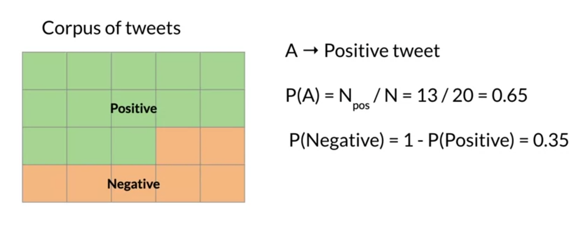
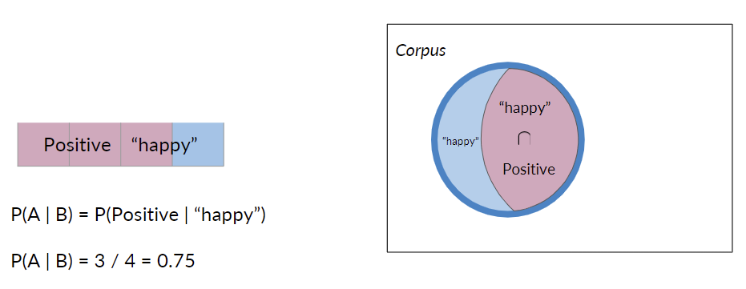
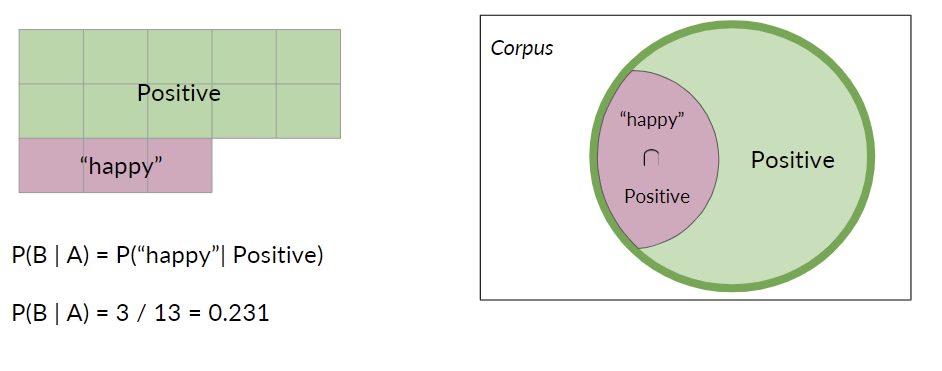
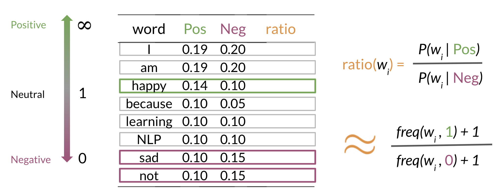
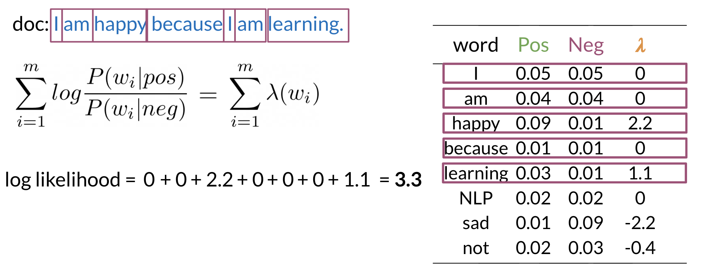

# Sentiment Analysis with Naïve Bayes

- [1 Probability and Bayes
  rules](#probability-and-bayes-rules)
- [2 Conditional
  Probabilities](#conditional-probabilities)
- [3 Naive Bayes for text
  classification.](#naive-bayes-for-text-classification)
  - [3.1 Laplacian
    Smoothing.](#laplacian-smoothing)
  - [3.2 Log
    Likelihood](#log-likelihood)

# Probability and Bayes rules

Bayes rule is applied in many different fields, ranging from medicine to
education and is used extensively in NLP. Imagine you have an extensive
corpus of tweets that can be categorized as either positive or negative
sentiment, but not both. Within that corpus, the word happy is sometimes
being labeled positive and sometimes negative.

Suppose you define event A as a tweets being labeled positive, then the
probability of event A, shown as B of A here, is calculated as the ratio
between the counts of positive tweets in the corpus divided by the total
number of tweets in the corpus. In this example, that number comes out
to 13 over 20, or 0.65. You could also express this value as a
percentage, 65 percent positive. It’s worth noting that the
complimentary probability here, which is the probability of the tweets
expressing a negative sentiment is just equal to one minus the
probability of a positive sentiment
($P(Negative) = 1-P(Positive) = 0.35$).

Now we define event B as the number of tweets containing the word
“happy” therefore $P(B) = P(happy) = N_{happy} / N = P(B) = 4/20 = 0.2$.
We can define the probability of intersection as:

# Conditional Probabilities

In order to derive Bayes rule, let’s first take a look at the
conditional probabilities. Now think about what happens if, instead of
the entire corpus, you only consider tweets that contain the word happy.
This is the same as saying, given that a tweet contains the word happy
with that, you would be considering only the tweets inside the blue
circle, where many of the positive tweets are now excluded. In this
case, the probability that a tweet is positive, given that it contains
the word happy, simply becomes the number of tweets that are positive
and also contain the word happy. We divide that by the number that
contain the word happy. As you can see by this calculation, your tweet
has a 75 percent likelihood of being positive if it contains the word
happy.

You could make the same case for positive tweets. The purple area
denotes the probability that a positive tweet contains the word happy.
In this case, the probability is 3 over 13, which is 0.231

We know now that $P(Postitve | happy) = 3/4$ and
$P(happy | Positive) = 3/13$. We know that the probability of the
intersection of being positive and happy should be
$P(Postitve | happy) * P(happy) = P(Positive \cap happy)$ and in an
analogous manner
$P(happy | Positive) * P(Positive) = P(happy \cap Positive)$

Therefore rearranging you get to:

$P(Postitve | happy) * P(happy) = P(happy | Positive) * P(Positive) / (happy)$

Generalizing Bayes Rule is:

$P(\textrm{X}|\textrm{Y}) = \frac{P(\textrm{Y}|\textrm{X}) \times P(\textrm{X})}{P(\textrm{Y})}$

# Naive Bayes for text classification.

To build a classifier, we will first start by creating conditional
probabilities given the following table:

This allows us to compute the table of probabilities:

Once you have the probabilities, you can compute the likelihood score as
follows:

A score greater than 1 indicates that the class is positive, otherwise
it is negative.

## Laplacian Smoothing.

Sometimes you try to calculate the probability of a word happening after
a word. To do that you might want to count the number of times those two
words showed up. One after another, divided by the number of times the
first word appeared. Now what if the two words never showed up next to
each other in the training corpus. You get a probability of zero, and
the probability of an entire sequence might go to zero.

Laplacian smoothing, a technique you can use to avoid your probabilities
being zero. The expression used to calculate the conditional probability
of a word given the class is the frequency of the word in the corpus:

$P({w_i}|class) = \frac{freq(w_{i}, class)}{N_{class}}$

However, if a word does not appear in the training, then it
automatically gets a probability of 0, to fix this we add smoothing as
follows:

$P({w_i}|class) = \frac{freq(w_{i}, class) + 1}{N_{class} + V_{class}}$

Where $N_{class}$ is the frequency of all words in class and $V_{class}$
is the number of unique words in a class.

## Log Likelihood

To compute the log likelihood, we need to get the ratios and use them to
compute a score that will allow us to decide whether a tweet is positive
or negative. The higher the ratio, the more positive the word is:

To do inference, you can compute the following:

As m gets larger, we can get numerical flow issues, so we introduce the
log, which gives you the following equation:

The first component is called the log prior and the second component is
the log likelihood. We further introduce λ as follows:

Having the $\lambda$ dictionary will help a lot when doing inference. An
example of this inference logic can be found below:

\## Training Naive Bayes

The following algorithm is used to train a Naive Bayes model:

1.  Get or annotate a dataset with positive and negative tweets
2.  Preprocess the text according to the classical preprocessing rules
    we have described in lecture 1 (lowercasing, remove punctuation,
    remove urls, remove names, stop words, stemming, lemmas,
    tokenization)
3.  Compute the $freq(w_{i}, class)$ with the sum of words $N_{class}$
    for every class.
4.  Get the conditional probabilities for every word and each class.
5.  Calculate the $\lambda$ of every word in the frquency table.
6.  Get the log prior las $logprior=log(\frac{P(pos)}/{P(neg)})$

\## Naive Bayes assumptions

Naïve bayes is a very simple model because it doesn’t require setting
any custom parameters. This method is referred to as naïve, because of
the assumptions it makes about the data. The first assumption is
independence between the predictors or features associated with each
class. And the second, has to do with your validation set. Let’s explore
each of these assumptions and how they could affect your results. To
illustrate what independence between features looks like, let’s look at
the following sentence.

In the first image, you can see the word sunny and hot tend to depend on
each other and are correlated to a certain extent with the word
“desert”. Naive Bayes assumes independence throughout. Furthermore, if
you were to fill in the sentence on the right, this naive model will
assign equal weight to the words “spring, summer, fall, winter”.
