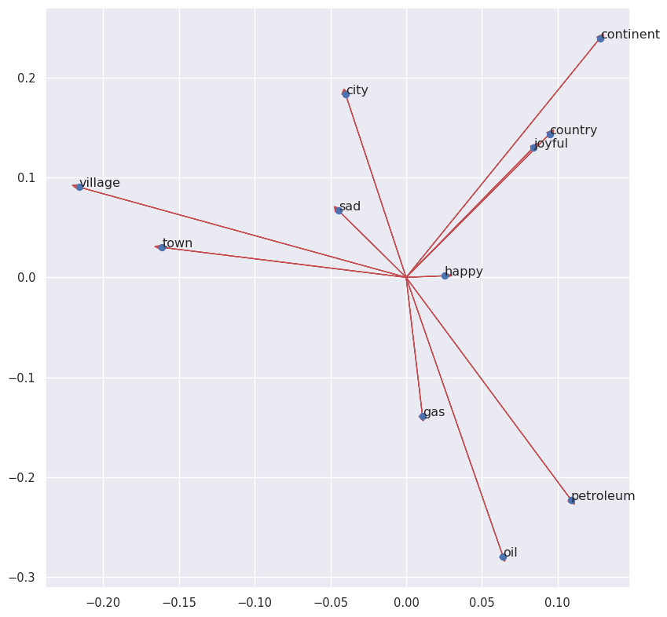
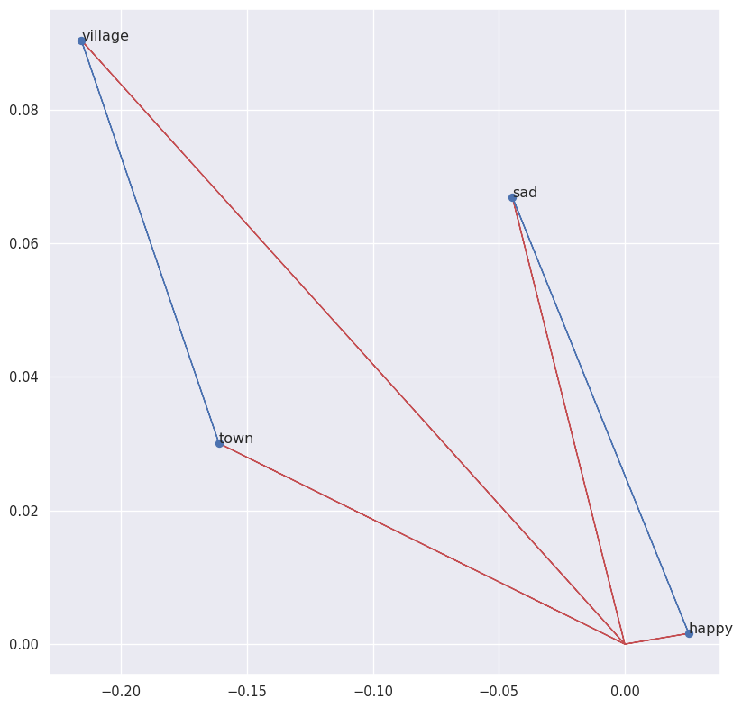
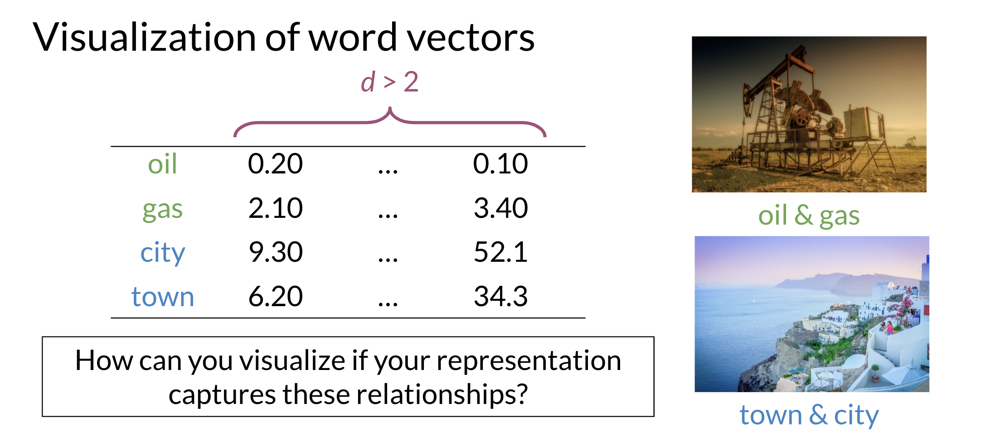
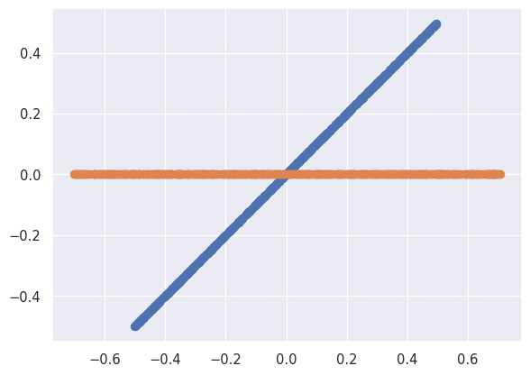
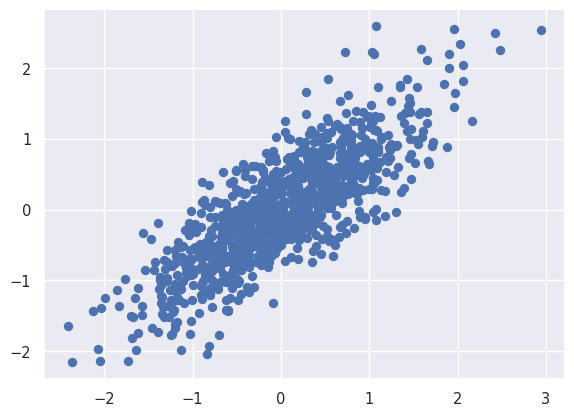
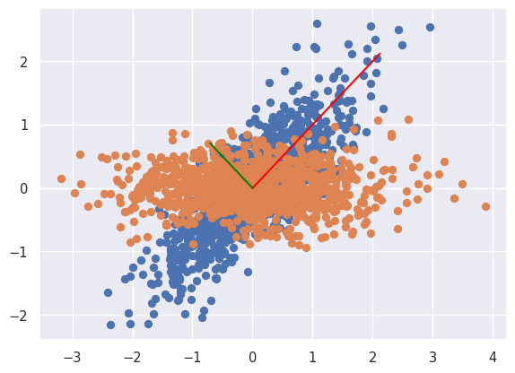

# Vector Space Models


- [<span class="toc-section-number">1</span> Vector space models
  applications](#vector-space-models-applications)
- [<span class="toc-section-number">2</span> Word by Word and Word by
  Doc](#word-by-word-and-word-by-doc)
- [<span class="toc-section-number">3</span> Similarity
  Measures](#similarity-measures)
  - [<span class="toc-section-number">3.1</span> Euclidian
    distance](#euclidian-distance)
    - [<span class="toc-section-number">3.1.1</span> Problems with
      euclidian distance](#problems-with-euclidian-distance)
  - [<span class="toc-section-number">3.2</span> Cosine
    Similarity](#cosine-similarity)
  - [<span class="toc-section-number">3.3</span> Manipulating Words in
    Vector Spaces](#manipulating-words-in-vector-spaces)
    - [<span class="toc-section-number">3.3.1</span> Word
      Distance](#word-distance)
- [<span class="toc-section-number">4</span> PCA](#pca)
  - [<span class="toc-section-number">4.1</span> Correlated Normal
    Random Variables.](#correlated-normal-random-variables)

# Vector space models applications

So suppose you have two questions, the first one is, where are you
heading? And the second one is where are you from? These sentences have
identical words except for the last ones. However, they both have a
different meaning. On the other hand say you have two more questions
whose words are completely different but both sentences mean the same
thing. Vector space models will help you identify whether the first pair
of questions or the second pair are similar in meaning even if they do
not share the same words. They can be used to identify similarity for a
question answering, paraphrasing and summarization. Vector space models
will also allow you to capture dependencies between words. Consider this
sentence, you eat cereal from a bowl, here you can see that the words
cereal and the word bowl are related.


Now let’s look at this other sentence, you buy something and someone
else sells it. So what it’s saying is that someone sells something
because someone else buys it. The second half of the sentence is
dependent on the first half. With vectors based models, you will be able
to capture this and many other types of relationships among different
sets of words. Vector space models are used in information extraction to
answer questions, in the style of who, what, where, how and etcetera. In
machine translation and in chess sports programming.

# Word by Word and Word by Doc

To get a vector space model using a word-by-word design, you will make a
co-occurrence matrix and extract vector or presentations for the words
in your corpus. You’ll be able to get a vector space model using a word
by document design using a similar approach.

The co-occurrence of two different words is the number of times that
they appear in your corpus together within a certain word distance $K$.


You can now apply the same concept and map words to documents. The rows
could correspond to words and the columns to documents. The numbers in
the matrix correspond to the number of times each word showed up in the
document.


You can represent the entertainment category, as a vector
$v=[500,7000]$. You can then also compare categories as follows by doing
a simple plot.


# Similarity Measures

In statistics and related fields, a similarity measure or similarity
function or similarity metric is a real-valued function that quantifies
the similarity between two objects. Although no single definition of a
similarity exists, usually such measures are in some sense the inverse
of distance metrics: they take on large values for similar objects and
either zero or a negative value for very dissimilar objects. Though, in
more broad terms, a similarity function may also satisfy metric axioms.

## Euclidian distance

Let us assume that you want to compute the distance between two points:
A,B. To do so, you can use the euclidean distance defined as:

$$
d(B,A) = \sqrt{(B_{1}-A_{1})^2+(B_{2}-A_{2})^2}
$$

Taking into account the text corpus of the previous example we can
calculate the distance between this to corpus as follows:


You can generalize finding the distance between the two points (A,B) to
the distance between an n dimensional vector as follows:

$$
d(\vec{v},\vec{w}) = \sqrt{\sum_{i=1}^{n} (v_{i}-w_{i})^2}
$$

Here is an example where I calculate the distance between 2 vectors
($n=3$).


### Problems with euclidian distance

Suppose that you are in a vector space where the corpora are represented
by the occurrence of the words disease and eggs. Here’s the
representation of a food corpus, and agriculture corpus, and the history
corpus. Each one of these corpora have texts related to that subject.
But you know that the word totals in the corpora differ from one
another. In fact, the agriculture and the history corpus have a similar
number of words, while the food corpus has a relatively small number.
Let’s define the Euclidean distance between the food and the agriculture
corpus as $d_1$ and let’s the Euclidean distance between the agriculture
and the history corpus be $d_2$. As you can see, the distance $d_2$ is
smaller than the distance $d_1$, which would suggest that the
agriculture and history corpora are more similar than the agriculture
and food corpora.


## Cosine Similarity

Cosine similarity is another type of similarity function. Following the
example below you can see that the angle Alpha between food and
agriculture is smaller than the angle Beta between agriculture and
history.


In this particular case, the cosine of those angles is a better proxy of
similarity between these vector representations than their Euclidean
distance. Formally we need to link the angle mentioned with some basic
algebra. For that we will use the vector norm and the dot product.

The vector norm is defined as:

$$
\mid \vec{v} \mid = \sqrt{\sum_{i=1}^{n} (\mid v_{i} \mid)^2}
$$

The dot product is defined as:

$$
\vec{v} \vec{w} = \sum_{i=1}^{n} v_{i} \dot w_{i}
$$

We also now that the dot product can be defined as:

$$
\hat{v} \hat{w} = {\mid \mid  \hat{v} \mid \mid}  \mid \mid \hat{w} \mid \mid cos(\beta)
$$

If the cosine similarity is = 1 it means the vectors are equal. If the
cosine similarity is 0 it means that the vectors are perpendicular.


## Manipulating Words in Vector Spaces

Suppose that you have a vector space with countries and their capital
cities. You know that the capital of the United States is Washington DC,
and you don’t know the capital of Russia. But you’d like to use the
known relationship between Washington DC and the USA to figure it out.


In this case the predicted position Moscow will be (10,4) meanwhile the
real position is (9,3). The distance between the predicted position
using the most similar vector pair and the real one will be $\sqrt{2}$

Lets practice with a more realistic example. We will load the
word_embeddings pickle file which contains 243 words as well as their
respective representation.

``` python
import pandas as pd
import numpy as np
import pickle

word_embeddings = pickle.load( open( "word_embeddings_subset.p", "rb" ) )
```

Now that the model is loaded, we can take a look at the word
representations. First, note that word_embeddings is a dictionary. Each
word is the key to the entry, and the value is its corresponding vector
presentation. Remember that square brackets allow access to any entry if
the key exists.

``` python
countryVector = word_embeddings['country'] # Get the vector representation for the word 'country'
print(type(countryVector)) # Print the type of the vector. Note it is a numpy array
print(countryVector) # Print the values of the vector.
```

    <class 'numpy.ndarray'>
    [-0.08007812  0.13378906  0.14355469  0.09472656 -0.04736328 -0.02355957
     -0.00854492 -0.18652344  0.04589844 -0.08154297 -0.03442383 -0.11621094
      0.21777344 -0.10351562 -0.06689453  0.15332031 -0.19335938  0.26367188
     -0.13671875 -0.05566406  0.07470703 -0.00070953  0.09375    -0.14453125
      0.04296875 -0.01916504 -0.22558594 -0.12695312 -0.0168457   0.05224609
      0.0625     -0.1484375  -0.01965332  0.17578125  0.10644531 -0.04760742
     -0.10253906 -0.28515625  0.10351562  0.20800781 -0.07617188 -0.04345703
      0.08642578  0.08740234  0.11767578  0.20996094 -0.07275391  0.1640625
     -0.01135254  0.0025177   0.05810547 -0.03222656  0.06884766  0.046875
      0.10107422  0.02148438 -0.16210938  0.07128906 -0.16210938  0.05981445
      0.05102539 -0.05566406  0.06787109 -0.03759766  0.04345703 -0.03173828
     -0.03417969 -0.01116943  0.06201172 -0.08007812 -0.14941406  0.11914062
      0.02575684  0.00302124  0.04711914 -0.17773438  0.04101562  0.05541992
      0.00598145  0.03027344 -0.07666016 -0.109375    0.02832031 -0.10498047
      0.0100708  -0.03149414 -0.22363281 -0.03125    -0.01147461  0.17285156
      0.08056641 -0.10888672 -0.09570312 -0.21777344 -0.07910156 -0.10009766
      0.06396484 -0.11962891  0.18652344 -0.02062988 -0.02172852  0.29296875
     -0.00793457  0.0324707  -0.15136719  0.00227356 -0.03540039 -0.13378906
      0.0546875  -0.03271484 -0.01855469 -0.10302734 -0.13378906  0.11425781
      0.16699219  0.01361084 -0.02722168 -0.2109375   0.07177734  0.08691406
     -0.09960938  0.01422119 -0.18261719  0.00741577  0.01965332  0.00738525
     -0.03271484 -0.15234375 -0.26367188 -0.14746094  0.03320312 -0.03344727
     -0.01000977  0.01855469  0.00183868 -0.10498047  0.09667969  0.07910156
      0.11181641  0.13085938 -0.08740234 -0.1328125   0.05004883  0.19824219
      0.0612793   0.16210938  0.06933594  0.01281738  0.01550293  0.01531982
      0.11474609  0.02758789  0.13769531 -0.08349609  0.01123047 -0.20507812
     -0.12988281 -0.16699219  0.20410156 -0.03588867 -0.10888672  0.0534668
      0.15820312 -0.20410156  0.14648438 -0.11572266  0.01855469 -0.13574219
      0.24121094  0.12304688 -0.14550781  0.17578125  0.11816406 -0.30859375
      0.10888672 -0.22363281  0.19335938 -0.15722656 -0.07666016 -0.09082031
     -0.19628906 -0.23144531 -0.09130859 -0.14160156  0.06347656  0.03344727
     -0.03369141  0.06591797  0.06201172  0.3046875   0.16796875 -0.11035156
     -0.03833008 -0.02563477 -0.09765625  0.04467773 -0.0534668   0.11621094
     -0.15039062 -0.16308594 -0.15527344  0.04638672  0.11572266 -0.06640625
     -0.04516602  0.02331543 -0.08105469 -0.0255127  -0.07714844  0.0016861
      0.15820312  0.00994873 -0.06445312  0.15722656 -0.03112793  0.10644531
     -0.140625    0.23535156 -0.11279297  0.16015625  0.00061798 -0.1484375
      0.02307129 -0.109375    0.05444336 -0.14160156  0.11621094  0.03710938
      0.14746094 -0.04199219 -0.01391602 -0.03881836  0.02783203  0.10205078
      0.07470703  0.20898438 -0.04223633 -0.04150391 -0.00588989 -0.14941406
     -0.04296875 -0.10107422 -0.06176758  0.09472656  0.22265625 -0.02307129
      0.04858398 -0.15527344 -0.02282715 -0.04174805  0.16699219 -0.09423828
      0.14453125  0.11132812  0.04223633 -0.16699219  0.10253906  0.16796875
      0.12597656 -0.11865234 -0.0213623  -0.08056641  0.24316406  0.15527344
      0.16503906  0.00854492 -0.12255859  0.08691406 -0.11914062 -0.02941895
      0.08349609 -0.03100586  0.13964844 -0.05151367  0.00765991 -0.04443359
     -0.04980469 -0.03222656 -0.00952148 -0.10888672 -0.10302734 -0.15722656
      0.19335938  0.04858398  0.015625   -0.08105469 -0.11621094 -0.01989746
      0.05737305  0.06103516 -0.14550781  0.06738281 -0.24414062 -0.07714844
      0.04760742 -0.07519531 -0.14941406 -0.04418945  0.09716797  0.06738281]

It is important to note that we store each vector as a NumPy array. It
allows us to use the linear algebra operations on it.

The vectors have a size of 300, while the vocabulary size of Google News
is around 3 million words!

``` python
#Get the vector for a given word:
def vec(w):
    return word_embeddings[w]
```

Word embeddings are the result of machine learning processes and will be
part of the input for further processes. These word embedding needs to
be validated or at least understood because the performance of the
derived model will strongly depend on its quality.

Word embeddings are multidimensional arrays, usually with hundreds of
attributes that pose a challenge for its interpretation.

``` python
import matplotlib.pyplot as plt # Import matplotlib
import seaborn as sns
sns.set_theme()

words = ['oil', 'gas', 'happy', 'sad', 'city', 'town', 'village', 'country', 'continent', 'petroleum', 'joyful']

bag2d = np.array([vec(word) for word in words]) # Convert each word to its vector representation

fig, ax = plt.subplots(figsize = (10, 10)) # Create custom size image

col1 = 3 # Select the column for the x axis
col2 = 2 # Select the column for the y axis

# Print an arrow for each word
for word in bag2d:
    ax.arrow(0, 0, word[col1], word[col2], head_width=0.005, head_length=0.005, fc='r', ec='r', width = 1e-5)


ax.scatter(bag2d[:, col1], bag2d[:, col2]); # Plot a dot for each word

# Add the word label over each dot in the scatter plot
for i in range(0, len(words)):
    ax.annotate(words[i], (bag2d[i, col1], bag2d[i, col2]))


plt.show()
```



Note that similar words like ‘village’ and ‘town’ or ‘petroleum’, ‘oil’,
and ‘gas’ tend to point in the same direction. Also, note that ‘sad’ and
‘happy’ looks close to each other; however, the vectors point in
opposite directions.

### Word Distance

Now plot the words ‘sad’, ‘happy’, ‘town’, and ‘village’. In this same
chart, display the vector from ‘village’ to ‘town’ and the vector from
‘sad’ to ‘happy’. Let us use NumPy for these linear algebra operations.

``` python
words = ['sad', 'happy', 'town', 'village']

bag2d = np.array([vec(word) for word in words]) # Convert each word to its vector representation

fig, ax = plt.subplots(figsize = (10, 10)) # Create custom size image

col1 = 3 # Select the column for the x axe
col2 = 2 # Select the column for the y axe

# Print an arrow for each word
for word in bag2d:
    ax.arrow(0, 0, word[col1], word[col2], head_width=0.0005, head_length=0.0005, fc='r', ec='r', width = 1e-5)

# print the vector difference between village and town
village = vec('village')
town = vec('town')
diff = town - village
ax.arrow(village[col1], village[col2], diff[col1], diff[col2], fc='b', ec='b', width = 1e-5)

# print the vector difference between village and town
sad = vec('sad')
happy = vec('happy')
diff = happy - sad
ax.arrow(sad[col1], sad[col2], diff[col1], diff[col2], fc='b', ec='b', width = 1e-5)


ax.scatter(bag2d[:, col1], bag2d[:, col2]); # Plot a dot for each word

# Add the word label over each dot in the scatter plot
for i in range(0, len(words)):
    ax.annotate(words[i], (bag2d[i, col1], bag2d[i, col2]))


plt.show()
```



We can also get the norm of a word in the word embedding:

``` python
print(np.linalg.norm(vec('town'))) # Print the norm of the word town
print(np.linalg.norm(vec('sad'))) # Print the norm of the word sad
```

    2.3858097
    2.9004838

Now, applying vector difference and addition, one can create a vector
representation for a new word. For example, we can say that the vector
difference between ‘France’ and ‘Paris’ represents the concept of
Capital.

One can move from the city of Madrid in the direction of the concept of
Capital, and obtain something close to the corresponding country to
which Madrid is the Capital.

``` python
capital = vec('France') - vec('Paris')
country = vec('Madrid') + capital

print(country[0:5]) # Print the first 5 values of the vector
```

    [-0.02905273 -0.2475586   0.53952026  0.20581055 -0.14862823]

We can observe that the vector ‘country’ that we expected to be the same
as the vector for Spain is not exactly it.

``` python
diff = country - vec('Spain')
print(diff[0:10])
```

    [-0.06054688 -0.06494141  0.37643433  0.08129883 -0.13007355 -0.00952148
     -0.03417969 -0.00708008  0.09790039 -0.01867676]

So, we have to look for the closest words in the embedding that matches
the candidate country. If the word embedding works as expected, the most
similar word must be ‘Spain’. Let us define a function that helps us to
do it. We will store our word embedding as a DataFrame, which facilitate
the lookup operations based on the numerical vectors.

``` python
keys = word_embeddings.keys()
data = []
for key in keys:
    data.append(word_embeddings[key])

embedding = pd.DataFrame(data=data, index=keys)
# Define a function to find the closest word to a vector:
def find_closest_word(v, k = 1):
    # Calculate the vector difference from each word to the input vector
    diff = embedding.values - v
    # Get the squared L2 norm of each difference vector.
    # It means the squared euclidean distance from each word to the input vector
    delta = np.sum(diff * diff, axis=1)
    # Find the index of the minimun distance in the array
    i = np.argmin(delta)
    # Return the row name for this item
    return embedding.iloc[i].name

embedding.head(8)
```

<div>
<style scoped>
    .dataframe tbody tr th:only-of-type {
        vertical-align: middle;
    }
&#10;    .dataframe tbody tr th {
        vertical-align: top;
    }
&#10;    .dataframe thead th {
        text-align: right;
    }
</style>

|         | 0         | 1         | 2         | 3         | 4         | 5         | 6         | 7         | 8         | 9         | ... | 290       | 291       | 292       | 293       | 294       | 295       | 296       | 297       | 298      | 299       |
|---------|-----------|-----------|-----------|-----------|-----------|-----------|-----------|-----------|-----------|-----------|-----|-----------|-----------|-----------|-----------|-----------|-----------|-----------|-----------|----------|-----------|
| country | -0.080078 | 0.133789  | 0.143555  | 0.094727  | -0.047363 | -0.023560 | -0.008545 | -0.186523 | 0.045898  | -0.081543 | ... | -0.145508 | 0.067383  | -0.244141 | -0.077148 | 0.047607  | -0.075195 | -0.149414 | -0.044189 | 0.097168 | 0.067383  |
| city    | -0.010071 | 0.057373  | 0.183594  | -0.040039 | -0.029785 | -0.079102 | 0.071777  | 0.013306  | -0.143555 | 0.011292  | ... | 0.024292  | -0.168945 | -0.062988 | 0.117188  | -0.020508 | 0.030273  | -0.247070 | -0.122559 | 0.076172 | -0.234375 |
| China   | -0.073242 | 0.135742  | 0.108887  | 0.083008  | -0.127930 | -0.227539 | 0.151367  | -0.045654 | -0.065430 | 0.034424  | ... | 0.140625  | 0.087402  | 0.152344  | 0.079590  | 0.006348  | -0.037842 | -0.183594 | 0.137695  | 0.093750 | -0.079590 |
| Iraq    | 0.191406  | 0.125000  | -0.065430 | 0.060059  | -0.285156 | -0.102539 | 0.117188  | -0.351562 | -0.095215 | 0.200195  | ... | -0.100586 | -0.077148 | -0.123047 | 0.193359  | -0.153320 | 0.089355  | -0.173828 | -0.054688 | 0.302734 | 0.105957  |
| oil     | -0.139648 | 0.062256  | -0.279297 | 0.063965  | 0.044434  | -0.154297 | -0.184570 | -0.498047 | 0.047363  | 0.110840  | ... | -0.195312 | -0.345703 | 0.217773  | -0.091797 | 0.051025  | 0.061279  | 0.194336  | 0.204102  | 0.235352 | -0.051025 |
| town    | 0.123535  | 0.159180  | 0.030029  | -0.161133 | 0.015625  | 0.111816  | 0.039795  | -0.196289 | -0.039307 | 0.067871  | ... | -0.007935 | -0.091797 | -0.265625 | 0.029297  | 0.089844  | -0.049805 | -0.202148 | -0.079590 | 0.068848 | -0.164062 |
| Canada  | -0.136719 | -0.154297 | 0.269531  | 0.273438  | 0.086914  | -0.076172 | -0.018677 | 0.006256  | 0.077637  | -0.211914 | ... | 0.105469  | 0.030762  | -0.039307 | 0.183594  | -0.117676 | 0.191406  | 0.074219  | 0.020996  | 0.285156 | -0.257812 |
| London  | -0.267578 | 0.092773  | -0.238281 | 0.115234  | -0.006836 | 0.221680  | -0.251953 | -0.055420 | 0.020020  | 0.149414  | ... | -0.008667 | -0.008484 | -0.053223 | 0.197266  | -0.296875 | 0.064453  | 0.091797  | 0.058350  | 0.022583 | -0.101074 |

<p>8 rows × 300 columns</p>
</div>

Now let us find the name that corresponds to our numerical country:

``` python
find_closest_word(country)
```

    'Spain'

For other countries:

``` python
print(find_closest_word(vec('Berlin') + capital))
print(find_closest_word(vec('Beijing') + capital))
```

    Germany
    China

And finally you can also use the concept to represent a whole sentence:

``` python
doc = "Venezuela petroleum king"
vdoc = [vec(x) for x in doc.split(" ")]
doc2vec = np.sum(vdoc, axis = 0)
doc2vec
```

    array([-0.19970703,  0.21722412, -0.07537842,  0.48486328, -0.17114258,
           -0.3737793 , -0.23876953, -1.2294922 , -0.00199127,  0.29003906,
           -0.05053711, -0.12792969, -0.4765625 ,  0.01806641, -0.19726562,
            0.28759766, -0.01013184,  0.03256226,  0.3597412 ,  0.31591797,
            0.517334  , -0.4790039 ,  0.09399414,  0.4814453 ,  0.43896484,
            0.16894531, -0.21533203, -0.13549805,  0.22851562,  0.39611816,
            0.17993164, -0.08813477, -0.31982422,  0.4477539 , -0.72802734,
            0.21606445,  0.06347656, -0.08886719,  0.43115234,  0.54296875,
            0.43017578, -0.13391113,  1.1074219 ,  0.35791016, -0.01855469,
            0.31518555, -0.62158203,  0.25952148, -0.54785156,  0.32907104,
           -0.6430664 ,  0.02490234, -0.15112305,  0.06750488, -0.25952148,
            0.31288147, -0.6484375 , -0.0324707 ,  0.21069336, -0.32058716,
            0.28955078,  0.46264648,  0.00177002,  0.309021  ,  0.22460938,
           -0.33007812, -0.34558105, -0.17285156, -0.4560547 ,  0.25421143,
           -0.2841797 , -0.30029297, -0.0625    , -0.5024414 , -0.37182617,
           -0.18432617, -0.12915039,  0.44311523,  0.18089294,  0.09692383,
           -0.03735352, -0.05828857, -0.35595703,  0.10559082,  0.16638184,
           -0.41992188, -0.42797852,  0.66711426,  0.01757812,  0.36206055,
            0.15844727, -0.0546875 , -0.32714844, -0.16809082, -0.38623047,
           -0.29589844,  0.04919434, -0.1348877 ,  0.48535156, -0.22705078,
            0.4477539 ,  0.6147461 , -0.09887695, -0.9248047 , -0.03369141,
            0.25219727, -0.19677734, -0.0567627 ,  0.03955078,  0.14013672,
            0.00878906, -0.0222168 , -0.35986137, -0.08007812,  0.19995117,
            0.42578125, -0.22862244, -0.24438477,  0.37365723,  0.3319702 ,
            0.16152954,  0.06494141, -0.5126953 , -0.43408203, -0.5358887 ,
           -0.07324219,  0.16447449, -0.40600586, -0.6370535 , -0.3618164 ,
           -0.5073242 ,  0.7138672 ,  0.04870605, -0.03271484,  0.21801758,
            0.03466797, -0.5180664 , -0.1809082 , -0.2368164 ,  0.21679688,
            0.05175781, -0.55859375,  0.05859375,  0.11816406,  0.20654297,
            0.00585938,  0.25512695, -0.02490234, -0.45947266,  0.4958496 ,
            0.46484375, -0.14562988, -0.62597656, -0.21057129,  0.15429688,
           -0.06445312, -0.30126953,  0.13183594,  0.12133789, -0.2993164 ,
            0.10180664,  0.47735596,  0.39208984,  0.05029297,  0.2290039 ,
            0.04589844, -0.09619141, -0.04022217,  0.21432495,  0.5283203 ,
           -0.42285156,  0.46679688,  0.31982422, -0.27246094,  0.12739563,
           -0.47705078,  0.3725586 , -0.8475342 , -0.4354248 ,  0.01702881,
           -0.703125  , -0.22875977, -0.5283203 , -0.26245117,  0.23751831,
            0.10839844,  0.42773438,  0.40576172,  0.5878906 ,  0.46240234,
           -0.3149414 ,  0.1809082 , -0.07287598, -0.2975464 , -0.43164062,
            0.4161377 , -0.24993896, -0.26953125, -0.31835938, -0.579834  ,
            0.06005859, -0.14282227, -0.3515625 , -0.58251953, -0.09503174,
           -0.04296875,  0.38500977, -0.44628906, -0.41748047,  0.00927734,
            0.08789062,  0.10534668, -0.35717773, -0.12890625,  0.14819336,
            0.2866211 , -0.4750595 , -0.04077148, -0.31323242, -0.14764404,
           -0.15505219, -0.38427734,  0.17675781, -0.44091797,  0.25073242,
            0.12451172,  0.0703125 ,  0.29736328,  0.83154297,  0.75      ,
           -0.03808594, -0.10839844, -0.21875   , -0.10845947,  0.03808594,
            0.47021484,  0.23831177, -0.08380127,  0.09594727, -0.09692383,
            0.22802734, -0.28955078, -0.3553543 ,  0.4260254 , -0.01513672,
           -0.21191406, -0.25585938, -0.25048828,  0.16064453, -0.19689941,
            0.18121338, -0.26416016,  0.00134277,  0.2590332 ,  0.46923828,
            0.10498047, -0.26745605, -0.34240723, -0.21435547, -0.25756836,
            0.39160156,  0.49609375, -0.07617188,  0.12402344,  0.49609375,
           -0.02490234, -0.5788574 , -0.17089844,  0.2705078 ,  0.4736328 ,
           -0.2697754 ,  0.8388672 ,  0.06176758, -0.2763672 , -0.25708008,
            0.41308594, -0.80371094, -0.06591797, -0.08691406,  0.3765869 ,
            0.24609375, -0.42529297,  0.6118164 ,  0.07763672,  0.23290253,
           -0.5986328 , -0.36987305,  0.03186035,  0.25842285, -0.15698242,
           -0.14480591, -0.88671875, -0.23339844, -0.46411133,  0.33740234,
           -0.08190918,  0.07080078,  0.07177734,  0.49658203, -0.01416016],
          dtype=float32)

``` python
find_closest_word(doc2vec)
```

    'Venezuela'

# PCA

When you have a representation of your words in a high dimensional
space, you could use an algorithm like PCA to get a representation on a
vector space with fewer dimensions. If you want to visualize your data,
you can get a reduced representation with three or fewer features. If
you perform principal component analysis on your data and get a two
dimensional representation, you can then plot a visual of your words. In
this case, you might find that your initial representation captured the
relationship between the words oil and gas and city and town. Because in
your two dimensional space they appear to be clustered with related
words.



Note that when doing PCA on this data, you will see that oil & gas are
close to one another and town & city are also close to one another. To
plot the data you can use PCA to go from $d>2 to d=2$.

The PCA algorithm is described as follows:


1.  Mean normalize your data.
2.  Compute the covariance matrix.
3.  Compute the SVD (Singular Value Decomposition) on your covariance.
    This returns $[USV] = svd(\sum)$. The three matrices U, S, V are
    drawn above. U is labelled with eigenvectors, and S is labelled with
    eigenvalues.
4.  You can then use the first $n$ columns of vector U, to get your new
    data by multiplying $XU[:,0 : n]$

PCA is based on the Singular Value Decomposition (SVD) of the Covariance
Matrix of the original dataset. The Eigenvectors of such decomposition
are used as a rotation matrix. The Eigenvectors are arranged in the
rotation matrix in decreasing order according to its explained variance.
This last term is related to the EigenValues of the SVD. In this case,
we are going to use the concept of rotation matrices applied to
correlated random data, just as illustrated in the next picture.


To start, let us consider a pair of random variables x, y. Consider the
base case when y = n \* x. The x and y variables will be perfectly
correlated to each other since y is just a scaling of x.

``` python
import numpy as np                         # Linear algebra library
import matplotlib.pyplot as plt            # library for visualization
import seaborn as sns
from sklearn.decomposition import PCA      # PCA library
import pandas as pd                        # Data frame library
import math                                # Library for math functions
import random                              # Library for pseudo random numbers
sns.set_theme()
np.random.seed(1)
n = 1  # The amount of the correlation
x = np.random.uniform(1,2,1000) # Generate 1000 samples from a uniform random variable
y = x.copy() * n # Make y = n * x

# PCA works better if the data is centered
x = x - np.mean(x) # Center x. Remove its mean
y = y - np.mean(y) # Center y. Remove its mean

data = pd.DataFrame({'x': x, 'y': y}) # Create a data frame with x and y
plt.scatter(data.x, data.y) # Plot the original correlated data in blue

pca = PCA(n_components=2) # Instantiate a PCA. Choose to get 2 output variables

# Create the transformation model for this data. Internally, it gets the rotation
# matrix and the explained variance
pcaTr = pca.fit(data)

rotatedData = pcaTr.transform(data) # Transform the data base on the rotation matrix of pcaTr
# # Create a data frame with the new variables. We call these new variables PC1 and PC2
dataPCA = pd.DataFrame(data = rotatedData, columns = ['PC1', 'PC2'])

# Plot the transformed data in orange
plt.scatter(dataPCA.PC1, dataPCA.PC2)
plt.show()
```



Now, what is the direction in which the variables point?

As mentioned before, a PCA model is composed of a rotation matrix and
its corresponding explained variance.

- pcaTr.components\_ has the rotation matrix
- pcaTr.explained_variance\_ has the explained variance of each
  principal component

``` python
print('Eigenvectors or principal component: First row must be in the direction of [1, n]')
print(pcaTr.components_)

print()
print('Eigenvalues or explained variance')
print(pcaTr.explained_variance_)
```

    Eigenvectors or principal component: First row must be in the direction of [1, n]
    [[-0.70710678 -0.70710678]
     [-0.70710678  0.70710678]]

    Eigenvalues or explained variance
    [1.66465230e-01 4.66587934e-33]

Is not a coincidence that the values of the eigenvectors are 0.7071 as
they correspond to $cos(45)$. In this case the rotation matrix is:

$$
R = \begin{bmatrix} cos(45^o) & sin(45^o) \\ -sin(45^o) & cos(45^o) \end{bmatrix}
$$

And $45$ is the same angle that the variables form as y= 1\*x. Then, PCA
has identified the angle in which point the original variables.

And the explained Variance is around \[0.166 0\]. Remember that the
Variance of a uniform random variable $x ~ U(1, 2)$, as our x and y, is
equal to:

$Var(x) = \frac {(2 - 1)^2}{12} = 0.083333$

Then the explained variance given by the PCA can be interpret as:

$[Var(x) + Var(y),  \ 0] = [0.0833 + 0.0833, \ 0] = [0.166, \ 0]$

Which means that all the explained variance of our new system is
explained by our first principal component.

## Correlated Normal Random Variables.

Now, we will use a controlled dataset composed of 2 random variables
with different variances and with a specific Covariance among them. The
only way I know to get such a dataset is, first, create two independent
Normal random variables with the desired variances and then combine them
using a rotation matrix. In this way, the new resulting variables will
be a linear combination of the original random variables and thus be
dependent and correlated.

``` python
import matplotlib.lines as mlines
import matplotlib.transforms as mtransforms
import seaborn as sns
sns.set_theme()

np.random.seed(100)

std1 = 1     # The desired standard deviation of our first random variable
std2 = 0.333 # The desired standard deviation of our second random variable

x = np.random.normal(0, std1, 1000) # Get 1000 samples from x ~ N(0, std1)
y = np.random.normal(0, std2, 1000)  # Get 1000 samples from y ~ N(0, std2)
#y = y + np.random.normal(0,1,1000)*noiseLevel * np.sin(0.78)

# PCA works better if the data is centered
x = x - np.mean(x) # Center x
y = y - np.mean(y) # Center y

#Define a pair of dependent variables with a desired amount of covariance
n = 1 # Magnitude of covariance.
angle = np.arctan(1 / n) # Convert the covariance to and angle
print('angle: ',  angle * 180 / math.pi)

# Create a rotation matrix using the given angle
rotationMatrix = np.array([[np.cos(angle), np.sin(angle)],
                 [-np.sin(angle), np.cos(angle)]])


print('rotationMatrix')
print(rotationMatrix)

xy = np.concatenate(([x] , [y]), axis=0).T # Create a matrix with columns x and y

# Transform the data using the rotation matrix. It correlates the two variables
data = np.dot(xy, rotationMatrix) # Return a nD array

# Print the rotated data
plt.scatter(data[:,0], data[:,1])
plt.show()
```

    angle:  45.0
    rotationMatrix
    [[ 0.70710678  0.70710678]
     [-0.70710678  0.70710678]]



Let us print the original and the resulting transformed system using the
result of the PCA in the same plot alongside with the 2 Principal
Component vectors in red and blue

``` python
plt.scatter(data[:,0], data[:,1]) # Print the original data in blue

# Apply PCA. In theory, the Eigenvector matrix must be the
# inverse of the original rotationMatrix.
pca = PCA(n_components=2)  # Instantiate a PCA. Choose to get 2 output variables

# Create the transformation model for this data. Internally it gets the rotation
# matrix and the explained variance
pcaTr = pca.fit(data)

# Create an array with the transformed data
dataPCA = pcaTr.transform(data)

print('Eigenvectors or principal component: First row must be in the direction of [1, n]')
print(pcaTr.components_)

print()
print('Eigenvalues or explained variance')
print(pcaTr.explained_variance_)

# Print the rotated data
plt.scatter(dataPCA[:,0], dataPCA[:,1])

# Plot the first component axe. Use the explained variance to scale the vector
plt.plot([0, rotationMatrix[0][0] * std1 * 3], [0, rotationMatrix[0][1] * std1 * 3], 'k-', color='red')
# Plot the second component axe. Use the explained variance to scale the vector
plt.plot([0, rotationMatrix[1][0] * std2 * 3], [0, rotationMatrix[1][1] * std2 * 3], 'k-', color='green')

plt.show()
```

    Eigenvectors or principal component: First row must be in the direction of [1, n]
    [[ 0.70827652  0.7059351 ]
     [-0.7059351   0.70827652]]

    Eigenvalues or explained variance
    [1.09488457 0.11243237]

    /tmp/ipykernel_110646/1540591202.py:25: UserWarning:

    color is redundantly defined by the 'color' keyword argument and the fmt string "k-" (-> color='k'). The keyword argument will take precedence.

    /tmp/ipykernel_110646/1540591202.py:27: UserWarning:

    color is redundantly defined by the 'color' keyword argument and the fmt string "k-" (-> color='k'). The keyword argument will take precedence.



The explanation of this chart is as follows:

- The rotation matrix used to create our correlated variables took the
  original uncorrelated variables x and y and transformed them into the
  blue points.
- The PCA transformation finds out the rotation matrix used to create
  our correlated variables (blue points). Using the PCA model to
  transform our data, puts back the variables as our original
  uncorrelated variables.
- The explained Variance of the PCA is

$[1.0094, 0.1125]$

Which is approximately:

$[1, 0.333 * 0.333] = [std1^2, std2^2]$

Which are the parameters of our original random variables x and y.

For information about how the roation matrix is derived you can check
the following
[article](https://en.wikipedia.org/wiki/Rotation_matrix#In_two_dimensions)
