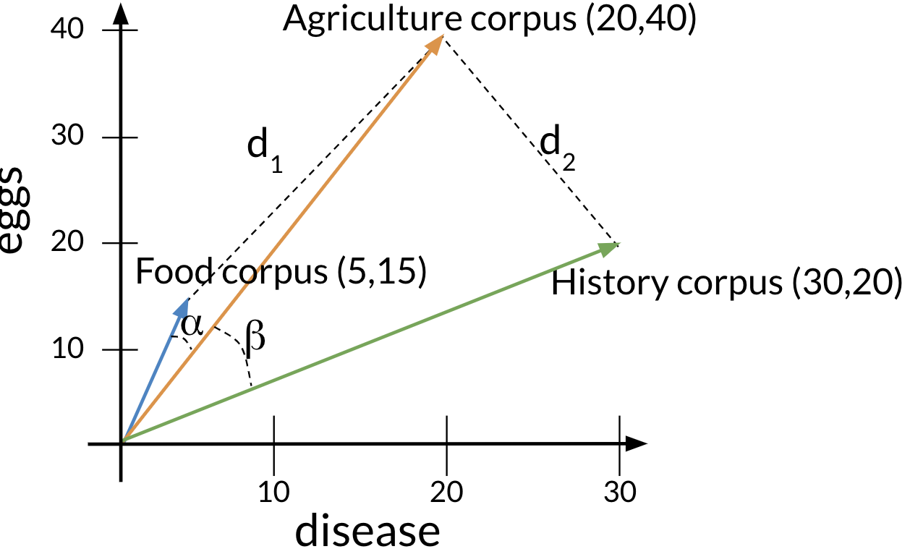
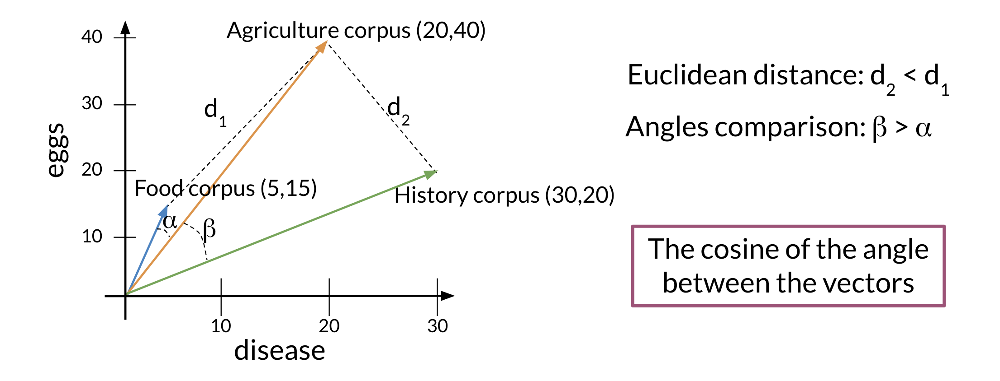

# Vector Space Models

- [1 Vector space models
  applications](#vector-space-models-applications)
- [2 Word by Word and Word by
  Doc](#word-by-word-and-word-by-doc)
- [3 Similarity
  Measures](#similarity-measures)
  - [3.1 Euclidian
    distance](#euclidian-distance)
    - [3.1.1 Problems with
      euclidian distance](#problems-with-euclidian-distance)
  - [3.2 Cosine
    Similarity](#cosine-similarity)
  - [3.3 Manipulating Words in
    Vector Spaces](#manipulating-words-in-vector-spaces)
- [4 PCA](#pca)

# Vector space models applications

So suppose you have two questions, the first one is, where are you
heading? And the second one is where are you from? These sentences have
identical words except for the last ones. However, they both have a
different meaning. On the other hand say you have two more questions
whose words are completely different but both sentences mean the same
thing. Vector space models will help you identify whether the first pair
of questions or the second pair are similar in meaning even if they do
not share the same words. They can be used to identify similarity for a
question answering, paraphrasing and summarization. Vector space models
will also allow you to capture dependencies between words. Consider this
sentence, you eat cereal from a bowl, here you can see that the words
cereal and the word bowl are related.

Now let’s look at this other sentence, you buy something and someone
else sells it. So what it’s saying is that someone sells something
because someone else buys it. The second half of the sentence is
dependent on the first half. With vectors based models, you will be able
to capture this and many other types of relationships among different
sets of words. Vector space models are used in information extraction to
answer questions, in the style of who, what, where, how and etcetera. In
machine translation and in chess sports programming.

# Word by Word and Word by Doc

To get a vector space model using a word-by-word design, you will make a
co-occurrence matrix and extract vector or presentations for the words
in your corpus. You’ll be able to get a vector space model using a word
by document design using a similar approach.

The co-occurrence of two different words is the number of times that
they appear in your corpus together within a certain word distance $K$.

You can now apply the same concept and map words to documents. The rows
could correspond to words and the columns to documents. The numbers in
the matrix correspond to the number of times each word showed up in the
document.

You can represent the entertainment category, as a vector
$v=[500,7000]$. You can then also compare categories as follows by doing
a simple plot.

# Similarity Measures

In statistics and related fields, a similarity measure or similarity
function or similarity metric is a real-valued function that quantifies
the similarity between two objects. Although no single definition of a
similarity exists, usually such measures are in some sense the inverse
of distance metrics: they take on large values for similar objects and
either zero or a negative value for very dissimilar objects. Though, in
more broad terms, a similarity function may also satisfy metric axioms.

## Euclidian distance

Let us assume that you want to compute the distance between two points:
A,B. To do so, you can use the euclidean distance defined as:

$$
d(B,A) = \sqrt{(B_{1}-A_{1})^2+(B_{2}-A_{2})^2}
$$

Taking into account the text corpus of the previous example we can
calculate the distance between this to corpus as follows:

You can generalize finding the distance between the two points (A,B) to
the distance between an n dimensional vector as follows:

$$
d(\vec{v},\vec{w}) = \sqrt{\sum_{i=1}^{n} (v_{i}-w_{i})^2}
$$

Here is an example where I calculate the distance between 2 vectors
($n=3$).

### Problems with euclidian distance

Suppose that you are in a vector space where the corpora are represented
by the occurrence of the words disease and eggs. Here’s the
representation of a food corpus, and agriculture corpus, and the history
corpus. Each one of these corpora have texts related to that subject.
But you know that the word totals in the corpora differ from one
another. In fact, the agriculture and the history corpus have a similar
number of words, while the food corpus has a relatively small number.
Let’s define the Euclidean distance between the food and the agriculture
corpus as $d_1$ and let’s the Euclidean distance between the agriculture
and the history corpus be $d_2$. As you can see, the distance $d_2$ is
smaller than the distance $d_1$, which would suggest that the
agriculture and history corpora are more similar than the agriculture
and food corpora.

## Cosine Similarity

Cosine similarity is another type of similarity function. Following the
example below you can see that the angle Alpha between food and
agriculture is smaller than the angle Beta between agriculture and
history.

In this particular case, the cosine of those angles is a better proxy of
similarity between these vector representations than their Euclidean
distance. Formally we need to link the angle mentioned with some basic
algebra. For that we will use the vector norm and the dot product.

The vector norm is defined as:

$$
\mid \vec{v} \mid = \sqrt{\sum_{i=1}^{n} (\mid v_{i} \mid)^2}
$$

The dot product is defined as:

$$
\vec{v} \vec{w} = \sum_{i=1}^{n} v_{i} \dot w_{i}
$$

We also now that the dot product can be defined as:

$$
\hat{v} \hat{w} = {\mid \mid  \hat{v} \mid \mid}  \mid \mid \hat{w} \mid \mid cos(\beta)
$$

If the cosine similarity is = 1 it means the vectors are equal. If the
cosine similarity is 0 it means that the vectors are perpendicular.

## Manipulating Words in Vector Spaces

# PCA
