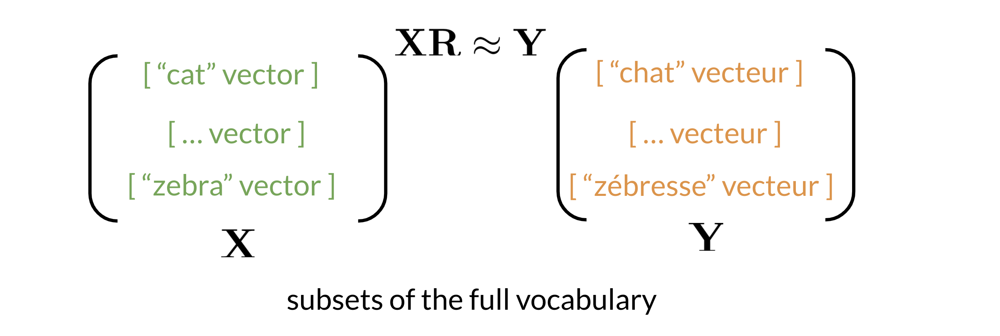
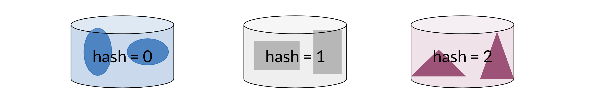
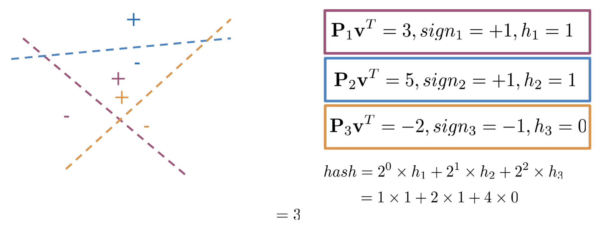

# Machine Translation and Document Search


- [<span class="toc-section-number">1</span> Transforming Word
  Vectors](#transforming-word-vectors)
- [<span class="toc-section-number">2</span> K-nearest
  neighbors](#k-nearest-neighbors)
  - [<span class="toc-section-number">2.1</span> Hash
    function](#hash-function)
  - [<span class="toc-section-number">2.2</span> Locality sensitive
    hashing](#locality-sensitive-hashing)
    - [<span class="toc-section-number">2.2.1</span> Multiple Planes for
      hash values](#multiple-planes-for-hash-values)
  - [<span class="toc-section-number">2.3</span> Aproximate Neareast
    Neighbours (ANN)](#aproximate-neareast-neighbours-ann)
  - [<span class="toc-section-number">2.4</span> Searching
    Documents](#searching-documents)

# Transforming Word Vectors

In this lecture we learn about machine translation. We will illustrate
how to map a word vector to a different language using a transformation
matrix. Let’s imagine the following example:


Note that the word “chat” in french means cat. You can learn that by
taking the vector corresponding to “cat” in english, multiplying it by a
matrix that you learn and then you can use cosine similarity between the
output and all the french vectors. You should see that the closest
result is the vector which corresponds to “chat”.

Here is a visualization of that showing you the aligned vectors:



Note that $X$ corresponds to the matrix of english word vectors and $Y$
corresponds to the matrix of french word vectors. $R$ is the mapping
matrix. To learn R we require the following:

- In a foor loop manner compute:
  - $Loss = \mid \mid XR-Y \mid \mid _{F}$
  - $g = \dfrac{d}{dR} Loss$
  - $R = R - \alpha * g$

$\mid \mid XR-Y \mid \mid _{F}$ is the Frobenius norm. An example of the
calculation of frobenius norm is below:


# K-nearest neighbors

Notice that a transform or the vector after the transformation, if it’s
embedding through an R matrix, would be in the French word vector space.
But it is not going to be necessarily identical to any of the word
vectors in the French word vector space. You need to search through the
actual French word vectors to find a French word that is similar to the
one that you created from the transformation

## Hash function

Let us say you have several data items and you want to group them into
buckets by some kind of similarity. One bucket can hold more than one
item, and each item is always assigned to the same bucket.


The results would be these blue ovals end up in bucket number 1, these
gray rectangles end up in bucket number 2, and these magenta triangles
are assigned to bucket 3.



Now, let’s think about how we’d like to do this with word vectors.
First, let’s assume that the word vectors have just one dimension
instead of 300 dimensions so each word is represented by a single
number, such as 100, 14, 17, 10, and 97.


You need to find a way to give each vector a hash value which is a key
that tells us which bucket it’s assigned to. A function that assigns a
hash value is called a hash function. In this case, the hash table has
10 buckets. Notice how the word vectors 100 and 10 are assigned to
bucket 0. The word vector 14 is assigned to bucket 4 and the word
vectors 17 and 97 are assigned to bucket 7. Do you notice a pattern? n
this case, the hash table has 10 buckets. Notice how the word vectors
100 and 10 are assigned to bucket 0. The word vector 14 is assigned to
bucket 4 and the word vectors 17 and 97 are assigned to bucket 7. Do you
notice a pattern?

This formula here is the hash function that’s being used to assign the
word vectors to their respective buckets. The modulo operator takes the
remainder after dividing by 10.

``` python
def basic_hash_table(value_l, n_buckets):

    def hash_function(value, n_buckets):
        return int(value) % n_buckets

    hash_table = {i:[] for i in range(n_buckets)}
    for value in value_l:
        hash_value = hash_function(value, n_buckets)
        hash_table[hash_value].append(value)
    return hash_table

print(basic_hash_table([14,10,17,100,97], 10))
```

    {0: [10, 100], 1: [], 2: [], 3: [], 4: [14], 5: [], 6: [], 7: [17, 97], 8: [], 9: []}

The code snippet above creates a basic hash table which consists of
hashed values inside their buckets. hash_function takes in value_l (a
list of values to be hashed) and n_buckets and mods the value by the
buckets. Now to create the hash_table, you first initialize a list to be
of dimension n_buckets (each value will go to a bucket). For each value
in your list of values, you will feed it into your hash_function, get
the hash_value, and append it to the list of values in the corresponding
bucket.

Now given an input, you don’t have to compare it to all the other
examples, you can just compare it to all the values in the same
hash_bucket that input has been hashed to.

When hashing you sometimes want similar words or similar numbers to be
hashed to the same bucket. To do this, you will use “locality sensitive
hashing.” Locality is another word for “location”. So locality sensitive
hashing is a hashing method that cares very deeply about assigning items
based on where they’re located in vector space.

## Locality sensitive hashing

One key method that you will use to reduce the computational cost of
finding Neighbors in high dimensional spaces is locality sensitive
hashing.

To start thinking about locality sensitive hashing, let’s first assume
that you’re using word vectors with just two dimensions. Other pits each
vector as a circle instead of arrows. So let’s say you want to find a
way to know that these blue dots are somehow close to each other, and
that these grey dots are also related to each other. First divide the
space using these dashed lines.


Instead of the typical buckets we have been using, you can think of
clustering the points by deciding whether they are above or below the
line. Now as we go to higher dimensions (say n-dimensional vectors), you
would be using planes instead of lines. Let’s look at a concrete
example:


Given a perpendicular vector $P$ (the unit vector of the plane
containing vector 1, 2 and 3) it is easy to notice that when we take the
dot product between $P$ and $V_n$ the sign of the resulting dot product
will correspond to the location above or below the plane.

### Multiple Planes for hash values



Given some point denote by $v$, you can run it trough several
projections $P_1, P_2, P_3$ to get one hash value. If you compute
$P_{1}v^T$ you get a positive number so you set $h_1 = 1$. $P_{2}v^T$
gives you a positive number so $h_2 = 1$. As $P_{3}v^T$ you will assing
$h_3=0$ You can compute de final hash value as:

$$
hash_v = \sum_{i}^{H}2^{i} * h_{i}
$$

In pythonic way:

``` python
import numpy as np

def side_of_plane(P, v):
    dot_product = np.dot(P, v.T)
    ## item is optional if we want to compute the sign instead
    ## of the sign matrix
    sign_of_dot_product = np.sign(dot_product).item()
    return sign_of_dot_product


def hash_multiple_plane(P_l, v):
    hash_value = 0
    for i, P in enumerate(P_l):
        sign = side_of_plane(P,v)
        hash_i = 1 if sign >= 0 else 0
        hash_value += 2**i * hash_i

    return hash_value

print(hash_multiple_plane([np.array([[2,2]]),
np.array([[-1,2]]),
np.array([[1,2]])],
np.array([[1,1]])))
```

    7

## Aproximate Neareast Neighbours (ANN)

We’ve seen that a few planes, such as these three can divide the vector
space into regions. But are these planes the best way to divide up the
vector space? What if instead, you divided the vector space like this?
In fact, you can’t know for sure which sets of planes is the best way to
divide up the vector space. So why not create multiple sets of random
planes. So that you can divide up the vector space into multiple
independent sets of hash tables.

## Searching Documents

Let’s say you have these documents composed of three words. I love
learning. How can you represent this entire document as a vector?

Well, you can find the word vectors for each individual word. I love
learning then just add them together. So the sum of all these word
vectors becomes a document vector with the same dimension as the word
vectors. In this case, three dimensions. You can then apply document
search by using k-nearest neighbors.

Let’s go this up, create a mini dictionary for word embeddings. Here is
the list of words contained in the document. You’re going to initialize
the document embedding as an area of zeros. Now for each word in a
document, you’ll get the word vector if the word exists in the
dictionary else zero, you add this all up and return the documents
embedding.

``` python
word_embedding = {"I": np.array([1,0,1]),
                   "love": np.array([-1,0,1]),
                   "learning": np.array([1,0,1])
                  }
words_in_document = ['I', 'love', 'learning', 'not_a_word']
document_embedding = np.array([0,0,0])
for word in words_in_document:
    document_embedding += word_embedding.get(word,0)

print(document_embedding)
```

    [1 0 3]
