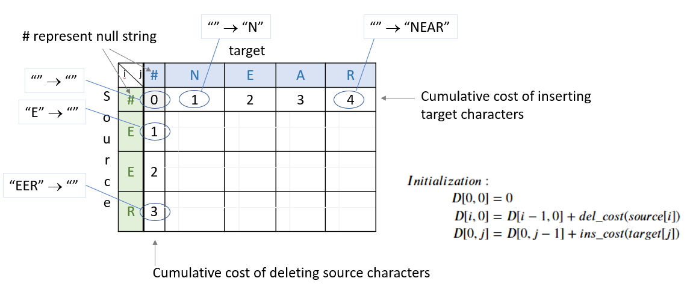
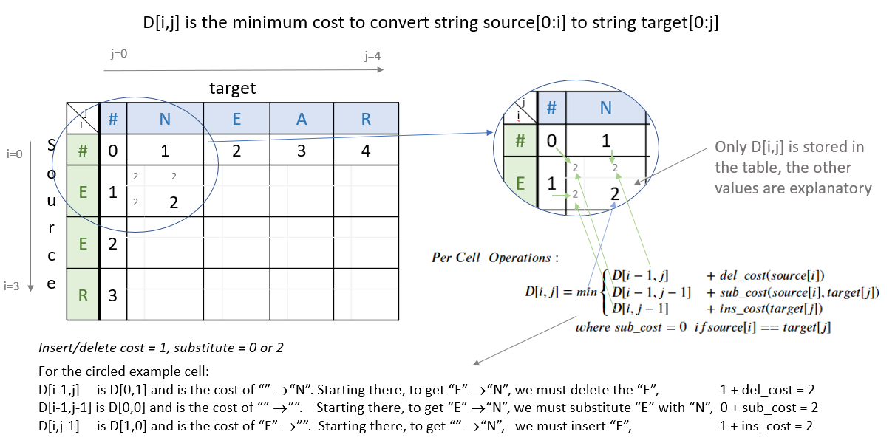
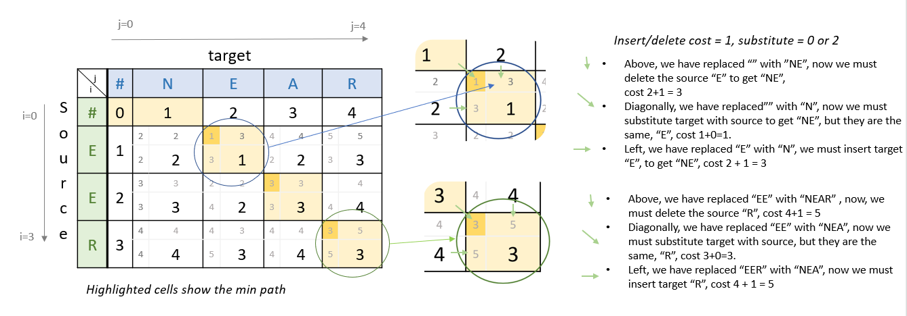

# Autocorrect and Minimum Edit Distance


- [<span class="toc-section-number">1</span> Autocorrection
  Algorithm](#autocorrection-algorithm)
  - [<span class="toc-section-number">1.1</span> Minimum edit
    distance](#minimum-edit-distance)
    - [<span class="toc-section-number">1.1.1</span> Min Edit Distance
      Function](#min-edit-distance-function)
    - [<span class="toc-section-number">1.1.2</span> AutoCorrector
      Function](#autocorrector-function)

# Autocorrection Algorithm

The basic computation algorithms are as follows:

- Identify a misspelled word.
- Find strings with $n$ edit distance away: (these could be random
  strings)
- Filter candidates: (keep only real words from the previous steps)
- Calculate word probabilities: (choose the word that is most likely to
  occur in that context)

Let’s deep dive in details one by one. The first thing that you can do
to identify a misspelled word is to find it in the dictionary, or in NLP
terms to find it in our vocabulary:

``` python
vocab = set({"death", "dead", "dear", "deer", "deep", "depth"})
word = "deah"

if word not in vocab:
    misspelled = True

print(f"The word {word} is misspelled: {misspelled}")
```

    The word deah is misspelled: True

To find strings $n$ distance away we need to find an operation that will
take the potential mispelled word and it will transform it to change it
into another one. There could be multiple operations like:

- Insert a letter. Example from ‘to’ to: ‘top’ or ‘two’.
- Delete a letter. Example from ‘hat’ to ‘at’.
- Switch (swap 2 adjacent letters). Example from ‘eta’ to ‘eat’ or
  ‘tea’.
- Replace (change 1 letter to another). Example from ‘deah’ to ‘dead’

To filter the candidate strings we can repeat step 1 to remove the
number of suggestions that are not part of a vocabulary.

To calculate probabilities we can build a frequency table from a very
big text corpus. Then the probability of a word will be:

$$
P(w) = \frac{C(w)}{v}
$$

Where $V$ is the total size of the corpus.

Some examples for string edits can be found as follows:

``` python
# data
word = 'dearz' # 🦌
word[0:]
```

    'dearz'

We can split the word in all possible ways as follows:

``` python
# splits with a loop
splits_a = []
for i in range(len(word)+1):
    splits_a.append([word[:i],word[i:]])

for i in splits_a:
    print(i)
```

    ['', 'dearz']
    ['d', 'earz']
    ['de', 'arz']
    ['dea', 'rz']
    ['dear', 'z']
    ['dearz', '']

An example of delete edits will be:

``` python
# deletes with a loop
splits = splits_a
deletes = []

print('word : ', word)
for L,R in splits:
    if R:
        print(L + R[1:], ' <-- delete ', R[0])

# deletes with a list comprehension
splits = splits_a
deletes = [L + R[1:] for L, R in splits if R]

print(deletes)
print('*** which is the same as ***')
for i in deletes:
    print(i)
```

    word :  dearz
    earz  <-- delete  d
    darz  <-- delete  e
    derz  <-- delete  a
    deaz  <-- delete  r
    dear  <-- delete  z
    ['earz', 'darz', 'derz', 'deaz', 'dear']
    *** which is the same as ***
    earz
    darz
    derz
    deaz
    dear

To get the candidate list we can do the following:

``` python
vocab = ['dean','deer','dear','fries','and','coke']
edits = list(deletes)

print('vocab : ', vocab)
print('edits : ', edits)

candidates=[x for x in edits if x in vocab]

### START CODE HERE ###
#candidates = ??  # hint: 'set.intersection'
### END CODE HERE ###

print('candidate words : ', candidates)
```

    vocab :  ['dean', 'deer', 'dear', 'fries', 'and', 'coke']
    edits :  ['earz', 'darz', 'derz', 'deaz', 'dear']
    candidate words :  ['dear']

## Minimum edit distance

Minimum Edit Distance has a wide variety of applications. It allows you
to implement spelling correction, document similarity, machine
translation, DNA sequencing and more. I will also show you the different
types of edits. You have already seen how to build autocorrect using
edit distance. Let’s consider a slightly different problem. What if you
are given two words strings or even whole documents and you wanted to
evaluate how similar they are.


When computing the minimum edit distance, you would start with a source
word and transform it into the target word. Let’s look at the following
example:


To go from \# to \# you need a cost of 0. From p to \# you get 1,
because that is the cost of a delete. p→s is 2 because that is the
minimum cost one could use to get from p to s. You can keep going this
way by populating one element at a time, but it turns out there is a
faster way to do this.


There are three equations:

- D\[i,j\] = D\[i-1, j\] + del_cost: this indicates you want to populate
  the current cell (i,j) by using the cost in the cell found directly
  above.

- D\[i,j\] = D\[i, j-1\] + ins_cost: this indicates you want to populate
  the current cell (i,j) by using the cost in the cell found directly to
  its left.

- D\[i,j\] = D\[i-1, j-1\] + rep_cost: the rep cost can be 2 or 0
  depending if you are going to actually replace it or not.

At every time step you check the three possible paths where you can come
from and you select the least expensive one. Once you are done, you get
the following:


Measuring the edit distance by using the three edits; insert, delete,
and replace with costs 1, 1 and 2 respectively is known as levenshtein
distance.

Finding the minimum edit distance on its own doesn’t always solve the
whole problem. You sometimes need to know how you got there too. You do
this by keeping a backtrace, which is simply a pointer in each cell
letting you know where you came from to get there so you know the path
taken across the table from the top left corner to the bottom right
corner. This tells you the edits taken and is particularly useful in
problems dealing with string alignment.

This tabular method for computation instead of brute force, is a
technique known as dynamic programming. Intuitively, this just means
that solving the smallest subproblem first and then reusing that result
to solve the next biggest subproblem, saving that result, reusing it
again and so on.

The diagram below describes how to initialize the table. Each entry in
D\[i,j\] represents the minimum cost of converting string source\[0:i\]
to string target\[0:j\]. The first column is initialized to represent
the cumulative cost of deleting the source characters to convert string
“EER” to ““. The first row is initialized to represent the cumulative
cost of inserting the target characters to convert from”” to “NEAR”.



Filling in the remainder of the table utilizes the ‘Per Cell Operations’
in the equation (5) above. Note, the diagram below includes in the table
some of the 3 sub-calculations shown in light grey. Only ‘min’ of those
operations is stored in the table in the min_edit_distance() function.



Below are some examples of cells where replacement is used. This also
shows the minimum path from the lower right final position where “EER”
has been replaced by “NEAR” back to the start. This provides a starting
point for the optional ‘backtrace’ algorithm below.



### Min Edit Distance Function

``` python
import numpy as np
import pandas as pd
def min_edit_distance(source, target, ins_cost = 1, del_cost = 1, rep_cost = 2):
    '''
    Input:
        source: a string corresponding to the string you are starting with
        target: a string corresponding to the string you want to end with
        ins_cost: an integer setting the insert cost
        del_cost: an integer setting the delete cost
        rep_cost: an integer setting the replace cost
    Output:
        D: a matrix of len(source)+1 by len(target)+1 containing minimum edit distances
        med: the minimum edit distance (med) required to convert the source string to the target
    '''
    # use deletion and insert cost as  1
    m = len(source)
    n = len(target)
    #initialize cost matrix with zeros and dimensions (m+1,n+1)
    D = np.zeros((m+1, n+1), dtype=int)

    ### START CODE HERE (Replace instances of 'None' with your code) ###

    # Fill in column 0, from row 1 to row m, both inclusive
    for row in range(1,m+1): # Replace None with the proper range
        D[row,0] = D[row-1,0] + del_cost

    # Fill in row 0, for all columns from 1 to n, both inclusive
    for col in range(1,n+1): # Replace None with the proper range
        D[0,col] = D[0,col-1] + ins_cost

    # Loop through row 1 to row m, both inclusive
    for row in range(1,m+1):

        # Loop through column 1 to column n, both inclusive
        for col in range(1,n+1):

            # Intialize r_cost to the 'replace' cost that is passed into this function
            r_cost = rep_cost

            # Check to see if source character at the previous row
            # matches the target character at the previous column,
            if source[row-1] == target[col-1]: # Replace None with a proper comparison
                # Update the replacement cost to 0 if source and target are the same
                r_cost = 0

            # Update the cost at row, col based on previous entries in the cost matrix
            # Refer to the equation calculate for D[i,j] (the minimum of three calculated costs)
            D[row,col] = min(D[row-1, col-1] + r_cost, D[row-1,col] + del_cost, D[row,col-1] + ins_cost)

    # Set the minimum edit distance with the cost found at row m, column n
    med = D[m,n]


    ### END CODE HERE ###
    return D, med

source =  'play'
target = 'stay'
matrix, min_edits = min_edit_distance(source, target)
print("minimum edits: ",min_edits, "\n")
idx = list('#' + source)
cols = list('#' + target)
df = pd.DataFrame(matrix, index=idx, columns= cols)
print(df)
```

    minimum edits:  4

       #  s  t  a  y
    #  0  1  2  3  4
    p  1  2  3  4  5
    l  2  3  4  5  6
    a  3  4  5  4  5
    y  4  5  6  5  4

### AutoCorrector Function

``` python
import re
from collections import Counter

def words(text): return re.findall(r'\w+', text.lower())

WORDS = Counter(words(open('./data/shakespeare.txt').read()))

def P(word, N=sum(WORDS.values())):
    "Probability of `word`."
    return WORDS[word] / N

def correction(word):
    "Most probable spelling correction for word."
    for i in candidates(word):
        print(f"candidate: {i} with probability {round(P(i),6)}")
    return max(candidates(word), key=P)

def candidates(word):
    "Generate possible spelling corrections for word."
    return (known([word]) or known(edits1(word)) or known(edits2(word)) or [word])

def known(words):
    "The subset of `words` that appear in the dictionary of WORDS."
    return set(w for w in words if w in WORDS)

def edits1(word):
    "All edits that are one edit away from `word`."
    letters    = 'abcdefghijklmnopqrstuvwxyz'
    splits     = [(word[:i], word[i:])    for i in range(len(word) + 1)]
    deletes    = [L + R[1:]               for L, R in splits if R]
    transposes = [L + R[1] + R[0] + R[2:] for L, R in splits if len(R)>1]
    replaces   = [L + c + R[1:]           for L, R in splits if R for c in letters]
    inserts    = [L + c + R               for L, R in splits for c in letters]
    return set(deletes + transposes + replaces + inserts)

def edits2(word):
    "All edits that are two edits away from `word`."
    return (e2 for e1 in edits1(word) for e2 in edits1(e1))


correction('dys')
```

    candidate: days with probability 0.00041
    candidate: dye with probability 1.9e-05

    'days'
