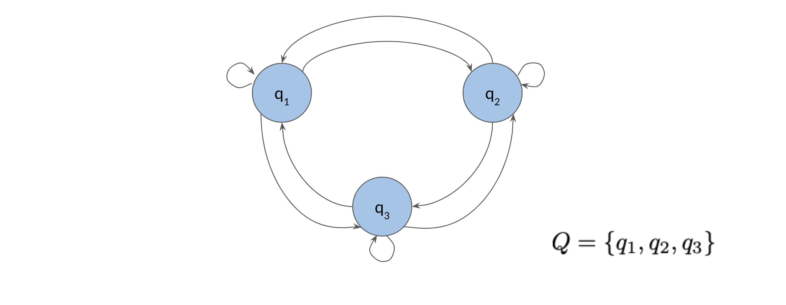
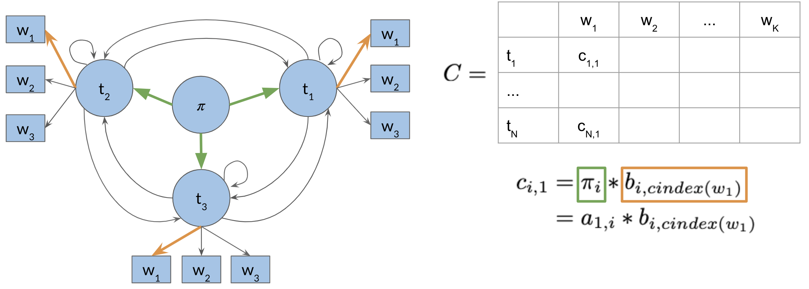
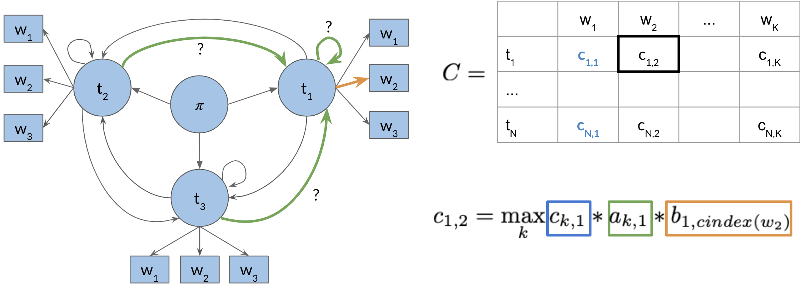
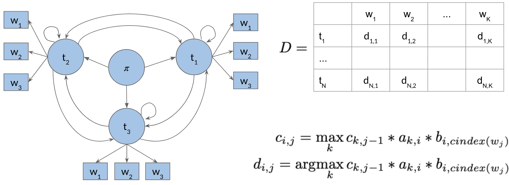

# Part of Speech Tagging


- [<span class="toc-section-number">1</span> Speech
  Tagging](#speech-tagging)
- [<span class="toc-section-number">2</span> Markov
  Chains](#markov-chains)
- [<span class="toc-section-number">3</span> Hidden Markov
  Models](#hidden-markov-models)
  - [<span class="toc-section-number">3.1</span> Transition and Emission
    Probabilities](#transition-and-emission-probabilities)
- [<span class="toc-section-number">4</span> Viterbi
  algorithm](#viterbi-algorithm)
  - [<span class="toc-section-number">4.1</span> Viterbi
    Initialization](#viterbi-initialization)
  - [<span class="toc-section-number">4.2</span> Viterbi
    Forward-Pass](#viterbi-forward-pass)
  - [<span class="toc-section-number">4.3</span> Viterbi
    Backbard-Pass](#viterbi-backbard-pass)

# Speech Tagging

First, we will go over what parts of speech tagging is. Then we will
show you how to use so-called Markov chains and hidden Markov models to
create parts of speech tags for your text corpus. Next, I will introduce
the Viterbi algorithm and demonstrate how it’s used in hidden Markov
models. You will get to try this on your own with an example. You’re
going to apply all of these skills in this week’s coding assignments.
It’s a big week, so let’s get started. Part of speech refers to the
category of words or the lexical terms in a language. Examples of these
lexical terms in the English language would be noun, verb, adjective,
adverb, pronoun, preposition although there are many others.

The process of assigning these tags to the words of a sentence or your
corpus is referred to as parts of speech tagging or POS, tagging for
shorts. Because POS tags describe the characteristic structure of
lexical terms in a sentence or text, you can use them to make
assumptions about semantics. They’re used for identifying named entities
too. In a sentence such as the Eiffel Tower is located in Paris, Eiffel
Tower and Paris are both named entities.


# Markov Chains

Markov Chains are a type of stochastic model that describes a sequence
of possible events. To get the probability for each event, it needs only
the states of the previous events. The word stochastic just means random
or randomness. So a stochastic model, incorporates and models processes
does have a random component to them.

You can use Markov chains to identify the probability of the next word.
For example below, you can see that the most likely word after a verb is
a noun.


To properly model the probabilities we need to identify the
probabilities of the POS tags and for the words.



The circles of the graph represent the states of your model. A state
refers to a certain condition of the present moment. You can think of
these as the POS tags of the current word. In this case
$Q = {q_1, q_2, q_3}$ is the set of all states in your model.

If you think about a sentence as a sequence of words with associated
part of speech tags. You can represent that sequence with a graph. Where
the parts of speech tags are events that can occur. Depicted by the
state of our model graph. In this example, NN is for announce, VB is for
verbs. And other, stands for all other tags. The edges of the graph have
weights or transition probabilities associated with them.


In the diagram above, the blue circles correspond to the part of speech
tags, and the arrows correspond to the transition probabilities from one
part of speech to another. You can populate the table on the right from
the diagram on the left. The first row in your A matrix corresponds to
the initial distribution among all the states. According to the table,
the sentence has a 40% chance to start as a noun, 10% chance to start
with a verb, and a 50% chance to start with another part of speech tag.

In more general notation, you can write the transition matrix A, given
some states Q, as follows:


# Hidden Markov Models

Going back to the Markov model that has the states for the parts of
speech, such as noun, verb, or other, you can now think of these as
hidden states because these are not directly observable from the text
data. It may seem a little confusing to think that this data is hidden.
Because if you look at a certain word such as jump, as a human who is
familiar with the English language, you can see that this is a verb.

The transition probabilities allowed you to identify the transition
probability from one POS to another. We will now explore hidden markov
models. In hidden markov models you make use of emission probabilities
that give you the probability to go from one state (POS tag) to a
specific word.


For example, given that you are in a verb state, you can go to other
words with certain probabilities. This emission matrix B, will be used
with your transition matrix A, to help you identify the part of speech
of a word in a sentence. To populate your matrix B, you can just have a
labelled dataset and compute the probabilities of going from a POS to
each word in your vocabulary. Here is a recap of what you have seen so
far:


Note that the sum of each row in your A and B matrix has to be 1. Next,
I will show you how you can calculate the probabilities inside these
matrices.

## Transition and Emission Probabilities

Here is a visual representation on how to calculate the probabilities:


The number of times that blue is followed by purple is 2 out of 3. We
will use the same logic to populate our transition and emission
matrices. In the transition matrix we will count the number of times tag
$t_{(i-1)}, t_{(i)}$ show up near each other and divide by the total
number of times $t_{(i-1)}$ shows up (which is the same as the number of
times it shows up followed by anything else)


To populate the transition matrix you have to keep track of the number
of times each tag shows up before another tag.


​In the table above, you can see that green corresponds to nouns (NN),
purple corresponds to verbs (VB), and blue corresponds to other (O).
Orange (π) corresponds to the initial state. The numbers inside the
matrix correspond to the number of times a part of speech tag shows up
right after another one.

To go from O to NN or in other words to calculate $P(O ∣ NN)$ you have
to compute the following.


Generalizing:

$$
P(t_{i} ∣ t_{i-1}) = \frac{C(t_{i-1}, t_{i})}{\sum^{N}_{j=1}C(t_{i-1}, t_{j})}
$$

Unfortunately, sometimes you might not see two POS tags in front each
other. This will give you a probability of 0. To solve this issue, you
will “smooth” it as follows:


The $\epsilon$ allows you to not have any two sequences showing up with
0 probability, which is useful when we want to generalize our transition
matrix to unknown text.

To populate the emission matrix, you have to keep track of the words
associated with their parts of speech tags.


To populate the matrix, we will also use smoothing as we have previously
used:

\$\$ P(w\_{i} ∣ t\_{i}) =

=

\$\$

Where $C(t_{i}, w_{i})$ is the count associated with how many times the
tag $t_i$ is associated with the word $w_i$ (so basically is the
frequency of the tag for a given word).

Lets make a simple example in python:

``` python
import numpy as np
import pandas as pd

tags = ['RB', 'NN', 'TO']
```

​Transition_counts counts the number of times a particular tag happened
next to another. The keys of this dictionary have the form
(previous_tag, tag) and the values are the frequency of occurrences.

Another one is the emission_counts dictionary which will count the
number of times a particular pair of (tag, word) appeared in the
training dataset.

In general think of transition when working with tags only and of
emission when working with tags and words.

``` python
transition_counts = {
    ('NN', 'NN'): 16241,
    ('RB', 'RB'): 2263,
    ('TO', 'TO'): 2,
    ('NN', 'TO'): 5256,
    ('RB', 'TO'): 855,
    ('TO', 'NN'): 734,
    ('NN', 'RB'): 2431,
    ('RB', 'NN'): 358,
    ('TO', 'RB'): 200
}
```

Now we will initialize our transition matrix:

``` python
num_tags = len(tags)

# Initialize a 3X3 numpy array with zeros
transition_matrix = np.zeros((num_tags, num_tags))

# Print matrix
transition_matrix
```

    array([[0., 0., 0.],
           [0., 0., 0.],
           [0., 0., 0.]])

Before filling this matrix with the values of the transition_counts
dictionary you should sort the tags so that their placement in the
matrix is consistent:

``` python
sorted_tags = sorted(tags)

# Print sorted list
sorted_tags
```

    ['NN', 'RB', 'TO']

To fill this matrix with the correct values you can use a double for
loop. You could also use itertools.product to one line this double loop:

``` python
import itertools
## O(n^2) complexity

for i in range(num_tags):
    # Loop columns
    for j in range(num_tags):
        # Define tag pair
        tag_tuple = (sorted_tags[i], sorted_tags[j])
        # Get frequency from transition_counts dict and assign to (i, j) position in the matrix
        transition_matrix[i, j] = transition_counts.get(tag_tuple)
# Print matrix
transition_matrix

## Itertools

for (i, tag1), (j, tag2) in itertools.product(enumerate(sorted_tags), repeat=2):
    transition_matrix[i, j] = transition_counts.get((tag1, tag2), 0)

transition_matrix
```

    array([[1.6241e+04, 2.4310e+03, 5.2560e+03],
           [3.5800e+02, 2.2630e+03, 8.5500e+02],
           [7.3400e+02, 2.0000e+02, 2.0000e+00]])

Now we will calculate the probabilities as:

``` python
rows_sum = transition_matrix.sum(axis=1, keepdims=True)
transition_matrix = transition_matrix / rows_sum
```

We can also check that this row sum is equal to 1:

``` python
transition_matrix.sum(axis=1, keepdims=True)
```

    array([[1.],
           [1.],
           [1.]])

To operate efficiently with this transition matrix we can use
vectorization. Lets imagine we want to get the diagonal of this matrix.
We could do this with a for loop:

``` python
import math

# Define 'print_matrix' function
def print_matrix(matrix):
    print(pd.DataFrame(matrix, index=sorted_tags, columns=sorted_tags))

# Copy transition matrix for for-loop example
t_matrix_for = np.copy(transition_matrix)

# Copy transition matrix for numpy functions example
t_matrix_np = np.copy(transition_matrix)

# Loop values in the diagonal
for i in range(num_tags):
    t_matrix_for[i, i] =  t_matrix_for[i, i] + math.log(rows_sum[i])

# Print matrix
print_matrix(t_matrix_for)
```

               NN        RB        TO
    NN  10.761549  0.101596  0.219659
    RB   0.102992  8.804673  0.245972
    TO   0.784188  0.213675  6.843752

    /tmp/ipykernel_65047/3844801661.py:15: DeprecationWarning:

    Conversion of an array with ndim > 0 to a scalar is deprecated, and will error in future. Ensure you extract a single element from your array before performing this operation. (Deprecated NumPy 1.25.)

Or using numpy vectorization:

``` python
d = np.diag(t_matrix_np)

# Print shape of diagonal
d.shape
d = np.reshape(d, (3,1))

# Print shape of diagonal
d.shape

# Perform the vectorized operation
d = d + np.vectorize(math.log)(rows_sum)

# Use numpy's 'fill_diagonal' function to update the diagonal
np.fill_diagonal(t_matrix_np, d)

# Print the matrix
print_matrix(t_matrix_np)
```

               NN        RB        TO
    NN  10.761549  0.101596  0.219659
    RB   0.102992  8.804673  0.245972
    TO   0.784188  0.213675  6.843752

And we can check that vectorization and traditional for loops yield the
same result:

``` python
t_matrix_for == t_matrix_np
```

    array([[ True,  True,  True],
           [ True,  True,  True],
           [ True,  True,  True]])

# Viterbi algorithm

The Viterbi algorithm makes use of the transition probabilities and the
emission probabilities as follows.


To go from $\phi$ to $O$ you need to multiply the corresponding
transition probability (0.3) and the corresponding emission probability
(0.5), which gives you 0.15. You keep doing that for all the words,
until you get the probability of an entire sequence.


## Viterbi Initialization

You will now populate a matrix C of dimension (num_tags, num_words).
This matrix will have the probabilities that will tell you what part of
speech each word belongs to.



Now to populate the first column, you multiply the initial $\phi$
distribution, for each tag, times $b_{i, cindex(w_{1})}$. Where i,
corresponds to the tag of the initial distribution and the
$cindex(w_i)$, is the index of word 1 in the emission matrix. And that’s
it, you are done with populating the first column of your new C matrix.
You will now need to keep track what part of speech you are coming from.
Hence we introduce a matrix D, which allows you to store the labels that
represent the different states you are going through when finding the
most likely sequence of POS tags for the given sequence of words
$w_1, ..., w_k$. At first you set the first column to 0, because you are
not coming from any POS tag.


## Viterbi Forward-Pass



So to populate a cell (i.e. 1,2) in the image above, you have to take
the max of \[kth cells in the previous column (blue elements), times the
corresponding transition probability of the kth POS to the first POS
(the green arrows) times the emission probability of the first POS and
the current word you are looking at (orange arrows)\]. You do that for
all the cells. Take a paper and a pencil, and make sure you understand
how it is done. The general rule:

$$
c_{i,j} = max_{k}c_{k,j-1}*a_{k,i}*b_{i,cindex(w_j)}
$$

Now to populate the D matrix, you will keep track of the argmax of where
you came from as follows:



Note that the only difference between $c_{ij}$ and $d_{ij}$ is that in
the former you compute the probability and in the latter you keep track
of the index of the row where that probability came from. So you keep
track of which k was used to get that max probability.

## Viterbi Backbard-Pass

The backward pass is the last of three steps of the Viterbi algorithm,
where you will retrieve the most likely sequence of parts of speech tags
for your given sequence of words. By now, you’ve populated the matrices
C and D. Now you just have to extract the path through your graph from
the matrix D, which represents the sequence of hidden states that’s most
likely generated our sequence where at one all the way towards K. First
calculate the index of the entry C_i,K with the highest probability in
the last column of C. The probability at this index is the probability
of the most likely sequence of hidden states generating the given
sequence of words. You use this index as to traverse backwards through
the matrix D to reconstruct the sequence of parts of speech tags. First,
calculate the index of the entry CIK with the highest probability in the
last column of C. The probability at this index is the probability of
the most likely sequence of hidden states generating the given sequence
of words. You use this index s to traverse backwards through the matrix
D to reconstruct the sequence of parts of speech tags.


The equation above just gives you the index of the highest row in the
last column of C. Once you have that, you can go ahead and start using
your D matrix as follows:


Note that since we started at index one, hence the last word ($w_5$) is
$t_1$. Then we go to the first row of D and what ever that number is, it
indicated the row of the next part of speech tag. Then next part of
speech tag indicates the row of the next and so forth. This allows you
to reconstruct the POS tags for your sentence. You will be implementing
this in this week’s programming assignment. Good luck!
