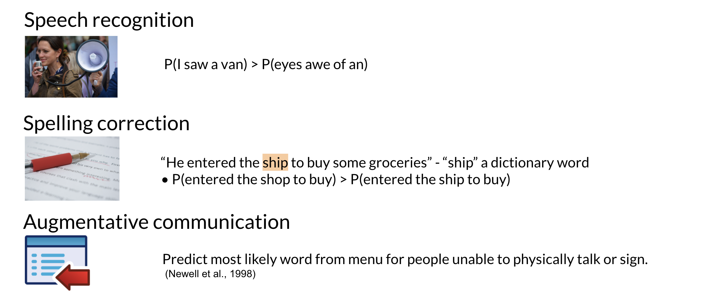
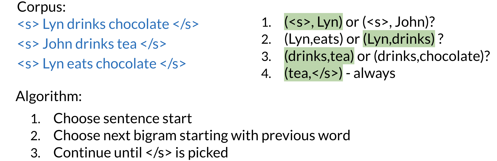

# Autocomplete and Language Models

- [<span class="toc-section-number">1</span> N-Grams
  Overview](#n-grams-overview)
- [<span class="toc-section-number">2</span> Sequence
  probabilities](#sequence-probabilities)
  - [<span class="toc-section-number">2.1</span> Starting and Ending
    Sentences](#starting-and-ending-sentences)
  - [<span class="toc-section-number">2.2</span> Python Example of
    N-Grams Preprocessing](#python-example-of-n-grams-preprocessing)
    - [<span class="toc-section-number">2.2.1</span> Text
      splitting](#text-splitting)
    - [<span class="toc-section-number">2.2.2</span> Sentence
      Tokenization](#sentence-tokenization)
    - [<span class="toc-section-number">2.2.3</span> Sentence to
      n-gram](#sentence-to-n-gram)
    - [<span class="toc-section-number">2.2.4</span> Prefix of an
      n-gram.](#prefix-of-an-n-gram)
    - [<span class="toc-section-number">2.2.5</span> Start and end of
      sentence word <s> and <e>.](#start-and-end-of-sentence-word--and-)
- [<span class="toc-section-number">3</span> The N-gram language
  Model:](#the-n-gram-language-model)
- [<span class="toc-section-number">4</span> Language Model
  Evaluation](#language-model-evaluation)
  - [<span class="toc-section-number">4.1</span> Building a language
    model](#building-a-language-model)
  - [<span class="toc-section-number">4.2</span> Out of vocabulary
    words](#out-of-vocabulary-words)
  - [<span class="toc-section-number">4.3</span> N-Gramm
    smooting](#n-gramm-smooting)

# N-Grams Overview

N-grams are fundamental and give you a foundation that will allow you to
understand more complicated models in the specialization. These models
allow you to calculate probabilities of certain words happening in a
specific sequence. Using that, you can build an auto-correct or even a
search suggestion tool.

Other applications of N-gram language modeling include:



Let’s look at an example. I am happy because I am learning. Unigrams for
this corpus, are a set of all unique single words appearing in the text.
For example, the word, I, appears in the corpus twice. But is included
only once in the unigram sets. The prefix uni stands for one. Bigrams
are all sets of two words that appear side-by-side in the corpus. Again,
the bigram, I am, can be found twice in the texts, but it is only
included once in the bigram sets. The prefix bi means two. Also notice
that the words must appear next to each other to be considered a bigram.


Now given the those definitions, we can label a sentence as follows:


In other notation you can write:

$$
- w_1^m = w_1w_2w_3 ... w_m
- w_1^3 = w_1w_2w_3
- w_{m-2}^m = w_{m-2}w_{m-1}w_{m}
$$

The conditional probability of Y given X can be estimated as the counts
of the bigram X comma Y and then you divide that by the counts of all
bigrams starting with X. This can be simplified to the count of the
bigram X comma Y divided by the counts of all unigrams X. This last step
only works if X is followed by another word.


The trigram probability will be computed as follows:


An generalizing the n-gram probabilities are calculated as:

$$
P(w_{N} | w_{1}^{N-1}) = \frac{C(w_{1}^{N-1}w_{N})}{C(w_{1}^{N-1})}
$$

# Sequence probabilities

Let’s find the probability of a sentence, or an entire sequence of
words. How would you calculate the probability of the sentence? The
teacher drinks tea. To get started, let’s refresh your memory of the
conditional probability in chain rule. Here, the conditional probability
is a probability of word B. If word A appeared just before B, you can
express the rule for the conditional probability in terms of the joints
probability of A and B, which is B of A, B. The probability of B given A
is equal to the probability of A and B divided by the probability of A.
You can rearrange this row so the probability of A and B is equal to the
probability of A times the probability of B given A. This can be
generalized to the chain rule, which describes the joint probability of
longer sequences.


For the following sentence “The teacher drinks tea”, you can compute the
following:

$P(the teacher drinks tea)= P(the)P(teacher ∣ the)P( drinks ∣ the teacher)P(tea ∣ the teacher drinks)$

One of the main issues with computing the probabilities above is the
corpus rarely contains the exact same phrases as the ones you computed
your probabilities on. Hence, you can easily end up getting a
probability of 0. The Markov assumption indicates that only the last
word matters. Hence:

$Bigram P(w_{N} | w_{1}^{N-1}) \approx P(w_{N} | w_{n-1})$
$N-gram P(w_{N} | w_{1}^{N-1}) \approx P(w_{N} | w_{n-N+1}^{n-1})$

And the modelling of the whole sequence becomes:

$P(w_{1}^n) \approx \prod_{i=1}^{N} P(w_{i} | w_{i-1})$ \$P(w\_{1}^n)
P(w\_{1}) P(w\_{2} \| w\_{1}) … P(w\_{n} \| w\_{n-1}) \$

## Starting and Ending Sentences

We usually start and end a sentence with the following tokens
respectively: <s> </s>.

When computing probabilities using a unigram, you can append an <s> in
the beginning of the sentence. To generalize to an N-gram language
model, you can add N-1 start tokens <s>.

For the end of sentence token </s>, you only need one even if it is an
N-gram. Here is an example:


## Python Example of N-Grams Preprocessing

Some common preprocessing steps for the language models include:

- lowercasing the text
- remove special characters
- split text to list of sentences
- split sentence into list words

``` python
import nltk               # NLP toolkit
import re                 # Library for Regular expression operations

nltk.download('punkt')    # Download the Punkt sentence tokenizer

# change the corpus to lowercase
corpus = "Learning% makes 'me' happy. I am happy be-cause I am learning! :)"
corpus = corpus.lower()

# note that word "learning" will now be the same regardless of its position in the sentence
print(corpus)

# remove special characters
corpus = "learning% makes 'me' happy. i am happy be-cause i am learning! :)"
corpus = re.sub(r"[^a-zA-Z0-9.?! ]+", "", corpus)
print(corpus)
```

    [nltk_data] Downloading package punkt to /home/azureuser/nltk_data...
    [nltk_data]   Package punkt is already up-to-date!

    learning% makes 'me' happy. i am happy be-cause i am learning! :)
    learning makes me happy. i am happy because i am learning!

### Text splitting

One way to do that is by using the str.split method.

The following examples illustrate how to use this method. The code
shows:

- How to split a string containing a date into an array of date parts.
- How to split a string with time into an array containing hours,
  minutes and seconds.

Also, note what happens if there are several back-to-back delimiters
like between “May” and “9”.

``` python
input_date="Sat May  9 07:33:35 CEST 2020"

# get the date parts in array
date_parts = input_date.split(" ")
print(f"date parts = {date_parts}")

#get the time parts in array
time_parts = date_parts[4].split(":")
print(f"time parts = {time_parts}")
```

    date parts = ['Sat', 'May', '', '9', '07:33:35', 'CEST', '2020']
    time parts = ['07', '33', '35']

This text splitting is more complicated than the tokenization process
used for sentiment analysis.

### Sentence Tokenization

Once you have a list of sentences, the next step is to split each
sentence into a list of words.

This process could be done in several ways, even using the str.split
method described above, but we will use the NLTK library nltk to help us
with that.

In the code assignment, you will use the method word_tokenize to split
your sentence into a list of words (you can also use the Spacy
Tokenization). Let us try the method in an example.

``` python
sentence = 'i am happy because i am learning.'
tokenized_sentence = nltk.word_tokenize(sentence)
print(f'{sentence} -> {tokenized_sentence}')
```

    i am happy because i am learning. -> ['i', 'am', 'happy', 'because', 'i', 'am', 'learning', '.']

Now that the sentence is tokenized, you can work with each word in the
sentence separately. This will be useful later when creating and
counting N-grams. In the following code example, you will see how to
find the length of each word.

``` python
# find length of each word in the tokenized sentence
sentence = ['i', 'am', 'happy', 'because', 'i', 'am', 'learning', '.']
word_lengths = [(word, len(word)) for word in sentence] # Create a list with the word lengths using a list comprehension
print(f' Lengths of the words: \n{word_lengths}')
```

     Lengths of the words:
    [('i', 1), ('am', 2), ('happy', 5), ('because', 7), ('i', 1), ('am', 2), ('learning', 8), ('.', 1)]

### Sentence to n-gram

The next step is to build n-grams from the tokenized sentences.

A sliding window of size n-words can generate the n-grams. The window
scans the list of words starting at the sentence beginning, moving by a
step of one word until it reaches the end of the sentence.

Here is an example method that prints all trigrams in the given
sentence.

``` python
def sentence_to_trigram(tokenized_sentence):
    """
    Prints all trigrams in the given tokenized sentence.

    Args:
        tokenized_sentence: The words list.

    Returns:
        No output
    """
    # note that the last position of i is 3rd to the end
    for i in range(len(tokenized_sentence) - 3 + 1):
        # the sliding window starts at position i and contains 3 words
        trigram = tokenized_sentence[i : i + 3]
        print(trigram)

tokenized_sentence = ['i', 'am', 'happy', 'because', 'i', 'am', 'learning', '.']

print(f'List all trigrams of sentence: {tokenized_sentence}\n')
sentence_to_trigram(tokenized_sentence)
```

    List all trigrams of sentence: ['i', 'am', 'happy', 'because', 'i', 'am', 'learning', '.']

    ['i', 'am', 'happy']
    ['am', 'happy', 'because']
    ['happy', 'because', 'i']
    ['because', 'i', 'am']
    ['i', 'am', 'learning']
    ['am', 'learning', '.']

### Prefix of an n-gram.

As you saw in the lecture, the n-gram probability is often calculated
based on the (n-1)-gram counts. The prefix is needed in the formula to
calculate the probability of an n-gram.

$$
\begin{equation*}
P(w_n|w_1^{n-1})=\frac{C(w_1^n)}{C(w_1^{n-1})}
\end{equation*}
$$

The following code shows how to get an (n-1)-gram prefix from n-gram on
an example of getting trigram from a 4-gram.

``` python
# get trigram prefix from a 4-gram
fourgram = ['i', 'am', 'happy','because']
trigram = fourgram[0:-1] # Get the elements from 0, included, up to the last element, not included.
print(trigram)
```

    ['i', 'am', 'happy']

### Start and end of sentence word <s> and <e>.

You could see in the lecture that we must add some special characters at
the beginning and the end of each sentence:

- <𝑠> at beginning.
- <𝑒> at the end. For n-grams, we must prepend n-1 of characters at the
  begining of the sentence.

Let us have a look at how you can implement this in code.

``` python
n = 3
tokenized_sentence = ['i', 'am', 'happy', 'because', 'i', 'am', 'learning', '.']
tokenized_sentence = ["<s>"] * (n - 1) + tokenized_sentence + ["</s>"]
print(tokenized_sentence)
```

    ['<s>', '<s>', 'i', 'am', 'happy', 'because', 'i', 'am', 'learning', '.', '</s>']

# The N-gram language Model:

To build our first N-gram language model we need the following
components:

1.  A count matrix which contains the relative frequencies of the words
    we have (inlucding <s> and </s>) in a given corpus.
2.  A probability matrix formed using the count matrix.
3.  A language model (which is basically a compute engine to calculate
    the probability of a given sequence given the probability matrix).
4.  Log probabilities conversion to avoid underflow.
5.  A generative language model (a scoring rule).

In detail the count matrix:

- Rows correspond to the unique corpus N-1 grams.
- Columns correspond to the unique corpus words.


To convert it into a probability matrix, you can use the following
formula:

$$
P(w_{n} | w_{n-N+1}^{n-1}) = \frac{C(w_{n-1}^{n-N+1}w_{n})}{C(w_{n-N+1}^{n-1})}
sum(row) = \sum_{w \in V}C(w_{n-1}^{n-N+1},w) = C(w_{n-1}^{n-N+1})
$$

Now given the probability matrix, you can generate the language model.
You can compute the sentence probability and the next word prediction:

$P(w_1^n) = \prod_{i=1}^{n} P(w_{i} | w_{i-1})$

To avoid underflow we multiple by the log and explode the properties of
the logaritm where log(ab) = log(a) + log(b)

$log(P(w_1^n)) \approx \sum_{i=1}^{n} P(w_{i} | w_{i-1})$

Finally here is a summary to create the generative model:



# Language Model Evaluation

In NLP there are two main methods for splitting. You can split the
corpus by choosing longer continuous segments like Wikipedia articles or
you can randomly choose short sequences of words such as those in the
sentences.

Perplexity is a commonly used metric in language modeling. But what does
it mean? If you’re familiar with the word perplexed you know that a
person is perplexed when they are confused by something very complex.
You can think of perplexity as a measure of the complexity in a sample
of texts, like how complex that text is. Perplexity is used to tell us
whether a set of sentences look like they were written by humans rather
than by a simple program choosing words at random.

A text that is written by humans is more likely to have a lower
perplexity score. Good language models have perplexity scores between 20
and 60 and log perplexity will between 4.3 and 5.9. The formulas to
calculate perplexity are as follows:

$$
PP(W) = P(s_1, s_2, ... s_m)
\sqrt[m]{\prod_{i=1}^{m}\prod_{j=1}^{\left| s_i \right|}\frac{1}{P(w_{j}^{(i)} | w_{j-1}^{(i)})}}
$$

Where $w_j^(i) -> j$ corresponds to the jth word in the ith sentence. If
you were to concatenate all the sentences then $w_i$ is the ith word in
the test set. To compute the log perplexity, you go from:

$\sqrt[m]{\prod_{i=1}^{m}\frac{1}{P(w_{i} | w_{i-1})}}$

To:

$logPP(W) = -\frac{1}{m}\sum_{i=1}^mlog_{2}(P(w_{i}| w_{i-1}))$

Lets make some python examples.

## Building a language model

Given the following dictionary:

``` python
n_gram_counts = {
    ('i', 'am', 'happy'): 2,
    ('am', 'happy', 'because'): 1}
```

The following code shows how to check, retrieve and update counts of
n-grams in the word count dictionary.

``` python
# get count for an n-gram tuple
print(f"count of n-gram {('i', 'am', 'happy')}: {n_gram_counts[('i', 'am', 'happy')]}")

# check if n-gram is present in the dictionary
if ('i', 'am', 'learning') in n_gram_counts:
    print(f"n-gram {('i', 'am', 'learning')} found")
else:
    print(f"n-gram {('i', 'am', 'learning')} missing")

# update the count in the word count dictionary
n_gram_counts[('i', 'am', 'learning')] = 1
if ('i', 'am', 'learning') in n_gram_counts:
    print(f"n-gram {('i', 'am', 'learning')} found")
else:
    print(f"n-gram {('i', 'am', 'learning')} missing")
```

    count of n-gram ('i', 'am', 'happy'): 2
    n-gram ('i', 'am', 'learning') missing
    n-gram ('i', 'am', 'learning') found

The next code snippet shows how to merge two tuples in Python. That will
be handy when creating the n-gram from the prefix and the last word.

``` python
# concatenate tuple for prefix and tuple with the last word to create the n_gram
prefix = ('i', 'am', 'happy')
word = 'because'

# note here the syntax for creating a tuple for a single word
n_gram = prefix + (word,)
print(n_gram)
```

    ('i', 'am', 'happy', 'because')

In the lecture, you’ve seen that the count matrix could be made in a
single pass through the corpus. Here is one approach to do that.

``` python
import numpy as np
import pandas as pd
from collections import defaultdict
def single_pass_trigram_count_matrix(corpus):
    """
    Creates the trigram count matrix from the input corpus in a single pass through the corpus.

    Args:
        corpus: Pre-processed and tokenized corpus.

    Returns:
        bigrams: list of all bigram prefixes, row index
        vocabulary: list of all found words, the column index
        count_matrix: pandas dataframe with bigram prefixes as rows,
                      vocabulary words as columns
                      and the counts of the bigram/word combinations (i.e. trigrams) as values
    """
    bigrams = []
    vocabulary = []
    count_matrix_dict = defaultdict(dict)

    # go through the corpus once with a sliding window
    for i in range(len(corpus) - 3 + 1):
        # the sliding window starts at position i and contains 3 words
        trigram = tuple(corpus[i : i + 3])

        bigram = trigram[0 : -1]
        if not bigram in bigrams:
            bigrams.append(bigram)

        last_word = trigram[-1]
        if not last_word in vocabulary:
            vocabulary.append(last_word)

        if (bigram,last_word) not in count_matrix_dict:
            count_matrix_dict[bigram,last_word] = 0

        count_matrix_dict[bigram,last_word] += 1

    # convert the count_matrix to np.array to fill in the blanks
    count_matrix = np.zeros((len(bigrams), len(vocabulary)))
    for trigram_key, trigam_count in count_matrix_dict.items():
        count_matrix[bigrams.index(trigram_key[0]), \
                     vocabulary.index(trigram_key[1])]\
        = trigam_count

    # np.array to pandas dataframe conversion
    count_matrix = pd.DataFrame(count_matrix, index=bigrams, columns=vocabulary)
    return bigrams, vocabulary, count_matrix

corpus = ['i', 'am', 'happy', 'because', 'i', 'am', 'learning', '.']

bigrams, vocabulary, count_matrix = single_pass_trigram_count_matrix(corpus)

print(count_matrix)
```

                      happy  because    i   am  learning    .
    (i, am)             1.0      0.0  0.0  0.0       1.0  0.0
    (am, happy)         0.0      1.0  0.0  0.0       0.0  0.0
    (happy, because)    0.0      0.0  1.0  0.0       0.0  0.0
    (because, i)        0.0      0.0  0.0  1.0       0.0  0.0
    (am, learning)      0.0      0.0  0.0  0.0       0.0  1.0

Now we build the probability matrix:

``` python
# create the probability matrix from the count matrix
row_sums = count_matrix.sum(axis=1)
# divide each row by its sum
prob_matrix = count_matrix.div(row_sums, axis=0)

print(prob_matrix)
```

                      happy  because    i   am  learning    .
    (i, am)             0.5      0.0  0.0  0.0       0.5  0.0
    (am, happy)         0.0      1.0  0.0  0.0       0.0  0.0
    (happy, because)    0.0      0.0  1.0  0.0       0.0  0.0
    (because, i)        0.0      0.0  0.0  1.0       0.0  0.0
    (am, learning)      0.0      0.0  0.0  0.0       0.0  1.0

The probability matrix helps you to find a probability for a given input
trigram:

``` python
# find the probability of a trigram in the probability matrix
trigram = ('i', 'am', 'happy')

# find the prefix bigram
bigram = trigram[:-1]
print(f'bigram: {bigram}')

# find the last word of the trigram
word = trigram[-1]
print(f'word: {word}')

# we are using the pandas dataframes here, column with vocabulary word comes first, row with the prefix bigram second
trigram_probability = prob_matrix[word][bigram]
print(f'trigram_probability: {trigram_probability}')
```

    bigram: ('i', 'am')
    word: happy
    trigram_probability: 0.5

## Out of vocabulary words

A vocabulary is a set of unique words supported by your language model.
In some tasks like speech recognition or question answering, you will
encounter and generate only words from a fixed sets of words. For
example, a chatbots can only answer in limited sets of questions. This
fixed list of words is also called closed vocabulary. However, using a
fixed set of words is not always sufficient for the task. Often, you
have to deal with words you haven’t seen before, which results in an
open vocabulary.

In order to create a vocabulary for the N-gram model we need to decide
into some critera:

- You could choose the minimum word frequency f, that is usually a small
  number. The words that occur more than f times in the corpus will
  become parts of the vocabulary V. Then replace all other words not in
  the vocabulary with UNK. This is a simple heuristic. What is
  guaranteed is that the words you care about, the ones that repeats a
  lot are parts of the vocabulary.
- Alternatively, you can decide what the maximum size of your vocabulary
  is and only include words with the highest frequency up to the maximum
  vocabulary size.
- One thing to consider is the influence of UNKs on the perplexity. Is
  it’s going to make it lower or higher? Actually, it’s usually lower.
  It will look like your language model is getting better and better.
  But watch out, you might just have a lot of UNKs. The model will then
  generate a sequence of UNK words with high probability and set of
  meaningful sentences. Due to this limitation, I would recommend using
  UNKs sparingly.

## N-Gramm smooting

When you train an N-gram on a limited corpus. The probabilities of some
words may be skewed. The three main concepts covered here are dealing
with missing n-grams, smoothing, and Backoff and interpolation.

The first type of smoothing is the laplacian smoothing (which we have
seen in the Naive Bayes lecture of course 1 and the HMM lecture of
course 1):

$P(w_n | w_{n-1}) = \frac{C(w_{n-1}, w_{n}+1)+1}{C(w_{n-1}) + V}$

The k-smoothing is very similar:

$P(w_n | w_{n-1}) = \frac{C(w_{n-1}, w_{n}+k)+1}{C(w_{n-1}) + k*V}$

When using back-off:

- If N-gram missing =\> use (N-1)-gram, …: Using the lower level N-grams
  (i.e. (N-1)-gram, (N-2)-gram, down to unigram) distorts the
  probability distribution. Especially for smaller corpora, some
  probability needs to be discounted from higher level N-grams to use it
  for lower level N-grams.

- Probability discounting e.g. Katz backoff: makes use of discounting.

- “Stupid” backoff: If the higher order N-gram probability is missing,
  the lower order N-gram probability is used, just multiplied by a
  constant. A constant of about 0.4 was experimentally shown to work
  well.

Finally we can also use interpolation, where the probability of $w_n$
conditioned to the previous words is calculated as:


