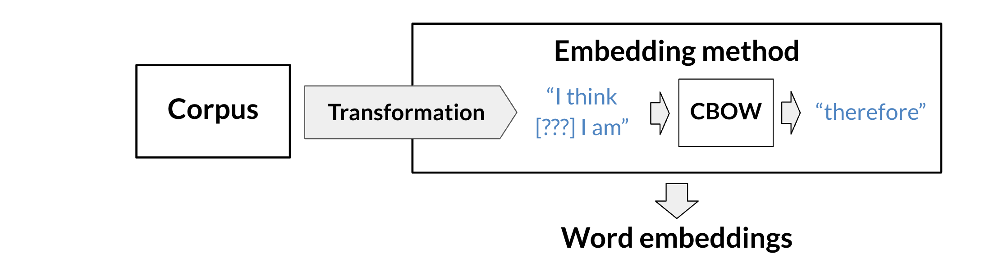
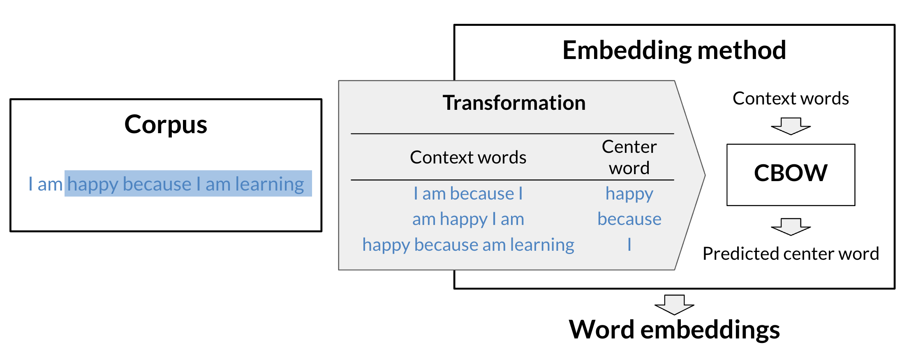

# Word Embeddings

- [<span class="toc-section-number">1</span>
  Introduction](#introduction)
  - [<span class="toc-section-number">1.1</span> How to create word
    embeddings](#how-to-create-word-embeddings)
- [<span class="toc-section-number">2</span> Word2Vec -
  CBOW](#word2vec---cbow)
  - [<span class="toc-section-number">2.1</span> Cleaning and
    tokenization](#cleaning-and-tokenization)
  - [<span class="toc-section-number">2.2</span> Sliding windows of
    words](#sliding-windows-of-words)
  - [<span class="toc-section-number">2.3</span> Transforming Words into
    Vectors](#transforming-words-into-vectors)
  - [<span class="toc-section-number">2.4</span> Creating one-hot
    vectors:](#creating-one-hot-vectors)
- [<span class="toc-section-number">3</span> Architecture of the CBOW
  Model](#architecture-of-the-cbow-model)
  - [<span class="toc-section-number">3.1</span>
    Dimensions](#dimensions)
  - [<span class="toc-section-number">3.2</span> Activation
    Functions](#activation-functions)
  - [<span class="toc-section-number">3.3</span> Softmax cost
    function](#softmax-cost-function)
  - [<span class="toc-section-number">3.4</span> Training a CBOW Model:
    Forward Propagation](#training-a-cbow-model-forward-propagation)

# Introduction

Word embeddings are used in most NLP applications. Whenever you are
dealing with text, you first have to find a way to encode the words as
numbers. Word embedding are a very common technique that allows you to
do so. Use cases of word embeddings have span across anywhere.

The simplest way to represent words as numbers is for a given vocabulary
to assign a unique integer to each word. One of the problems is that the
order of the words alphabetical in this example doesn’t make much sense
from a semantic perspective. For example, there is no reason why happy
should be assigned a greater number than hand for instance or a smaller
one than zebra.

A potential mitigation of this will be to use one-hot representation,
however the problem with this representation is that vectors become
increasingly high depending of the vocabulary size. Besides this kind of
representation is not position aware, that means that the representation
doesn’t carry the word meaning. If you attempt to determine how similar
two words are by calculating the distance between their one hot vectors,
then you will always get the same distance between any two pairs of
words. For example, using one hot vectors, the word happy is just as
similar to the word paper as it is to the word excited. Intuitively, you
would think that happy is more similar to excited than it is to paper


Words on the left are considered negative in some way and words on the
right are considered positive in some way. Words that are much more
negative, are further to the left and the words that are much more
positive are further to the right. You could store their positions as
numbers in a single vector of Length 1. Notice that you can now use any
decimal value instead of 0 and 1. This is quite useful, in that now you
can say that happy and excited that are more similar to each other
compared to the word paper, because the number representing happy is
closer to the number representing excited.


## How to create word embeddings

To create word embeddings, you always need two things, a corpus of text,
and an embedding method.

The corpus contains the words you want to embed, organized in the same
way as they would be used in the context of interest. For example, if
you want to generate towards embeddings based on Shakespeare, then your
corpus would be the full, and original text of Shakespeare and not study
notes, side presentations, or keywords from Shakespeare. The context of
a word tells you what type of words tend to occur near that specific
word. The context is important as this is what will give meaning to each
word embedding.

There are many types of possible methods that allow you to learn the
word embeddings. The machine learning model performs a learning task,
and the main by-products of this task are the word embeddings. The task
could be to learn to predict a word based on the surrounding words in a
sentence of the corpus, as in the case of the continuous bag-of-words.

The task is self-supervised: it is both unsupervised in the sense that
the input data — the corpus — is unlabelled, and supervised in the sense
that the data itself provides the necessary context which would
ordinarily make up the labels.

When training word vectors, there are some parameters you need to tune.
(i.e. the dimension of the word vector)


Embedding computation is usually classified in 2 different categories:

- Classical Methods.
- Contextual Embeddings.

Classical methods are usually context unaware which means that a word
will always have the same embedding (this is not true always). Among the
most relevants we have:

- word2vec (Google, 2013). Word2Vec algorithm showed that we can use a
  vector (a list of numbers) to properly represent words in a way that
  captures semantic or meaning-related relationships (e.g. the ability
  to tell if words are similar, or opposites, or that a pair of words
  like “Stockholm” and “Sweden” have the same relationship between them
  as “Cairo” and “Egypt” have between them) as well as syntactic, or
  grammar-based, relationships (e.g. the relationship between “had” and
  “has” is the same as that between “was” and “is”). The implementation
  of word2vec can be via:

  - Continuous bag-of-words (CBOW): the model learns to predict the
    center word given some context words. It works by computing the
    conditional probability of a target word given the context words
    surrounding it across a window of size k.
  - Continuous skip-gram / Skip-gram with negative sampling (SGNS): the
    model learns to predict the words surrounding a given input word.

- Global Vectors (GloVe) (Stanford, 2014): factorizes the logarithm of
  the corpus’s word co-occurrence matrix, similar to the count matrix
  you use in HMM.

- fastText (Facebook, 2016): based on the skip-gram model and takes into
  account the structure of words by representing words as an n-gram of
  characters. It supports out-of-vocabulary (OOV) words.

Deep Learning and contextual embeddings, in these more advanced models,
words have different embeddings depending on their context. You can
download pre-trained embeddings for the following models.

- BERT (Google 2018) and derivatives (RoBERTA, BART, DistillBERT,
  CamemBERT, ALBERT, XLM-RoBERTA)
- ELMo (Allen Institute for AI, 2018).
- GPT2 (Open AI, 2018)

# Word2Vec - CBOW

To create word embeddings, you need a corpus and a learning algorithm.
The by-product of this task would be a set of word embeddings. In the
case of the continuous bag-of-words model, the objective of the task is
to predict a missing word based on the surrounding words.



Here is a visualization that shows you how the models works.


As you can see, the window size in the image above is 5. The context
size, C, is 2. C usually tells you how many words before or after the
center word the model will use to make the prediction. Here is another
visualization that shows an overview of the model.



## Cleaning and tokenization

Before implementing any natural language processing algorithm, you might
want to clean the data and tokenize it. Here are a few things to keep
track of when handling your data.


A small pipeline to tokenize text can be shown as follows:


## Sliding windows of words

Given a pre-tokenized text we can extract the center words using a
sliding window as:

``` python
import re
import nltk

nltk.download('punkt')

import emoji
import numpy as np
from nltk.tokenize import word_tokenize

def tokenize(corpus):
    data = re.sub(r'[,!?;-]+', '.', corpus)
    data = nltk.word_tokenize(data)  # tokenize string to words
    data = [ ch.lower() for ch in data
             if ch.isalpha()
             or ch == '.'
             or emoji.get_emoji_regexp().search(ch)
           ]
    return data

from typing import List
def get_windows(words : List, C : int) -> tuple :
    i = C
    while i < len(words) - C:
        center_word = words[i]
        #words[(i - C):i] C words before center word
        #words[(i + 1):(i+C+1)] words after center word
        context_words = words[(i - C):i] + words[(i+1):(i+C+1)]
        yield context_words, center_word
        i +=1

corpus = 'Who ❤️ "word embeddings" in 2020? I do!!!'
tokens = tokenize(corpus)

sliding_windows = get_windows(tokens, 2)

#tuple/iterator
for i,j in sliding_windows:
    print(f"{i} {j}")
```

    ['who', '❤️', 'embeddings', 'in'] word
    ['❤️', 'word', 'in', '.'] embeddings
    ['word', 'embeddings', '.', 'i'] in
    ['embeddings', 'in', 'i', 'do'] .
    ['in', '.', 'do', '.'] i

    [nltk_data] Downloading package punkt to /home/azureuser/nltk_data...
    [nltk_data]   Package punkt is already up-to-date!

## Transforming Words into Vectors

Given some context words we need to feed them into a model and predict
the central word. Of the sample corpus which is the sentence “I’m happy
because I’m learning” you first create a vocabulary which is the set of
unique words in the corpus.

You can now encode each word as a column, one hot vector where each row
of the vector corresponds to a word of the vocabulary. So five rows in
total here. By the way, here the words corresponding to the rows are
arranged in alphabetical order but any other order would be fine. In
this way the vector for am will have a one in the row corresponding to
am and zero everywhere else. To transform the context vectors into one
single vector, you can use the following.


As you can see, we started with one-hot vectors for the context words
and and we transform them into a single vector by taking an average. As
a result you end up having the following vectors that you can use for
your training.

Where the context word vectors will be (X) and the center word vector
will be target (Y).

## Creating one-hot vectors:

The center words will be represented as one-hot vectors, and the vectors
that represent context words are also based on one-hot vectors.

To create one-hot word vectors, you can start by mapping each unique
word to a unique integer (or index). We have provided a helper function,
get_dict, that creates a Python dictionary that maps words to integers
and back.

``` python
def get_dict(data):
    """
    Input:
        K: the number of negative samples
        data: the data you want to pull from
        indices: a list of word indices
    Output:
        word_dict: a dictionary with the weighted probabilities of each word
        word2Ind: returns dictionary mapping the word to its index
        Ind2Word: returns dictionary mapping the index to its word
    """
    #
    #     words = nltk.word_tokenize(data)
    words = sorted(list(set(data)))
    n = len(words)
    idx = 0
    # return these correctly
    word2Ind = {}
    Ind2word = {}
    for k in words:
        word2Ind[k] = idx
        Ind2word[idx] = k
        idx += 1
    return word2Ind, Ind2word

words = ['i', 'am', 'happy', 'because', 'i', 'am', 'learning']
word2Ind, Ind2word = get_dict(words)

print(word2Ind)
print(Ind2word)
```

    {'am': 0, 'because': 1, 'happy': 2, 'i': 3, 'learning': 4}
    {0: 'am', 1: 'because', 2: 'happy', 3: 'i', 4: 'learning'}

You can easily convert an integer, 𝑛 nto a one-hot vector.

Consider the word “happy”. First, retrieve its numeric index.

``` python
n = word2Ind['happy']

# Print index of word 'happy'
n
```

    2

Now we create a zero vector fitted with zeros:

``` python
# Create vector with the same length as the vocabulary, filled with zeros
V = len(word2Ind)
center_word_vector = np.zeros(V)

# Print vector
center_word_vector
```

    array([0., 0., 0., 0., 0.])

And we replace the 0 elements with the index of the word we are
interested in:

``` python
center_word_vector[n] = 1
```

Wrapping into a function:

``` python
# Define the 'word_to_one_hot_vector' function that will include the steps previously seen
def word_to_one_hot_vector(word, word2Ind, V):
    one_hot_vector = np.zeros(V)
    one_hot_vector[word2Ind[word]] = 1
    return one_hot_vector

word_to_one_hot_vector('happy', word2Ind, V)
```

    array([0., 0., 1., 0., 0.])

Now for the context word we average the one hot vectors. We use list
comprehension construct and the word_to_one_hot_vector function:

``` python
context_words = ['i', 'am', 'because', 'i']
context_words_vectors = [word_to_one_hot_vector(w, word2Ind, V) for w in context_words]

# Print one-hot vectors for each context word
np.mean(context_words_vectors, axis=0)
```

    array([0.25, 0.25, 0.  , 0.5 , 0.  ])

Wrapping in a function:

``` python
def context_words_to_vector(context_words, word2Ind, V):
    context_words_vectors = [word_to_one_hot_vector(w, word2Ind, V) for w in context_words]
    context_words_vectors = np.mean(context_words_vectors, axis=0)
    return context_words_vectors
```

To build the training dataset we iterate over the tokens and we use the
get_windows function in convination with the previous functions:

``` python
for context_words, center_word in get_windows(words, 2):  # reminder: 2 is the context half-size
    print(f'Context words:  {context_words} -> {context_words_to_vector(context_words, word2Ind, V)}')
    print(f'Center word:  {center_word} -> {word_to_one_hot_vector(center_word, word2Ind, V)}')
    print()
```

    Context words:  ['i', 'am', 'because', 'i'] -> [0.25 0.25 0.   0.5  0.  ]
    Center word:  happy -> [0. 0. 1. 0. 0.]

    Context words:  ['am', 'happy', 'i', 'am'] -> [0.5  0.   0.25 0.25 0.  ]
    Center word:  because -> [0. 1. 0. 0. 0.]

    Context words:  ['happy', 'because', 'am', 'learning'] -> [0.25 0.25 0.25 0.   0.25]
    Center word:  i -> [0. 0. 0. 1. 0.]

Considering only one row by using a generator function:

``` python
def get_training_example(words, C, word2Ind, V):
    for context_words, center_word in get_windows(words, C):
        yield context_words_to_vector(context_words, word2Ind, V), word_to_one_hot_vector(center_word, word2Ind, V)

for context_words_vector, center_word_vector in get_training_example(words, 2, word2Ind, V):
    print(f'Context words vector:  {context_words_vector}')
    print(f'Center word vector:  {center_word_vector}')
    print()
```

    Context words vector:  [0.25 0.25 0.   0.5  0.  ]
    Center word vector:  [0. 0. 1. 0. 0.]

    Context words vector:  [0.5  0.   0.25 0.25 0.  ]
    Center word vector:  [0. 1. 0. 0. 0.]

    Context words vector:  [0.25 0.25 0.25 0.   0.25]
    Center word vector:  [0. 0. 0. 1. 0.]

# Architecture of the CBOW Model

You have an input, X, which is the average of all context vectors. You
then multiply it by $W_1$ and add $b_1$. The result goes through a ReLU
function to give you your hidden layer. That layer is then multiplied by
$W_2$ and add $b_2$. The result goes through a softmax which gives you a
distribution over V, vocabulary words. You pick the vocabulary word that
corresponds to the arg-max of the output.


## Dimensions

The Dimensions (for a single input) we have the following:

- x is in the input layer, a column vector with $Vx1$ size being V the
  size of the vocabulary.
- The values stored in the hidden layer are $z_1 = w_1x + b1$. An then
  over $z_1$ we apply a ReLU activation function to generate $h$.
- The size of $W_1$ will $NxV$ (N is the size of the word embeddings)
  and $b_1$ is $Nx1$ size.
- Multiplying NxV by Vx1 matrix plus a Nx1 bias matrix give us a Nx1
  hidden layer called h.
- From the hidden layer we move to calculate z_2 = w_2h + b2.
- $W_2$ has $VxN$ dimensions and $b_2$ has $Vx1$ dimensions.
- $z_2$ has $Vx1$ dimendions.
- The final output layer we have $Vx1$ vector.


We have mainly been speaking about the CBOW model by using one example
as an input. However, what happens if we decide to feed in several
inputs and get several outputs at the same time? How do we vectorized?

Say that you want to feed an input context toward vectors into the
neural network during each iteration. M is called the batch size and
it’s a hyper parameter of the model that you define at training time.
You can join these m column vectors side by side to form a matrix with
zero’s and m columns, which I’ll notice capital X. You can then pass
this matrix through the network and you will get capital H. The matrix
representing the values of the hidden layer equals ReLU the weight
matrix capital Z1, where Z1 is W1 times X+B1. It’s an N rows by m
columns matrix. Know that you need to replace the original b1 bias
vector with a bias matrix capital B1 where you duplicate the column
vector M times to have an N by m matrix. So that the bias germs are
added to each of the weighted sums just as a tip. When you’re working on
the assignment, this is known as broadcasting the vector to a matrix and
it’s performed automatically by numpy when adding a matrix to a column
vector with the same number of rows. Next, capital Y hat, the matrix
containing the m outputs. It is equal to the softmax of W2H+B2. And
again you’re replicating the bias vector lower case b2 M times to get
the bias matrix capital B2. Y hat has zeros and m columns. You can break
Y hat down into m column vectors, each one corresponding to one of the
input context words vectors from the input matrix. So the vector from
the first column of the input matrix is transformed into the vector
corresponding to the first column of the output matrix, and similarly
for the other m-1 vectors.


## Activation Functions

The Rectified Linear Unit (ReLU) is one of the most popular activation
functions it deep learning. Apart from the input neuron which are used
as is each layer first calculates the weighted sum of its inputs and add
a bias and then passess this to an activation function. ReLU is a
popular general purpose activation function that only activates the
neuron every some of its weighted input is positive and passes through
this result. If that’s the case mathematically ReLU of X where X is a
real number is equal to the maximum of (0, X).


An example as follows:

``` python
# Define a random seed so all random outcomes can be reproduced
np.random.seed(10)

# Define a 5X1 column vector using numpy
z_1 = 10*np.random.rand(5, 1)-5
h = z_1.copy()

h < 0
```

    array([[False],
           [ True],
           [False],
           [False],
           [ True]])

To take the max and set the rest to 0:

``` python
h[h < 0] = 0
```

Generically:

``` python
def relu(z):
    result = z.copy()
    result[result < 0] = 0
    return result
```

The softmax function works as follows. The input is a vector of real
numbers and the output is a vector which elements sum up to up and which
elements are between 0 and 1. As an example lets imagine the following
vector:


``` python
import numpy as np

z = np.array([9, 8, 11, 10, 8.5])
exp_z = np.exp(z)
print(exp_z)
sum_z = np.sum(exp_z)
print(sum_z)
y_hat = exp_z / sum_z
print(y_hat)
print(round(np.sum(y_hat)) == 1)
```

    [ 8103.08392758  2980.95798704 59874.1417152  22026.46579481
      4914.7688403 ]
    97899.4182649208
    [0.08276948 0.03044919 0.61158833 0.22499077 0.05020223]
    True

Generically:

``` python
def softmax(z):
    e_z = np.exp(z)
    sum_e_z = np.sum(e_z)
    return e_z / sum_e_z
```

## Softmax cost function

The cost function for the CBOW model is a cross-entropy loss defined as:

``` python
import numpy as np
def cross_entropy_loss(y_hat, y):
    return -np.sum(y * np.log(y_hat))
```

Mathematically:

$J = - \sum_{k=1}^V y_{k} log\hat{y}_{k}$


## Training a CBOW Model: Forward Propagation

A quick refresher on forward propagation. It involves seeking input
values, passing them forward through the neural network from input to
output through each successive layer, and calculating the values of the
layers as you do so. Starting with a batch of examples represented as X
aV by m matrix, where V is the vocabulary size and m is the batch size.
You will first propagate X forward into the neural network and get the
output matrix Y hat, which is aV by m matrix. Remember that the output
matrix simply stacks the m output column vectors corresponding to the m
input vectors representing each of training examples.

Now, let’s revisit the formulas for forward propagation. To calculate
the loss for a single example, you use the cross-entropy loss function.
When you’re working with batches of examples, you will calculate the
cost, which has the same purpose as the loss and is actually based on
the loss function. In practice, the terms loss and cost are often used
interchangeably, but in this course, we will refer to loss for a single
example and cost to refer to a batch of examples. The cross-entropy cost
for a batch of examples is simply the mean of the cross-entropy losses
of each of the m individual examples.

$J_{batch} = - \frac{1}{m} \sum_{i=1}^m \sum_{j=1}^V y_{j}^i log\hat{y}_{j}^i$

To minimize the cost we will need to use backpropagation.
Backbpropagation is an algorithm that calculate the partial derivates or
cost gradiant with respect to the weights and biases of the neural
network.

Besides we need to use the gradient descent algorithm to update the
weights and biases after every iteration.

Lets see one example. Assuming an embedding dimension of N=3 and a
vocabulary size V of 5 we will initialize the W1 and W2 and b1,b2
matrixes:

``` python
# Define the size of the word embedding vectors and save it in the variable 'N'
N = 3

# Define V. Remember this was the size of the vocabulary in the previous lecture notebooks
V = 5

# Define first matrix of weights
W1 = np.array([[ 0.41687358,  0.08854191, -0.23495225,  0.28320538,  0.41800106],
               [ 0.32735501,  0.22795148, -0.23951958,  0.4117634 , -0.23924344],
               [ 0.26637602, -0.23846886, -0.37770863, -0.11399446,  0.34008124]])

# Define second matrix of weights
W2 = np.array([[-0.22182064, -0.43008631,  0.13310965],
               [ 0.08476603,  0.08123194,  0.1772054 ],
               [ 0.1871551 , -0.06107263, -0.1790735 ],
               [ 0.07055222, -0.02015138,  0.36107434],
               [ 0.33480474, -0.39423389, -0.43959196]])

# Define first vector of biases
b1 = np.array([[ 0.09688219],
               [ 0.29239497],
               [-0.27364426]])

# Define second vector of biases
b2 = np.array([[ 0.0352008 ],
               [-0.36393384],
               [-0.12775555],
               [-0.34802326],
               [-0.07017815]])
```

``` python
print(f'V (vocabulary size): {V}')
print(f'N (embedding size / size of the hidden layer): {N}')
print(f'size of W1: {W1.shape} (NxV)')
print(f'size of b1: {b1.shape} (Nx1)')
print(f'size of W2: {W2.shape} (VxN)')
print(f'size of b2: {b2.shape} (Vx1)')
```

    V (vocabulary size): 5
    N (embedding size / size of the hidden layer): 3
    size of W1: (3, 5) (NxV)
    size of b1: (3, 1) (Nx1)
    size of W2: (5, 3) (VxN)
    size of b2: (5, 1) (Vx1)

Lets re-use our previous functions:

``` python
def get_dict(data):
    """
    Input:
        K: the number of negative samples
        data: the data you want to pull from
        indices: a list of word indices
    Output:
        word_dict: a dictionary with the weighted probabilities of each word
        word2Ind: returns dictionary mapping the word to its index
        Ind2Word: returns dictionary mapping the index to its word
    """
    #
    #     words = nltk.word_tokenize(data)
    words = sorted(list(set(data)))
    n = len(words)
    idx = 0
    # return these correctly
    word2Ind = {}
    Ind2word = {}
    for k in words:
        word2Ind[k] = idx
        Ind2word[idx] = k
        idx += 1
    return word2Ind, Ind2word
# Define the tokenized version of the corpus
words = ['i', 'am', 'happy', 'because', 'i', 'am', 'learning']

# Get 'word2Ind' and 'Ind2word' dictionaries for the tokenized corpus
word2Ind, Ind2word = get_dict(words)

# Define the 'get_windows' function as seen in a previous notebook
def get_windows(words, C):
    i = C
    while i < len(words) - C:
        center_word = words[i]
        context_words = words[(i - C):i] + words[(i+1):(i+C+1)]
        yield context_words, center_word
        i += 1

# Define the 'word_to_one_hot_vector' function as seen in a previous notebook
def word_to_one_hot_vector(word, word2Ind, V):
    one_hot_vector = np.zeros(V)
    one_hot_vector[word2Ind[word]] = 1
    return one_hot_vector

# Define the 'context_words_to_vector' function as seen in a previous notebook
def context_words_to_vector(context_words, word2Ind, V):
    context_words_vectors = [word_to_one_hot_vector(w, word2Ind, V) for w in context_words]
    context_words_vectors = np.mean(context_words_vectors, axis=0)
    return context_words_vectors

# Define the generator function 'get_training_example' as seen in a previous notebook
def get_training_example(words, C, word2Ind, V):
    for context_words, center_word in get_windows(words, C):
        yield context_words_to_vector(context_words, word2Ind, V), word_to_one_hot_vector(center_word, word2Ind, V)
```

And now we save the generator object:

``` python
# Save generator object in the 'training_examples' variable with the desired arguments
training_examples = get_training_example(words, 2, word2Ind, V)
```

We can use next to get the next available value from an iterator:

``` python
# Get first values from generator
x_array, y_array = next(training_examples)
```

In this notebook next is used because you will only be performing one
iteration of training.

Now we convert all these vectors in 2D arrays to perform matrix
multiplication:

``` python
# Copy vector
x = x_array.copy()

# Reshape it
x.shape = (V, 1)

# Print it
print(f'x:\n{x}\n')

# Copy vector
y = y_array.copy()

# Reshape it
y.shape = (V, 1)

# Print it
print(f'y:\n{y}')
```

    x:
    [[0.25]
     [0.25]
     [0.  ]
     [0.5 ]
     [0.  ]]

    y:
    [[0.]
     [0.]
     [1.]
     [0.]
     [0.]]

Let’s calculate the values of the hidden layer

$$
\begin{align}
 \mathbf{z_1} = \mathbf{W_1}\mathbf{x} + \mathbf{b_1}  \tag{1} \\
 \mathbf{h} = \mathrm{ReLU}(\mathbf{z_1})  \tag{2} \\
\end{align}
$$

``` python
z1 = np.dot(W1, x) + b1
z1
```

    array([[ 0.36483875],
           [ 0.63710329],
           [-0.3236647 ]])

Now we calculate h:

``` python
h = relu(z1)
h
```

    array([[0.36483875],
           [0.63710329],
           [0.        ]])

And now we calculate $z_2$ and $\hat{y}$:

``` python
# Compute z2 (values of the output layer before applying the softmax function)
z2 = np.dot(W2, h) + b2

# Print z2
z2
```

    array([[-0.31973737],
           [-0.28125477],
           [-0.09838369],
           [-0.33512159],
           [-0.19919612]])

``` python
y_hat = softmax(z2)
y_hat
```

    array([[0.18519074],
           [0.19245626],
           [0.23107446],
           [0.18236353],
           [0.20891502]])

To find which word the neural network predicted we can:

``` python
print(Ind2word[np.argmax(y_hat)])
```

    happy

So now that the forward pass is completed we need to backpropagate the
loss. For that we calculate:

``` python
cross_entropy_loss(y_hat, y)
```

    1.465015292361111

Now to backpropagate:

$$
\begin{align}
    \frac{\partial J}{\partial \mathbf{W_1}} &= \rm{ReLU}\left ( \mathbf{W_2^\top} (\mathbf{\hat{y}} - \mathbf{y})\right )\mathbf{x}^\top \tag{7}\\
    \frac{\partial J}{\partial \mathbf{W_2}} &= (\mathbf{\hat{y}} - \mathbf{y})\mathbf{h^\top} \tag{8}\\
    \frac{\partial J}{\partial \mathbf{b_1}} &= \rm{ReLU}\left ( \mathbf{W_2^\top} (\mathbf{\hat{y}} - \mathbf{y})\right ) \tag{9}\\
    \frac{\partial J}{\partial \mathbf{b_2}} &= \mathbf{\hat{y}} - \mathbf{y} \tag{10}\\
\end{align}
$$

Note: these formulas are slightly simplified compared to the ones in the
lecture as you’re working on a single training example, whereas the
lecture provided the formulas for a batch of examples. In the assignment
you’ll be implementing the latter.

Let’s start with an easy one.

**Calculate the partial derivative of the loss function with respect to
$\mathbf{b_2}$, and store the result in `grad_b2`.**

$$
\frac{\partial J}{\partial \mathbf{b_2}} = \mathbf{\hat{y}} - \mathbf{y} \tag{10}
$$

``` python
grad_W1 = np.dot(relu(np.dot(W2.T, y_hat - y)), x.T)
grad_W2 = np.dot(y_hat - y, h.T)
grad_b1 = relu(np.dot(W2.T, y_hat - y))
grad_b2 = y_hat - y
# Print vector
# Print matrix
print(f"Grad W1: {grad_W1}")
print(f"Grad W2: {grad_W2}")
print(f"Grad b1: {grad_b2}")
print(f"Grad b2: {grad_b2}")
```

    Grad W1: [[0.         0.         0.         0.         0.        ]
     [0.         0.         0.         0.         0.        ]
     [0.04261464 0.04261464 0.         0.08522929 0.        ]]
    Grad W2: [[ 0.06756476  0.11798563  0.        ]
     [ 0.0702155   0.12261452  0.        ]
     [-0.28053384 -0.48988499  0.        ]
     [ 0.06653328  0.1161844   0.        ]
     [ 0.07622029  0.13310045  0.        ]]
    Grad b1: [[ 0.18519074]
     [ 0.19245626]
     [-0.76892554]
     [ 0.18236353]
     [ 0.20891502]]
    Grad b2: [[ 0.18519074]
     [ 0.19245626]
     [-0.76892554]
     [ 0.18236353]
     [ 0.20891502]]

For gradient descent we select a learning rate. And we update the
gradients accordingly:

$$
\begin{align}
 \mathbf{W_1} &:= \mathbf{W_1} - \alpha \frac{\partial J}{\partial \mathbf{W_1}} \tag{11}\\
 \mathbf{W_2} &:= \mathbf{W_2} - \alpha \frac{\partial J}{\partial \mathbf{W_2}} \tag{12}\\
 \mathbf{b_1} &:= \mathbf{b_1} - \alpha \frac{\partial J}{\partial \mathbf{b_1}} \tag{13}\\
 \mathbf{b_2} &:= \mathbf{b_2} - \alpha \frac{\partial J}{\partial \mathbf{b_2}} \tag{14}\\
\end{align}
$$
